# 2023 年你应该知道的 10 个惊人的机器学习可视化

> 原文：<https://towardsdatascience.com/10-amazing-machine-learning-visualizations-you-should-know-in-2023-528282940582>

## 用较少的代码创建机器学习图的黄砖


戴维·皮斯诺伊在 [Unsplash](https://unsplash.com/?utm_source=unsplash&utm_medium=referral&utm_content=creditCopyText) 上的照片

数据可视化在机器学习中起着重要的作用。

机器学习中的数据可视化用例包括:

*   超参数调谐
*   模型性能评估
*   验证模型假设
*   寻找异常值
*   选择最重要的功能
*   识别特征之间的模式和相关性

机器学习中与上述关键事物直接相关的可视化称为 ***机器学习可视化*** 。

创建机器学习可视化有时是一个复杂的过程，因为即使用 Python 也需要编写大量代码。但是，由于 Python 的开源 **Yellowbrick** 库，即使复杂的机器学习可视化也可以用较少的代码创建。该库扩展了 Scikit-learn API，并为视觉诊断提供了 Scikit-learn 没有提供的高级功能。

今天，我将详细讨论以下类型的机器学习可视化，它们的用例以及 Yellowbrick 实现。

```
**Yellowbrick ML Visualizations
-----------------------------** 01\. [Priniciapal Component Plot](#4662)
02\. [Validation Curve](#7375)
03\. [Learning Curve](#3a38)
04\. [Elbow Plot](#fd50)
05\. [Silhouette Plot](#3848)
06\. [Class Imbalance Plot](#f055)
07\. [Residuals Plot](#a31d)
08\. [Prediction Error Plot](#8e09)
09\. [Cook’s Distance Plot](#e1a7)
10\. [Feature Importances Plot](#9389)
```

# 黄砖—快速入门

## 装置

Yellowbrick 的安装可以通过运行以下命令之一来完成。

*   **pip** 软件包安装程序:

```
pip install yellowbrick
```

*   **康达**包装安装程序:

```
conda install -c districtdatalabs yellowbrick
```

## 使用黄砖

Yellowbrick 可视化工具具有类似 Scikit-learn 的语法。可视化工具是从数据中学习以产生可视化效果的对象。它通常与 Scikit-learn 估计器一起使用。为了训练可视化工具，我们调用它的 fit()方法。

## 保存情节

为了保存使用 Yellowbrick visualizer 创建的绘图，我们调用 show()方法如下。这将把图保存为磁盘上的 PNG 文件。

```
visualizer.show(outpath="name_of_the_plot.png")
```

# 1.主成分图

## 使用

主成分图在 2D 或 3D 散点图中可视化高维数据。因此，该图对于识别高维数据中的重要模式极其有用。

## 黄砖实施

用传统的方法创造这个情节是复杂和费时的。我们需要首先对数据集应用 PCA，然后使用 matplotlib 库来创建散点图。

相反，我们可以使用 Yellowbrick 的 PCA visualizer 类来实现相同的功能。它利用主成分分析方法，减少了数据集的维数，并用 2 或 3 行代码创建了散点图！我们需要做的就是在 PCA()类中指定一些关键字参数。

让我们举个例子来进一步理解这一点。在这里，我们使用*乳腺癌*数据集(见最后的[引文](#6fde))，它有 30 个特征和两个类别的 569 个样本(*恶性*和*良性*)。由于数据的高维数(30 个特征)，除非我们对数据集应用 PCA，否则不可能在 2D 或 3D 散点图中绘制原始数据。

以下代码解释了我们如何利用 Yellowbrick 的 PCA 可视化工具来创建 30 维数据集的 2D 散点图。

(作者代码)

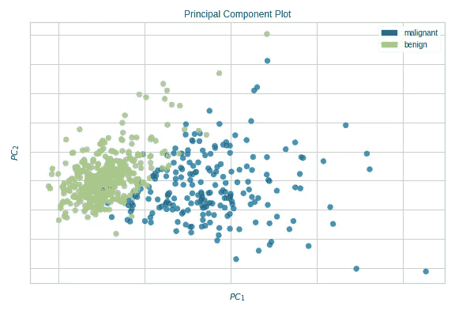

**主成分图——2D**(图片由 autr 提供)

我们还可以通过在 PCA()类中设置`projection=3`来创建一个 3D 散点图。

(作者代码)

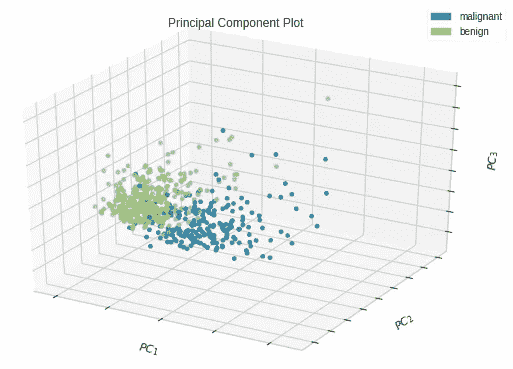

**主成分图— 3D** (图片由作者提供)

PCA 可视化工具最重要的参数包括:

*   **小数位数:** bool，默认`True`。这表示数据是否应该缩放。我们应该在运行 PCA 之前缩放数据。点击了解更多关于[的信息。](https://rukshanpramoditha.medium.com/principal-component-analysis-18-questions-answered-4abd72041ccd#f853)
*   **投影:** int，默认为 2。当`projection=2`出现时，一个 2D 散点图被创建。当`projection=3`时，创建一个 3D 散点图。
*   **类:**列表，默认`None`。这表示 y 中每个类的类标签。类名将作为图例的标签。

# 2.验证曲线

## 使用

验证曲线描绘了*单个*超参数对训练和验证集的影响。通过查看曲线，我们可以确定模型对于给定超参数的指定值的过拟合、欠拟合和恰到好处的条件。当一次有多个超参数要调整时，不能使用验证曲线。相反，你可以使用网格搜索或随机搜索。

## 黄砖实施

使用传统方法创建验证曲线既复杂又耗时。相反，我们可以使用 Yellowbrick 的 ValidationCurve 可视化工具。

为了在 Yellowbirck 中绘制验证曲线，我们将使用相同的*乳腺癌*数据集构建一个随机森林分类器(参见最后的[引文](#6fde))。我们将绘制随机森林模型中 **max_depth** 超参数的影响。

以下代码解释了我们如何利用 Yellowbrick 的 ValidationCurve 可视化工具，使用 *breast_cancer* 数据集创建验证曲线。

(作者代码)

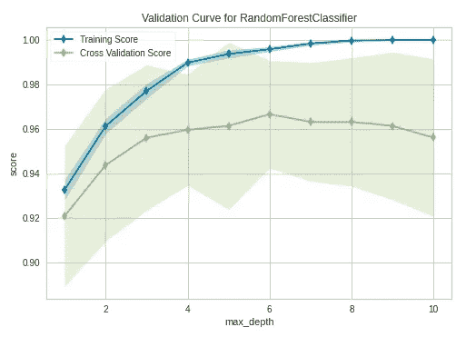

**验证曲线**(图片作者提供)

在**最大深度**值为 6 之后，模型开始过度拟合。当`max_depth=6`时，该模型非常适合训练数据，并且在新的看不见的数据上也推广得很好。

验证曲线可视化工具最重要的参数包括:

*   **估计器:**这可以是任何 Scikit-learn ML 模型，如决策树、随机森林、支持向量机等。
*   **参数名称:**这是我们想要监控的超参数的名称。
*   **参数范围:**这包括*参数名称*的可能值。
*   **cv:** int，定义交叉验证的折叠数。
*   **评分:**字符串，包含模型的评分方法。对于分类，*精度*优先。

# 3.学习曲线

## 使用

学习曲线绘制了训练和验证误差或准确度与时期数或训练实例数的关系。您可能认为学习曲线和验证曲线看起来是一样的，但是迭代次数绘制在学习曲线的 x 轴上，而超参数的值绘制在验证曲线的 x 轴上。

学习曲线的用途包括:

*   学习曲线用于检测模型的*欠拟合*、*过拟合*和*恰到好处*情况。
*   当找到神经网络或 ML 模型的最佳学习速率时，学习曲线用于识别**低收敛**振荡**振荡发散*和*适当收敛* 场景。*
*   *学习曲线用于查看我们的模型从添加更多训练数据中获益多少。以这种方式使用时，x 轴显示训练实例的数量。*

## *黄砖实施*

*使用传统方法创建学习曲线既复杂又耗时。相反，我们可以使用 Yellowbrick 的学习曲线可视化工具。*

*为了在 Yellowbirck 中绘制一条学习曲线，我们将使用相同的*乳腺癌*数据集构建一个支持向量分类器(参见最后的[引文](#6fde))。*

*以下代码解释了我们如何利用 Yellowbrick 的 LearningCurve 可视化工具，使用 *breast_cancer* 数据集创建验证曲线。*

*(作者代码)*

*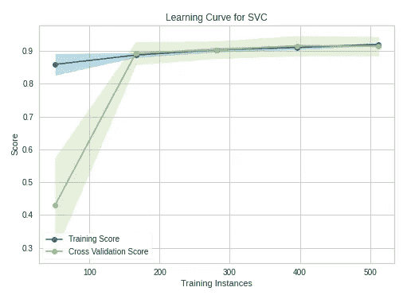*

***学习曲线**(图片作者提供)*

*该模型不会从添加更多的训练实例中受益。该模型已经用 569 个训练实例进行了训练。在 175 个训练实例之后，验证准确度没有提高。*

*学习曲线可视化工具最重要的参数包括:*

*   ***估计器:**这可以是任何 Scikit-learn ML 模型，例如决策树、随机森林、支持向量机等。*
*   ***cv:** int，定义交叉验证的折叠数。*
*   ***评分:**字符串，包含模型的评分方法。对于分类，*精度*优先。*

# *4.肘图*

## *使用*

*肘图用于选择 K-Means 聚类中的最佳聚类数。该模型最适合折线图中肘形出现的点。肘是图表上的拐点。*

## *黄砖实施*

*使用传统方法创建弯头图既复杂又耗时。相反，我们可以使用 Yellowbrick 的 KElbowVisualizer。*

*为了在 Yellowbirck 中绘制学习曲线，我们将使用 *iris* 数据集构建 K-Means 聚类模型(参见最后的[引文](#2bc7))。*

*下面的代码解释了我们如何利用 Yellowbrick 的 KElbowVisualizer，使用 *iris* 数据集创建肘图。*

*(作者代码)*

*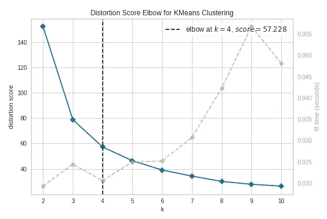*

***肘情节**(图片由作者提供)*

**弯头*出现在 k=4 处(用虚线标注)。该图表明该模型的最佳聚类数是 4。换句话说，该模型很好地拟合了 4 个聚类。*

*KElbowVisualizer 最重要的参数包括:*

*   ***估计量:** K 均值模型实例*
*   ***k:** int 或者 tuple。如果是整数，它将计算(2，k)范围内的分类分数。如果是元组，它将计算给定范围内的聚类的分数，例如，(3，11)。*

# *5.轮廓图*

## *使用*

*侧影图用于选择 K-Means 聚类中的最佳聚类数，也用于检测聚类不平衡。该图提供了比肘图更精确的结果。*

## *黄砖实施*

*用传统方法创建轮廓图既复杂又耗时。相反，我们可以使用 Yellowbrick 的轮廓可视化工具。*

*为了在 Yellowbirck 中创建一个剪影图，我们将使用 *iris* 数据集构建一个 K-Means 聚类模型(参见最后的[引文](#2bc7))。*

*以下代码块解释了我们如何利用 Yellowbrick 的 SilhouetteVisualizer，使用具有不同 k(聚类数)值的 *iris* 数据集创建轮廓图。*

***k=2***

*(作者代码)*

*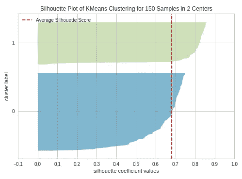*

***具有 2 个聚类(k=2)的轮廓图**(图片由作者提供)*

*通过更改 KMeans()类中的聚类数，我们可以在不同的时间执行上述代码，以创建 k=3、k=4 和 k=5 时的剪影图。*

***k=3***

*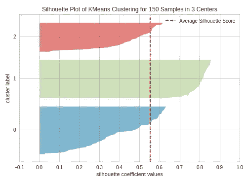*

***具有 3 个聚类的轮廓图(k=3)** (图片由作者提供)*

***k=4***

*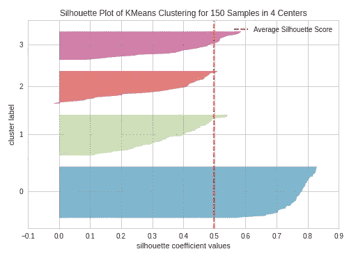*

***具有 4 个聚类(k=4)** 的轮廓图，(图片由作者提供)*

***k=5***

*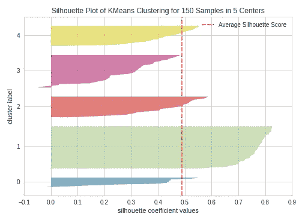*

***具有 4 个聚类的轮廓图(k=5)** (图片由作者提供)*

*轮廓图包含每个簇的一个刀形。每个刀形都是由代表聚类中所有数据点的条形创建的。因此，刀形的宽度代表了集群中所有实例的数量。条形长度表示每个实例的轮廓系数。虚线表示剪影得分—来源: [*动手 K-Means 聚类*](https://medium.com/mlearning-ai/k-means-clustering-with-scikit-learn-e2af706450e4) (我写的)。*

*具有大致相等宽度的刀形的图告诉我们，聚类是平衡的，并且在每个聚类中具有大致相同的实例数量——这是 K-Means 聚类中最重要的假设之一。*

*当刀形条延伸到虚线时，聚类被很好地分开，这是 K-Means 聚类的另一个重要假设。*

*当 k=3 时，团簇很好地平衡并且很好地分离。因此，我们示例中的最佳集群数是 3。*

*轮廓可视化工具最重要的参数包括:*

*   ***估计器:** K 均值模型实例*
*   ***颜色:** string，用于每种刀形的颜色集合。“yellowbrick”或 Matplotlib 颜色映射字符串之一，如“Accent”、“Set1”等。*

# *6.阶级不平衡图*

## *使用*

*类别不平衡图检测分类数据集中目标列中类别的不平衡。*

*当一个类的实例明显多于另一个类时，就会发生类不平衡。例如，与垃圾邮件检测相关的数据集有 9900 个“非垃圾邮件”类别的实例，而只有 100 个“垃圾邮件”类别的实例。该模型将无法捕获少数类别(垃圾邮件类别)。这样做的结果是，当一个阶层失衡时，模型将无法准确预测少数阶层—来源: [*在幕后偷偷发生的 20 大机器学习和深度学习错误*](https://rukshanpramoditha.medium.com/top-20-machine-learning-and-deep-learning-mistakes-that-secretly-happen-behind-the-scenes-e211e056c867) (我写的)。*

## *黄砖实施*

*用传统方法创建类不平衡图既复杂又耗时。相反，我们可以使用 Yellowbrick 的 ClassBalance 可视化工具。*

*为了绘制 Yellowbirck 中的等级不平衡图，我们将使用*乳腺癌*数据集(分类数据集，参见最后的[引文](#6fde))。*

*以下代码解释了我们如何利用 Yellowbrick 的 ClassBalance 可视化工具，使用 *breast_cancer* 数据集创建一个类别不平衡图。*

*(作者代码)*

*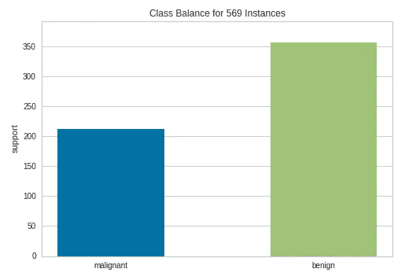*

***阶层失衡剧情**(图片由作者提供)*

*在*恶性*类中有 200 多个实例，在*良性*类中有 350 多个实例。因此，我们在这里看不到太多的类不平衡，尽管实例在两个类中的分布并不均匀。*

*ClassBalance 可视化工具最重要的参数包括:*

*   ***标签:**列表，目标列中唯一类的名称。*

# *7.残差图*

## *使用*

*线性回归中的残差图用于通过分析回归模型中的误差方差来确定残差(观察值-预测值)是否不相关(独立)。*

*残差图是通过绘制残差和预测值来创建的。如果预测值和残差之间存在任何类型的模式，则表明拟合的回归模型并不完美。如果这些点围绕 x 轴随机分布，回归模型与数据吻合得很好。*

## *黄砖实施*

*使用传统方法创建残差图既复杂又耗时。相反，我们可以使用 Yellowbrick 的 ResidualsPlot 可视化工具。*

*为了在 Yellowbirck 中绘制残差图，我们将使用*Advertising*([Advertising . CSV](https://drive.google.com/file/d/1-1MgAOHbTI5DreeXObN6KLcSka6LS9G-/view?usp=share_link)，参见最后的[引文](#8bd8))数据集。*

*以下代码解释了我们如何利用 Yellowbrick 的 ResidualsPlot 可视化工具，使用*广告*数据集创建残差图。*

*(作者代码)*

*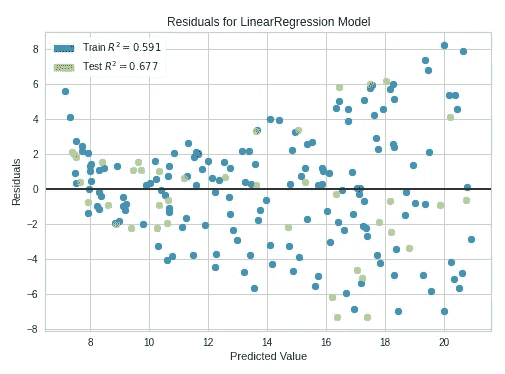*

***残差图**(图片由作者提供)*

*在残差图中，我们可以清楚地看到预测和残差之间的某种非线性模式。拟合的回归模型并不完美，但已经足够好了。*

*残差图可视化器最重要的参数包括:*

*   ***估计量:**这可以是任何 Scikit-learn 回归量。*
*   ***hist:** bool，默认`True`。是否绘制残差直方图，该直方图用于检查另一个假设-残差近似正态分布，平均值为 0，标准偏差固定。*

# *8.预测误差图*

## *使用*

*线性回归中的预测误差图是一种用于评估回归模型的图形方法。*

*预测误差图是通过将预测值与实际目标值进行对比来创建的。*

*如果模型做出非常准确的预测，这些点应该在 45 度线上。否则，这些点会分散在该直线周围。*

## *黄砖实施*

*用传统方法创建预测误差图既复杂又耗时。相反，我们可以使用 Yellowbrick 的 PredictionError 可视化工具。*

*为了在 Yellowbirck 中绘制预测误差图，我们将使用*广告* ( [广告. csv](https://drive.google.com/file/d/1-1MgAOHbTI5DreeXObN6KLcSka6LS9G-/view?usp=share_link) ，参见[引用](#8bd8)结尾)数据集。*

*以下代码解释了我们如何利用 Yellowbrick 的 PredictionError 可视化工具，使用 *Advertising* 数据集创建残差图。*

*(作者代码)*

*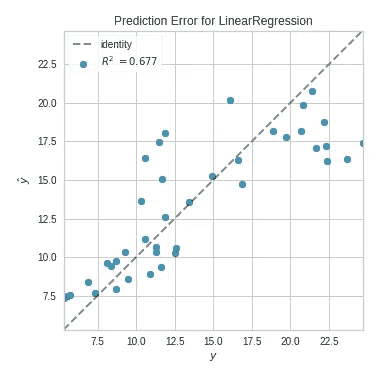*

***预测误差图**(图片由作者提供)*

*点不完全在 45 度线上，但模型足够好。*

*PredictionError 可视化工具最重要的参数包括:*

*   ***估计量:**这可以是任何 Scikit-learn 回归量。*
*   ***身份:** bool，默认`True`。是否画 45 度线。*

# *9.库克距离图*

## *使用*

*库克距离衡量实例对线性回归的影响。具有较大影响的实例被视为异常值。含有大量异常值的数据集不适合未经预处理的线性回归。简单地说，库克距离图用于检测数据集中的异常值。*

## *黄砖实施*

*用传统方法创建库克距离图既复杂又耗时。相反，我们可以使用 Yellowbrick 的 CooksDistance 可视化工具。*

*为了在 Yellowbirck 绘制库克距离图，我们将使用*广告* ( [广告. csv](https://drive.google.com/file/d/1-1MgAOHbTI5DreeXObN6KLcSka6LS9G-/view?usp=share_link) ，参见[引用](#8bd8)在最后)数据集。*

*以下代码解释了我们如何利用 Yellowbrick 的 CooksDistance 可视化工具，使用*广告*数据集创建一个 Cook's distance 图。*

*(作者代码)*

*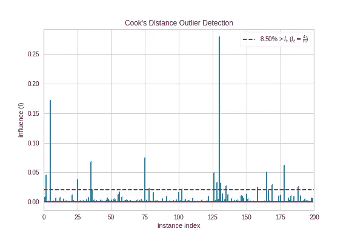*

***库克的距离图**(图片由作者提供)*

*有一些观察延长了阈值(水平红色)线。他们是局外人。所以，我们应该在建立回归模型之前准备好数据。*

*CooksDistance 可视化工具最重要的参数包括:*

*   ***draw_threshold:** bool，默认`True`。是否画门槛线。*

# *10.特征重要性图*

## *使用*

*特征重要度图用于选择产生 ML 模型所需的最少重要特征。由于不是所有的特性都对模型有相同的贡献，我们可以从模型中删除不太重要的特性。这将降低模型的复杂性。简单的模型易于训练和解释。*

*要素重要度图显示了每个要素的相对重要度。*

## *黄砖实施*

*使用传统方法创建特征重要性图既复杂又耗时。相反，我们可以使用 Yellowbrick 的 FeatureImportances 可视化工具。*

*为了在 Yellowbirck 中绘制特征重要性图，我们将使用包含 30 个特征的*乳腺癌*数据集(见最后的[引文](#6fde))。*

*以下代码解释了我们如何利用 Yellowbrick 的 FeatureImportances 可视化工具，使用 *breast_cancer* 数据集创建特征重要度图。*

*(作者代码)*

**

***特征重要性图**(图片由作者提供)*

*并非数据集中的所有 30 个要素都对模型有很大贡献。我们可以从数据集中移除带有小横条的特征，并用所选特征重新装配模型。*

*FeatureImportances 可视化工具最重要的参数包括:*

*   ***估计器:**任何支持`feature_importances_`属性或`coef_`属性的Scikit-learn 估计器。*
*   ***相对:**布尔，默认`True`。是否以百分比形式绘制相对重要性。如果`False`，显示特征重要性的原始数值分数。*
*   ***绝对:**布尔，默认`False`。是否通过避免负号只考虑系数的大小。*

# *ML 可视化的使用总结*

1.  ***主成分图:** *PCA()* ，用途——在 2D 或 3D 散点图中可视化高维数据，可用于识别高维数据中的重要模式。*
2.  ***验证曲线:** *验证曲线()*，用途——绘制单个*超参数对训练和验证集的影响。**
3.  ***学习曲线:** *LearningCurve()* ，用途——检测模型的*欠拟合*、*过拟合*和*恰到好处*条件，识别**低收敛*、*振荡*、*振荡发散*、*适当收敛***
4.  ****肘图:***kelbow visualizer()*，用法—选择 K-Means 聚类中的最优聚类数。**
5.  ****Silhouette Plot:***Silhouette visualizer()*，用法——选择 K-Means 聚类中的最优聚类数，检测 K-Means 聚类中的聚类不平衡。**
6.  ****类不平衡图:** *ClassBalance()* ，用法-检测分类数据集中目标列中类的不平衡。**
7.  ****残差图:** *残差图()*，用法-通过分析回归模型中误差的方差，确定残差(观察值-预测值)是否不相关(独立)。**
8.  ****预测误差图:** *PredictionError()* ，用法-用于评估回归模型的图形方法。**
9.  ****库克距离图:** *CooksDistance()* ，用法-根据实例的库克距离检测数据集中的异常值。**
10.  ****特征重要度图:** *特征重要度()*，用法-根据每个特征的相对重要度选择所需的最少重要特征，以生成一个 ML 模型。**

**今天的帖子到此结束。**

**如果您有任何问题或反馈，请告诉我。**

## **阅读下一篇(推荐)**

*   ****黄砖，使用单行代码可视化特性的重要性****

**[](https://rukshanpramoditha.medium.com/yellowbrick-for-visualizing-features-importances-using-a-single-line-of-code-33c87572eada)  

*   **解释验证曲线——绘制单个超参数的影响**

[](/validation-curve-explained-plot-the-influence-of-a-single-hyperparameter-1ac4864deaf8)  

*   **绘制学习曲线以分析神经网络的训练性能**

[](https://rukshanpramoditha.medium.com/plotting-the-learning-curve-to-analyze-the-training-performance-of-a-neural-network-4a35818d01f2)  

*   **动手 K 均值聚类**

[](https://medium.com/mlearning-ai/k-means-clustering-with-scikit-learn-e2af706450e4)  

## 支持我当作家

*我希望你喜欢阅读这篇文章。如果你愿意支持我成为一名作家，请考虑* [***注册会员***](https://rukshanpramoditha.medium.com/membership) *以获得无限制的媒体访问权限。它只需要每月 5 美元，我会收到你的会员费的一部分。*

[](https://medium.com/membership/@rukshanpramoditha)  

非常感谢你一直以来的支持！下一篇文章再见。祝大家学习愉快！

## 乳腺癌数据集信息

*   **引用:** Dua，d .和 Graff，C. (2019)。UCI 机器学习知识库[http://archive . ics . UCI . edu/ml]。加州欧文:加州大学信息与计算机科学学院。
*   **来源:**[https://archive . ics . UCI . edu/ml/datasets/breast+cancer+Wisconsin+(诊断)](https://archive.ics.uci.edu/ml/datasets/breast+cancer+wisconsin+(diagnostic))
*   **许可:** *威廉·h·沃尔伯格*(威斯康星大学
    普通外科学系)*w·尼克街*(威斯康星大学
    计算机科学系)*奥尔维·l·曼加里安*(威斯康星大学计算机科学系)持有该数据集的版权。尼克街在*知识共享署名 4.0 国际许可*([**CC BY 4.0**](https://creativecommons.org/licenses/by/4.0/))下向公众捐赠了这个数据集。您可以在此了解有关不同数据集许可类型[的更多信息。](https://rukshanpramoditha.medium.com/dataset-and-software-license-types-you-need-to-consider-d20965ca43dc#6ade)

## 虹膜数据集信息

*   **引用:** Dua，d .和 Graff，C. (2019)。UCI 机器学习知识库[http://archive . ics . UCI . edu/ml]。加州欧文:加州大学信息与计算机科学学院。
*   **来源:**[https://archive.ics.uci.edu/ml/datasets/iris](https://archive.ics.uci.edu/ml/datasets/iris)
*   **许可:** *R.A. Fisher* 拥有该数据集的版权。迈克·马歇尔在*知识共享公共领域专用许可* ( [**CC0**](https://creativecommons.org/share-your-work/public-domain/cc0) )下向公众捐赠了这个数据集。您可以在此了解有关不同数据集许可类型[的更多信息。](https://rukshanpramoditha.medium.com/dataset-and-software-license-types-you-need-to-consider-d20965ca43dc#6ade)

## 广告数据集信息

*   **来源:**[https://www.kaggle.com/datasets/sazid28/advertising.csv](https://www.kaggle.com/datasets/sazid28/advertising.csv)
*   **许可:**该数据集在*知识共享公共领域专用许可* ( [**CC0**](https://creativecommons.org/share-your-work/public-domain/cc0) )下公开可用。您可以在此了解有关不同数据集许可类型[的更多信息。](https://rukshanpramoditha.medium.com/dataset-and-software-license-types-you-need-to-consider-d20965ca43dc#6ade)

## 参考

*   [https://www.scikit-yb.org/en/latest/](https://www.scikit-yb.org/en/latest/)
*   [https://www.scikit-yb.org/en/latest/quickstart.html](https://www.scikit-yb.org/en/latest/quickstart.html)
*   [https://www.scikit-yb.org/en/latest/api/index.html](https://www.scikit-yb.org/en/latest/api/index.html)

[鲁克山普拉莫迪塔](https://medium.com/u/f90a3bb1d400?source=post_page-----528282940582--------------------------------)
**2022–11–04****