# Docker 容器入门的 10 个命令

> 原文：<https://towardsdatascience.com/10-commands-to-get-started-with-docker-containers-deffdcbf90fe>

## 安心构建、交付和部署您的应用


[伊恩·泰勒](https://unsplash.com/@carrier_lost?utm_source=medium&utm_medium=referral)在 [Unsplash](https://unsplash.com?utm_source=medium&utm_medium=referral) 上拍照

Docker 是一个很好的工具，可以很容易地开发你的应用程序，将它们装入*容器*并部署到任何地方。

在我作为一名数据科学家的工作中，每当我需要将一个具有多种底层服务(如后端、数据库、前端等)的应用程序打包成一个我可以运行、更新、停止、共享并明确部署到任何云的*映像*时，我都会频繁地使用 Docker:IT 界从未见过这样的灵活性。

> 在这篇文章中，我分享了一些我经常用来操作 Docker 容器的 Docker 命令。虽然这不是对 Docker 的全面介绍，但它至少应该给你一些做大事的基础知识。

👉如果你是一名数据科学家，打算转向生产领域，让自己的应用在本地笔记本之外获得第二次生命，那么学习 Docker 是一个不错的选择。

我希望你都准备好了。让我们开始吧🏊

这篇文章假设读者对 Docker 的基本概念有一点熟悉，比如 Docker *客户端*和*守护进程*、*图像*、*容器*、*主机*、*Docker 文件*等。如果你不熟悉这些术语，我强烈建议你查看官方文件的概述部分:最多两分钟。

# 1 —构建 Docker 映像

> “一个*图像*是一个只读模板，带有创建 Docker 容器的指令。通常，一个图像是基于另一个图像的，并有一些额外的定制。例如，您可以构建一个基于`ubuntu`映像的映像，但是安装 Apache web 服务器和您的应用程序，以及运行您的应用程序所需的配置细节。”
> —资料来源:Docker [docs](https://docs.docker.com/get-started/overview/#docker-objects) 。

为了便于学习，我们将构建并使用一个自定义的 Docker 图像，而不是从注册表中提取一个图像(将注册表想象成一个存储 Docker 图像的中心位置，类似于 Github，但用于图像)

这个映像封装了一个 Python 3.7 环境，它拥有在端口 80 上运行 Flask API 所需的一切。

为了构建这个 Docker 映像，我们需要在 Docker 文件中定义一系列指令:本文不会涉及 Docker 文件命令的细节。要了解更多，我建议你查看这个[链接](https://docs.docker.com/engine/reference/builder/)。

我们将使用的 docker 文件如下:它基本上是一组连续的指令，包含用户在命令行上调用的所有命令来组合一个图像。

让我们一行一行地理解这个 does 文件的作用:

*   它首先提取一个封装了轻量级 python 3.7 环境的基础[映像](https://github.com/docker-library/python/blob/f871d0435e7f35a693fa1b60aa159e6a1a4c6a2e/3.7/buster/Dockerfile)
*   它设置了 Flask 应用程序将在容器上运行的工作目录
*   它将 requirements.txt 文件从主机复制到容器中(即在工作目录中)
*   它运行`pip`来安装 Python 需求
*   它将当前目录的内容(尤其是`app.py`文件)复制到容器中
*   它表示容器在运行时正在监听网络端口 80
*   当图像运行时，它执行 Python 代码

我们将要运行的 Python 代码是一个简单的 hello-world Flask API，没有什么特别的。

要构建图像并用特定的名称标记它(我选择了`flask_image`，运行以下命令:

```
docker build -t flask_image
```

一旦构建开始执行，它会检查 over 文件中的每个步骤。

这里肯定有很多内容，所以我将跳过细节，以免你不知所措。不过如果你有兴趣的话，我推荐你查看一下这个 [*章节*](https://docs.docker.com/get-started/overview/#docker-objects) *。*

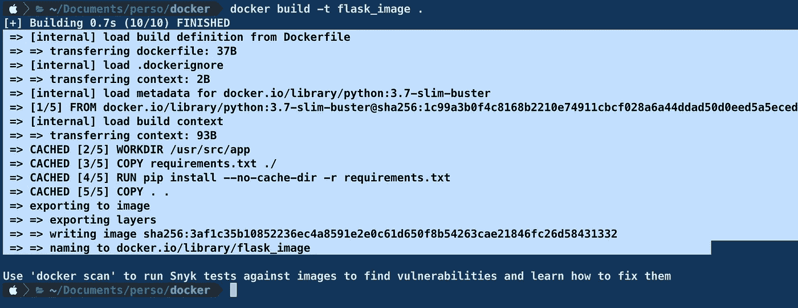

作者截图

# **2 —运行 Docker 容器**

> 容器是图像的可运行实例。您可以使用 Docker API 或 CLI 创建、启动、停止、移动或删除容器。您可以将容器连接到一个或多个网络，为其附加存储，甚至根据其当前状态创建新的映像。”—资料来源:Docker [docs](https://docs.docker.com/get-started/overview/#docker-objects) 。

一旦构建了 Docker 映像，您可以首先检查它是否存在于您的文件系统中。

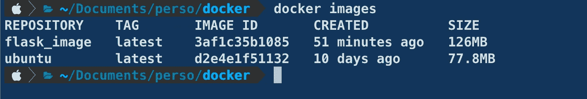

作者截图

然后，您可以运行它:这将创建一个容器。如果您再次运行映像，这将创建另一个容器，依此类推。事实上，正如官方文档所指出的，容器只不过是映像 的一个 ***运行实例。***

让我们通过运行我们的映像来运行一个容器:

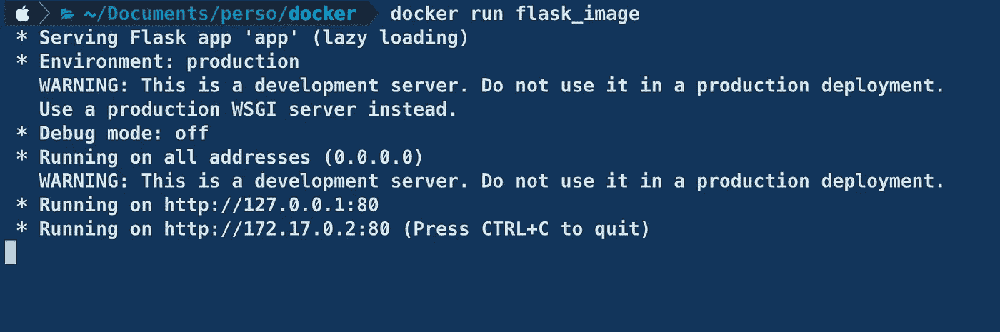

作者截图

正如所料，这个容器触发一个监听 TCP 端口 80 的 Flask 服务器。

太好了！但是似乎我们不能在不杀死容器的情况下退出控制台。如果我们能在后台运行容器，那就太好了。

# 3-在后台运行容器

大多数时候，你的容器需要作为服务在后台运行。这可能是一个类似我们正在使用的 API，也可能是一个数据库、代理服务器、React 应用程序等。

你可以这样做:你只需添加`-d`(分离的)选项:

```
docker run -d flask_image
```

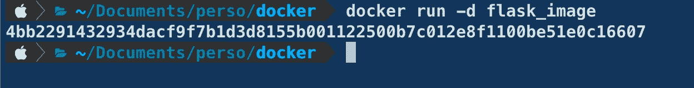

作者截图

要检查容器是否确实在后台运行，可以使用列出正在运行的容器的`ps` Docker 命令。

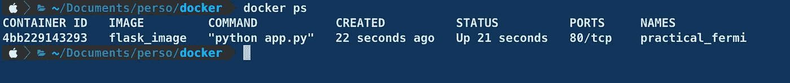

作者截图

现在，容器正在运行并提供一个令人惊叹的 API(我们可以看到端口号被打印到控制台)，我们是否可以从外部(即从主机)访问它，并开始向它发送查询？

# 4 —映射容器和主机之间的端口

为了让主机可以访问我们的 Flask API，我们需要将当前容器的端口(80)映射到主机上的一个可用端口。让我们挑选，说… **1234**

语法如下:

```
docker run -p 1234:80 flask_image
```

如果我们点击 [http://localhost](http://localhost) :1234，Chrome 表明这个 API 确实可以从主机访问。

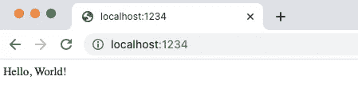

作者截图

如果我们多次点击刷新按钮，我们可以看到容器上的 HTTP 日志。

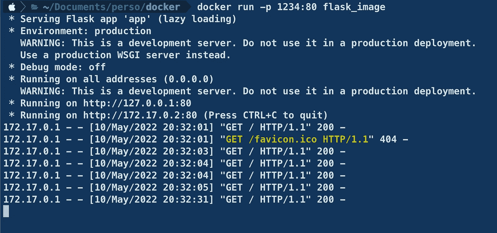

作者截图

您也可以通过添加`-d`选项在后台运行该命令:

```
docker run -d -p 1234:80 flask_image
```

现在您已经有了一个可以从容器外部访问的运行 API。

# 5-停止容器运行

假设您在后台运行一个容器，现在您想停止它。

首先，使用`ps`查找它的`id`:

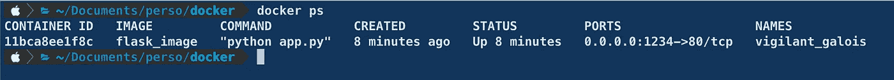

作者截图

并在以下命令中使用它:

```
docker stop 11bca8ee1f8c
```

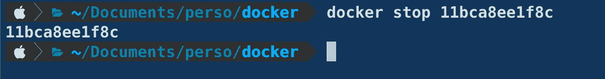

作者截图

通过再次运行`ps`，容器不再可见。

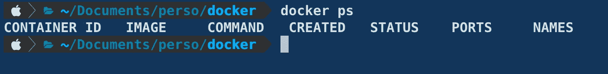

作者截图

但是，您仍然可以将其视为已停止的容器(以及其他先前已停止的容器):

```
docker ps -a
```

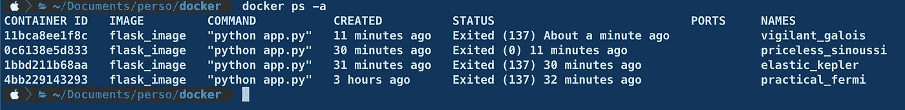

作者截图

# 6-启动停止的容器

给定它的 id，您可以用`docker start`启动一个停止的容器

你只需要提供它的 id:

```
docker start 11bca8ee1f8c
```

# 7-移除停止的容器

一旦一个容器被停止，您需要删除它，您首先需要使用`docker ps -a`获取它的 id，然后启动一个`docker rm`命令。

```
docker rm 11bca8ee1f8c
```

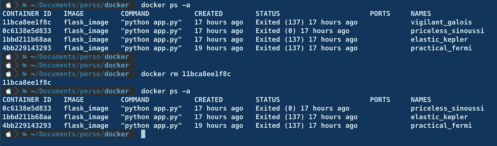

# 8-移除所有停止的容器

现在，如果您需要移除所有停止的容器，并且不想手动执行，您可以使用`prune`命令。

```
docker container prune
```

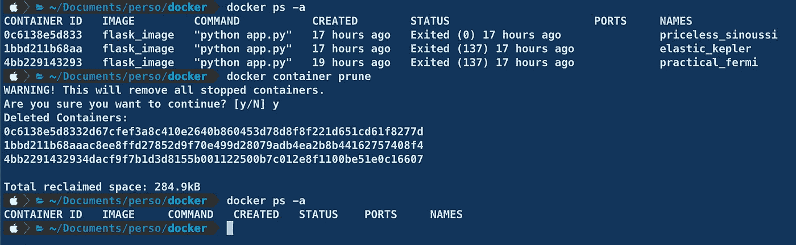

# 9-运行容器，并在它停止后将其移除

如果您想在容器停止后自动移除它，您可以在运行它时使用`—rm`选项。

这是一个很好的选项，可以提供清理。

```
docker run --rm -d -p 1234:80 flask_image
```

# 10-重命名容器

如果出于某种原因，您需要重命名您的容器，您可以使用`docker rename`命令来完成。

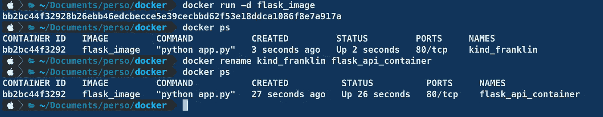

# 结论

我们只是触及了容器的表面，它们是做什么的，以及如何用简单(并且有用)的命令来使用它们。

然而，由于容器通常只有一个职责，所以它们通常与其他容器组合在一起形成一个完整的堆栈:这是通过 [docker-compose](https://docs.docker.com/engine/reference/commandline/compose/) 实现的，我们可能会在以后的文章中对此进行研究。

今天就这些了。直到下一次更多的编程技巧和教程。👋

# 新到中？你可以每月订阅 5 美元，并解锁各种主题的无限文章(技术、设计、创业……)你可以通过点击我的推荐[链接](https://ahmedbesbes.medium.com/membership)来支持我

<https://ahmedbesbes.medium.com/membership>  

照片由[卡斯滕·怀恩吉尔特](https://unsplash.com/@karsten116?utm_source=medium&utm_medium=referral)在 [Unsplash](https://unsplash.com?utm_source=medium&utm_medium=referral) 上拍摄