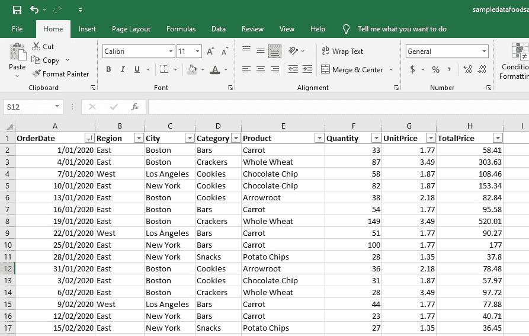
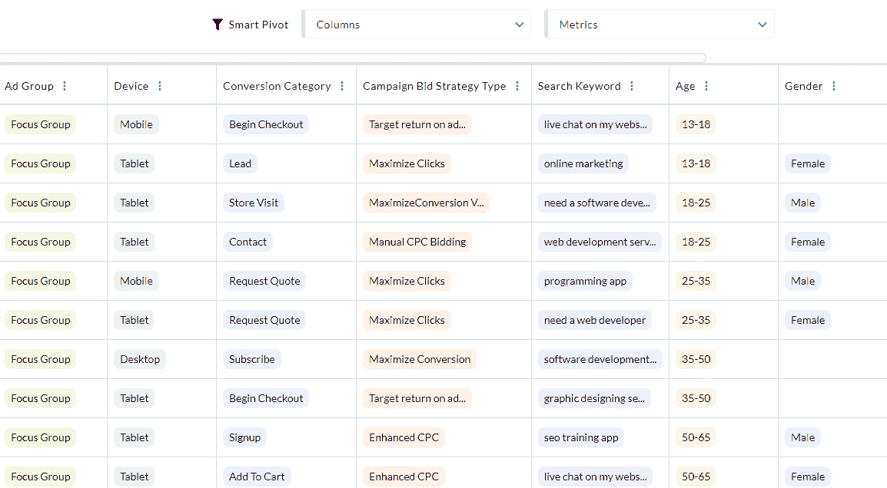
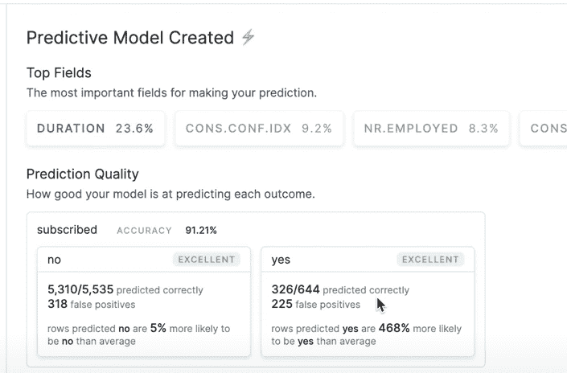
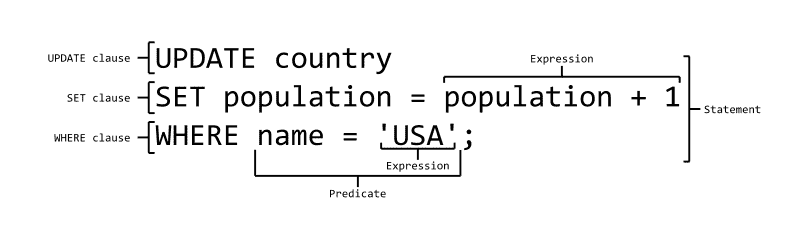
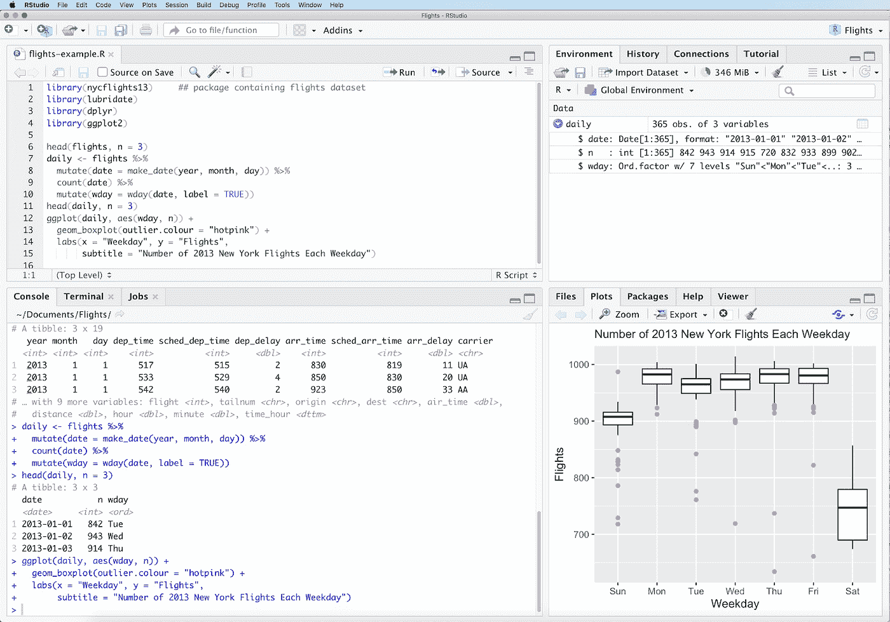
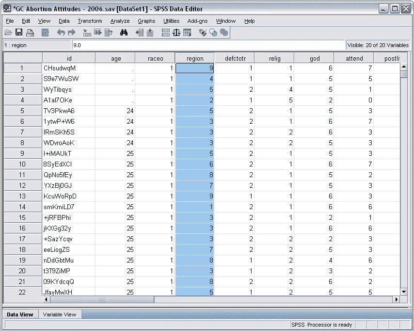
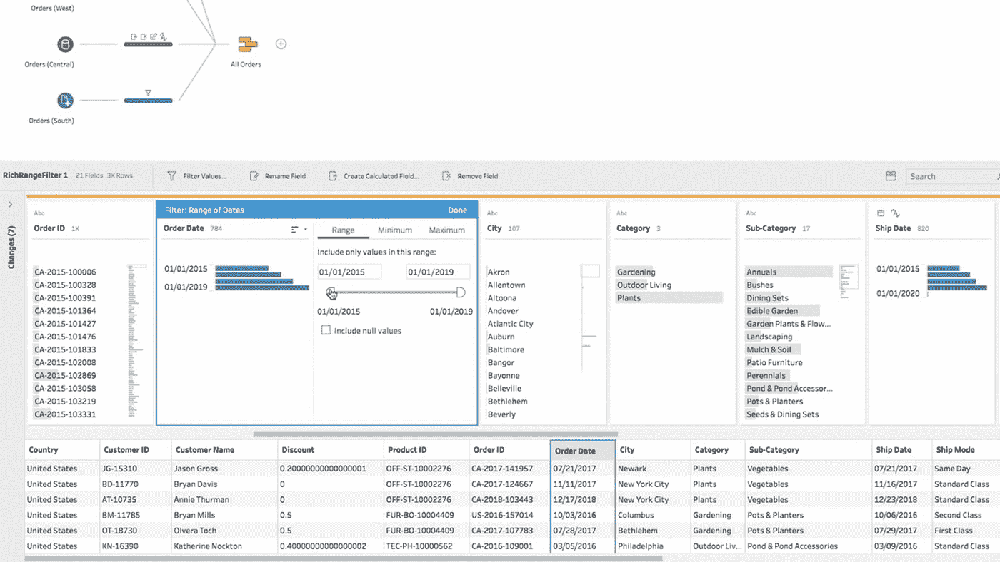
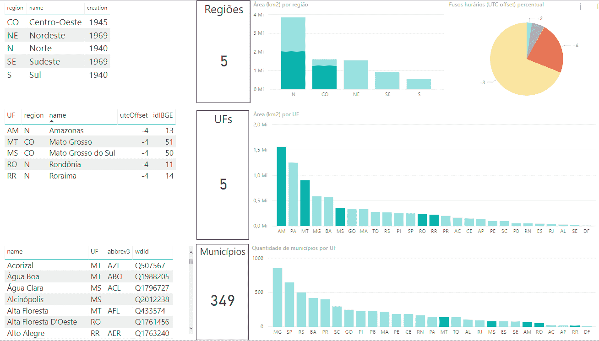
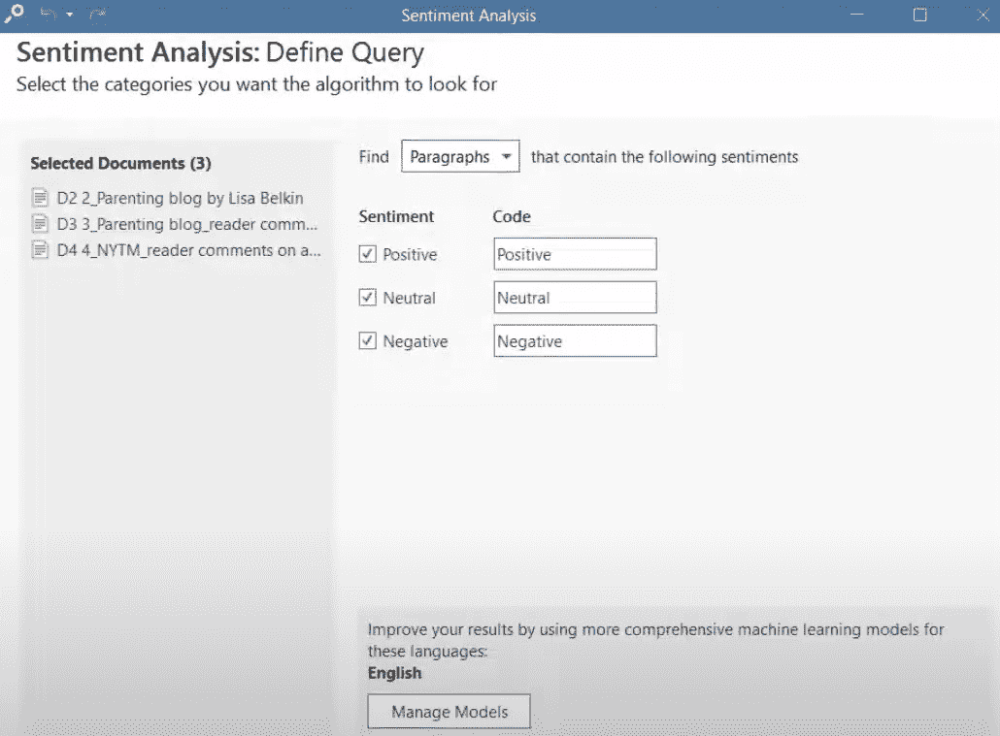

# 初学者和专家的 10 个数据分析工具

> 原文：<https://towardsdatascience.com/10-data-analysis-tools-for-beginners-and-experts-2d083203b06e>

## 为你的事业或职业选择合适工具的指南

米利安·耶西耶在 [Unsplash](https://unsplash.com/s/photos/data-analysis?utm_source=unsplash&utm_medium=referral&utm_content=creditCopyText) 上拍摄的照片

有许多数据分析工具，每一个都是为特定的用例而设计的。有时，工具会重叠并服务于相同的用例，两者各有利弊。这使得寻找满足您需求的合适工具变得非常困难。

今天，我将向您展示在选择工具时应该注意什么，我将介绍 10 款最优秀、最受初学者和数据科学家欢迎的工具。

# 如何选择正确的分析工具

选择数据分析工具时，需要考虑几个因素:

*   您的企业拥有什么类型的数据？它们需要特定的分析程序吗？(例如数据建模)
*   我们要处理多大规模的数据？大数据？
*   这项工作的技术性如何？我们面对的是数据科学家还是数据分析师？也许是营销人员和销售人员？
*   你需要任何特定类型的可视化吗？(例如地理热图)
*   你的公司有多少人？预算是多少？

# 目录

*   [最适合存储/编辑数据&创建图形:Excel](#1013)
*   [最适合非技术用户:聚合物搜索](#580f)
*   [最容易建立预测模型:Akkio](#6644)
*   [最适合查询大数据:SQL](#720c)
*   [最适合机器学习&自动化:Python](#431f)
*   [最适合高级统计分析:R](#9cbf)
*   [最适合科学&学术界:SPSS](#7519)
*   [最佳商业智能&报告:表格](#2c7c)
*   [商业智能的廉价替代品:Power BI](#8f4f)
*   [最适合定性数据分析:ATLAS.ti](#da5f)

# 最适合存储/编辑数据和创建图表:Excel

作者截图

**非常适合:**存储/编辑数据、基本分析、操作数据、图形/图表。
**专长等级:**初级到中级

Excel 和 Google 的工作表 99%相似，所以我把它们都放在这里。Google Sheets 是免费工具，而 Excel 不是。它们做的事情完全一样，所以如果你的工作场所没有 Excel，你可以随时使用谷歌工作表。

Excel 是我快速创建图形和图表的首选工具，因为它们制作方便，并提供多种图表类型:条形图、堆积条形图、簇状条形图、饼图、散点图、盒须图、雷达图——应有尽有！Excel 都有。

您可以快速定制颜色，并为每种图形类型选择多种布局。如果你想在网上发布一幅图像，而又不想让它因为缩小/压缩而变得模糊，调整大小功能也很方便。

Excel 的另一个常见用例是数据操作。使用其广泛的函数和公式，您可以对数据进行几乎任何类型的操作，例如，想看看每一列中的第 5 个字母是否是元音，并输出 TRUE 或 FALSE？使用 Excel 公式很容易做到这一点。

最后，Excel 对于基础分析还是不错的。如果您对数据有某些疑问，您可以通过创建一个数据透视表并添加切片器来过滤数据来轻松回答这些问题。

如果你发现自己每天使用 Excel 几个小时，建议学习 VBA，它是 Excel 的本地编程语言(Visual Basic)。VBA 允许你自动完成任务，这对那些花大量时间在 Excel 上的人来说是有益的。我想说，如果你每天花一个多小时在 Excel 上，这是值得学习的。

Excel 的最大缺点是它不适合更复杂的数据操作(如连接数据集)和分析大数据，因为它有 100 万行的限制。它也不是更高级的统计分析(如回归建模)的最佳工具。

# 示例使用案例:

**双变量分析:**您有一些结构化数据，并且您想要快速创建一组条形图和散点图，以便对您的数据进行单变量或双变量分析。Excel 在这方面又快又方便，提供了您需要的几乎所有图表类型。

**数据透视表:**您有一些餐馆的销售数据，并且您想要回答一些基本问题，例如“在一天的不同时间，哪种饭菜最受欢迎？”通过在 Excel 中创建数据透视表，您可以轻松快捷地得到答案。

**计算:**您想要对您的数据执行计算。Excel 为您提供了多种方法，例如，您有关于产品销售和评级的电子商务数据，并且想要使用 Wilson 的下限创建一个“加权分数”。即使像这样半复杂的公式也可以在 Excel 中复制。

**数据操作:**你想清理或者操作数据。Excel 有多种方法来编辑数据的某些部分(例如，删除每个单元格中的第 4 到第 6 个字符位置，将一列拆分为多列，使用 if 语句)。

总的来说，每个人都使用 Excel——包括数据科学家，因为它可以方便地执行简单的任务，如图形/图表和数据透视表。它也适合存储/编辑/操作数据。

# 最适合非技术用户:聚合物搜索

作者截图

**适合:**营销/销售/调查数据、数据演示、商业智能。
**专长等级:**初级

[Polymer Search](https://www.polymersearch.com/) 是一款无代码人工智能工具，旨在分析销售和营销数据。这是最容易学习的数据分析工具之一，比 Excel 简单。

你把你的数据上传到它的网络工具上，它会在几秒钟内把你的数据转换成一个交互式的网络应用。在这里，您可以执行几个分析功能:

1.交互式数据透视表:如果你对数据有某些疑问，你可以使用数据透视表快速得到答案，只需点击几下鼠标，在“智能数据透视表”下选择你的变量。由于一切都是互动的，你不需要浪费时间设置切片器，你可以通过点击标签轻松地过滤输入/输出数据。

2.交互式可视化:为您呈现一些图表类型。主要是条形图、时间序列、散点图、气泡图和热图。这些可用于发现模式、趋势、相关性、数量和其他关于数据的见解。它们还可以用来创建交互式仪表板。由于一切都是交互的，您可以轻松地过滤掉某些数据点(例如，删除异常值或查看没有某些数据点的数据会是什么样子)。

3.Auto-Explainer:允许您生成关于数据的摘要，显示数据中的异常和表现最佳的组合。例如，PPC 营销人员可以选择他们想要最大化的指标(如“转化率”)，该工具可以生成影响该指标的因素组合，如受众定位/人口统计、广告创意、竞价策略等。

还有一个人工智能功能，可以提出关于数据的见解。

我非常喜欢 Polymer 的一个特性是它能自动识别数组并自动拆分它们。例如，如果你做了一个调查，并要求人们“选择最多 5 个项目”，在 Excel 中分析这一点可能会很棘手(甚至在 R 中)，但 Polymer 会将每个项目检测为独立的，因此分析它变得很简单。如果检测不正确，您可以在列设置中关闭此功能(每个列都有自己的设置)。

Polymer 的最大缺点是它不能处理大数据，并且在进行更高级的分析时灵活性有限。例如，你不能对聚合物进行多元分析。还有数量有限的图形/图表类型。

# 示例使用案例:

**营销/销售数据:**你正在运行脸书广告或任何类型的 PPC 活动，你想找到表现最好的组合。Polymer 的 Auto-Explainer 工具会自动为您完成这项工作。

如果你想找到合适的目标受众，你只需输入性别、年龄、地点和设备类型，Polymer 就会给出从最佳表现到最差表现的不同结果组合。该报告还显示了任何异常值/异常值，并给出了每个数字的上下文信息(如 X 的表现高于平均水平 56%)。

**商业智能:**您有一个电子表格，您希望将它快速转换成交互式仪表板，用于演示或商业智能目的。Polymer 会自动将您的文件转换为交互式数据库，并让您创建交互式图形/图表，您可以通过 URL 共享这些图形/图表，使主管或客户可以轻松访问。

总的来说，Polymer 是非技术人员创建交互式仪表板、数据透视表和分析营销、销售或调查数据的工具。尽管该工具是为初学者设计的，但我发现它可以做一些非常强大的事情，为我节省了大量的编码时间。

# 最容易建立预测模型:Akkio

作者截图

**理想适合:**预测分析、销售、营销
**专业水平:**初学者

Akkio 是一个人工智能工具，可以让普通人成为数据科学家。你把数据集上传到 Akkio 上，选择你想要预测的变量，Akkio 就会围绕这个变量建立一个神经网络。不需要编码经验。

Akkio 自动进行 80–20 的训练/测试分割，这意味着您上传的数据的 80%用作训练数据，20%用作验证集。这使得 Akkio 能够确定和显示模型的统计有效性。

我喜欢 Akkio 的一点是，它不只是预测结果。它有一个准确度等级，它认为模型有多准确，并指出假阳性。

同样，只需点击几下鼠标，你就可以将模型部署到 web 应用程序、Zapier 或 API 中。

Akkio 的主要缺点是定价从每月 50 美元开始，并且仅限于表数据。你将无法进行物体检测、图像和音频分类等工作。此外，已经了解 R 或 Python 的人可以创建更好的模型。

# 示例使用案例:

你经营着一家电子商务商店，想开始向你的商店推荐产品并发送电子邮件简讯。你不是数据科学家，雇一个也太贵了。相反，你可以使用 Akkio 建立模型，根据客户过去的购买行为预测他们可能会购买什么。

总的来说，Akkio 是一个供非技术背景的用户开始预测分析的工具。

# 最适合查询大数据的:SQL

来源:[https://commons . wikimedia . org/wiki/File:SQL _ ANATOMY _ wiki . SVG # File links](https://commons.wikimedia.org/wiki/File:SQL_ANATOMY_wiki.svg#filelinks)

**非常适合:**查询和操作大数据。
**专长等级:**中级

SQL 是一种编程语言，主要用于查询和数据操作。

简而言之，SQL 做了 Excel 做的大部分事情，但在处理大数据方面效率要高很多倍。在 Excel 中需要一个多小时的事情，用 SQL 可以在几秒钟内完成。

与 Excel 相比，SQL 允许您轻松地发送更大的文件，因为 Excel 文件可能非常大。SQL 允许你在更小的纯文本文件中存储数据。

当您必须将多个数据集连接在一起时，SQL 也会大放异彩。

SQL 的缺点是学习起来比 Excel 要复杂一些，对于真正基本的任务，它的效率比 Excel 低。

# 示例使用案例

**大数据操作:**您有非常大的文件(例如，数百万条 Twitter tweets 数据)，并且需要清理和编辑这些数据。在 Excel 中这样做是不可能的，但是 SQL 允许您用不到 15 行代码做几乎任何类型的操作。

**将数据集连接在一起:**假设您有 3 个包含 10 列的电子表格文件，您想要将它们连接在一起。你不能把它们垂直复制粘贴到 Excel 中。您需要将它们横向组合成一个包含 30 列的新数据集。在 Excel 中这样做是非常困难和耗时的，所以你需要 SQL 来完成。

# 机器学习和自动化的最佳选择:Python

[Artturi Jalli](https://unsplash.com/@artturijalli?utm_source=unsplash&utm_medium=referral&utm_content=creditCopyText) 在 [Unsplash](https://unsplash.com/s/photos/python?utm_source=unsplash&utm_medium=referral&utm_content=creditCopyText) 上拍摄的照片

**非常适合:**机器学习、自动化、应用部署、大数据。
**专长等级:**高级

Python 是一种免费的开源编程语言，在数据分析师和数据科学家中非常流行。你想使用 Python 的三个主要原因是它的高级、快速和包含大量的库。

Python 是一种高级编程语言，内部用 C 语言编写，这意味着您不必处理内存/RAM 的使用，它存储在哪里，以及处理耗时的位和字节。作为一种高级编程语言，Python 是分析数据的理想编程语言。

我喜欢 Python 的一点是它是开源的，并且有很多社区支持。你可以找到各种各样的图书馆，例如，无需自己编码就能找到访问者的位置。目前有超过 200，000 个软件包，用于数据分析的流行软件包包括[、Matplotlib](/data-visualization-using-matplotlib-16f1aae5ce70) 、Plotly 和 Seaborn。

它的主要用例是机器学习、自动化和数据分析。

*   大数据——Python 处理大数据的速度极快
*   即使对于较小的数据集，Python 在执行困难的计算时也非常灵活
*   对于大多数组织来说，Python 可以通过自动化流程节省大量时间，这使得它成为一项非常值得拥有的技能。

因为它是开源的，所以它可以访问数量惊人的库。有超过 200，000 个软件包，最受欢迎的包括 Matplotlib、Plotly 和 Seaborn。

Python 最大的缺点是它不利于移动应用程序，因为没有人为此使用 Python。它也是为更高级的用户设计的，因为你可能需要几个月的时间来学习这个工具。对于基本任务，在 Excel 或其他工具上完成会更有效率。

# 示例使用案例:

**自动化:**每天你的工作场所会给你 10 个数据集来分析。他们希望你查看数据中的某些变量，为其创建图形/图表，并将其发送到特定的电子邮件。

虽然在 Excel 中可以做到这一点，但每天分析 10 个数据集非常耗时，因为您需要手动分析每个数据集。

使用 Python，您可以通过编写 15 行代码来自动化这一过程，这些代码将分析他们每天发送给您的每个数据集，并将信息发送到这些特定的电子邮件。

**清理数据:**你从网飞搜集了一系列电视节目，包括预告片链接、分级、描述等。你意识到网站上有一些丢失的数据。例如，并不是所有的节目都有预告片。

使用 Python，你可以解决这个问题，首先检测丢失的链接，然后编写一个脚本来检查 IMDb 是否有预告片。如果有，从那里抓取链接。如果没有，就去 Youtube 上看看预告片，然后从那里下载。

**探索性数据分析:** EDA 可能是一个耗时的过程，但使用[Pandas Profiling](/exploratory-data-analysis-with-pandas-profiling-de3aae2ddff3)(Python 中的一个开源模块)，您可以在几行代码中生成数据的交互式摘要。这允许您通过可视化数据和查看数据的分布来理解数据。

总的来说，Python 是该领域最常用的语言，由于它是一种高级语言，所以相对容易掌握，这使得它成为数据科学家非常需要的技能。

# 最适合高级统计分析:R

来源:[https://commons . wikimedia . org/wiki/File:r studio _ IDE _ snapshot . png](https://commons.wikimedia.org/wiki/File:RStudio_IDE_screenshot.png)

**理想适用:**高级学术统计分析、机器学习、大数据
**专业知识水平:**高级

[R](https://www.r-project.org/) 和 Python 在处理大数据的能力上都极其相似。使用这两种方法中的任何一种，您都可以完成大多数工作，但是当涉及到统计分析过程，尤其是探索性数据分析(EDA)时，R 具有优势。

如果一个工具是通用的，它可以做很多事情(例如，Python 不仅仅是一个数据分析工具，还允许您创建和部署生产级应用程序)。然而，如果一个工具是特定的，它可以做得更好。r 是专门为数据分析设计的，当涉及到非常高级的统计分析(学术水平的东西)时，它可以打败 Python。

此外，在 R 上做一般的分析比 Python 更容易。使用 Python，你需要找到正确的库，弄清楚它是如何工作的，然后编写代码。Matplotlib 缺乏用户直观性，可能会让许多人感到害怕，而 R 的 ggplot2 更容易使用。

但总的来说，他们大多能做同样的事情，大多数人仍然会从 Python 中获益更多。就用例而言，R 和 Python 是相似的，但是用 R 你不能像 Python 一样创建生产级应用，而用 Python，更难做高级的学术数学。

# 科学和学术界的最佳选择:SPSS

来源:[https://upload . wikimedia . org/Wikipedia/commons/7/72/sort column。JPG](https://upload.wikimedia.org/wikipedia/commons/7/72/Sortcolumn.JPG)

**理想情况:** t 检验、方差分析、方差分析、线性&逻辑回归、聚类分析、置信区间。
**专长等级:**中级

SPSS 主要是一个点击式工具，主要由教育和社会科学专业人士使用。它在政府、市场研究和零售业中也有应用。

我喜欢 SPSS 的一点是，它允许各种测试和多元回归类型，以适应所有类型的数据和场景。SPSS 需要中级的统计学知识来进行更精细的假设检验技术，如 t 检验、MANOVAs 和 ANOVAs。

SPSS 最大的缺点就是 99 美元/月起的价格。

# 示例使用案例

**采样数据:**你在心理学、社会学或医学领域工作，在那里你正在进行需要采样的科学实验。一个例子是当测试一种药物是否能提高测试分数时——你需要有一个对照组和一个实验组。t 检验允许您根据您设置的 p 值找出这两组在统计上是否不同。

**多变量分析:**多变量分析侧重于同时跨多个变量分析组间差异。举个例子:就像上面这个关于药物是否能提高考试成绩的例子，你也要考虑年龄、性别、种族等等。

总的来说，SPSS 是一个“中级”工具，介于 R、Python 等高级编程语言和 Excel、Polymer Search 等初级工具之间。它的理想受众是希望分析样本数据以发现统计意义的科学专业人士。

# 最佳商业情报和报告:Tableau

作者截图

**非常适合:**创建交互式仪表盘和图表，基本数据清理。
**专长等级:**初级到中级

[Tableau](https://www.tableau.com/) 是创建视觉上吸引人的图形和交互式仪表盘的最佳工具，无需编码。

虽然 R 和 Python 等其他工具更适合分析数据和创建预测模型来推动业务决策，但 Tableau 提供了一种更好的方式来将数据传达给不精通技术的人，并允许他们通过交互式仪表盘监控这些信息。

Tableau 也可以用于分析数据，但它不能很好地处理需要彻底清理的杂乱数据。地址就是一个例子。由于地址有这么多正确格式(不同的信息顺序，缩写和非缩写)，在 Tableau 中分析这种格式将是一场噩梦。R & Python 更适合这个。

Tableau 的另一个缺点是它主要针对大型企业。他们的定价从每月 70 美元开始。

# 示例使用案例:

**演示:**你是一名数据科学家或数据分析师，需要向高管展示一些发现。ggplot/matplotlib 中的可视化效果是静态的，缺乏交互性，也不美观。您需要创建漂亮的、可定制的、交互式的报告，以便团队中的任何人都可以轻松访问。BI 工具允许您创建这些类型的可视化，以及轻松连接多个表的能力，以便更深入地研究数据，并在数据允许的情况下将数据分解到任何级别。Tableau 让您能够以简单的拖放方式完成所有这些工作。

**实时交互式仪表盘:**您想要创建实时交互式仪表盘，但在 Matplotlib/Seaborn/Plotly 中对它们进行编程过于复杂和耗时，而在 r 中则不可能。使用 Tableau，您可以节省数小时的时间，并使它们看起来好 10 倍。

# 更便宜的解决方案:Power BI

来源:[https://commons . wikimedia . org/wiki/File:dado sabertos-ms-PWR bi-demo 02 . png](https://commons.wikimedia.org/wiki/File:DadosAbertos-ms-pwrBI-demo02.png)

**非常适合:**创建交互式仪表盘、图表和数据操作。
**专长等级:**初级到中级

[Power BI](https://powerbi.microsoft.com/en-us/) 是 Tableau 的替代产品，提供了比数据可视化更全面的 BI 包。它不需要编程就可以开始，但提供了使用 DAX 语言的选项，对于没有编程知识的人来说，这很容易掌握。

在快速和简单的可视化方面，Tableau 有优势，但使用 Power BI，操纵和清理数据更容易，因为 DAX 是一种强大的编程语言。Power BI 还可以与其他微软产品很好地集成。

Power BI 计划起价为 9.99 美元/月，可以与其他微软产品很好地集成，并提供与 R & Python 的集成以构建模型。

总的来说，虽然这两个工具都适合商业智能，Tableau 在视觉方面提供更多，但 PowerBI 更便宜，更适合处理数据。

# 最适合定性数据分析:ATLAS.ti

作者截图

**理想适合:**文本挖掘、情感分析
**专业水平:**初级到中级

[ATLAS.ti](https://atlasti.com/) 是一款用于分析定性数据的工具，例如社交媒体上的评论、开放式调查问题和采访。该工具允许非技术用户执行复杂的任务，如情感分析。

其特点包括:

*   词云
*   单词表
*   文本搜索
*   情感分析
*   实体识别
*   通过形容词、名词、连词等过滤。
*   同义词
*   演示功能

Atlas.ti 还支持上传视频和图像进行多模态分析，并能很好地处理地理数据/地图。

缺点是他们的定价从每月 35 美元开始，用于非商业用途，他们的情感分析只支持 4 种语言:英语，德语，西班牙语和葡萄牙语。

# 示例使用案例:

**非结构化数据:**您录制了一系列面对面的采访，并希望从这些记录中发现真知灼见。你不熟悉 Python，所以你求助于 ATLAS.ti，它允许你在没有任何编码的情况下执行文本挖掘。

**社会科学实验:**你在社会科学领域工作，你进行一些实验，比如让你的参与者在看完一段视频后写下他们的感受并画一幅画，看看这段视频如何影响他们写/画的东西。这通常是一个很难分析的任务，但是 ATLAS.ti 使多模态分析变得简单多了。

# 结论

选择正确的工具取决于您的组织想要分析的数据类型、您的预算和专业水平。

大多数情况下，最好是在工作中使用多种工具的组合。

例如，数据科学家的堆栈通常包括 Excel/Google Sheets、R/Python 和 Tableau。一个营销人员的堆栈可能涉及 Excel，聚合物搜索和 Akkio。社会科学的人可能会用 Excel，ATLAS.ti，SPSS。

大多数工具都有某种形式的免费试用，所以如果你不确定的话，试一试也无妨。