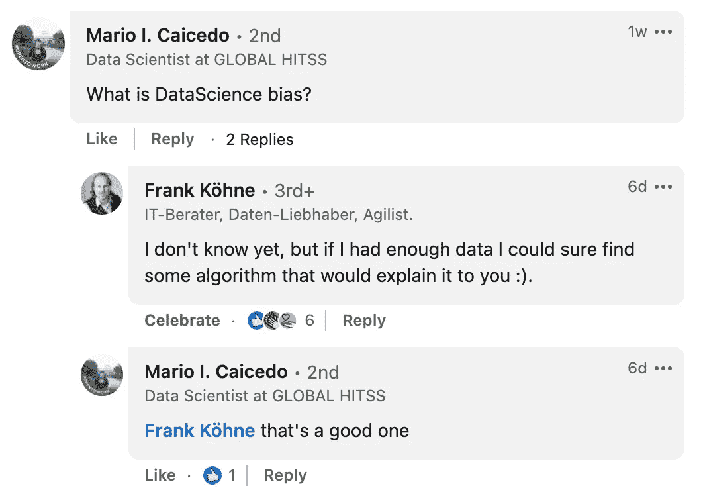
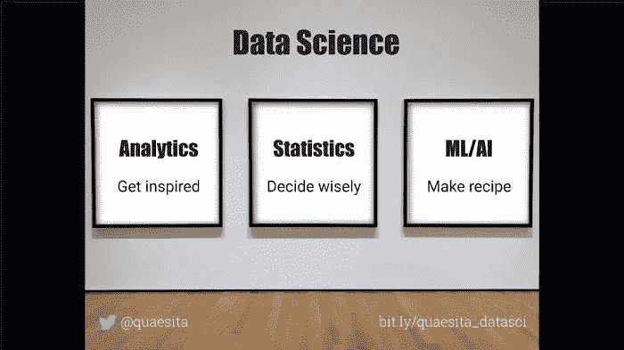
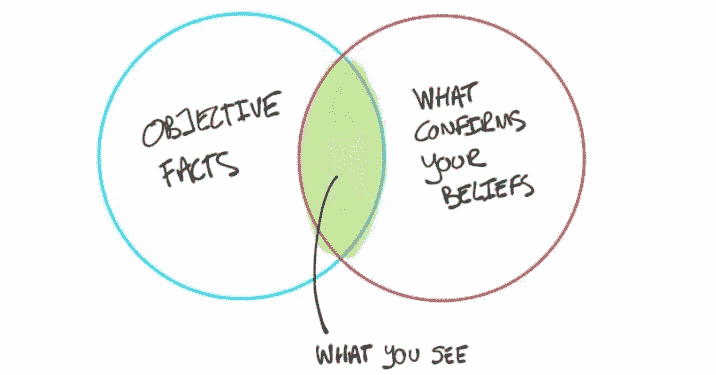

# 业余分析师和专业分析师的 10 个区别

> 原文：<https://towardsdatascience.com/10-differences-between-amateurs-and-professional-analysts-3a1be1a06a4d>

## 成为“真正的”数据分析师的旅程

亚历山大·辛恩在 [Unsplash](https://unsplash.com/?utm_source=medium&utm_medium=referral) 上的照片

分析就像写作职业:基础知识很容易入门，是一门艺术，所以进入门槛很低，任何人都可以自称为“作家”。标题中没有质量保证。

然而，有足够的文化来写一些推文并不能让你成为[托尼·莫里森](https://en.wikipedia.org/wiki/Toni_Morrison)或[加布里埃尔·加西亚·马尔克斯](https://en.wikipedia.org/wiki/Gabriel_Garc%C3%ADa_M%C3%A1rquez)——最好的作家比初学者超前好几光年。他们的观察很有力量。他们的洞察力改变了世界。

[分析](http://bit.ly/quaesita_sminianalytics)也是如此。这个行业的差异是巨大的。另一方面，比如说，[统计](http://bit.ly/quaesita_statistics)的准入门槛更高，所以最低水平的统计学家比最低水平的分析师更令人印象深刻……但也有更窄的技能范围。比起统计学家和 ML 工程师，专家分析师给我的印象要深刻得多。

业余分析师和专业分析师之间有很大的不同，在这篇文章中，我将为你总结其中的 10 点。对于每一个，我都有一个更深入的博客帖子，所以请随意跟随链接的线索，找到让你好奇的兔子洞。

## 专业数据人员与业余数据人员的区别#1 —软件技能

专业分析师努力学习最有效、最快速、最灵活的工作工具，这意味着他们可以快速超越点击式分析界面，学习编码。如果他们想宣称自己是一名专业人士，他们至少在这三种语言中的两种语言上掌握了惊人的技能: *R、Python 和 SQL* 。 [***了解更多***](http://bit.ly/quaesita_realanalyst) 。

## 专业数据与业余数据的区别之二——轻松处理大量数据

“大数据”有多大？这取决于你可以利用的技术——10 年前可能有价值的东西今天已经没有价值了。当你需要[额外的工程技能](http://bit.ly/quaesita_dataeng)来访问和移动数据时，数据就是“大”的。如果您可以将整个数据集加载到笔记本电脑的内存中，那么它肯定不是“大”的。

照片由[兰迪·塔兰皮](https://unsplash.com/@randytarampi?utm_source=medium&utm_medium=referral)在 [Unsplash](https://unsplash.com?utm_source=medium&utm_medium=referral) 上拍摄

与新手不同，专业分析师不会被数据集的规模吓倒。如果需要额外的工程技能来应对，那就这样吧。你会学到你必须学的东西。因此，专家分析师经常在这个过程中学会[数据工程技能](http://bit.ly/quaesita_dataeng)。 [***了解更多***](http://bit.ly/quaesita_realanalyst) 。

## 专业数据与业余数据的区别#3 —不受数据科学偏见的影响

业余分析师和专家分析师之间的另一个巨大区别是，专家已经形成了对数据的全面不尊重。他们从不把数据以大写字母“D”发音。

> “有了数据，你仍然只是另一个有观点的人。”

我最喜欢的统计学先驱之一，W. Edwards Deming ，有一句名言*“没有数据，你只是另一个有观点的人。这是真的，但不幸的是:“有了数据，你仍然只是另一个有观点的人。专家分析家们从骨子里明白这一点。*

我在 LinkedIn 上的一篇帖子的评论中隐藏着一颗宝石。

数据会让毫无戒心的业余爱好者产生虚假的安全感，但专家知道如何避免量化的轻信。要开始建立相同的免疫力，停止将数据视为特殊。 [***了解更多***](http://bit.ly/quaesita_realanalyst) 。

## 专业数据与业余数据的区别# 4——了解职业

与业余分析师不同，专业分析师是通过选择 成为 ***分析师的，而不是因为运气不好。对他们来说，分析本身就是一门优秀的学科，而不是通往其他职业的敲门砖(比如[机器学习](http://bit.ly/mf-ml)或[统计学](http://bit.ly/quaesita_statistics))。***

图片由作者制作，为我的[“数据科学到底是什么？”博文](http://bit.ly/quaesita_datascim)。

专业分析师明白，让你成为分析师的不是你的职位，也不是你使用的工具和技术。让你成为专家分析师的是你在[探索和灵感](http://bit.ly/quaesita_hbrrish)方面的专长——所以这是思考分析职业微妙之处的最佳出发点。 [***了解更多***](http://bit.ly/quaesita_careeranalyst) 。

## 专业数据与业余数据的区别之五——拒绝成为数据骗子

专业分析师*拒绝*成为[数据骗子](http://bit.ly/quaesita_charlatan):有毒后见之明的兜售者。

数据骗子的第一个警告信号是未能理解[**分析和统计是非常不同的学科**](http://bit.ly/quaesita_battle) **。不管你的正式职位是什么，没有规定说你不能想学就学，只要你不把它们弄混。为了避免意外成为数据骗子，一次解决一个问题。 [***了解更多***](http://bit.ly/quaesita_careeranalyst) 。**

## 专业数据与业余数据的差异# 6——抵抗确认偏差

[**确认偏差**](http://bit.ly/quaesita_confirmation) 意思是我们都可以看着同一个数字，对它有不同的感知。

由 [Paul J](https://twitter.com/pivotservices/status/1062234390493884416?s=19) 提供的确认偏差图解，经允许使用。

换句话说，[确认偏差](http://bit.ly/quaesita_confirmation) 是[数据驱动决策](http://bit.ly/quaesita_inspired)的死对头，因为这意味着一个事实不再仅仅是一个事实，无论你投入多少数学和科学去得到它。它从分析数据中吸取了所有的价值。

如果你渴望成为一名专业分析师，你需要绝地级别的确认偏差解药。这意味着将有意的练习放在磨练防御确认偏差的两个最佳技能上:*预注册*和*面对* [*脱敏*](http://bit.ly/quaesita_inkblot) 。 [***学习如何***](http://bit.ly/quaesita_careeranalyst) 。

## 专业数据与业余数据的差异#7 —对数据的现实预期

如果你是专业分析师，你知道数据不欠你什么。对你的麻烦来说连像样的质量都没有。

对分析师来说，处理别人留下的烂摊子是工作的一大部分。由 [Oleksii Hlembotskyi](https://unsplash.com/@lshphoto?utm_source=medium&utm_medium=referral) 在 [Unsplash](https://unsplash.com?utm_source=medium&utm_medium=referral) 上拍摄的照片

对于分析师来说，坏数据是一个职业现实，很大程度上是因为他们的工作涉及花更多的时间处理二手数据，而不是一手数据。分析师痛苦地意识到，你经常需要从坏数据开始，以找出如何制造更好的数据。要理解这些区别的重要性，并查看帮助分析师处理杂乱数据的技能列表，请点击 [***了解更多信息。***](http://bit.ly/quaesita_realisticanalyst)

## 专业数据与业余数据的区别# 8——知道如何增加价值

如果你是一个决策者的混合体，你的价值由你的决策和行动的质量来判断。你的分析技能是达到这一目的的手段——分析只是你武库中的众多武器之一。

分析师充当决策者的某种感觉器官。照片由 [Gerax Sotelo](https://unsplash.com/es/@gsotelo?utm_source=medium&utm_medium=referral) 在 [Unsplash](https://unsplash.com?utm_source=medium&utm_medium=referral) 上拍摄

如果你是一个纯粹的分析师，你的价值取决于你为决策者服务的能力。决策者的工作是将信息转化为更好的行动，如果他们不能获得大量信息，这是没有希望的。这就是分析师的用武之地，他们既被动地支持决策者的信息需求(通过查找能够回答他们特定问题的数据)，也主动地支持决策者的信息需求(通过探索数据来启发他们考虑新的方向，使他们更具创新性和抵御威胁的能力)。

> 分析师充当决策者的某种感觉器官。

专家分析师知道，从任何地方开始，除了你的决策者的需求和优先事项，一定会把你引入歧途。 [***了解更多***](http://bit.ly/quaesita_valueanalyst) 。

## 专业数据与业余数据的区别之九——对时间的不同思考

很少有角色像激光一样专注于时间的投资回报(ROI)。

一个经验丰富的分析师知道他们的工作不是一件有保证结果的确定的事情，而是在灵感、创新和早期威胁检测方面的时间投资。这就是为什么他们会找那些也明白这一点的老板——那些不会因为他们空手而归而惩罚他们的老板。

照片由 [MK 汉密尔顿](https://unsplash.com/@mkhamilton?utm_source=medium&utm_medium=referral)在 [Unsplash](https://unsplash.com?utm_source=medium&utm_medium=referral) 上拍摄

如果他们在为一个精明的组织工作，他们的团队相信他们会最大限度地利用分配给他们的时间，所以他们会不断地考虑他们行动的潜在时间 ROI。要了解这如何指导专家分析师的工作方式， [***在这里了解更多***](http://bit.ly/quaesita_timeanalysts) 。

## 专业数据与业余数据的差异# 10——对卓越的细微看法

分析游戏就是优化每分钟的灵感。

与业余爱好者不同，专业分析师不认为速度是一个肮脏的词，而是一个微妙的概念，指导他们如何看待自己的工作，如何优先考虑，如何评估业绩，以及如何发展自己的技能。

巴纳巴斯·赫特伦迪在 [Unsplash](https://unsplash.com?utm_source=medium&utm_medium=referral) 上拍摄的照片

作为专业分析师，速度也是你技能发展的北极星。诚然，数据格局正在快速变化，因此您不能停滞不前。你今天使用的工具不会持续很久。继续磨爪子，但不要追流行语。

> 不要再问:*“我是不是应该学习所有酷小孩都在谈论的这个工具/方法/技术？”* 开始提问:*“学这个会让我更快吗？”*

学习任何能让你更快的东西(用所有重要的方式)。既然你的工作包括加速别人，那就从加速自己开始吧。 [***了解更多***](http://bit.ly/quaesita_fastanalyst) 。

# 熟能生巧！

如果你只是想稍微了解一下分析，那就去看看一些数据吧。不要等待特别许可。你不需要任何花哨的训练。跳过这些课程和书籍，如果你还不是专家也不要担心…开始吧！一旦看数据开始变得有趣，你就可以称自己为分析师了。

但是如果你渴望成为专家，我有个坏消息要告诉你。虽然我希望你能探索我的[分析迷你课程](http://bit.ly/quaesita_sminianalytics)，但我(或其他任何人)教你的东西都不会让你精通。阅读分析可以帮助你调整心态和态度，但是精通需要天赋和实践。很多很多很多的练习。

 [## 分析:完整的迷你课程

### 我写这篇时事通讯的目的之一是帮助我将散乱的思绪转变成连贯的学习之旅…

bit.ly](http://bit.ly/quaesita_sminianalytics) 

如果你渴望用一些核心概念和对分析职业的思考来补充你的实践课程，请参加我的[迷你分析课程](http://bit.ly/quaesita_sminianalytics)。

哦，如果你在这里玩得开心，看看如果你不止一次点击拍手按钮会发生什么。