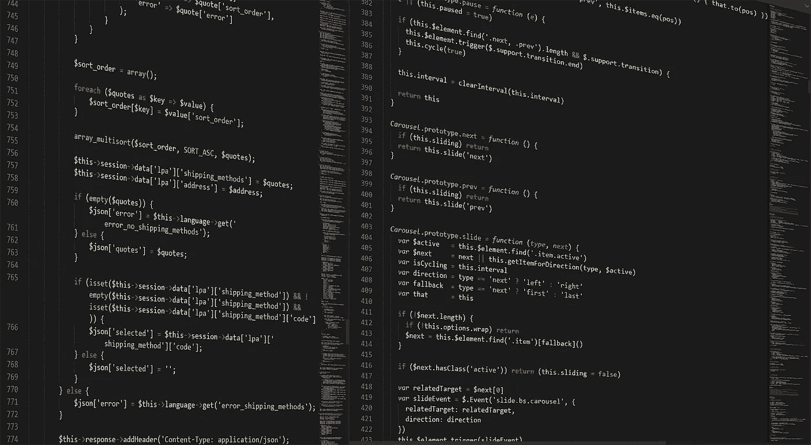

# 你应该知道的 10 个基本的 Julia 数组方法

> 原文：<https://towardsdatascience.com/10-essential-julia-array-methods-you-should-know-bedb07b5488a>

## 用这十个你可以使用的好方法把你的阵列带到一个新的水平



(图片由 [Pixabay](http://pixabay.com) 上的 [Boskampi](https://pixabay.com/images/id-1873854/) 提供)

# 介绍

Julia 编程语言是一种非常著名的面向科学计算的语言。虽然这种语言肯定是一种具有许多不同功能的通用语言，但它令人惊叹的数字能力无疑是人们关注的焦点。在很多方面，Julia 在处理数组和矩阵数据的能力上就像一个高级 FORTRAN。

在数据科学领域，伟大的数值方法和快速计算肯定会在做任何事情时派上用场。也就是说，学习 Julia 中数组的来龙去脉，以及分派给数组的方法可能是个好主意。今天我想回顾一下在 Julia 中使用传统的一维数值数组的一些最基本的方法。我认为这是在 Julia 身上学到的最有价值的东西之一，因为它经常被用于科学，在科学中，我们的阵列变成了我们的特征，我们的元素变成了我们的观察。关于科学等价性的另一个注意事项是，在 Julia 中,“Vector”这个名字只是一个数组的别名，所以如果我或者代码，比如说 Vector，记住它的基本意思是数组。最后一件事，如果您想亲自尝试一下这段代码，看看它在笔记本上是什么样子，这里有一个我在本文中使用的笔记本的链接:

[](https://github.com/emmettgb/Emmetts-DS-NoteBooks/blob/master/Julia/10%20Julia%20array%20methods.ipynb) [## Emmetts-DS-NoteBooks/10 Julia array methods . ipynb at master emmett GB/Emmetts-DS-NoteBooks

### 各种项目的随机笔记本。通过创建帐户，为 emmettgb/Emmetts-DS 笔记本电脑的开发做出贡献…

github.com](https://github.com/emmettgb/Emmetts-DS-NoteBooks/blob/master/Julia/10%20Julia%20array%20methods.ipynb) 

# №1:推！()

我想说的第一个方法是推！方法。如其名称结尾的解释点所示，push！是一种会改变我们血型的功能。用力！只是用来将元素移动到几乎任何可迭代的对象中…这实际上是另一件需要注意的事情——由于多重分派，这些方法并不总是只适用于数组。用力！可以用在许多其他类型的收藏上，甚至那些不是来自 Base 的库中的收藏。再者，你甚至可以自己写推送！，我在一篇完整的文章中谈到了推送！。如果你想更多地了解这种方法，以及它的用途，你可以在这里阅读我写的关于它的文章:

[](/everything-you-need-to-know-about-push-in-julia-1f01891f1c0a) [## 关于 Push 你需要知道的一切！在朱莉娅

### 用力！()方法是你需要了解的 Julia 基础的重要部分。让我们来看看它能做什么。

towardsdatascience.com](/everything-you-need-to-know-about-push-in-julia-1f01891f1c0a) 

使用 push！非常简单，我们将从定义要推送的数组开始！收件人:

```
x = [5, 10, 15, 20, 25, 30, 35, 40, 45]
```

我们现在可以叫推了！方法，首先提供我们想要推送的 iterable，然后是我们想要推送的 item:

```
push!(x, 50)
10-element Vector{Int64}:
  5
 10
 15
 20
 25
 30
 35
 40
 45
 50
```

需要注意的一点是，我们的 x 数组是一个向量{Int64}。每当我们构造这种类型时，括号中的类型 Int64 作为 T 从内部构造函数提供给外部构造函数。如果我刚才说的没有任何意义，不要担心——因为这里有一篇文章解释了我刚才到底说了什么！：

[](/a-painfully-in-depth-look-at-constructors-in-julia-2053a69bc8c6) [## 对《朱莉娅》中构造函数的痛苦的深入观察

### 在 Julia 中构建构造函数的所有细节

towardsdatascience.com](/a-painfully-in-depth-look-at-constructors-in-julia-2053a69bc8c6) 

无论如何，因为这个类型，我们称之为 T(可能在代码中就是这么叫的)，是 Int64，我们只能把整数压入它。例如，字符串会导致类型字符串不能转换为 Int64:

```
push!(x, "hi")
MethodError: Cannot `convert` an object of type String to an object of type Int64
```

有两种方法可以解决这样的问题…

*   编写一个新的 convert()方法，将字符串转换为整数。
*   把 T 的类型改成 any，那么这个数组的类型可以是任意的。

对于这样的东西，最好的选择当然是第二种。在大多数情况下，这可能是你要做的选择，我们可以用一个简单的造型来做到这一点。

```
xany = Vector{Any}(x)
```

注意，虽然我可能说了 cast，但我们实际上是在这里调用一个构造函数。这是有区别的，因为转换/转换是通过方法完成的，而构造当然是通过构造函数完成的。

```
push!(xany, "hi")
11-element Vector{Any}:
  5
 10
 15
 20
 25
 30
 35
 40
 45
 50
   "hi"
```

# №2:滤镜！()

另一个不合理的有用的方法是过滤器！()方法。这也是一种在 Julia 生态系统中随处可见的方法，那些在数据科学领域工作的人可能需要格外关注，因为这种方法经常被用作我们的条件屏蔽。该函数将根据函数的假返回值过滤值。这个函数当然可以是我们环境中的一个定义好的别名，但是它也可以是匿名的，甚至是一个闭包函数。由于在 Julia 中函数被视为与类型相同，并且该语言是词汇范围的，这使得像这样使用函数的调用非常容易应用于许多不同的场景。用法很简单，我将使用一个匿名函数，如果你想了解更多，我也有一篇文章:

[](/what-on-earth-is-an-anonymous-function-f8043eb845f3) [## 匿名函数到底是什么？

### 揭开 Julia 中匿名函数和类型的来龙去脉

towardsdatascience.com](/what-on-earth-is-an-anonymous-function-f8043eb845f3) 

```
filter!(z -> z < 40, x)
7-element Vector{Int64}:
  5
 10
 15
 20
 25
 30
 35
```

我希望 Base 中包含的一件事是 BitArray 能够做到这一点。我创建的 OddFrames 包实际上解决了这个问题，但是使 BitArray 索引成为类型间的通用特性。这样，您可以使用条件语句快速索引任何内容，而无需使用函数。也就是说，Julia 的优点在于，即使该方法的默认系统不符合我们的需求，比如用一个位数组屏蔽，我们也可以自己编写这样的代码！为此，我们还将方便地使用这个列表中的下两个函数，findall()和 deleteat！():

```
import Base: filter!function filter!(mask::BitArray, x::AbstractVector)
        pos = findall(x -> x == 0, mask)
        [deleteat!(x, p) for p in pos]
end
```

请注意，由于我们将 mask 分派给 bitarray，我们还需要将下面的数组转换为 vector，否则我们将得到“bool is not callable”，这是因为我们仍在使用常规过滤器！()方法，并试图将其作为函数调用。我们也可以将这种类型作为 Vector{Bool}来避免这种类型转换(不过，我们还是像以前一样构造了一个类型，只是在精神上可以认为这是一种类型转换，我只是想详细说明一下。)

```
mask = BitArray([typeof(z) == Int64 for z in xany])
11-element BitVector:
 1
 1
 1
 1
 1
 1
 1
 1
 1
 1
 0filter!(mask, xany)

1-element Vector{Vector{Any}}:  [5, 10, 15, 20, 25, 30, 35, 40, 45, 50]
```

> 美味的肉汁…朱莉娅是个很酷的人。

注意，返回并不重要，它只是 for 循环的产物——我们可以不返回任何东西来抑制这个输出，因为我们的数组已经在函数内部变异了。

```
print(xany)

Any[5, 10, 15, 20, 25, 30, 35, 40, 45, 50]
```

# №3:删除 at！()

下一个方法非常简单。删除 at！()方法允许我们通过索引删除数组中的一个元素。在前面的例子中，我们使用了 deleteat！()删除数组中每个有错误的位置。在我们的 x 数组的例子中，我将用它来删除我们的第一个索引，它将是 5。

```
deleteat!(x, 1)
6-element Vector{Int64}:
 10
 15
 20
 25
 30
 35
```

# №4:查找所有()

findall()方法是另一个我一直在使用的非常好的方法，这也是为什么在上面使用它的原因。这个函数是我们列表中的第一个非突变函数，也是第一个返回非原始向量的函数。方法收集特定值的所有实例，然后返回找到这些值的索引数组。例如，我们可以对 x 上的数字 10 使用 findall()，因为它只有一个 10，现在在位置 1，我们将获得包含该位置的 1 元素数组。返回的类型总是 array，所以如果你的值是一个集合(不是按类型，而是按定义)，那么你可以总是在第一个元素索引新的数组，以获得奇异位置。

```
findall(y -> y == 10, x)[1]1
```

使用这个，我们最终可以做三倍的工作来得到第一个元素的索引。

```
x[findall(y -> y == 10, x)[1]]10
```

> 我很搞笑。

# №5: vcat/hcat

接下来要知道的方法分别是 vcat()和 hcat()方法。您可能已经猜到了，这些是用于数组的垂直和水平连接的。这些方法也可以用来将一维数组转化为多维数组。如果数组水平连接，这将把类型变为矩阵。在垂直连接的情况下，这基本上就像我们将每个值推入数组。

```
x3 = vcat(x, x, x)
18-element Vector{Int64}:
 10
 15
 20
 25
 30
 35
 10
 15
 20
 25
 30
 35
 10
 15
 20
 25
 30
 35
```

hcat 将创建一个矩阵:

```
xh = hcat(x, x, x)
6×3 Matrix{Int64}:
 10  10  10
 15  15  15
 20  20  20
 25  25  25
 30  30  30
 35  35  35
```

# №6: .*, .+, …

接下来的清单上几乎所有的。运营商，其中有很多。基本上所有这些都只是常规操作符的迭代版本。虽然它们并不存在于每一个操作符绑定中，但是它们确实存在，并且比打开一个完整的循环来给数组中的每一个元素加一个数要方便和漂亮得多。这不仅适用于按位运算符，也适用于一元运算符。

```
x .== x
6-element BitVector:
 1
 1
 1
 1
 1
 1x .^ 26-element Vector{Int64}:
  100
  225
  400
  625
  900
 1225.- x6-element Vector{Int64}:
 -10
 -15
 -20
 -25
 -30
 -35
```

# №7:插入！()

我们要看的下一个函数是 insert！()函数。正如您所料，这将给定的值插入到数组中。方法推的区别！()和 insert()方法的区别在于，insert 允许您指定要推进到的索引。如果在某个时候需要添加数据，或者特别是希望在不改变任何其他索引的情况下改变元素，这是非常方便的。这个函数也很容易使用，并且只接受三个位置参数。

```
insert!(x, 1, 5)7-element Vector{Int64}:
  5
 10
 15
 20
 25
 30
 35
```

根据我的经验，这种方法非常有用，但是在很多情况下，对于稍微改变的算法，我们可以切换到另一种类似的方法，splice！()

# №8:拼接！()

拼接！方法很像 insert！方法，然而在插入时！将保留我们正在更改的索引周围的值，拼接！不会。拼接！函数也有更多的细节要处理，因为我们可以拼接！一次输入几个值。同样，我们可以一次选择多个索引——这种方法非常方便，使得可变数组成为可能并且易于使用。

```
splice!(x, 1:5, [50, 45, 40, 35, 30])7-element Vector{Int64}:
 50
 45
 40
 35
 30
 30
 35
```

# №9:累加()

累积值可能是一件有点烦人的事情。虽然由于我们周围的基本函数，我们经常不需要使用累加器，但它们对于某些算法仍然非常有用。也就是说，这个列表中的下一个函数是 accumulate()函数。这将返回一个与我们提供的数组维数完全相同的数组。然而，这些元素将被操作成它之前的每个元素的累积。也就是说，新累积数组中的最终值将是整个数组的总和。最棒的是，我们可以用 Julia 的大多数操作符做到这一点，所以我们可以做一个累加器，它可以进行乘法、减法、平方等运算。

```
accumulate(*, x)7-element Vector{Int64}:
          50
        2250
       90000
     3150000
    94500000
  2835000000
 99225000000accumulate(+, x)[length(x)] == sum(x)true
```

# №10:地图切片()

我想看的最后一个方法是 mapslices()。我们可能都习惯于 map()函数，但是 mapslices 的工作方式与该函数略有不同。这个函数只允许你把一个给定的函数映射到整个数组，但是只接收返回的某些值，例如，如果我们想以一种奇怪的方式对某个东西求和:

```
mapslices(sum, x, dims = [1])
```

# 结论

数组不仅是 Julia 编程语言的一个非常重要的方面，也是整个科学计算的一个非常重要的方面。Julia 有一个相当健壮的处理数组的接口，包括一维数组和其他数组，所以在使用这种语言时利用它是一个很好的主意。这些简单的方法可能看起来不会改变生活，但它们肯定是必不可少的、令人敬畏的和有用的。感谢您阅读我的文章，我希望这篇关于 Julia 中奇妙的 vector 实现的简短旅程是一篇很棒的阅读！