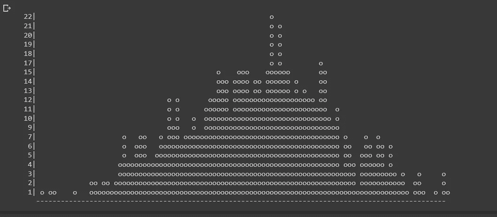

# 2022 年你应该知道的 10 个领先的 Python 库

> 原文：<https://towardsdatascience.com/10-leading-python-libraries-you-should-know-in-2022-a3287498c4b4>

## 破折号，不平衡学习， **FlashText，PyFlux，还有更多**


由[布雷特·乔丹](https://unsplash.com/@brett_jordan?utm_source=medium&utm_medium=referral)在 [Unsplash](https://unsplash.com?utm_source=medium&utm_medium=referral) 上拍摄的照片

Python 编程充满了可能性。它简单明了，有许多优秀的库和函数，可以使任务更易于管理。每个 Python 开发者都必须使用流行的库，比如 OS、pandas、datetime、scikit-learn、seaborn、Tkinter 等等。

在本文中，我将讨论十个您可能感兴趣的 Python 库。让我们仔细看看一些不常见但很有价值的 Python 编程库。

# **1。Wget**

数据科学家最重要的职责之一是数据提取，尤其是从网站提取数据。Wget 是一个用于下载非交互式在线文件的免费模块。即使用户没有登录，该模块也可以在后台运行，因为它是非交互式的。因此，它是从网站或页面下载所有照片的理想选择。

我们通常使用这个模块来实现自动化，我们想让它在后台继续运行。

> 安装:

```
pip install wget
```

# **2。钟摆**

如果您需要在 python 项目中使用日期和计时，钟摆是一个很好的项目。这个 python 包简化了日期和时间操作。它能够完全取代 Python 的原生类。

> 安装:

```
pip install pendulum
```

如果我们想获得任何特定时区的当前时间，那么钟摆模块的一行代码可以完成如下任务。

```
import pendulum# Getting current UTC time
**utc_time =****pendulum.now('UTC')**
```

# **3。不平衡学习**

事实上，当每个类别中的样本数量几乎相等时，分类算法的性能最佳，但在实际项目中，大多数数据集是不平衡的。

这些数据集影响机器学习算法的学习阶段和后续预测。为了解决这些问题，不平衡学习正在发展。IB 项目的组件 Scikit Learn 与之兼容。当您下次遇到不平衡的数据集时，请记住这一点。

> 安装:

```
pip install -U imbalanced-learn# orconda install -c conda-forge imbalanced-learn
```

# **4。FlashText**

在大多数 NLP 任务中，替换句子中的单词或从短语中移除单词是文本数据清洗。这个过程通常使用正则表达式来执行，但是随着搜索关键字的数量接近数千，它变得非常困难。

Python 中的 flash 文本模块基于 flash 文本算法，在这种情况下提供了一个合适的替代方案。Flashtext 的运行时间是一致的，不管搜索查询的数量是多少，这是它最健壮的特性。

> 安装:

```
pip install flashtext
```

# **5。模糊模糊和多模糊**

这个名字听起来很有趣，但是 fuzzywuzzy 是一个方便的字符匹配库。它可以快速实现字符串匹配和令牌匹配等操作。它还可以很容易地匹配来自几个数据库的条目。

有许多高级模糊匹配替代方法可用，如 polyfuzz，它使用变形器、手套、快速文本和嵌入来进行高效匹配。

> 安装:

```
pip install fuzzywuzzy
pip install polyfuzz
```

如果我们想用 transformers、FastText、Td-IDF 或 Embeddings 等高级算法在两个文本列表之间应用模糊匹配，那么下面几行代码可以帮助我们。

```
from polyfuzz.models import TFIDF                                from polyfuzz import PolyFuzz                                                           tfidf = TFIDF(n_gram_range=(3, 3))                              model = PolyFuzz(tfidf)                             model.match(from_list, to_list)
```

> 直接从行业专家那里获得 Python 和数据科学的优质内容——使用我的推荐链接成为中级会员以解锁内容:[https://pranjalai.medium.com/membership](https://pranjalai.medium.com/membership)

# **6。PyFlux**

机器学习中最普遍的困难之一是时间序列分析。Pyflux 是一个开源 Python 包，旨在处理时间序列挑战。该模块包含几个良好的当前时间序列模型，包括 Arima、GARCH 和 VaR 模型。最后，flux 为时间序列建模提供了一种有效的方法。值得一试。

> 安装:

```
pip install pyflux
```

# **7。Ipyvolume**

数据科学是关于交流结果的，可视化是一个巨大的帮助。Ipyvolume 是一个 Python 模块，用于在 Jupyter 笔记本中查看 3D 视觉效果(如 3D 立体图)。

> 安装:

```
# Using pippip install ipyvolume# Using Conda/Anacondaconda install -c conda-forge ipyvolume
```

这是你如何使用它。

```
import ipyvolume as ipv
import numpy as np
x, y, z, u, v, w = np.random.random((6, 1000))*2-1
ipv.quickquiver(x, y, z, u, v, w, size=5)
```


由作者添加

# **8。破折号**

Dash 是一个用于开发 web 应用程序的轻量级 Python 框架。它是用 Flash Plotly.js 和 React.js 构建的，Dash 是创建数据可视化应用程序的理想选择。这些应用程序可以通过网络浏览器查看。

> 安装:

```
pip install dash==0.29.0 # This will install the core dash backendpip install dash-html-components==0.13.2 # This command will install HTML componentspip install dash-core-components==0.36.0 # Supercharged componentspip install dash-table==3.1.3 # Interactive DataTable component
```

# **9。Bashplotlib**

Bashlotlib 是一个 Python 库和命令行实用程序，用于在终端创建简单的图形。当用户不能访问 GUI 时，可视化数据变得非常有用。

> 安装:

```
pip install bashplotlib
```

下面是如何使用它来制作一个交互式直方图。

```
import numpy as npfrom bashplotlib.histogram import plot_histrand_nums = np.random.normal(size=700, loc=0, scale=1)plot_hist(rand_nums, bincount=100)
```



由作者添加

# **10。Colorama**

Colorama 是一个 Python 包，可以在终端和命令行上生成彩色文本。它使用标准 ANSI 转义码对终端输出进行着色和样式化。它是跨平台的，在 Windows 和 Linux 上运行良好。

> 安装:

```
pip install colorama
```

下面是使用方法。

```
from colorama import init, Fore, Backinit()# Fore changes the text's foreground color
print(Fore.BLUE + "These are Blue Letters")#Back changes the text's background color
print(Back.WHITE + "This is White Background")
```

# 结论

许多现实世界的应用程序经常使用易于理解的 Python 编程语言。由于它是一种高级的、动态类型的、解释型的语言，所以它在错误调试领域迅速发展。此外，因为 Python 库是可用的，所以用户可以完成各种活动而无需构建他们的代码。

因此，学习 Python 及其库对于当今任何有抱负的人才来说都是至关重要的。作为开发人员，这些库可以让您的生活更加轻松。

> *在你走之前……*

如果你喜欢这篇文章，并且想继续关注更多关于 **Python &数据科学**的**精彩文章**——请点击这里[https://pranjalai.medium.com/membership](https://pranjalai.medium.com/membership)考虑成为中级会员。

请考虑使用 [**我的推荐链接**](https://pranjalai.medium.com/membership) 报名。通过这种方式，会员费的一部分归我，这激励我写更多关于 Python 和数据科学的令人兴奋的东西。