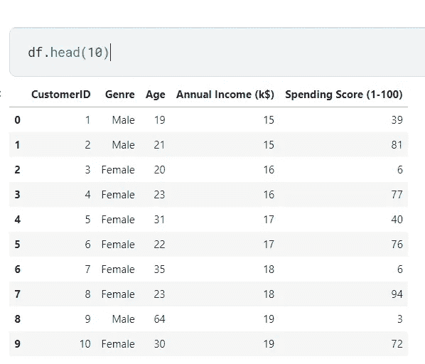
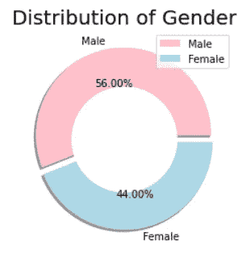
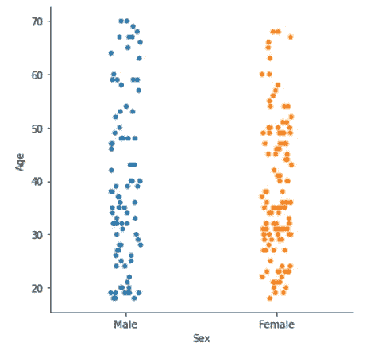
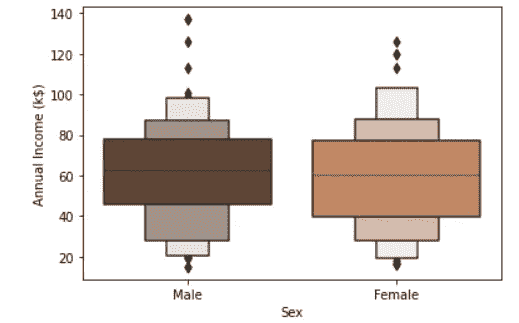
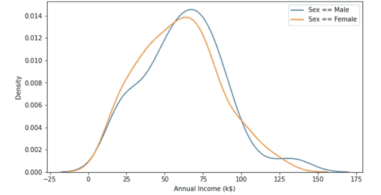
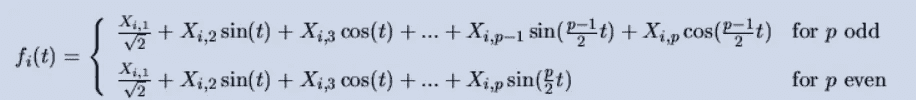
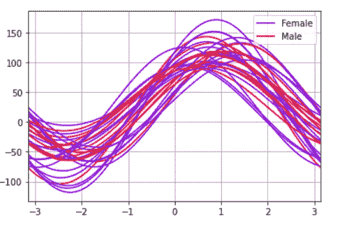
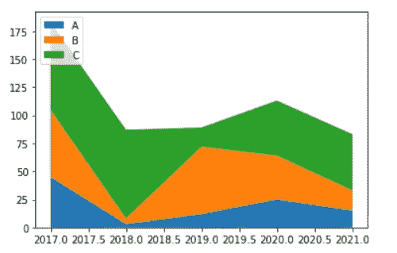
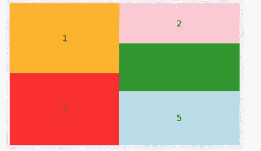

# 10 个鲜为人知的 Python 可视化概念和技巧

> 原文：<https://towardsdatascience.com/10-less-known-python-visualization-concepts-and-hacks-2b5f8ff4a5b7>

## 添加到您的探索性数据分析库中


来源:[像素](https://www.pexels.com/ko-kr/photo/4175054/)(免费使用)

# 介绍

可视化是我们以各种视觉形式描述数据的操作，从图表、图形到信息图形。它是探索性数据分析(EDA)中最重要的部分之一，因为它使我们能够轻松掌握变量之间的关系和数据的任何独特特征，这对后期的特征工程和建模非常有用。在本文中，我将向您介绍 10 个 Python 可视化概念和技巧，这些概念和技巧不太为人所知，但是对于将它们添加到您的可视化武库中非常有用！

我们从导入相关库和[数据集](https://www.kaggle.com/shwetabh123/mall-customers)(CC0:Creative Commons；允许商业使用)我们将在下面的一些例子中使用。

```
**import** numpy **as** np
**import** pandas **as** pd
**import** seaborn **as** sns
**import** matplotlib.pyplot **as** pltdf = pd.read_csv(“../input/mall-customers/Mall_Customers.csv”)df
```



来源:来自作者

这是一个购物中心客户数据集，包含 5 个变量—客户 ID、类型、年龄、年收入(k$)和消费得分(1-100)。

为了方便起见，我们将流派列重命名为性别。

```
df.rename(columns={'Genre':'Sex'}, inplace=True)
```

# 使用样式

Python 中的 Matplotlib 允许我们指定用于可视化的特定样式。这些风格使我们的视觉化图像更容易理解，更容易阅读和解释，有时还会给它们添加美学的味道，使它们对观众更有说服力。以下是您可以使用的样式列表。

```
['seaborn-deep','seaborn-muted','bmh','seaborn-white','dark_background','seaborn-notebook','seaborn-darkgrid','grayscale','seaborn-paper','seaborn-talk','seaborn-bright','classic','seaborn-colorblind','seaborn-ticks','ggplot','seaborn','_classic_test','fivethirtyeight','seaborn-dark-palette','seaborn-dark','seaborn-whitegrid','seaborn-pastel','seaborn-poster']
```

在开始构建可视化之前，您只需运行以下代码:

```
plt.style.use("fivethirtyeight")
```

# 设置和更新参数

有时，为您制作的每个可视化指定参数很麻烦，您可能希望为您制作的所有可视化定义一组参数。在这种情况下，您可以利用 matplotlib 的 rcParams 方法。

```
**# Setting figure size using matplotlib.pyplot's rcParams method** plt.rcParams['figure.figsize'] = (16, 9)**# Setting linewidth of line graph
import** matplotlib **as** mpl
[mpl.rcParams](https://matplotlib.org/stable/api/matplotlib_configuration_api.html#matplotlib.RcParams)['lines.linewidth'] = 2##and other settings are available too
##[https://matplotlib.org/stable/tutorials/introductory/customizing.html](https://matplotlib.org/stable/tutorials/introductory/customizing.html)
```

也可以通过 seaborn 的 set 方法设置参数或设置。

```
**# Another way to set figure size using seaborn's set method** sns.set(rc={'figure.figsize':(10,8)})
```

我们可以使用 matplotlib 中的 pylab 方法来更新参数。

```
**import** matplotlib.pylab **as** pylab**# Specify various parameters you want to overwrite/update with**params = {'legend.fontsize': 'large','figure.figsize': (16,9),'axes.labelsize': 'x-large','axes.titlesize':'small','xtick.labelsize':'medium','ytick.labelsize':'x-large'} pylab.rcParams.update(params)
```

请注意，您可以使用 7 个不同的选项来指定大小，如下所示:

```
Size: {'xx-small', 'x-small', 'small', 'medium', 'large', 'x-large', 'xx-large'}
```

# 环形图

这是一个很好的可视化不同类别的比例图。当您为每个部分的实际比例值添加注释时会更有效，因为具有相似比例的部分可能很难相互区分。

```
size = df['Sex'].value_counts()
colors = ['pink', 'lightblue']
labels = "Male", "Female"
explode = [0.05, 0.03] *# It specifies the fraction of the radius with which to offset each wedge for each portion. In this case, we only have two categories and so we specify two values.*# first argument specifies the location of circle center and the second argument specifies the size of the radius. We set color to be  white so that the center of the circle becomes empty and hence the name "donut" plot.
donut = plt.Circle((0,0), 0.6, color = 'white') # The autopct argument allows us to add annotations of proportion values to each portion of the donut plot
plt.pie(size, colors = colors, labels = labels, shadow = True, explode = explode, autopct = '%.2f%%')plt.title('Distribution of Gender', fontsize = 20)
p = plt.gcf()
p.gca().add_artist(donut)
plt.legend()
plt.show()
```



来源:来自作者

# 群体图

群体图是一种可视化类型，允许我们可视化每个类别的值的分布。它可能比其他类型的可视化(如箱线图)更有用，因为它的粒度显示(即显示每个数据点的值)如下所示。这样做的缺点是，如果有太多具有相似值范围的数据点，可视化可能会看起来过于集中，并在解释可视化时造成困难。我建议将它用于不太大的数据集。



来源:来自作者

您可以使用以下代码创建上面的虫群图:

```
sns.catplot(x='Sex', y='Age', data=df)
```

# 博兴图

Boxenplot 是由 seaborn 包提供的，看起来几乎像一个方框图。虽然箱线图的主要改进是分位数的更精细显示，这为用户的可视化增加了更多信息。关于这个可视化的更多信息可以从这个[文档](https://seaborn.pydata.org/generated/seaborn.boxenplot.html)中找到。

```
sns.boxenplot(x='Sex', y='Annual Income (k$)', data=df, palette = 'copper')
```



来源:来自作者

# 散布矩阵图

散点图包含数值变量的单变量和多变量可视化。如果有 n 个数值变量，则显示 n x n 个网格，对角线位置的网格包含每个变量的单变量分布图(如直方图)，而其他网格向我们显示散点图，解释不同变量组合之间的关系。请看下面的可视化！


来源:来自作者

```
**from** pandas.plotting **import** scatter_matrixpd.plotting.scatter_matrix(df.drop('CustomerID',axis=1), figsize=(10,10))
```

# 密度图

核分布估计图是一种类似于直方图的分布图，但不同之处在于它描述的是概率密度函数，而不是纯粹的计数或比例。根据熊猫[文档](https://pandas.pydata.org/docs/reference/api/pandas.DataFrame.plot.kde.html)，“这是一种估计随机变量概率密度函数(PDF)的非参数方法，使用高斯核进行估计，包括自动带宽确定。”

```
fig, ax = plt.subplots(1,1,figsize=(9,5))sns.kdeplot(df[df['Sex']=='Male']['Annual Income (k$)'], ax=ax) 
sns.kdeplot(df[df['Sex']=='Female']['Annual Income (k$)'], ax=ax)plt.legend(['Sex == Male', 'Sex == Female'])
```



来源:来自作者

正如您在上面看到的，这种可视化对于并列不同类别的密度图以及查看分布如何不同非常有用。这可能会给我们关于变量本身的有用见解，以及关于如何设计该特征以提高模型性能的潜在想法。

# 安德鲁斯曲线

因为人类能够感知和理解的最大维数是三，任何超过这个维数的特征组合都变得很难放到画布上。为了解决这个问题，有几种可视化方法以我们可以理解的方式描述了三维的多维数据。安德鲁斯曲线就是其中之一。它通过以下方式转换多元观测值:



资料来源:安德鲁斯博士(1972)。高维数据图，*生物特征*28:125–136。

看看这个[教程](https://www.learningtree.com/blog/using-a-pandas-andrews-curve-plot-for-multidimensional-data/)的另一个例子。虹膜数据中对应于不同物种的线用不同的颜色标记，我们看到一些线有很多重叠，而另一些没有。这给了我们一个概念，一个变量中的哪些类别具有与其他类别完全不同的基本分布或模式。

```
**from** pandas.plotting **import** andrews_curves**# Only used 30 sampled data points to create the visualization because using the entire data makes the display too cluttered**andrews_curves(df.drop(“CustomerID”, axis=1).sample(30), ‘Sex’,colormap=’rainbow’)
```



来源:来自作者

# 堆积面积图

堆积面积图有助于显示不同类别在一段时间内的比例或数值的细分。看看下面的可视化。



来源:来自作者

正如你在上面看到的，我们可以很容易地看到类别和 A、B、C 的细分是如何随时间变化的。例如，A、B 和 C 的细分在 2017 年开始相对均匀。然而，B 和 C 的部分呈指数下降，直到 2018 年，而 A 的部分保持相对不变。

# 树形地图

类似于饼图、条形图和圆环图，树形图向我们展示了不同类别比例的可视化显示。我个人认为它比前面提到的三个图更有效，尤其是当你有很多类别要比较的时候。例如，在圆环图中，许多具有相似比例的类别显示为一个圆中的角，这可能很难理解。另一方面，三棵树图在一个大矩形的石板中以不同大小的矩形显示比例，这使我们更容易立即知道类别在大小方面如何相互比较。



来源:来自作者

```
**import** matplotlib.pyplot asplt
**import** seaborn **as** sns
**import** folium
**import** squarify# Create a new variable that assigns random categories from 1 to 4 for the purpose of illustrating this example
df['rand_assignment'] = [randint(1,5) for e in range(len(df))]y = df['rand_assignment'].value_counts( )

# The alpha argument sets the transparency of the visualization. If you would like to form the graph plot less transparent, make alpha greater than 1\. This solidifies the graph plot, making it less transparent and dense. On the other hand, ff you would like to form the graph plot more transparent, make alpha smaller than 1.squarify.plot(sizes = y.values, label = y.index, alpha=.8, color = ['red','orange','lightblue','green','pink'])plt.axis('off')
plt.show()
```

# 结论

在本文中，我向您解释了 10 种可视化和技巧，它们不太为人所知和利用，但对添加到您的数据可视化工具包中很有用。最重要的是，我个人认为最重要的是理解每一个可视化做什么，它显示什么信息，什么时候它最有效，以及它如何被用来向观众传达你想要的信息，而不是骄傲于你知道如何创建多少可视化。

如果你觉得这篇文章有帮助，请考虑通过以下链接注册 medium 来支持我: )

[joshnjuny.medium.com](https://joshnjuny.medium.com/membership)

你不仅可以看到我，还可以看到其他作者写的这么多有用和有趣的文章和帖子！

# 关于作者

*数据科学家。加州大学欧文分校信息学专业一年级博士生。*

*密歇根大学刑事司法行政记录系统(CJARS)经济学实验室的前研究领域专家，致力于统计报告生成、自动化数据质量审查、构建数据管道和数据标准化&协调。Spotify 前数据科学实习生。Inc .(纽约市)。*

*他热爱运动，健身，烹饪亚洲美食，看 kdramas，制作/表演音乐，最重要的是崇拜我们的主耶稣基督。结账他的* [*网站*](http://seungjun-data-science.github.io) *！*