# 10 分钟轻松的 SQL 教程，适合铁杆熊猫爱好者

> 原文：<https://towardsdatascience.com/10-minute-effortless-sql-tutorial-for-die-hard-pandas-lovers-a64c36733fd0>

## 曾几何时，情况正好相反


菲奥娜·阿特摄于 Pexels

## 动机

当 Pandas package 在 2009 年获得公开曝光时，SQL 自 1974 年以来一直统治着数据世界。Pandas 具有一系列吸引人的功能，如内置可视化和灵活的数据处理，并成为一种终极数据探索工具。随着它越来越受欢迎，出现了许多教授 Pandas 并将其与 SQL 进行比较的课程和资源。

快进到 2021 年，人们现在首先开始接触熊猫包*，而不是通用数据语言——SQL。尽管 SQL 一如既往地受欢迎，但 Pandas 的灵活性和多功能性使其成为初学数据科学家的首选。*

*那么，既然知道熊猫，为什么还需要 SQL 呢？*

*即使熊猫看起来是更好的选择，SQL 仍然在数据科学家的日常工作中扮演着重要角色。事实上，SQL 是数据科学第二大需求和第三大增长的编程语言(见[这里](/the-most-in-demand-skills-for-data-scientists-in-2021-4b2a808f4005))。所以，如果你想在这个领域找到一份工作，在你的简历中加入 SQL 是必须的。了解熊猫，学习 SQL 应该轻而易举，正如您将在本文中看到的。*

*<https://ibexorigin.medium.com/membership>  

获得由强大的 AI-Alpha 信号选择和总结的最佳和最新的 ML 和 AI 论文:

<https://alphasignal.ai/?referrer=Bex>  

## 连接到数据库

设置一个 SQL 工作区并连接到一个示例数据库可能是一件非常痛苦的事情。首先，你需要安装你喜欢的 SQL 风格(PostgreSQL，MySQL 等。)并下载一个 SQL IDE。在这里做这些会使我们偏离文章的目的，所以我们将使用捷径。

具体来说，我们将在 Jupyter 笔记本中直接运行 SQL 查询，无需额外的步骤。我们需要做的就是使用 pip 安装`ipython-sql`包:

```
pip install ipython-sql
```

安装完成后，启动一个新的 Jupyter 会话，并在笔记本中运行以下命令:

```
%load_ext sql
```

你已经准备好了！

为了说明基本的 SQL 语句是如何工作的，我们将使用 Chinook SQLite 数据库，您可以从这里下载。该数据库有 11 个表。

要检索存储在该数据库表中的数据，请运行以下命令:

```
%sql sqlite:///data/chinook.db
```

该语句以`%sql`行内神奇命令开始，告诉笔记本解释器我们将运行 SQL 命令。接下来是下载的 Chinook 数据库所在的路径。对于 SQLite 数据库，有效路径应该总是以前缀`sqlite:///`开头。上面，我们正在连接到存储在当前目录的“data”文件夹中的数据库。如果你想传递一个绝对路径，前缀应该以四个正斜杠开始- `sqlite:////`

如果您希望连接到不同风格的数据库，可以参考这篇[优秀文章](/heres-how-to-run-sql-in-jupyter-notebooks-f26eb90f3259)。

## 先看一下表格

在 Pandas 中，我们通常做的第一件事是使用`.head()`函数来查看数据。让我们学习如何在 SQL 中实现这一点:

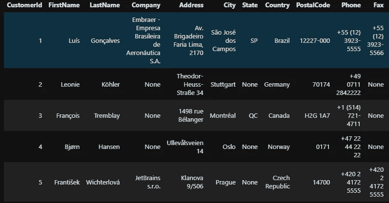

数据集也被许可用于商业用途。

上述查询中的第一个关键字是`SELECT`。它相当于 Pandas 中的括号操作符，在这里我们选择特定的列。但是，SELECT 关键字后跟一个*(星号)。*是一个 SQL 操作符，它从一个在`FROM`关键字后指定的表中选择所有内容(所有行和列)。LIMIT 用于最小化返回的输出。所以，上面的查询相当于`df.head()`函数。

如果不想选择所有列，可以在 select 关键字后指定一个或多个列名:

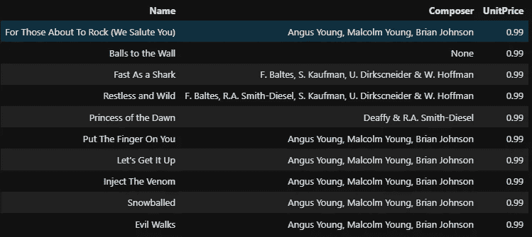

相当于熊猫的操作是

```
tracks[['Name', 'Composer', 'UnitPrice']].head(10)
```

SQL 中另一个有用的关键字是`DISTINCT`。在任何列名之前添加此关键字都会返回其唯一值:


SQL 中的注释用双破折号书写。

## 计算行数

就像 Pandas 在其数据帧上有`.shape`属性一样，SQL 有一个`COUNT`函数来显示表中的行数:

```
%%sqlSELECT COUNT(*) FROM tracks
```

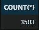

也可以将列名传递给 COUNT:

```
%sql SELECT COUNT(FirstName) FROM customers
```


但是输出将与 COUNT(*)相同。

更有用的信息是计算特定列中唯一值的数量。我们可以通过在 COUNT 中添加 DISTINCT 关键字来实现这一点:


## 使用 WHERE 子句筛选结果

仅仅是看和数行是相当蹩脚的。让我们看看如何根据条件过滤行。

首先，让我们来看看价格超过一美元的歌曲:

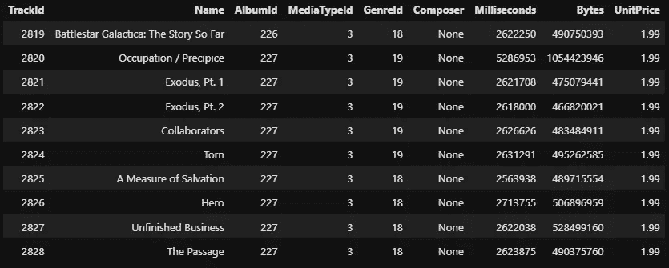

条件语句写在 WHERE 子句中，该子句总是位于 FROM 关键字之后和 LIMIT 关键字之前。使用条件句和我们在熊猫身上做的很相似。

使用条件句时也可以使用 COUNT 函数。例如，让我们看看价格在 1 到 10 美元之间的歌曲数量:

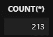

上面我们用布尔运算符 AND 链接了两个条件。其他布尔运算符在 SQL 中是相同的。

现在，让我们看看所有将巴黎或柏林作为账单城市的发票:

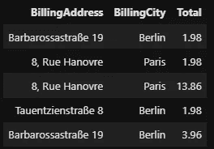

SQL 中的等号运算符只需要一个“=”(等号)。不等式运算符用“！= '或'【T4]'运算符:

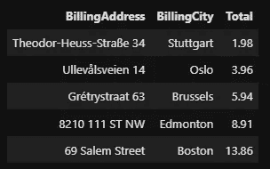

## 使用“介于”和“在”更容易过滤

类似的条件句使用得非常频繁，用简单的布尔写出它们变得很麻烦。例如，Pandas 有`.isin()`函数，它检查一个值是否属于一个组或值的列表。如果我们想选择五个城市的所有发票，我们必须编写五个连锁条件。幸运的是，SQL 支持类似于`.isin()`的 IN 操作符，所以我们不必:

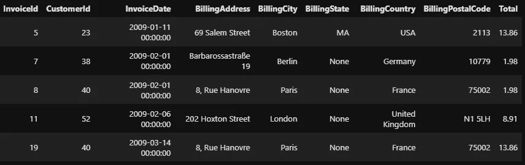

IN 之后的值列表应该作为元组给出，而不是列表。您也可以用 NOT 关键字否定条件:

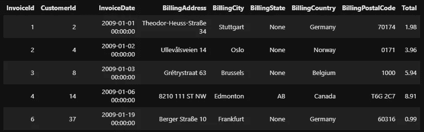

对数字列的另一种常见筛选操作是选择某个范围内的值。为此，可以使用 BETWEEN 关键字，相当于`pd.Series.between()`:


## 检查空值

每个数据源都有缺失值，数据库也不例外。就像有几种方法可以探索 Pandas 中缺失的值一样，有一些特定的关键字可以检查 SQL 中是否存在空值。以下查询计算 BillingState 中缺少值的行数:

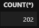

您可以在 IS 和 NULL 之间添加 NOT 关键字，以筛选出特定列中缺少的值:

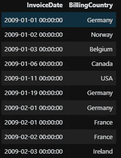

## 使用 LIKE 更好地匹配字符串

在 WHERE 子句中，我们根据精确的文本值过滤列。但是通常，我们可能希望根据模式过滤文本列。在 Pandas 和 pure Python 中，我们会使用正则表达式进行模式匹配，这非常强大，但需要时间来掌握。

作为替代，SQL 提供了一个“%”通配符作为占位符来匹配任何字符 0 次或更多次。例如，“gr%”字符串匹配“great”、“groom”、“greed”，而“%ex%”匹配中间带有“ex”的任何文本，等等。让我们看看如何在 SQL 中使用它:

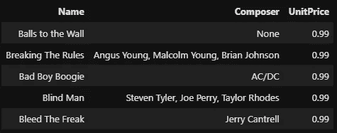

上面的查询查找所有以“b”开头的歌曲。包含通配符的字符串应该在 LIKE 关键字之后。

现在，让我们找出标题中包含“美丽”一词的所有歌曲:

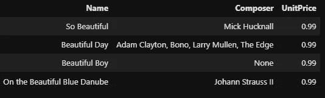

您也可以在 LIKE 旁边使用其他布尔运算符:

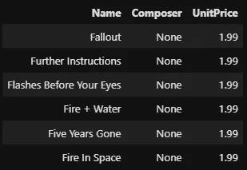

SQL 中还有许多其他通配符，它们具有不同的功能。你可以在这里看到完整的列表和它们的用法[。](https://www.w3schools.com/sql/sql_wildcards.asp)

## SQL 中的聚合函数

还可以对列执行基本的算术运算。这些操作在 SQL 中称为聚合函数，最常见的是`AVG, SUM, MIN, MAX`。它们的功能应该从它们的名字中清晰可见:

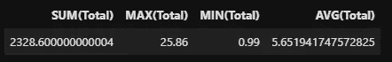

聚合函数对于使用它们的列只给出一个结果。这意味着您不能跨一列进行聚合并选择其他未聚合的列:

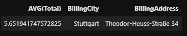

您可以使用 WHERE 子句轻松地将聚合函数与条件结合起来:

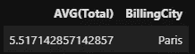

也可以在列和简单数字上使用算术运算符，如+、-、*、/等。在列上使用时，操作是按元素执行的:

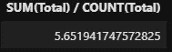

关于算术运算，有一点需要注意:如果您只对整数执行运算，SQL 认为您期望整数作为答案:

```
%%sql SELECT 10 / 3
```


而不是返回 3.33…，结果是 3。要获得浮点数结果，您应该在查询中至少使用一个浮点数，或者使用所有浮点数以确保安全:

```
%%sql SELECT 10.0 / 3.0
```

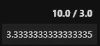

利用这些知识，让我们以分钟为单位计算一首歌曲的平均持续时间:

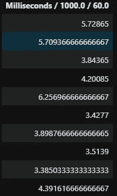

如果您注意上面的列，它的名称被写成“*用于生成该列*的查询。”由于这种行为，使用长时间的计算(如查找列的标准偏差或方差)可能会有问题，因为列名将与查询本身一样大。

为了避免这种情况，SQL 允许别名，类似于 Python 中的别名导入语句。例如:

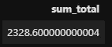

在一个`SELECT`语句中的单个项目后使用`as`关键字告诉 SQL 我们在混淆。以下是更多的例子:

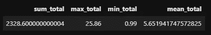

对于具有长名称的列，也可以很容易地使用别名。

## SQL 中的排序结果

就像 Pandas 有`sort_values`方法一样，SQL 支持通过`ORDER BY`子句对列进行排序。在子句后传递列名会按升序对结果进行排序:

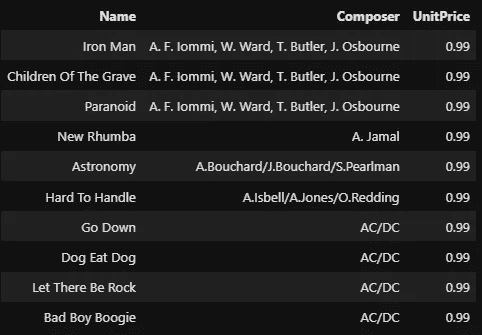

我们按照作曲家的名字对曲目表进行升序排序。请注意，ORDER BY 语句应始终位于 WHERE 子句之后。也可以通过以下方式将两列或更多列传递给 ORDER:

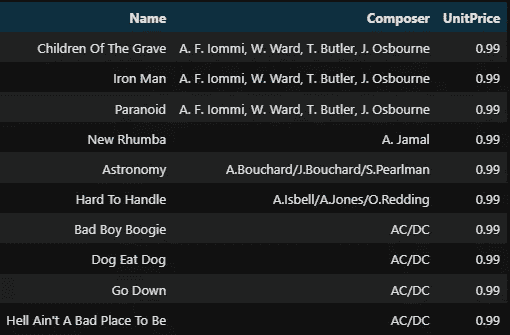

您也可以通过在每个列名后传递`DESC`关键字来颠倒排序:


上面的查询在按降序对 UnitPrice 和 Compose 排序以及按升序对 name 排序后返回三列(`ASC`是默认关键字)。

## SQL 中的分组

熊猫最强大的功能之一就是`groupby`。你可以用它把桌子变成任何你想要的形状。它在 SQL - `GROUP BY`子句中的近亲可以用来实现相同的功能。例如，下面的查询统计了每个流派中的歌曲数量:

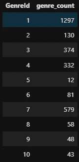

SQL 中的 GROUP BY 和 Pandas 中的`groupby`的区别在于，SQL 不允许选择 GROUP BY 子句中没有给出的列。例如，在上面的查询中添加一个额外的空闲列会产生一个错误:

但是，您可以在 SELECT 语句中选择任意多的列，只要您对它们使用某种类型的聚合函数:

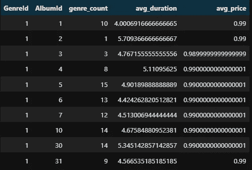

上面的查询几乎包括了我们到目前为止学到的所有主题。我们根据专辑 ID 和流派 ID 进行分组，并为每个组计算一首歌曲的平均持续时间和价格。我们也在有效地利用别名。

我们可以通过按平均持续时间和流派计数排序来使查询更加强大:

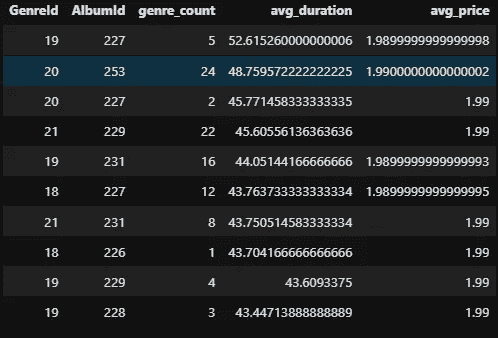

注意我们如何在 ORDER BY 子句中使用聚合函数的别名。一旦为列或聚合函数的结果起了别名，就只能在查询的其余部分通过别名来引用它们。

## 将条件句与 HAVING 连用

默认情况下，SQL 不允许在 WHERE 子句中使用聚合函数进行条件筛选。例如，我们希望只选择歌曲数量大于 100 的流派。让我们试试 WHERE 子句:

根据聚合函数的结果筛选行的正确方法是使用 HAVING 子句:


HAVING 子句通常与 GROUP BY 连用。每当您想使用集合函数过滤行时，HAVING 子句是一个不错的选择！

## 摘要

到目前为止，您应该已经意识到 SQL 有多强大。尽管我们学到了很多，但我们仅仅触及了皮毛。对于更高级的话题，你可以阅读 W3Schools 上的[优秀指南，并通过在](https://www.w3schools.com/sql/default.Asp) [Hackerrank](https://www.hackerrank.com/) 或 [LeetCode](https://leetcode.com/) 上解决真实世界的 SQL 问题来练习你的查询技巧。感谢您的阅读！

<https://ibexorigin.medium.com/membership>  <https://ibexorigin.medium.com/subscribe>  

## 更多来自我的故事…

</how-to-create-slick-math-animations-like-3blue1brown-in-python-457f74701f68>  </matplotlib-vs-plotly-lets-decide-once-and-for-all-dc3eca9aa011>  <https://ibexorigin.medium.com/yes-these-unbelievable-masterpieces-are-created-with-matplotlib-b62e0ff2d1a8>  </an-in-depth-tutorial-to-python-decorators-that-you-can-actually-use-1e34d3d2d305>  <https://ibexorigin.medium.com/how-to-use-matplotlib-annotations-like-you-know-what-you-are-doing-da61e397cce3> *