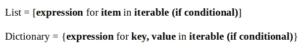

# 关于堆栈溢出的 10 个最常见的 Python 字典问题

> 原文：<https://towardsdatascience.com/10-most-frequently-asked-python-dictionary-questions-on-stack-overflow-2cb345f07496>

## 来自现实生活的问题


在 [Unsplash](https://unsplash.com/s/photos/question?utm_source=unsplash&utm_medium=referral&utm_content=creditCopyText) 上由[Towfiqu barb huya](https://unsplash.com/@towfiqu999999?utm_source=unsplash&utm_medium=referral&utm_content=creditCopyText)拍摄的照片

Stack Overflow 是最大的在线社区，它不断地在软件、编码、数据科学和许多其他主题中提问和回答问题。

我认为使它成为无价资源的是问题来自现实生活。人们会发帖询问他们在工作中遇到的困难。答案通常来自经历过同样挑战并找到解决方案的人。

我写了一篇关于[关于熊猫](/10-most-frequently-asked-pandas-questions-on-stack-overflow-b9d7d94cd83e)的 10 个最常见问题的文章。在本文中，我们将讨论关于栈溢出的 Python 字典的 10 个最常见的问题。

如果您正在学习 Python 进行软件开发或创建面向数据的产品，那么您很可能会遇到这些问题。

在撰写本文时，我已经根据栈溢出的投票数和浏览量选择了问题(跳过了重复的问题)。

## 1.如何在一个表达式中合并两个字典？

解决这个问题有多种方法。如果您使用的是 Python 3.9 或更高版本，您可以简单地使用“|”操作符。

```
a = {"James": 95, "Jane": 98}
b = {"Matt": 85, "Ashely": 90}
c = a | b

c
# output
{'James': 95, 'Jane': 98, 'Matt': 85, 'Ashely': 90}
```

Python 字典中的键必须是唯一的，因此如果两个字典中存在相同的键，合并的字典将只有其中一个键。

```
a = {"James": 95, "Jane": 98}
b = {"Matt": 85, "Ashely": 90, "James": 100}
c = a | b

c
# output
{'James': 100, 'Jane': 98, 'Matt': 85, 'Ashely': 90}
```

键 James 的值是 100，这是我们在字典 b 中的值，如果你把表达式写成“b | a”，字典 c 就会有来自字典 a 的 James。

```
a = {"James": 95, "Jane": 98}
b = {"Matt": 85, "Ashely": 90, "James": 100}
c = b | a

c
# output
{'Matt': 85, 'Ashely': 90, 'James': 95, 'Jane': 98}
```

原因是表达式“a | b”类似于用字典 b 更新字典 a 的操作。因此，在具有相同键的情况下，值将来自最后一个字典。

“a | b”运算符返回组合字典，但不改变 a 或 b。如果需要使用另一个字典中的键值对来更新一个字典，请使用 update 方法。

```
a = {"James": 95, "Jane": 98}
b = {"Matt": 85, "Ashely": 90, "James": 100}
a.update(b)

a
# output
{'James': 100, 'Jane': 98, 'Matt': 85, 'Ashely': 90}
```

在上面的代码片段中，字典 a 用字典 b 更新。

如果使用的是 Python 3.5 或以上版本，可以使用“{**a，**b}”表达式，其作用与“a | b”相同。

```
a = {"James": 95, "Jane": 98}
b = {"Matt": 85, "Ashely": 90, "James": 100}
c = {**a, **b}

c
# output
{'James': 100, 'Jane': 98, 'Matt': 85, 'Ashely': 90}
```

## 2.如何从 Python 字典中删除一个键？

第一个选项是 del 函数。

```
a = {"James": 95, "Jane": 98, "Matt": 85, "Ashely": 90}
del a["James"]

a
# output
{'Jane': 98, 'Matt': 85, 'Ashely': 90}
```

del 函数仅在字典中存在该键时才有效。否则，它会引发一个 KeyError。如果您不确定字典中是否存在该键，请使用 pop 方法，但一定要指定如果该键不存在该怎么办。否则，pop 方法也会引发一个 KeyError。

与只从字典中删除指定键的 del 函数不同，pop 方法删除键并返回它的值。如果键不存在，它返回我们指定的值。

```
a = {"James": 95, "Jane": 98, "Matt": 85, "Ashely": 90}

a.pop("James", None)
# output
95

a.pop("Max", None)
# output
```

上面代码片段中的第二个操作没有返回任何内容，因为 Max 不是字典 a 中的一个键，但是键 James 已经从字典中删除了。

```
a
# output
{'Jane': 98, 'Matt': 85, 'Ashely': 90}
```

## 3.使用 for 循环迭代字典

如果我们使用一个带有字典的 for 循环，我们就可以遍历所有的键。

```
a = {"James": 95, "Jane": 98, "Matt": 85, "Ashely": 90}

for key in a:
    print(key, a[key])

# output
James 95
Jane 98
Matt 85
Ashely 90
```

在上面的 for 循环中，我们打印了键，并使用“a[key]”表达式访问它的值。

我们还可以使用 items 方法迭代键和值。

```
a = {"James": 95, "Jane": 98, "Matt": 85, "Ashely": 90}

for key, value in a.items():
    print(key, value)

# output
James 95
Jane 98
Matt 85
Ashely 90
```

## 4.如何按值对字典进行排序？

我们可以使用 Python 内置的排序函数来完成这项任务。如果我们将其应用于字典项目(即键-值对)，项目将按键排序。

```
a = {"James": 95, "Jane": 98, "Matt": 85, "Ashely": 90}

sorted(a.items())
# output
[('Ashely', 90), ('James', 95), ('Jane', 98), ('Matt', 85)]
```

返回的数据结构是元组列表。每个元组包含两个值。第一个是关键，第二个是它的值。为了按值排序，我们需要使用排序函数的 key 参数，并指定按元组中的第二项排序。

```
a = {"James": 95, "Jane": 98, "Matt": 85, "Ashely": 90}

sorted(a.items(), key=lambda x:x[1])
# output
[('Matt', 85), ('Ashely', 90), ('James', 95), ('Jane', 98)]
```

如果我们需要将返回数据结构作为字典，我们可以使用 dict 构造函数。

```
a = {"James": 95, "Jane": 98, "Matt": 85, "Ashely": 90}

sorted_a = dict(sorted(a.items(), key=lambda x:x[1]))

sorted_a
# output
{'Matt': 85, 'Ashely': 90, 'James': 95, 'Jane': 98}
```

## 5.如何向字典中添加新键？

我们可以添加一个新的密钥，如下所示:

```
a = {"James": 95, "Jane": 98, "Matt": 85, "Ashely": 90}

a["Max"] = 100

a
# output
{'James': 95, 'Jane': 98, 'Matt': 85, 'Ashely': 90, 'Max': 100}
```

如果字典中已经存在该键，则用新值更新其值。

```
a = {"James": 95, "Jane": 98, "Matt": 85, "Ashely": 90}

a["James"] = 100

a
# output
{'James': 100, 'Jane': 98, 'Matt': 85, 'Ashely': 90}
```

## 6.检查字典中是否已经存在某个键

我们可以使用 keys 方法来访问字典的键。然后，我们可以检查字典键中是否存在给定的键，如下所示:

```
a = {"James": 95, "Jane": 98, "Matt": 85, "Ashely": 90}
keys_to_check = ["James", "Max", "Ashley"]

for key in keys_to_check:
    print(key, key in a.keys())
# output
James True
Max False
Ashley False
```

## 7.如何在 Python 中以列表形式返回字典键？

在前一个问题中，我们了解到 keys 方法返回字典键。我们可以应用 list 构造函数来创建由 keys 方法返回的字典键列表。

```
a = {"James": 95, "Jane": 98, "Matt": 85, "Ashely": 90}

list(a.keys())
# output
['James', 'Jane', 'Matt', 'Ashely']
```

## 8.如何从独立的键和值列表中创建字典？

这可以通过使用 zip 函数和 dict 构造函数来完成。

```
names = ["James", "Jane", "Matt", "Ashley"]
grades = [95, 98, 85, 90]

grades_dict = dict(zip(names, grades))

grades_dict
# output
{'James': 95, 'Jane': 98, 'Matt': 85, 'Ashley': 90}
```

列表中出现的键和值是匹配的。

## 9.创建一本有理解力的词典

我们可以使用字典理解，这是一种使用 iterables 创建字典的方法。它类似于列表理解，只是语法略有不同。

列表和字典理解的基本结构如下:



(图片由作者提供)

我们来做一个例子。

```
words = ['data', 'science', 'machine', 'learning']
words_len_dict = {i:len(i) for i in words}

words_len_dict
# output
{'data': 4, 'science': 7, 'machine': 7, 'learning': 8}
```

键的表达式是“I ”,它表示单词列表中的项目。值的表达式是“len(i)”，它计算每个单词中的字符数。

## 10.用 Python 创建新字典

我们可以使用 dict 构造函数或者空花括号来创建一个空字典。

```
# dict constructor
a = dict()
type(a)
# output
dict

# curly braces
b = {}
type(b)
# output
dict
```

在撰写本文时，有 181，580 个关于堆栈溢出的问题被标记为 Python 字典。我们已经知道了这个庞大的列表和资源的前 10 个问题的答案。

你可以成为[媒介会员](https://sonery.medium.com/membership)来解锁我的作品的全部访问权限，以及媒介的其余部分。如果你已经是了，别忘了订阅[如果你想在我发表新文章时收到电子邮件的话。](https://sonery.medium.com/subscribe)

感谢您的阅读。如果您有任何反馈，请告诉我。