# 10 个熊猫查询示例，让你轻松使用熊猫查询

> 原文：<https://towardsdatascience.com/10-pandas-query-examples-that-will-make-you-use-pandas-query-easily-12a45b1e115>

## 数据科学

## 开始使用熊猫查询功能轻松过滤您的数据


由 cookie_studio 创作的[滴咖啡照片](https://www.freepik.com/photos/drip-coffee)——【www.freepik.com 

**主数据集过滤使用熊猫查询功能！**

有了 Pandas 库，Python 中的数据分析变得很容易。在执行数据分析任务时，您通常需要选择数据子集进行深入研究。而这可以用**熊猫轻松实现。DataFrame.query()** 函数。

因此，了解如何高效和有效地利用它非常重要。

我列举了 10 个例子，解释了几乎所有可以使用查询函数过滤数据点的用例。最后，你将能够在需要的时候毫不费力地使用熊猫的查询功能。

您可以通过下面的索引快速跳转到您最喜欢的用例。

```
**·** [**Filtering using Single Condition**](#7fc6)
  ∘ [Example 1](#66c5)
**·** [**Filtering on Multiple Conditions**](#5a5d)
  ∘ [Example 1](#bd3d)
  ∘ [Example 2](#67af)
  ∘ [Example 3](#685e)
**·** [**Filtering based on Text Columns**](#7968)
  ∘ [Example 1](#1c2d)
**·** [**Simple Math Operation in Pandas Query**](#5d7e)
  ∘ [Example 1](#4280)
  ∘ [Example 2](#4b75)
**·** [**Built-In Functions in Pandas Query**](#1821)
  ∘ [Example 1](#2c05)
  ∘ [Example 2](#3165)
**·** [**Filtering based on Date-Time Columns**](#e832)
  ∘ [Example 1](#224c)
  ∘ [Example 2](#d651)
**·** [**Inplace in Pandas Query Function**](#ebb0)
```

> 📍注意:我使用的是自己创建的 [Dummy_Sales_Data](https://github.com/17rsuraj/data-curious/blob/master/TowardsDataScience/Dummy_Sales_Data_v1.csv) ，你可以在我的 [**Github**](https://github.com/17rsuraj/data-curious/blob/master/TowardsDataScience/Dummy_Sales_Data_v1.csv) repo 上免费获得[**MIT License**](https://github.com/17rsuraj/data-curious/blob/master/LICENSE.md)**！**！

让我们将数据集导入熊猫数据框架— `**df**`

```
import pandas as pd
df = pd.read_csv("Dummy_Sales_Data_v1.csv")
df.head()
```


虚拟销售数据|作者图片

这是一个简单的 9999 x 12 的数据集，我用 Python 中的[**Faker**](/faker-an-amazing-and-insanely-useful-python-library-b313a60bdabf)**创建的📚**

**你可以在本文末尾下载一个完整的笔记本，里面有所有这些例子！**

**在进入示例之前，快速回顾一下 pandas 中的查询功能—**

**Q 查询函数用于根据指定的表达式提取记录，并返回新的数据帧。表达式是以字符串形式书写的条件或条件组合。**

**在后端，使用 pandas 中的`**eval()**`函数计算该表达式，并返回数据或记录的子集，其中表达式被计算为 **TRUE** 。**

**因此，要过滤 pandas DataFrame，您只需在查询函数中指定条件，您将在后续示例中看到这一点。**

> **为什么要在熊猫数据帧`**.loc**`、`**.iloc**`和括号`**[ ]**`上使用`**query()**`符号**

*   **pandas DataFrame 属性—— `**.loc**`和`**.iloc**`——专门用于根据行和列标签和索引提取数据集的子集。因此，它并没有真正为您提供根据条件过滤数据帧的灵活性。**
*   **括号符号`**[ ]**`为您提供了根据条件过滤数据帧的灵活性，但是用多对方括号来编写在语法上是很庞大的**

**另一方面，pandas `**query()**`函数为您提供了基于一个或多个条件提取数据帧子集的灵活性，这些条件被写成一个非常简单的表达式。您真的不需要考虑或检查任何丢失的括号！💯**

**现在，您知道了为什么应该使用 query()函数来过滤数据集，让我们从示例开始吧。**

**从最简单的用例开始—基于单个条件(即仅一列上的条件)过滤数据帧。**

# **使用单一条件过滤**

**当过滤单个条件时，在`query()`函数中待评估的表达式将只包含一个条件。并且返回的输出将包含该表达式计算为`TRUE`的所有行。**

## **示例 1**

**假设您想提取数量为 95 的所有行。所以逻辑形式的条件可以写成—**

```
**Quantity == 95**
```

**📌记住，你需要把这个条件写成一个字符串，也就是用双引号`**“ ”**` 把它括起来。**

**因此，您可以根据以下条件过滤数据帧—**

```
**df.query("Quantity == 95")**
```

**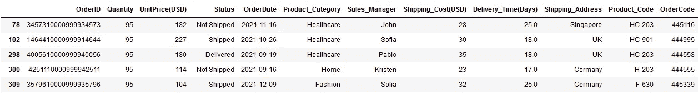**

**在 pandas 查询中使用单个条件进行过滤()|图片由作者提供**

**看起来很简单。它返回数量为 95 的所有行。**

**嗯，这很简单，你甚至可以像这样使用括号符号——`**df[df[“Quantity”]==95]**`**。****

> ****但是，如果您想在同一列中再包含一个条件，该怎么办呢？？****

****这无疑在括号符号中增加了一对方括号，使得它*庞大*并且从长远来看*难以管理*。这就是`**query()**`的有效性开始显现的时候。****

# ****根据多个条件过滤****

****无论您根据一个还是多个条件进行过滤，query()的语法都是相同的——通过将条件括在`**“ ”**` 中，将条件写成字符串。****

****但是，您必须指定如何基于两个或更多条件进行过滤，因此您可以从以下两个条件中选择一个:****

*   ****`**AND**`:只有两个条件都满足时，才返回数据帧中的所有记录****
*   ****`**OR**`:返回数据帧中满足一个或两个条件的所有记录。****

****让我们用下面两个例子来看看它是如何工作的。****

## ****示例 1****

****假设，您想要选择两个条件(数量为 95，单价为 182)都为真的所有行。****

****所以，你应该选择`AND`逻辑。在 query()表达式中，使用关键字`**and**`实现。💯****

****注意，包含单价的列被命名为*单价(美元)*****

****所以，条件是—****

```
****Quantity == 95
UnitPrice(USD) == 182****
```

****这个表达会变成—****

```
****"Quantity == 95 and UnitPrice(USD) == 182"****
```

****要提取所需的数据集，您需要编写—****

```
****df.query("Quantity == 95 and UnitPrice(USD) == 182")****
```

****然而，您得到的不是输出，而是关于*‘单价’*的 **KeyError** ，如下所示。🚨🚨****

****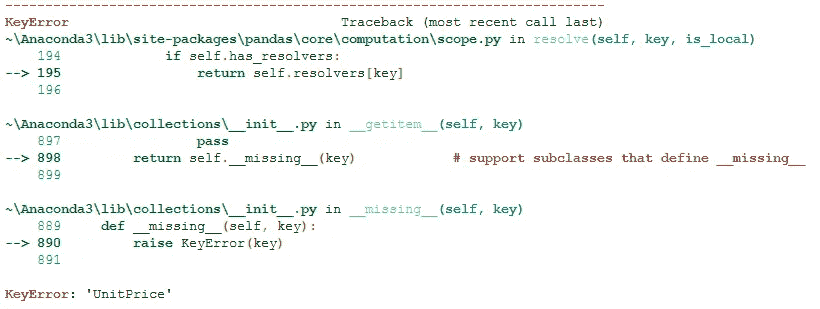****

****作者的列名|图像不一致时出现关键错误****

> ****但是为什么会出现这个错误呢？？****

****这是因为，query()函数对列名有一些限制。并且列名*单价(美元)*在查询()中使用无效。****

****query()表达式将列名 *UnitPrice(USD* )中的 *UnitPric* e 解释为要对变量 USD 进行操作的函数。****

****📌[**query()guidelines**](https://pandas.pydata.org/docs/reference/api/pandas.DataFrame.query.html)为这个问题提供了一个快速的替代方法，将反勾号中的无效列名称为— `**`UnitPrice(USD)`**`****

****所以你应该写的正确表达是—****

```
****df.query("Quantity == 95 and `UnitPrice(USD)` == 182")****
```

****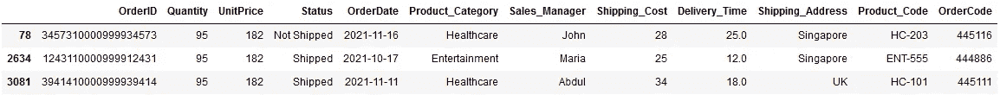****

****按作者在查询()和逻辑|图像中筛选多个条件****

****如您所见，当这两个条件都满足时，只有 3 条记录。****

****然而，同样有可能你忘记提到一个反勾号，程序将抛出另一个*语法错误*。因此，一个最简单的解决方案是将 [**中的列名**](/how-to-rename-columns-in-pandas-with-examples-24c983fcc3b8) 修改如下—****

```
**df.rename(columns={**'UnitPrice(USD)':'UnitPrice'**, 
                   'Shipping_Cost(USD)':'Shipping_Cost',
                   'Delivery_Time(Days)':'Delivery_Time'},
          inplace=True)**
```

****因此，您现在可以使用新的列名获得相同的输出，如下所示—****

```
**df.query("Quantity == 95 and **UnitPrice == 182**")**
```

****或者，您也可以使用*与号运算符* `**&**` 获得相同的输出，如下所示****

```
**df.query("Quantity == 95 **&** UnitPrice == 182")**
```

****你可以看到这是多么简单——你可以用简单的英语把表达写在纸上。****

****现在，让我们看看如何实现`**OR**`逻辑。****

## ****示例 2****

****假设您希望获得至少满足上述一个条件的所有行。****

****你所需要做的就是在以下两个条件之间使用关键字`**or**`—****

```
****df.query("Quantity == 95 or UnitPrice == 182")****
```

****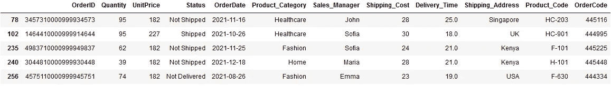****

****根据多个条件或逻辑筛选|按作者筛选图像****

****它返回两个条件之一为真的所有行(*见上图*中的第 2 到第 5 行)以及两个条件都为真的行(*第 1 行*****

****这里也可以使用按位运算符`**|**`来代替`**or**`关键字。✅****

****更进一步，您还可以在 query()中使用`**NOT**`逻辑，当 query 中的指定条件被评估为`FALSE`时，它将返回所有记录。****

## ****示例 3****

****假设您想要获取所有数量不等于 95 的行。****

****最简单的答案是在表达式中的条件前使用`**not**`关键字或否定运算符`**~**`，如下所示。****

```
****df.query("not (Quantity == 95)")****
```

****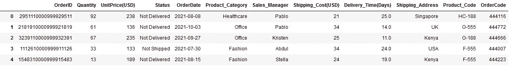****

****在查询|作者图片中使用 NOT 逻辑进行过滤****

****正如您在输出中看到的，它包含了 Quantity 不为 95 的所有行。****

****此外，条件不必总是等于运算符，而是可以在定义条件时从`**==**`、`**!=**`、 `**>**`、`**<**`、`**≥**`、 **≤** 中选择任意一个。****

****因此，在以下条件下使用不等运算符`**!=**`，可以得到与`NOT`逻辑相同的输出****

```
**df.query("**Quantity != 95**")**
```

****这将进一步节省您编写(可能会忘记结束)额外的圆括号的努力！从而简化了`query()`的表述。****

****条件并不总是需要在数字列上。您始终可以基于非数字文本列来筛选数据点。****

# ****基于文本列的过滤****

****根据文本列进行筛选时，您的条件应该是将列名与字符串进行比较。****

> ****记住，你的`query()`表达式已经是字符串了。那么如何在另一个字符串中写一个字符串呢？？****

****📌只需用单引号将您想要在条件中使用的文本值括起来，如`**‘ ’**` 。让我们看一个如何做到这一点的例子。****

## ****示例 1****

****假设，您想要获取状态为'*未发货*'的所有记录。你可以把这个用`query()`表达式写成—****

```
**df.query("Status == **'Not Shipped'**")**
```

****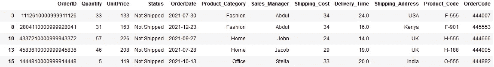****

****按作者过滤文本栏|图像****

****它返回所有记录，其中 Status 列包含值— ' *未发货*'。****

****同样，您可以在同一列或不同列上使用多个条件，它可以是数字列和非数字列上条件的组合。💯****

****在现实世界中，大多数时候，用于过滤数据帧的条件包括某些计算。Pandas query()允许您在查询表达式中自由使用数学。****

# ****熊猫查询中的简单数学运算****

****数学运算可以是任何东西，比如加、减、乘、除，甚至是列中某个值的平方或立方。****

****由于数学运算是用于数值的，所以只能在查询表达式中的数值列上使用，如下例所示。****

## ****示例 1****

****例如，假设当 double of shipping cost 小于 50 时，您希望从数据集中获取所有行。****

****这就像用简单的英语书写表达式一样简单，如下所示****

```
**df.query("**Shipping_Cost*2** < 50")**
```

****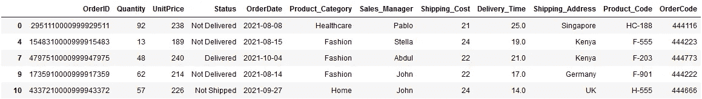****

****query()函数内的数学运算|作者图片****

****嘣！它返回所有需要的行。****

****您还可以在一列或多列中包含甚至有点复杂的计算。💯****

## ****示例 2****

****假设您希望得到所有*数量的平方和运输成本的平方之和小于 500* 的行。****

```
**df.query("**Quantity**2 + Shipping_Cost**2** < 500")**
```

****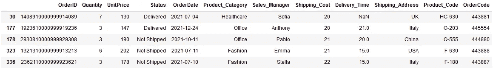****

****query()函数中的复杂数学运算|作者图片****

****您可能已经注意到，使用 query()函数进行复杂的计算是多么简单。****

****但是，您并不仅限于使用不同的数学运算，而是可以在查询表达式中使用内置函数。****

# ****熊猫查询中的内置函数****

****Python 内置的函数如`sqrt()`、`abs()`、`factorial()`、`exp()`等可以很容易地在查询表达式中使用。您可以像在正常用例中一样直接使用它。****

## ****示例 1****

****检索单价的平方根大于 15 的所有行。因此这里将使用内置函数— `sqrt()`。****

```
**df.query(**"sqrt(UnitPrice) > 15"**)**
```

****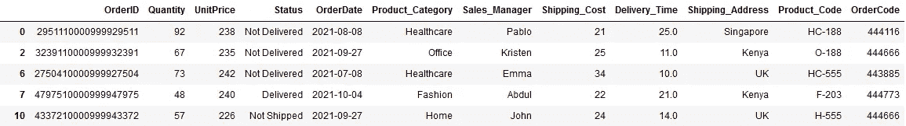****

****在 Pandas query()中使用内置函数|图片作者****

****很简单！该查询将返回单价超过 225 的所有行。****

****此外，query()函数非常灵活，您还可以在同一个查询表达式中使用内置函数和数学函数。****

## ****示例 2****

****获得所有单价的平方根小于一半运费的记录是如此简单，你可以用——****

```
**df.query("**sqrt(UnitPrice) < Shipping_Cost/2**")**
```

****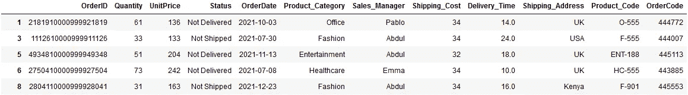****

****数学和内置函数在查询表达式|作者图片中的组合****

****这样，您可以使用不同复杂程度的多个条件来过滤数据集。这也是使用一个简单的查询。✅****

****到目前为止，您观察到的所有查询示例都是关于数字和文本列的。但是，query()的用法并不仅限于这些数据类型。****

****通常，您需要根据日期时间值过滤数据帧。query()函数非常灵活，您可以根据日期和时间值轻松过滤数据集，这一点您可以在下一节中了解。****

# ****基于日期-时间列进行筛选****

****使用 query()函数根据日期时间值过滤数据帧的唯一要求是，包含这些值的列的数据类型应该是`**datetime64[ns]**` ✅****

****在我们的示例数据集中，OrderDate 列包含日期时间值，但它被解析为字符串值。您可以很容易地[将该列转换成所需的数据类型](/change-column-data-type-in-pandas-954d7acdef1d),使用—****

```
**df["OrderDate"] = **pd.to_datetime**(df["OrderDate"], format="%Y-%m-%d")**
```

****现在，您已经准备好使用`query()`中的日期-时间列过滤数据帧。要提取关于日期的有用信息并在 query()函数中使用它们，`**dt**`访问器非常方便。****

> ****📌 **dt** 是一个访问器对象，用于提取日期时间序列的类似日期时间的属性。****

****让我们探索一下可以根据日期时间值过滤数据集的不同方法。****

## ****示例 1****

****假设您想要获取订单日期在八月份的所有记录。你需要做的就是—****

```
**df.query("**OrderDate.dt.month == 8**")**
```

****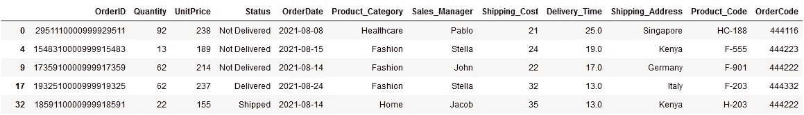****

****使用 query()中的日期筛选数据集|按作者排序的图像****

****如您所见，所有记录都有八月份的订单日期。`**OrderDate.dt.month**` 展示了如何使用`**dt**`访问器从整个日期值中只提取月份。****

****进一步过滤，假设您想要获得 2021 年 8 月的所有订单，其中订单日为 15 或更多。你可以通过——****

```
**df.query("**OrderDate.dt.month == 8 and OrderDate.dt.year == 2021 and OrderDate.dt.day >=15**")**
```

****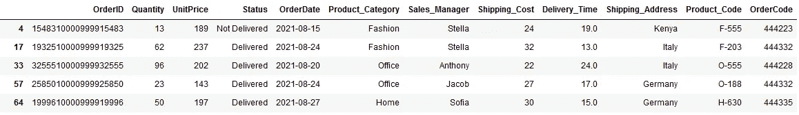****

****根据日期-时间变量的多个条件进行筛选|按作者排序的图片****

****尽管这是一个典型的`**dt**`访问器的例子，并且在同一列上组合多个条件，但是这个表达式似乎太长了，因此不是一个好的实践。****

****编写它只是为了演示如何使用`**dt**`操作符提取数据的不同部分，以及如何组合多个条件。****

****然而，您可以通过编写非常简单表达式得到完全相同的输出，如下所示****

```
**df.query("**OrderDate >= '2021-08-15' and OrderDate <= '2021-08-31'**")**
```

****此外，您还可以在单个表达式中组合日期-时间列上的条件和任何其他列上的条件。💯****

## ****示例 2****

****例如，检索订单日期为前一个示例且状态为 Delivered 的所有记录非常简单，查询表达式为****

```
**df.query("**OrderDate >= '2021-08-15' and OrderDate <= '2021-08-31' and Status == 'Delivered'**")**
```

****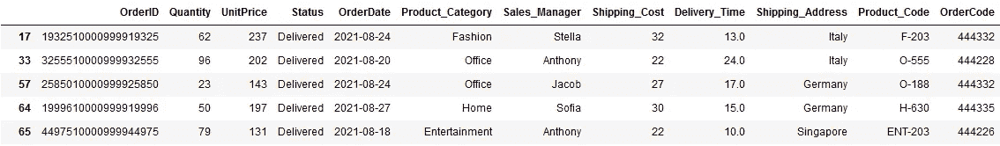****

****根据不同列的多个条件进行筛选|按作者排序的图片****

****它返回表达式计算为 True 的所有记录。同样，这只是一个演示如何在单个查询中组合日期-时间和文本列条件的示例。****

****到目前为止，您只指定了要在 query()函数中计算的表达式。然而，该函数还采用了另一个可选参数— `**inplace**`****

# ****就地熊猫查询功能****

****在所有示例中，您都可以看到 df.query()生成了一个新的数据帧。这是因为 query() — `**inplace**` —的第二个参数默认设置为 False。****

****因此，即使在多个条件下过滤数据帧后，如果您检查数据帧的大小，它将显示 9999 x 12 的原始大小****

```
****df.shape**# output
**(9999, 12)****
```

****因此，使用`**inplace=False**`，查询没有修改原始数据集。当你想改变原始数据帧时，只需点击`inplace=True`。****

****🚨但是要小心使用 `inplace=True`，因为它会覆盖原始数据帧。因此，一旦执行了带有此选项的查询，就没有机会恢复原始数据帧。****

****以上就是使用 query()过滤数据点的全部内容！****

****我希望你发现这篇文章非常有用，令人耳目一新，并且你学会了一些非常酷的过滤熊猫数据帧的技巧。我确信，读完这篇文章后，你会更频繁、更流利地使用 pandas query()函数。****

****过去 4 年多以来，我一直在使用 Python 进行数据分析，并发现 query()函数最便于过滤数据集。这些技巧中的大部分，我每天都在工作中使用。****

> ****有兴趣在媒体上阅读更多的故事吗？？****

****💡考虑 [**成为媒体会员**](https://medium.com/@17.rsuraj/membership) 到**访问媒体上无限的**故事和每日有趣的媒体文摘。我会得到你的费用的一小部分，没有额外的费用给你。****

****💡请务必 [**注册我的电子邮件列表**](https://medium.com/subscribe/@17.rsuraj) 以免错过另一篇关于数据科学指南、技巧和提示、SQL 和 Python 的文章。****

****💡这里有一个完整的 [**笔记本**](https://github.com/17rsuraj/data-curious/blob/master/TowardsDataScience/pandas_query_deep_dive.ipynb) 里面有所有的例子。****

******感谢您的阅读！******