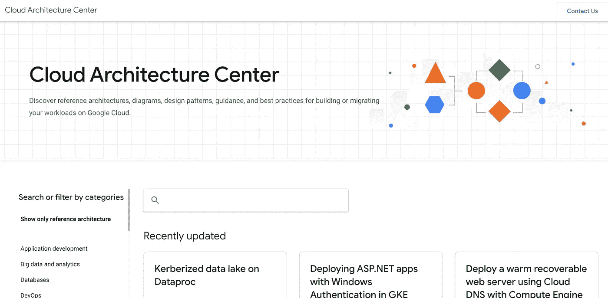

# 在 Google Cloud 上学习数据科学的 10 个便利资源

> 原文：<https://towardsdatascience.com/10-resources-to-learn-data-science-on-google-cloud-c19fb3033df5>


劳伦·埃德瓦尔森在 [Unsplash](https://unsplash.com/s/photos/google?utm_source=unsplash&utm_medium=referral&utm_content=creditCopyText) 上的照片

> 我对有抱负的数据科学家的首要建议是了解云计算。

**所有企业都在将数据工作负载转移到云上。**

如果你打算建立一个 ML 模型，并在一家公司投入生产，我几乎可以保证它会涉及到访问或处理云上的数据。

我注意到，现在大多数数据科学职位的招聘广告都将云技能作为工作描述的核心部分。我强烈建议你花时间提升技能。

**哪家云提供商** **— AWS，GCP(谷歌云平台)，或者 Azure 都无所谓。**

**选择一个，使用该平台学习数据存储、处理、分析和 ML 工作流的基础知识。**

就我而言，我和 GCP 一起着陆。

我喜欢使用 GCP 的一个主要原因是谷歌开发者倡导团队创建了大量易于理解的文档和高质量的学习资源。

在这篇文章中，我将分享我在谷歌云上开发时的 10 大信息和灵感来源。

我将这些资源分类为:博客、GitHub 库、文档页面、YouTube 频道和内容创建者。

> 几乎每天我都能找到新的有价值的信息源来帮助我理解一个主题或实现一个解决方案。我确信我一定错过了一些很棒的资源——如果你认为我错过了什么，请评论！

# 博客

## 1.[开发者和从业者谷歌云博客](https://cloud.google.com/blog/topics/developers-practitioners)

Google Cloud 在他们的主网站上有一个非常活跃的[博客](https://cloud.google.com/blog/),涵盖了许多 Google Cloud 相关的主题，包括高级趋势以及更详细的技术内容。

开发者和实践者博客是主 Google Cloud 博客中的一个子主题，主要关注 GCP 工具的详细教程和演示。

这些高质量的博客文章是由谷歌杰出的开发者权益团队成员撰写的。

我发现这个博客对于学习最佳实践特别有用。

还有许多优秀的[备忘单](https://cloud.google.com/blog/products/gcp/5-google-cloud-product-cheat-sheets-2021)，它们可以很好地刷新你对不同 GCP 工具的记忆。“[Google Cloud Products in 4 Words or Less](https://cloud.google.com/blog/topics/developers-practitioners/back-popular-demand-google-cloud-products-4-words-or-less-2022-edition)”这篇博文对于了解 GCP 平台产品非常有用。

## 2.[谷歌云媒体博客](https://medium.com/google-cloud)

除了谷歌云网站上的博客，谷歌还会定期更新他们在 Medium 上的“社区”博客。这包括来自谷歌云员工以及该领域其他从业者的大量策划博客帖子。

与开发人员和实践者的博客类似，该资源包含大量关于各种 GCP 用例及最佳实践的深入教程。

查看这个博客的新更新已经成为我早上例行公事的一部分。

# GitHub 仓库

## 3.Google cloud platform github repo(⭐️顶级资源)

Google Cloud 维护着一个非常活跃的 GitHub 帐户，拥有数百个包含教程、研讨会材料和 GCP 工具的存储库。

这是一个很好的资源，可以找到 GCP 上已经实现的解决方案的代码片段，并观察 Google 工程师的编码最佳实践。

GCP 文档中引用了许多这样的库，但是，我建议浏览一下，看看是否有与您要使用的工具和语言相关的库。

我特别强调的内容包括:

*   [专业服务](https://github.com/GoogleCloudPlatform/professional-services) —谷歌云专业服务团队面临的常见解决方案的教程和代码
*   [GCP 上的 ML](https://github.com/GoogleCloudPlatform/ml-on-gcp)—谷歌云上各种机器学习框架的指南
*   [GCP 的 MLOps](https://github.com/GoogleCloudPlatform/mlops-on-gcp)—针对各种 ML 工程主题的大量设计和代码模式的演示
*   [带 Vertex AI 的 MLOps](https://github.com/GoogleCloudPlatform/mlops-with-vertex-ai)—使用 Vertex AI 平台的端到端 MLOps 流程
*   [ML 设计模式](https://github.com/GoogleCloudPlatform/ml-design-patterns)—O ' Reilly 的 [ML 设计模式](https://www.oreilly.com/library/view/machine-learning-design/9781098115777/)书的源代码和例子
*   [GCP 的数据科学](https://github.com/GoogleCloudPlatform/data-science-on-gcp) —奥莱利的[谷歌云平台上的数据科学](https://www.oreilly.com/library/view/data-science-on/9781491974551/)的源代码和示例
*   [培训数据分析师](https://github.com/GoogleCloudPlatform/training-data-analyst) —谷歌云[培训课程的实验室和演示](http://cloud.google.com/training)

## 4.[谷歌 API 源代码](https://github.com/googleapis)

Google 提供了许多客户端库，可以使用您选择的语言与其服务进行交互。

**在整个 Google Cloud 文档中，您会发现每个工具的各种代码片段，展示了如何为您选择的客户端库使用 API。**

这些代码片段实际上可以在 Github 上的 Google API 源代码中找到——通常在一个名为 samples 的文件夹中。我发现这非常方便，因为您可以在一个地方访问所有这些代码示例，而不必浏览文档中的各个页面，试图找到您依稀记得的有用片段。

> 例如，[这里是使用 BigQuery 的 Python API 的所有代码片段](https://github.com/googleapis/python-bigquery/tree/master/samples)。

此外，您可以访问这些样本的各种[测试](https://github.com/googleapis/python-bigquery/tree/master/samples/tests) Google 用来测试这些代码样本。当基于这些片段为你自己的函数编写单元测试时，这些可以成为有用的参考。

# 证明文件

## 5.产品文档页面—关键概念

正如您所料，Google Cloud 上的每个产品都有大量的文档，包括解释和分步示例教程。

特别是，每个产品文档页面都有一个名为“概念”的部分。

**概念页解释了每个产品最重要的方面**。他们通常会指出关键特性和最佳实践。这对于快速上手非常有帮助，特别是如果你以前在另一个云提供商上使用过类似的工具。

例如，这里有一个到[谷歌云存储](https://cloud.google.com/storage/docs/concepts)和[云 SQL](https://cloud.google.com/sql/docs/concepts) 的关键概念页面的链接。

## 6.[谷歌云架构中心](https://cloud.google.com/architecture)

在很大程度上，谷歌的[文档](https://cloud.google.com/docs)是理解每个 GCP 工具的关键概念和有用例子的极好资源。

很长一段时间，由于文档页面如此全面，我甚至从未想过看看是否有更多的资源可以帮助我在 Google Cloud 上设计解决方案。

直到我偶然发现了谷歌云架构中心。

> 在大多数情况下，您正在处理的数据问题已经被其他人解决了(至少部分解决了)。没有必要重新发明轮子。

**Google 云架构中心包含参考架构、图表、设计模式、指南以及在 Google 云上构建或迁移工作负载的最佳实践。**

每当在 Google Cloud 上设计一个新的解决方案时，我总是在架构中心查看已经记录在案的类似解决方案。如果还没有参考架构，它仍然为解决我的具体问题提供了灵感。

例如，有一个现成的[解决方案，用于处理流时间序列数据](https://cloud.google.com/architecture/processing-streaming-time-series-data)，包括使用发布/订阅和数据流进行异常检测。

许多参考架构还链接到文档各部分的[教程章节](https://cloud.google.com/bigquery/docs/tutorials)。



作者捕获的云架构中心的屏幕截图

# YouTube 频道

## 7.[谷歌云技术](https://www.youtube.com/channel/UCJS9pqu9BzkAMNTmzNMNhvg)

谷歌云技术是谷歌面向开发者的主要 YouTube 频道，拥有超过 80 万用户。该频道的特色是由 Google Developer Advocate 团队专业制作的视频，介绍 GCP 工具和最佳实践以及技术教程演练。

**这个频道不同于其他谷歌云 YouTube 频道(** [**谷歌开发者**](https://www.youtube.com/user/GoogleDevelopers) **，** [**谷歌云**](https://www.youtube.com/channel/UCTMRxtyHoE3LPcrl-kT4AQQ) **)，因为它专注于为从业者提供深入的技术资料。**其他渠道更多地从“高管层”的角度来看待趋势和概念，对 GCP 解决方案的日常实施用处不大。

如果我需要一个工具的演练，这通常是我熟悉主要概念和最佳实践的第一站。

我建议访问[播放列表](https://www.youtube.com/user/googlecloudplatform/playlists)页面，浏览与您感兴趣的工具最相关的播放列表。我特别喜欢国玉峰的《人工智能历险记》

## 8.[云中奇遇](https://www.youtube.com/channel/UCAkiVNZfRKgxerudxbVkHfg)

《云中冒险》是一个小得多的频道(目前只有 2k 订户)，由国玉峰运营，他也是谷歌云开发者的倡导者。尽管它很大，但它是内容的金矿。

该频道主要提供关于机器学习和 MLOps 的长篇实时教程。国玉峰实时浏览教程，这并不总是按照计划进行，但这是一种非常有价值的学习方式，因为你可以看到如何调试他遇到的常见问题。

我真的很喜欢他关于用人工智能平台管道生产机器学习[的视频。](https://www.youtube.com/watch?v=NKN6HawFuts)

不幸的是，看起来他已经有一段时间没有上传任何新的内容了，然而，有很多旧的内容让你很忙。

# 内容创建者

最后，我想强调几个我最喜欢关注的人物，他们在谷歌云领域创造了伟大的内容。我肯定我已经错过了许多其他优秀的内容创作者，但这里有两个不断出现的真正有用的材料。

我已经链接到他们的中型博客，但是，我建议你也在 LinkedIn 上关注他们，以获得定期更新和见解。

## 9.拉克什马南

Lak 是谷歌云数据分析和人工智能解决方案总监。他主要围绕 BigQuery 和机器学习提供有见地的思考和清晰的教程。

他是许多书籍的作者，包括《O ' Reilly[big query 权威指南](https://www.oreilly.com/library/view/google-bigquery-the/9781492044451/) ( [GitHub 链接](https://github.com/GoogleCloudPlatform/bigquery-oreilly-book))。

## 10.[普里扬卡·韦尔加迪亚](https://pvergadia.medium.com/)

Priyanka 是谷歌的开发人员关系工程师，在谷歌的云技术 YouTube 频道和 LinkedIn 上非常活跃。

Priyanka 在整个 Google Cloud 上创建主题内容，包括许多娱乐性和知识性的视频。

她最近制作了一个很棒的系列来解释谷歌云的 13 个参考架构。

# 结论

在这篇文章中，我分享了我作为数据科学家使用 Google Cloud 进行开发的 10 大技术资源。

谷歌为开发者提供的资源质量给我留下了深刻的印象，这使得谷歌云成为迄今为止我最喜欢与之合作的云提供商。

这些资源中有许多是我在过去几个月才接触到的，这让我觉得肯定还有更多我忽略了的。我很想知道你最喜欢的资源是什么——我肯定错过了一些！

```
This post was originally published on my blog: [https://engineeringfordatascience.com/posts/top_10_google_cloud_resources/](https://engineeringfordatascience.com/posts/top_10_google_cloud_resources/)
```