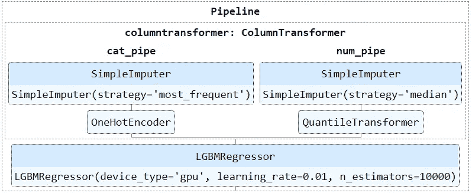
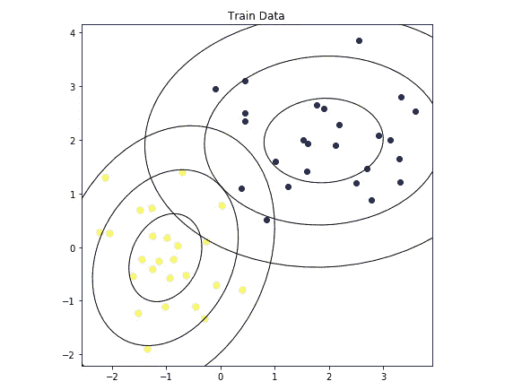
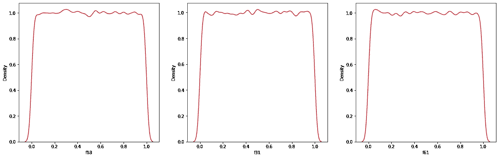
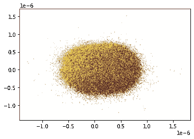

# 埋藏在文档中等待被发现的 10 颗 Sklearn 宝石

> 原文：<https://towardsdatascience.com/10-sklearn-gems-buried-in-the-docs-waiting-to-be-found-ad95a8fabdfd>

## 隐藏的宝藏

照片由[乔尼·卢](https://www.pexels.com/photo/closeup-photo-of-purple-gemstones-1121123/)

# 动机

我*讨厌* Sklearn。我上的“ML 入门”课对支持向量机的解释非常糟糕，以至于我以此为基础来评价整个库。在那之后的几个月里，我放弃了这门课程，永远离开了曼梯·里。

我一点也不知道 Sklearn 会成为我在庞大的数据科学堆栈中最喜欢的库。我也不知道我会为此写 22 篇文章。这是我第 23 次。最后一个的[和之前的](/19-hidden-sklearn-features-you-were-supposed-to-learn-the-hard-way-5293e6ff149)[的](https://ibexorigin.medium.com/6-sklearn-mistakes-that-silently-tell-you-are-rookie-f1fe44779a4d)都是飞天成功。成千上万的人读过它们。

我写这篇文章的目的是一样的——向你展示这个图书馆比你想象的要棒得多。这一次，您将了解我发现并立即添加到我的工具箱中的一些最新的、被低估的 Sklearn 特性。

这篇文章将比我上一篇类似的功能汇编实用得多，我的上一篇类似的功能汇编更侧重于边缘情况。尽情享受吧！

</19-hidden-sklearn-features-you-were-supposed-to-learn-the-hard-way-5293e6ff149>  

# 1️.功能变压器

尽管 Sklearn 有许多预处理转换器可以放入管道中，但它们不足以用于任何可以想象的预处理场景。即使您有一个不在管道内的单独步骤，原子的单一调用管道的整体思想也会崩溃。

这就是为什么你应该把你所有的自定义函数包装在`FunctionTransformer`里面，这样可以把它们转换成一个 Sklearn 兼容的转换器。唯一的要求是该函数接受一个特征数组(X)和一个可选的目标数组，并在预处理后返回它们。

## 💻演示

## 📚证明文件

**功能变压器** — [链接](https://scikit-learn.org/stable/modules/generated/sklearn.preprocessing.FunctionTransformer.html#sklearn.preprocessing.FunctionTransformer)

<https://ibexorigin.medium.com/membership>  

获得由强大的 AI-Alpha 信号选择和总结的最佳和最新的 ML 和 AI 论文:

<https://alphasignal.ai/?referrer=Bex>  

# 2️.用户定义的变压器

在最后一节的基础上，您不能在一个简单的函数中执行一些定制的数据清理步骤。

例如，清理过程中最常见的操作之一是缩放倾斜要素，使其呈正态分布。通常，人们使用像`PowerTransformer`或`np.log`这样的对数变压器，但是它们有一个缺点。如果某个要素包含零，对数将无法处理它们并引发错误。

作为一种变通方法，人们在特征向量上加 1，然后进行变换。如果他们需要原始向量，他们会调用该要素的指数函数并减去 1-问题就解决了。

当然，这个操作不是内置在 Sklearn 中的，并且您不能在一个简单的 Python 函数中执行它。这就是你用定制变形金刚优雅地解决这个难题的地方。下面是一个完全符合我描述的转换器:

## 💻演示

该类应该从`BaseEstimator`和`TransformerMixin`类继承，使其能够插入到管道中。编写的代码越少，数据泄露的可能性就越小。

如果您想了解关于这种方法的更多信息，我有一篇关于这种类型的定制转换器的单独文章，包括 FunctionTransformer:

</how-to-write-powerful-code-others-admire-with-custom-sklearn-transformers-34bc9087fdd>  

## 📚证明文件

**BaseEstimator** — [链接](https://scikit-learn.org/stable/modules/generated/sklearn.base.BaseEstimator.html#sklearn.base.BaseEstimator)。

**变压器混频器** — [链接](https://scikit-learn.org/stable/modules/generated/sklearn.base.TransformerMixin.html)。

# 3️.转换目标回归器

有时，即使是目标数组也需要额外的预处理步骤，这是不能包含在管道中的。一个典型的场景是缩放数字目标，使它们呈正态分布。你在管道之外这样做，经常不止一次。

如果有一个管道也能处理目标数组，那不是很好吗？原来是有的！(仅用于回归)。

TransformedTargetRegressor 是一个类，它既接受功能上的回归器管道，也接受目标数组的单独预处理函数或转换器。

## 💻演示

`regressor`参数接受以它们结尾的回归变量或管道。它还有`transformer`参数，您可以为它传递一个要应用到目标上的 transformer 类。如果 transformer 是一个函数，比如`np.log`，你可以把它传递给`func`参数。

然后，调用`fit`将转换特性和目标数组，并拟合回归量。在文档中了解更多信息。

## 📚证明文件

**转换目标进度器** — [环节](https://scikit-learn.org/stable/modules/generated/sklearn.compose.TransformedTargetRegressor.html#sklearn.compose.TransformedTargetRegressor)。

# 4️.HTML 估计器表示

如果你的管道由几个步骤或者子管道组成，它们的 IPython 显示会让你眼睛出血。如果你不小心在 Jupyter 中显示它们，看起来会是这样:

幸运的是，Sklearn 提供了估算器的 HTML 表示，使它们更加用户友好，让我们看得开心:

## 💻演示

通过将 display config 设置为`diagram`，您可以在 IPython 中获得管道的交互式 HTML 表示。

## 📚证明文件

**sklearn.set_config** — [链接](https://scikit-learn.org/stable/modules/generated/sklearn.set_config.html)。

**sk learn . utils . estimator _ html _ repr**—[链接](https://scikit-learn.org/stable/modules/generated/sklearn.utils.estimator_html_repr.html)

# 5️.正交判别分析

在 Kaggle [即时满足竞赛](https://www.kaggle.com/c/instant-gratification/overview)中，一个二次判别分析分类器甚至在没有超参数调整的情况下也取得了令人印象深刻的 0.965 ROC AUC 分数，超过了大多数基于树的模型，包括 XGBoost 和 LightGBM。

那么，如果这种算法可以胜过最先进的模型，为什么你以前从未听说过它呢？嗯，它的用例是有限的。用于训练 QDA 的要素应严格服从正态分布，从而便于 QDA 计算和拟合分布周围的椭球形状。

图片来自 Sklearn 用户指南

QDA 的另一个优势是它非常快，在百万行数据集上训练它只需要几秒钟:

## 💻演示

在这本[笔记本](https://www.kaggle.com/cdeotte/pseudo-labeling-qda-0-969/notebook)中，Chris Deotte 展示了他如何通过组合 512 个 QDA 模型获得 0.965 的 ROC AUC 分数。

在上个月的 [TPS 竞赛(9 月)](https://www.kaggle.com/c/tabular-playground-series-sep-2021/overview)中，我也设法获得了 0.8 左右的 ROC AUC，而表现最好的解决方案大约为 0.81。2%的差异是您可能要考虑的最精确的基于树的模型和运行速度极快的模型之间的权衡，前者速度慢得多，后者以较低的精确度为代价。

## 📚证明文件

**方差分析** — [环节](https://scikit-learn.org/stable/modules/generated/sklearn.discriminant_analysis.QuadraticDiscriminantAnalysis.html#sklearn.discriminant_analysis.QuadraticDiscriminantAnalysis)。

# 6️.投票分类器/回归器

在一个单独的项目中，你经常会得到几个性能相似的模型。这就是投票组合可以集体使用这些模型来进一步提高性能的地方。投票分类器将几个分类器的多数投票作为最终预测。如果类是概率或预测是连续的，则预测是平均的。

这种方法非常有效的原因是概率论中固有的。简而言之，当组合时，具有 0.6、0.7、0.8 准确度的三个分类器最终将优于具有 0.8 准确度的三个分类器。如果你不相信我，请阅读来自 MLWave 的这篇文章。

Sklearn 提供了两个方便的类来实现这个操作。您需要传递一个分类器或回归器列表，它会处理剩下的事情。

## 💻演示

我将`voting`设置为 soft，表示我希望预测是概率。还有一个`weights`参数，您可以使用它为更精确的模型分配不同的系数。查看文档了解更多细节。

## 📚证明文件

**投票分类器** — [链接](https://scikit-learn.org/stable/modules/generated/sklearn.ensemble.VotingClassifier.html#sklearn.ensemble.VotingClassifier)。

**VotingRegressor** — [链接](https://scikit-learn.org/stable/modules/generated/sklearn.ensemble.VotingRegressor.html)。

# 7️.堆叠分类器/回归器

另一种比投票更强大的集合方法是**堆叠**。

假设你有五个模型。要堆叠它们的输出，您需要将它们逐一拟合到训练数据中，并生成预测。您将有五个预测集，这些预测集与定型集的目标数组组合成一个数据集。

然后，您选择一个最终的、完全不同的模型来训练这个“预测数据集”，并在保留集上进行预测。

堆叠背后的想法是，您选择的 1 级模型应该尽可能多样化。不同的模型从不同的角度学习训练集中的信息，覆盖了整个信息空间。换句话说，像树、线性模型、表面拟合、基于邻居的模型、贝叶斯模型和高斯模型这样的各种模型最大化了训练潜力，并且它们的组合输出减少了偏差并防止了过度拟合。

在 Kaggle 表格竞赛中，大多数获胜的解决方案都是几个模型叠加在一起。

## 💻演示

尽管听起来很复杂，但使用 Sklearn，你很快就会掌握它的窍门。实现就像投票分类器/回归器一样直观。欲了解更多信息，请阅读本文或文档。

## 📚证明文件

**堆叠分类器** — [环节](https://scikit-learn.org/stable/modules/generated/sklearn.ensemble.StackingClassifier.html#sklearn.ensemble.StackingClassifier)。

**堆栈回归器** — [链接](https://scikit-learn.org/stable/modules/generated/sklearn.ensemble.StackingRegressor.html)。

# 8️.LocalOutlierFactor

离群点是机器学习中的一个严重问题。它们会使模型的目标函数产生偏差，并可能导致过于乐观或悲观的结果。

对于小型玩具数据集来说，发现异常值不成问题。真正的挑战始于拥有超过 50–100 个要素的数据集。您需要一种既快速又准确地检测高维离群值的算法。即便如此，对于包含数百个要素和数百万行的数据集，原始算法可能需要数小时才能运行。

这就是你需要结合一个降维算法和一个健壮的离群点检测器的地方。最近喜欢上的一个组合是 **UMAP** 和**localooutlierfactor**。

UMAP 在降低数据集的维度并尽可能多地保留信息方面表现出色。至于 LocalOutlierFactor，它是一种基于邻居的算法，旨在快速处理大型数据集。

## 💻演示

如果这个演示不完全可以理解，我有一篇关于这个主题的单独文章来深入讨论它:

</tricky-way-of-using-dimensionality-reduction-for-outlier-detection-in-python-4ee7665cdf99>  

## 📚证明文件

**local outlierfactor**—[链接](https://scikit-learn.org/stable/modules/generated/sklearn.neighbors.LocalOutlierFactor.html#sklearn.neighbors.LocalOutlierFactor)。

# 9️.量化变压器

有时，你会遇到像下面这样的疯狂分布，简单的对数变换，或者定标器不能满足它:

具有罕见分布的合成生成数据-按作者

如果你有这样的双峰，三峰，或 *n* 峰分布，你最好的选择是`QuantileTransformer`使它们尽可能正态分布。它使用稳健的统计指标，如四分位数和中位数来确定分布的中心和比例。

## 💻演示

## 📚证明文件

**量化器** — [环节](https://scikit-learn.org/stable/modules/generated/sklearn.preprocessing.QuantileTransformer.html#sklearn.preprocessing.QuantileTransformer)。

# 1️0️.PCA + tSNE/UMAP

更多的数据不一定意味着更好的模型。有些数据集太大了，即使不完全使用它们，你也能做得很好。但是如果你不愿意将一部分数据放在一边，我建议使用降维技术将数据投影到一个较低的空间。

不能保证模型性能的提高，但是从长远来看，您可以在更小的数据集上运行更多的实验，因为您将使用更少的 RAM，并且计算时间将会更短。

但问题是，如果数据集中有许多特征，质量降维可能需要太长时间。你不会第一次就做对，所以更多的实验会更加昂贵。这就是为什么 Sklearn 文档建议将降维算法和 PCA(主成分分析)结合起来。

主成分分析对任意维数都能快速工作，是第一阶段简化的理想选择。建议使用 PCA 将数据投影到合理的维数，如 30–50，然后使用其他算法进一步降低维数。

下面是 PCA 和 tSNE 的组合:

## 💻演示

300 个维度的综合生成数据—按作者

在一个包含 100 万行和大约 300 个要素的合成数据集上，将数据投影到前 30 个维度，然后投影到 2D，需要 4.5 个小时。不幸的是，结果并不乐观:

这就是为什么我建议使用 UMAP。它比 tSNE 快得多，并且更好地保留了数据的本地结构:

300 维合成数据的 UMAP 投影

UMAP 设法找到了目标类之间的明显区别，并且比 tSNE 快 20 倍。

## 📚证明文件

**PCA** — [链接](https://scikit-learn.org/stable/modules/generated/sklearn.decomposition.PCA.html)。

**tSNE** — [链接](https://scikit-learn.org/stable/modules/generated/sklearn.manifold.TSNE.html#sklearn.manifold.TSNE)。

**UMAP** — [链接](https://umap-learn.readthedocs.io/)。

# 摘要

有趣的事实是——我仍然不知道支持向量机及其工作原理。并且没有立即学习它们的计划。评判我吧，但我只关心树木。

感谢您的阅读！

<https://ibexorigin.medium.com/membership>  

## **我的更多故事……**

<https://ibexorigin.medium.com/28-weekly-machine-learning-tricks-and-resources-that-are-pure-gems-1-8e5259a93c94>  </18-non-cliché-datasets-for-beginner-data-scientists-to-build-a-strong-portfolio-c59743b2a829>  </in-depth-spacy-tutorial-for-beginners-in-nlp-2ba4d961328f>  <https://ibexorigin.medium.com/in-depth-guide-to-building-custom-sklearn-transformers-for-any-data-preprocessing-scenario-33450f8b35ff> 