# 80%的数据操作需要 10 次 SQL 操作

> 原文：<https://towardsdatascience.com/10-sql-operations-for-80-of-your-data-manipulation-7461c56e25f4>

作者图片

关系数据库(表格数据)是最常用的数据库之一，它占被捕获数据总量的 70%。

SQL 是操作关系数据最常用的编程语言之一。数据分析师和数据科学家非常积极地使用 SQL 来完成数据拉取和数据操作任务。

在这篇博客中，我将带您了解 10 个最常用的 SQL 操作，每个有抱负的数据科学家/数据分析师都应该知道。让我们开始吧:

1.  **Limit** :查看行会让你对数据表不同列中的值有一个概念。获取并查看数据表的“所有”行是一个昂贵的操作，它需要时间和资源。因此，获取数据表前几行的功能变得非常有用。Limit 子句用于获取数据表的顶行。

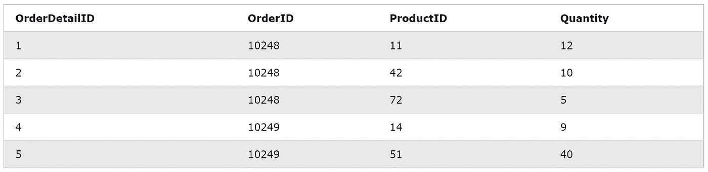

2. **Distinct** :使用 Distinct，我们可以找到一列中的不同值，应用 count 函数可以给出该列中不同值的计数。例如，我们可以使用下面的代码来查找不同(或唯一)产品 id 的数量。

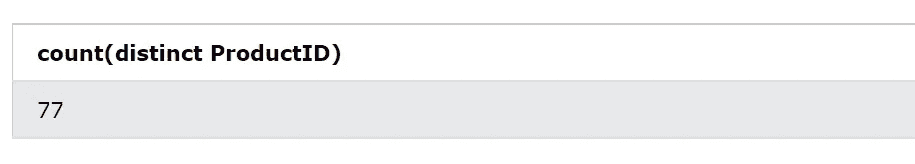

**3。聚合:**聚合运算用于求出一列值的总和、计数、最小值、最大值等。例如，如果我们想找到售出产品的总数量(或单位),我们可以将 sum 函数应用于 quantity 列。类似地，我们还可以通过对 quantity 列应用 max 函数来查找产品的最大销售量。

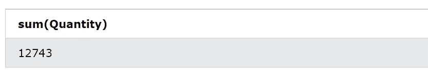

总量(图片由作者提供)

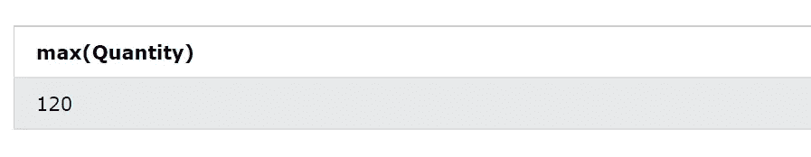

最大数量(图片由作者提供)

**4。Groupby:** Groupby 用于查找列级的聚合/组。Groupby 与 sum、min、max、count 等聚合一起使用。例如，为了找到所有产品的总销售量，我们可以按产品 id 分组，并找到数量的总和。

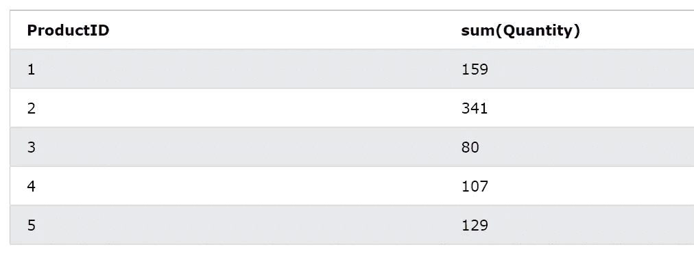

所有产品的总销量(图片由作者提供)

**5。Where:** Where 子句用于根据一些列值过滤行。例如，假设我们想要查看对应于产品 id 10 的总销售量，我们可以在产品 id 列上使用 where 子句。

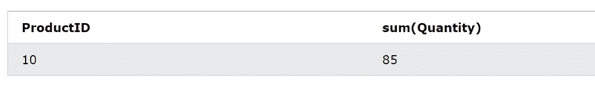

对应于 ProductID — 10 的总数量

**6。Having:** Having 子句用于对聚集的列/值应用过滤器。例如，假设我们想要查找总销售量大于 350 件的产品，我们可以使用 having 子句对聚合数量应用过滤器。

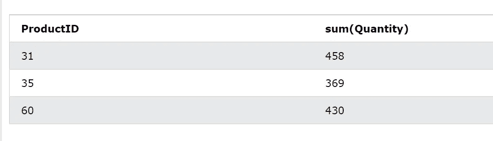

*Where vs Having: Where 用于对数据帧的现有列应用过滤器，而 Having 用于对列的聚合值应用过滤器。*

7 .**。Order by:** Order by 子句用于按升序(默认)或降序对列的值进行排序。例如，如果我们想找到零售商销售的最大数量的产品，那么我们可以使用 order by 函数。

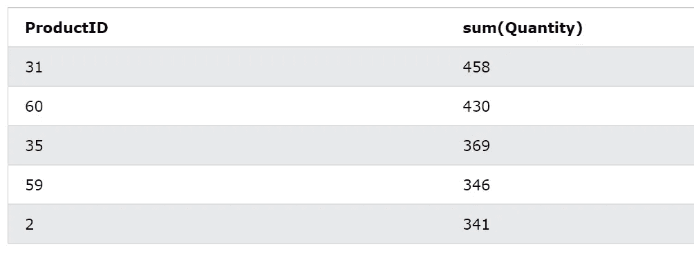

按聚合列排序(按作者排序的图像)

Order by 也可以应用于非聚合列。例如，使用下面的代码，我们可以对数量列进行排序:

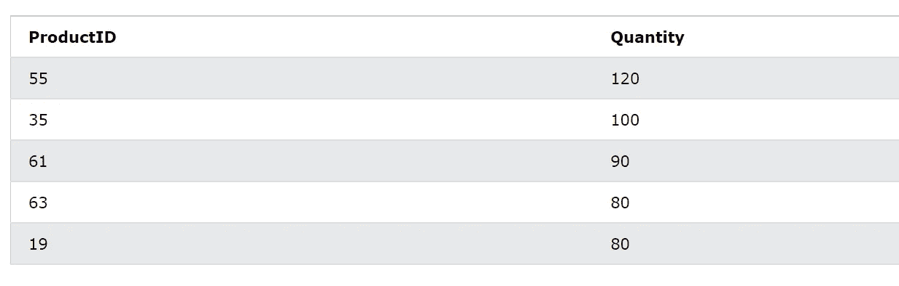

按 ProductID 列排序(按作者排序的图像)

**8。Join:** Join 用于将两个数据表中的信息合并到一个表中。图像，如果我们想获得产品的信息，我们可以将订单明细表与产品表连接起来以获得产品信息。为了连接两个数据表，我们需要在两个表中公共的主键(或列)上连接它们。在下面的示例中，我们使用 ProductID 列在两个表之间应用内部联接。

在这里了解更多关于加入的信息:[加入简介！](https://medium.com/codex/learn-everything-about-joins-in-pandas-5370a8ad7aa5)

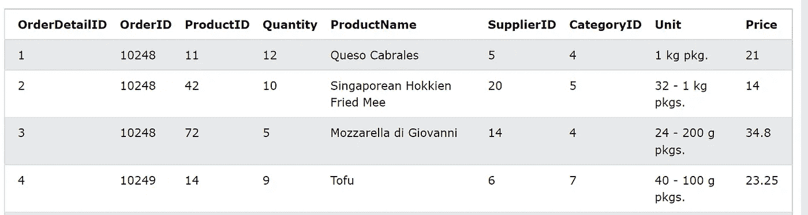

连接表(作者图片)

**9。窗口:**窗口函数用于在数据的子集/窗口上应用函数。例如，为了找到每个类别中的前 3 个销售产品，我们可以按类别列对数据进行分区(按 CategoryID 进行分区)，按总量排序(从高到低)，将行号附加到每一行，并过滤前 3 行(如下面的代码所示)。

数据划分的目的是找到等级、滞后等。在数据子群中。下面是窗口函数的一些使用案例:找出每个类别中的前 3 名，比较当前行和前一行的值，等等。

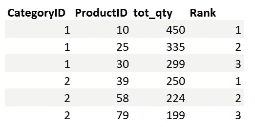

过滤每个类别中的前 3 个产品(按作者分类的图片)

**10。LIKE** : Like 操作符与‘Where’子句一起使用，用于搜索列中的特定模式。例如，为了找到联系号码以代码 171 开头的供应商，我们可以使用以下代码:

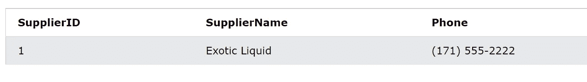

使用 LIKE 运算符过滤联系人(图片由作者提供)

*如果你觉得我的博客有用，那么你可以* [***关注我***](https://anmol3015.medium.com/subscribe) *每当我发布一个故事时，你都可以直接得到通知。如果你自己喜欢体验媒介，可以考虑通过* [***注册会员***](https://anmol3015.medium.com/membership) *来支持我和其他成千上万的作家。*

# 谢谢大家！

这里还有一个与你相关的故事:

 