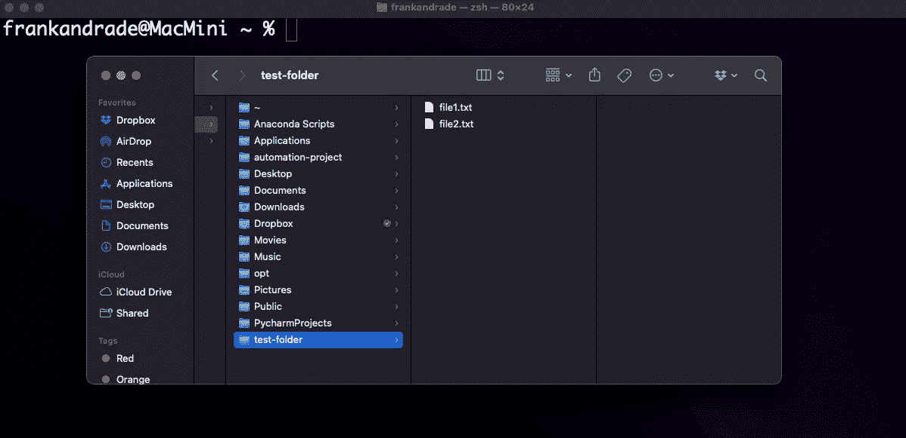
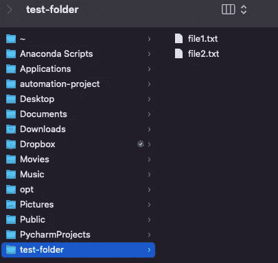
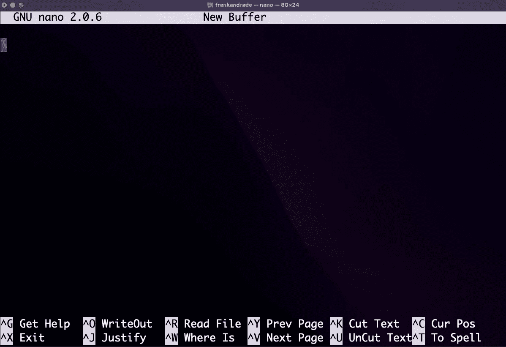

# 任何学习 Python 的人都应该知道的 10 个终端命令

> 原文：<https://towardsdatascience.com/10-terminal-commands-anyone-learning-python-should-know-22c847ece888>

## 像专业人士一样使用终端命令来使用您的电脑


图片由 [cottonbro](https://www.pexels.com/@cottonbro/) 在[像素](https://www.pexels.com/photo/man-in-white-crew-neck-shirt-wearing-silver-framed-eyeglasses-5474034/)上拍摄

我们大多数人通过图形用户界面(GUI)与计算机进行交互。当执行简单任务时，这个友好的选项对我们来说已经足够了，但是当要做更高级的事情时，命令行(CLI)是首选界面。

使用 CLI，我们可以做我们使用 GUI 做的事情，例如浏览目录和处理文件，但是它在速度和效率方面表现出色，甚至可以轻松处理重复的任务(如果您非常熟悉命令的话)

在本文中，我们将看到任何学习 Python 的人都应该知道的基本终端命令。为什么？它们[形成了自动化的基础](https://medium.com/p/74f3fdbabef3)，这是我们大多数人喜欢在 Python 中做的事情(命令# 7“cat”就是一个很好的例子)

# 1.显示当前工作目录

pwd 代表打印工作目录，它会打印当前的工作目录。

```
$ **pwd**
/Users/frank
```

Windows 上的输出略有变化。

```
$ **pwd**
C:\Users\frank
```

# 2.激光唱片

cd 代表更改目录。我们可以使用这个命令来浏览文件夹。

现在，这是您应该在终端上看到的内容

```
user@computer-name:~ $
```

我的情况是`frankandrade@MacMini ~`。`~`表示我们在用户的个人文件夹中。



作者图片

假设我们想使用终端移动到`test-folder`。

```
frankandrade@MacMini ~ % **cd** test-folder/
```

现在我们不再位于`~`，而是位于`test-folder`。

```
frankandrade@MacMini test-folder %
```

如果您想返回到父目录，请使用`cd ..`

# 3.限位开关（Limit Switch）

此命令列出当前目录中的计算机文件。

我的`test-folder`有 2 个 txt 文件。



作者图片

如果我们使用`ls`命令，我们将得到这两个文件作为输出

```
$ **ls** file1.txt file2.txt
```

太好了！我们列出了两个文件。现在让我们列出那些我们在 GUI 中看不到的隐藏文件。

```
$ **ls -a** .  ..  .DS_Store file1.txt file2.txt
```

如你所见，除了文本文件，我的文件夹中还有其他文件。

# 4.mkdir

这个命令允许我们创建一个新的文件夹。

让我们创建一个名为`my-folder`的文件夹。

```
$ **mkdir** my-folder
```

现在我们使用`ls`来验证文件夹是否被创建。

```
$ **ls** file1.txt file2.txt my-folder
```

# 5.触控

这个命令允许我们创建一个空文件。

让我们创建一个名为`file3.txt`的文件

```
$ **touch** file3.txt
```

现在我们使用`ls`来验证文件是否被创建。

```
$ **ls** file1.txt file2.txt file3.txt my-folder
```

如果您想使用终端编辑这个新文件，请使用`nano`。

```
$ **nano** file3.txt
```

运行上面的命令后，`nano`将会打开。



作者图片

这是一个简单的基于终端的文本编辑器。我们可以使用 Nano 来修改现有文件或编写简短的纯文本文件。

我只写下`Hello World!`几个字，然后按`^X`、`Y`并点击`enter`退出并保存文件。

如果您打开`file3.txt`，您将看到所做的更改。

# 6.空间

这个命令帮助我们从计算机中删除文件和目录。

说我们要删除`file3.txt`。

```
$ **rm** file3.txt
```

如果您想删除目录，请添加-r

```
$ **rm** **-r** my-folder/
```

现在我们使用`ls`来验证文件和目录是否被删除。

```
$ **ls** file1.txt file2.txt
```

# 6.平均变化

我们可以使用 mv 命令来移动文件或目录，也可以重命名文件。

对于这个例子，我在`~`目录中创建了一个`file3.txt`文件。

让我们将这个文件移动到`test-folder`目录。

```
$ **mv** file3.txt test-folder
```

如果第二个元素不是目录，而是另一个文件名，我们将重命名该文件。

让我们将 file3.txt 重命名为 my-file3.txt

```
$ **mv** file3.txt my-file3.txt
```

# 7.猫

`cat`最基本的功能是查看文件内容。

让我们看看`file1.txt`里面的内容(它只有“一”和“二”两个字)

```
$ **cat** file1.txtone
two
```

我们还可以使用`cat`连接两个(或更多)文件的内容。如果你想深入了解这个问题，可以看看我下面的视频。

让我们将文件 1 和文件 2 的内容连接起来，放入新的文件 3 中。

```
$ **cat** file1.txt file2.txt > file3.txtone
two
three
four
```

但这还不是全部！我们可以使用`cat`和`>>`将一个文件的内容附加到另一个文件中。

```
$ **cat** file2.txt >> file1.txtone
two
three
four
```

# 8–9.头/尾

使用`head`命令，我们可以很容易地看到文件的前 10 行。

对于这个例子，我有一个编号为 1 到 12 的 file1.txt。让我们看看前 10 排。

```
$ **head** file1.txtone
two
three
four
five
six
seven
eight
nine
ten
```

我们可以使用`cat`命令得到类似的结果，但是当我们只想看到前“n”行时`head`更有用。我们只需添加如下所示的`-n` 参数。

```
$ **head** **-n** 5 file1.txtone
two
three
four
five
```

如果我们想得到最后 10 或“n”行，我们可以使用`tail`命令。

让我们获取 file1.txt 的最后 5 行。

```
$ **tail** **-n** 5 file1.txteight
nine
ten
eleven
twelve
```

# 10.丙酸纤维素

要复制一个文件或目录，我们使用`cp`命令。

让我们复制我的 file1.txt 文件，并将其放入名为 new-folder 的文件夹中。

```
$ **cp** file1.txt new-folder
```

如果我们想要复制一个目录，我们必须添加`-r`参数。

让我们将名为 new-folder 的文件夹复制到父目录(..)

```
$ **cp** -r new-folder ..
```

恭喜你！您刚刚学习了 10 个终端命令，它们将帮助您像专业人士一样使用电脑。

用 Python 学习数据科学？ [**通过加入我的 10k+人电子邮件列表，获得我的免费 Python for Data Science 备忘单。**](https://frankandrade.ck.page/26b76e9130)

如果你喜欢阅读这样的故事，并想支持我成为一名作家，可以考虑报名成为一名媒体成员。每月 5 美元，让您可以无限制地访问数以千计的 Python 指南和数据科学文章。如果你用[我的链接](https://frank-andrade.medium.com/membership)注册，我会赚一小笔佣金，不需要你额外付费。

[](https://frank-andrade.medium.com/membership) [## 通过我的推荐链接加入媒体——弗兰克·安德拉德

### 作为一个媒体会员，你的会员费的一部分会给你阅读的作家，你可以完全接触到每一个故事…

frank-andrade.medium.com](https://frank-andrade.medium.com/membership)