# 数据科学家的 10 个 VSCode 生产力技巧

> 原文：<https://towardsdatascience.com/10-vscode-productivity-hacks-for-data-scientists-1836f87e0525>

## 借助这些 VSCode 扩展，您的工作效率提高 10 倍

安德里亚斯·克拉森在 Unsplash[上拍摄的照片](https://unsplash.com?utm_source=medium&utm_medium=referral)

# 介绍

Visual Studio Code (VSCode)是数据科学专业人士中最流行的集成开发环境之一。它支持大量的编程语言，自带终端集成、内置调试器、直观的键盘快捷键、Jupyter 笔记本支持和可定制的布局。如果您找不到满足您需求的内置功能，请访问 VSCode 扩展市场。它有超过 30，000 个扩展可供选择，其中一个可能就是您正在寻找的。在本文中，我们精心挑选了 10 个 VSCode 扩展，它们将有助于提高您作为数据科学家的工作效率。

# 1.AutoDocString

文档字符串也称为文档字符串，是描述 python 类、函数或方法的字符串文字。Docstrings 为试图使用您开发的类、函数或方法的开发人员提供了指南。

[AutoDocString](https://marketplace.visualstudio.com/items?itemName=njpwerner.autodocstring) 帮助根据定义的变量名、返回值、类型提示和引发的错误生成预填充的文档字符串。

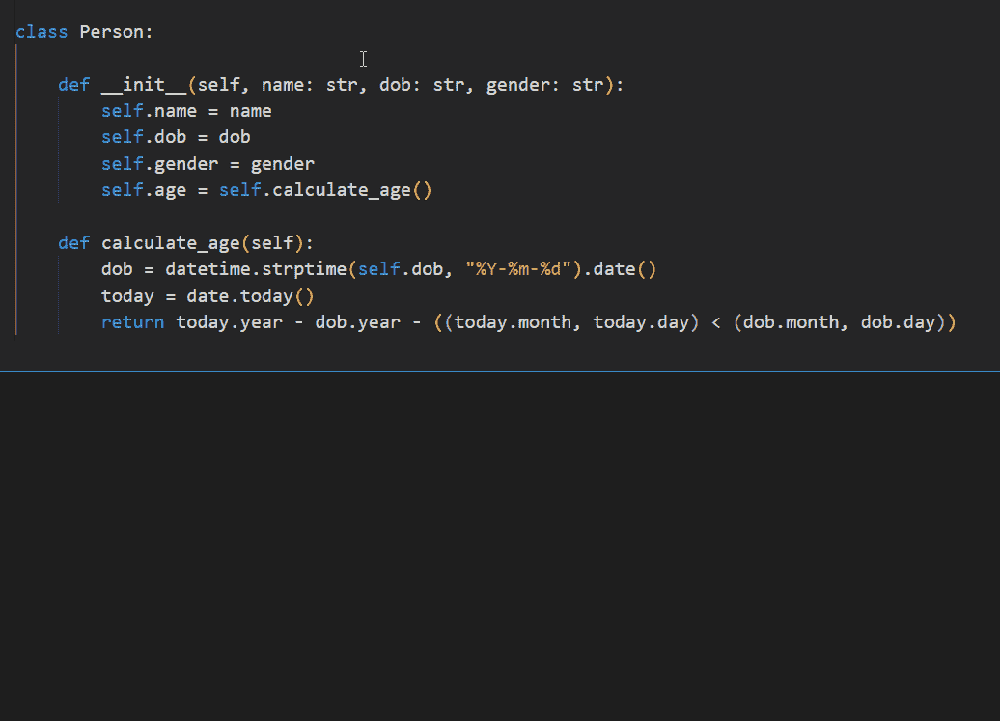

查看这篇关于如何在数据科学项目中使用 AutoDocString 的教程。

# 2.更好的评论

代码中交织的注释提供了人类可读的描述，这使得维护和调试更加容易。我们经常在注释中记下重要的笔记，只是为了在滚动无尽的代码页时忽略它们。

[更好的注释](https://marketplace.visualstudio.com/items?itemName=aaron-bond.better-comments)通过将注释分类为重点、提醒、问题和待办事项，帮助在代码中创建更人性化的注释。更好的评论颜色编码不同类别的评论，使其更容易识别。

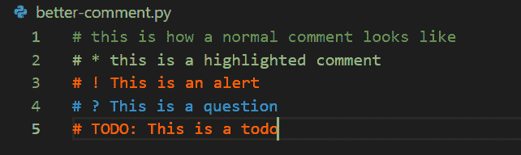

# 3.托多 MD

[TODO MD](https://marketplace.visualstudio.com/items?itemName=usernamehw.todo-md) 是 VSCode 中的一个高级任务列表扩展，帮助你管理 markdown 格式的待办事项。TODO MD 允许基于各种属性(如颜色代码、项目名称、上下文、标签、截止日期等)对任务进行注释。这简化了组织和搜索任务的过程。让我们在 VSCode 中创建新的 markdown 文件，标题为`todo.md`。

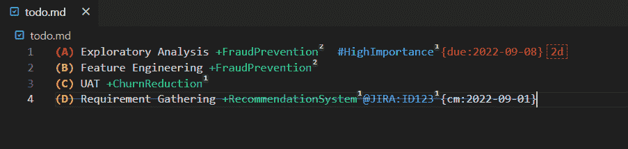

*   使用圆括号中的大写字母排列任务列表的优先级，例如`(A)`、`(B)`、`(C)`
*   使用`+`符号后跟项目名称，用项目名称注释任务
*   使用`@`符号后跟上下文名称，用上下文注释任务
*   使用`#`符号后跟标签名称来标记任务，例如#HighImportance，#LowImportance
*   使用`{due: YYYY-MM-DD}`为任务分配截止日期
*   使用`{cm: YYYY-MM-DD}`标记已完成的任务和完成日期

待办事项 MD 面板有助于根据各种注释对您的任务进行分组，甚至在过期任务旁边还有一个提醒图标。

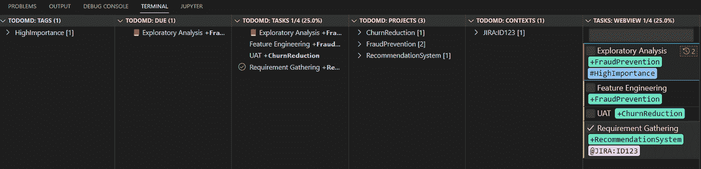

# 4.智能代码

代码完成，也称为代码提示或自动完成，是建议函数、方法、类或关键字名称的工具。在您的集成开发环境中拥有代码完成工具可以极大地提高您的工作效率，因为它减少了手动输入关键字或在文档中搜索类、方法和函数。

IntelliSense 是 VSCode 中常用的代码完成辅助工具。下图显示了 Pylance 的智能感知。请注意，推荐的代码是按字母顺序显示的，我们必须在这些推荐中循环，以找到我们打算使用的方法。

[IntelliCode](https://visualstudio.microsoft.com/services/intellicode/) 是一个智能代码完成扩展，它推荐您最有可能使用的代码。IntelliCode 将最有可能使用的代码放在推荐列表的顶部，用星号标记。这有助于节省我们按字母顺序遍历所有可能代码的时间。

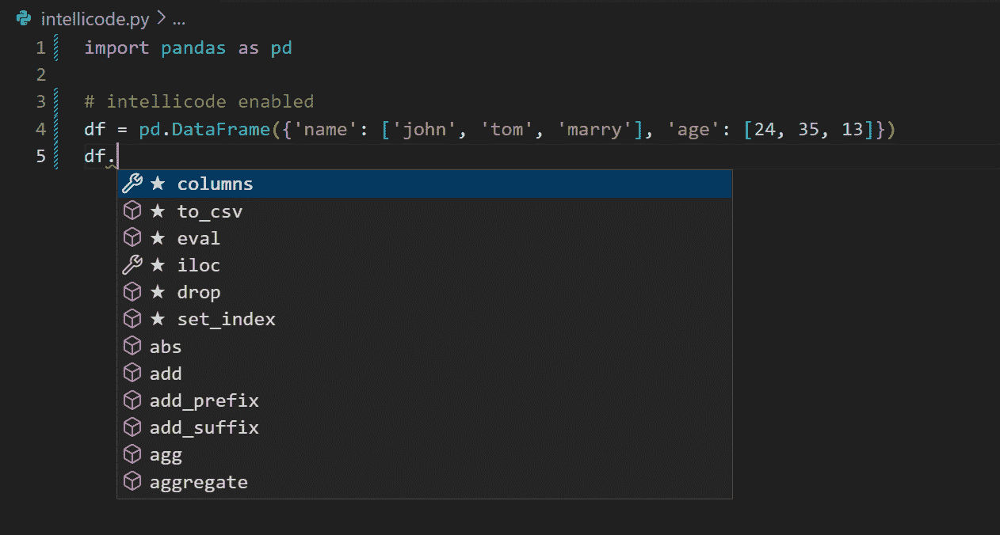

# 5.Python 缩进

在 Python 中，缩进是代码行开头的空格，有助于指示代码块并提高代码可读性。 [Python Indent](https://marketplace.visualstudio.com/items?itemName=KevinRose.vsc-python-indent) 是一个 VSCode 扩展，有助于纠正 VSCode 的默认缩进。下面是启用和未启用 python-indent 扩展的示例。

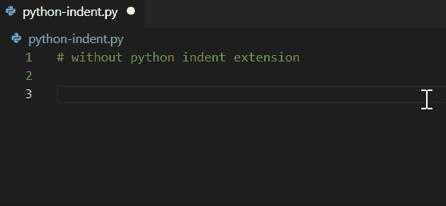

适当的缩进使得代码更易于阅读。

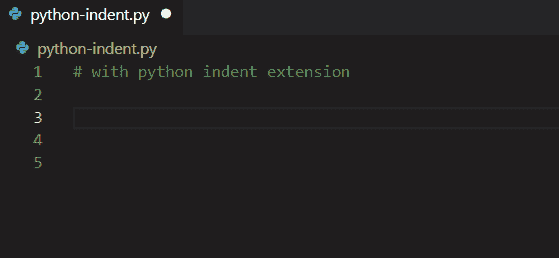

# 6.缩进-彩虹

缩进通常难以阅读，尤其是在带有嵌套缩进的代码中。[缩进-彩虹](https://marketplace.visualstudio.com/items?itemName=oderwat.indent-rainbow)通过对缩进进行颜色编码，有助于使这些缩进更易于阅读。

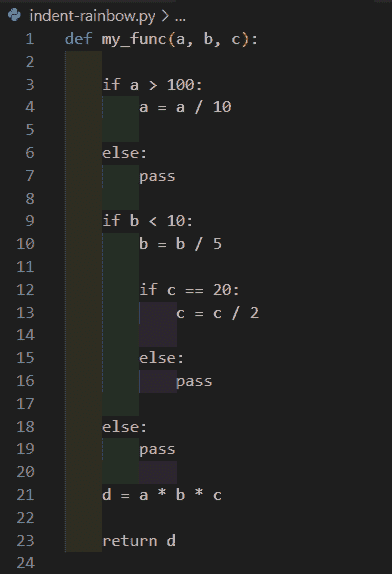

# 7.代码拼写检查器

您是否经常在文档字符串或注释中犯愚蠢的拼写错误，然后由同事通过请求更正？使用[代码拼写检查器](https://marketplace.visualstudio.com/items?itemName=streetsidesoftware.code-spell-checker)避免这些错误。代码拼写检查有助于执行拼写检查，并更正代码、注释和文档字符串的单词建议。让我们看一个例子。

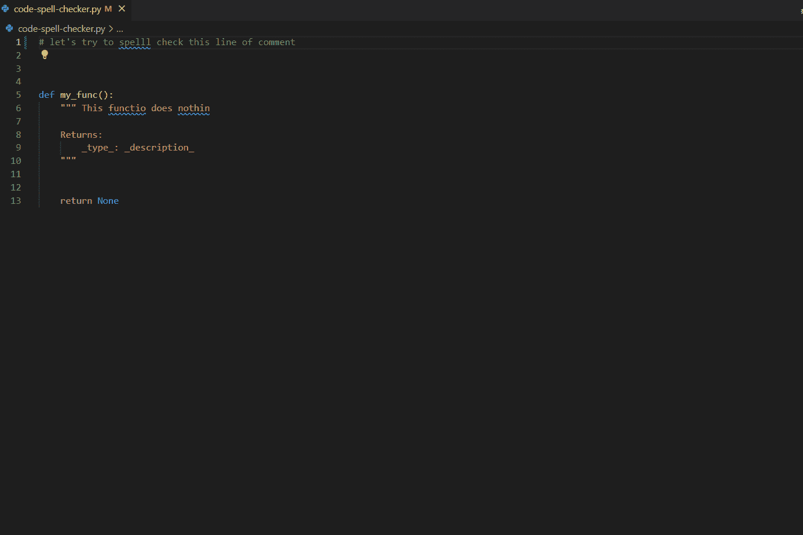

# 8.降价预览增强

阅读或写原始格式的批单可能很乏味，令人困惑，尤其是对初学者来说。[缩小预览增强版](https://marketplace.visualstudio.com/items?itemName=shd101wyy.markdown-preview-enhanced)是一款缩小预览器，实时显示对`.md`文件的编辑，让您可以快速编辑缩小的文件。

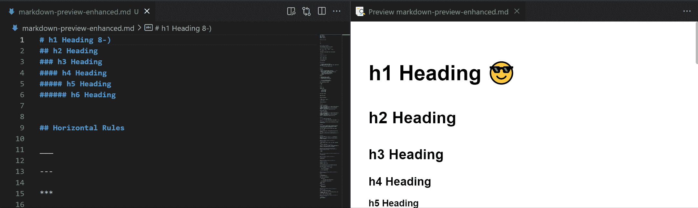

# 9.Python 的 AREPL

使用 python 的[AREPL](https://marketplace.visualstudio.com/items?itemName=almenon.arepl)实时调试您的 Python 代码。

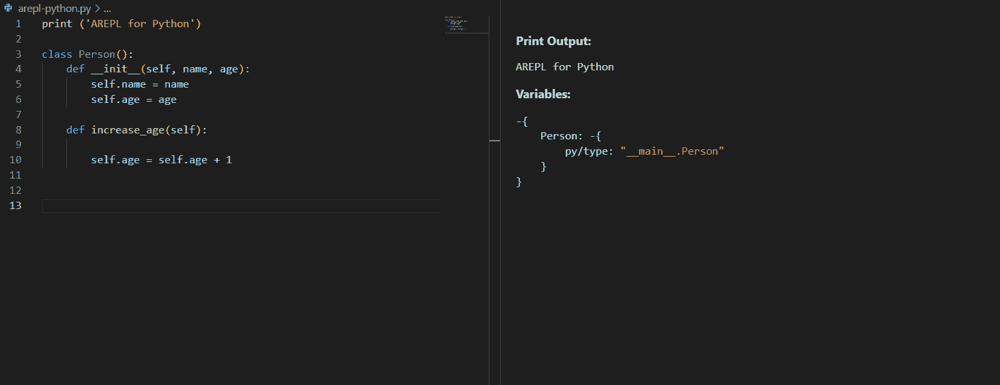

REPL 循环(Read-Eval-Print-Loop)是一种交互式环境，在这种环境中，用户对计算机的输入被读取、评估，并将结果返回给用户。AREPL 代表自动化 REPL [1]，它是一个便笺簿，在其中调试、运行和编写代码可以同时完成。每当您停止键入时，都会计算代码并显示输出。但不仅仅是输出，您的局部变量也被保存起来以供检查。更新代码，值会无缝变化。

# 10.碳

[Carbon-now-sh](https://marketplace.visualstudio.com/items?itemName=ericadamski.carbon-now-sh) 扩展允许您通过 VSCode 使用 [carbon.now.sh](https://carbon.now.sh/) 创建美丽的源代码图像。

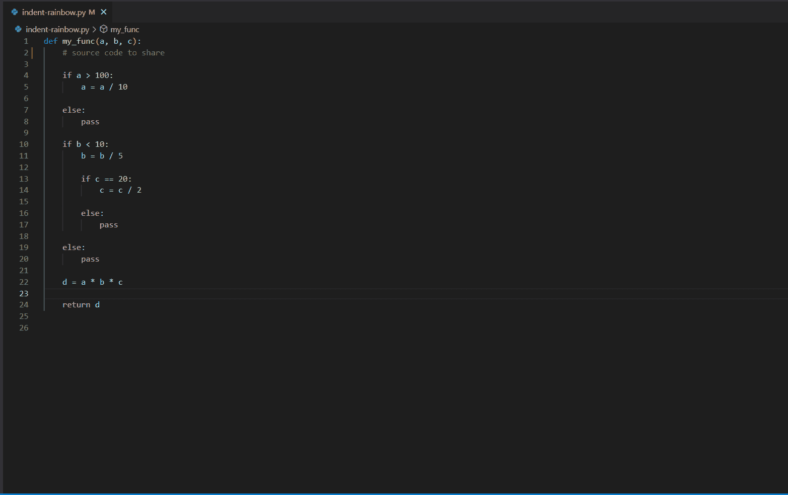

1.  突出显示您希望共享的代码
2.  使用快捷键`Alt+Cmd+A`或(【Windows 上的 )或打开命令面板(`Cmd+Shift+P`或【Windows 上的 )，然后键入 Carbon。您将被重定向至 [carbon.now.sh](https://carbon.now.sh/) 并将您所选的代码填入文本框。
3.  调整您的形象
4.  导出图像

# 结论

在本文中，我们共享了 10 个 VSCode 扩展，这些扩展对于提高数据科学家的工作效率非常有用。这些扩展广泛覆盖文档、代码格式化和调试领域。我希望这有所帮助。请在下面的评论中自由分享您最喜欢的 VSCode 扩展！

加入 Medium 阅读更多类似文章。

  

# 参考

[1] [演讲:AREPL:俄亥俄州克利夫兰的 python | PyCon 2018 实时评测](https://pycon-archive.python.org/2018/schedule/presentation/198/)