# 如何轻松地服务和部署机器学习模型

> 原文：<https://towardsdatascience.com/10-ways-bentoml-can-help-you-serve-and-scale-machine-learning-models-4060f1e59d0d>

## `Moving from Jupyter notebooks to production is not that difficult`毕竟


弗兰·雅克耶在 Unsplash[上的照片](https://unsplash.com?utm_source=medium&utm_medium=referral)

如果您是一名数据科学家，您可能会花大量时间开发复杂的 Jupyter 笔记本来执行数据分析、构建复杂的培训管道或计算统计数据。

Jupyter 笔记本在这方面非常棒，它让我们可以立刻构建出想法的原型。

**但是，一旦您完成了这项工作，并且对保存的 ML 模型感到满意，会发生什么呢？🤔**

这是您开始考虑将它们部署到生产中的地方。你开始工作的时候有没有想清楚这一点？

大概不会。这不怪你，因为这不是数据科学家的核心专长。(尽管行业目前正朝着这个方向发展)

> 在本教程中，我将展示如何使用一个名为 BentoML 的 Python 库来打包您的机器学习模型并轻松部署它们。
> 
> ***我先给大家介绍一下制作 ML 的概念。然后，我将向您介绍该工具，并涵盖 BentoML 可以让您的生活变得更轻松的 10 种方式。***

*PS:这不是一篇 clickbait 的文章:所有这些理由都是有效的、有据可查的理由。对于每一个，我将分享代码，解释和我的印象。*

事不宜迟，我们来看看🔍

# 一旦你的模型被训练后会发生什么？

一旦你训练了一个模型，你需要开始考虑与其他团队分享它。

如果您团队中的其他开发人员(例如后端或前端开发人员)想要使用它，他们需要与包装它的某种 API 进行交互。这个 API 必须清晰并有文档记录，有明确的错误记录和数据验证。

如果 DevOps 团队想要管理您的模型的部署，它需要处理它的依赖关系。它通常期望至少有一个运行并服务于您的模型的 Docker 映像。

如果产品团队想要对您的模型进行压力测试或者向客户展示，那么 API 必须能够适应许多并发请求。

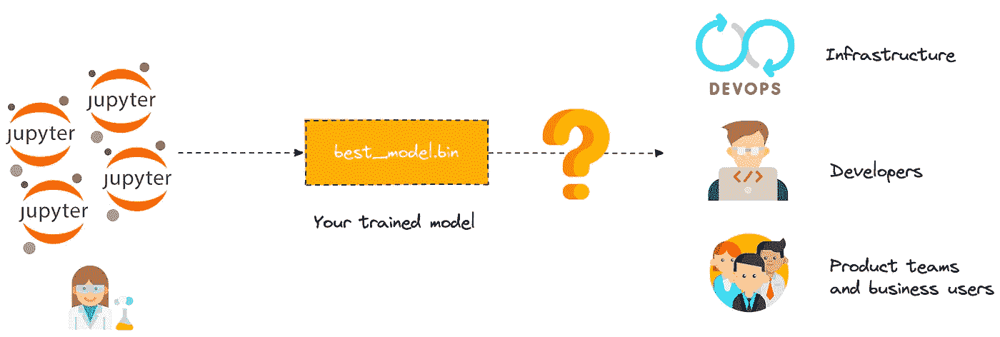

接下来会发生什么？作者图片

这里总结一下。

将一个 ML 模型带入生活(即生产)会有很多限制:

*   多 ML 框架的使用和支持(咄！)
*   创建 API 并以最低的性能水平为其服务
*   再现性和依赖性管理
*   API 文档
*   监控、日志记录、指标等。

势不可挡不是吗？

在接下来的 10 节中，我们将通过概念、有用的命令和 ML 相关的特性来探索 BentoML 是如何实现这一点的。

# 1— BentoML🍱:分发您的 ML 模型的标准化格式

[**BentoML**](https://www.bentoml.com/) 是模型服务和部署的端到端解决方案。它旨在帮助数据科学家利用通用 MLOps 最佳实践构建生产就绪型终端。

> 它是另一个 web 框架吗？

不完全是。BentoML 将 ML 项目中需要的所有东西打包成一个名为 ***的分发格式🍱***

**更准确地说，便当是一个文件档案，包含您的模型训练的所有**源代码**和您定义的用于服务的**API**，保存的**二进制模型**，**数据文件**，**docker 文件**，**依赖关系**，以及附加的**配置**。**

**所有的东西都组合成一个单元，并打包成一种标准化的格式。**

**你可以把便当想象成 Docker 图像，但是对于 ML。**

**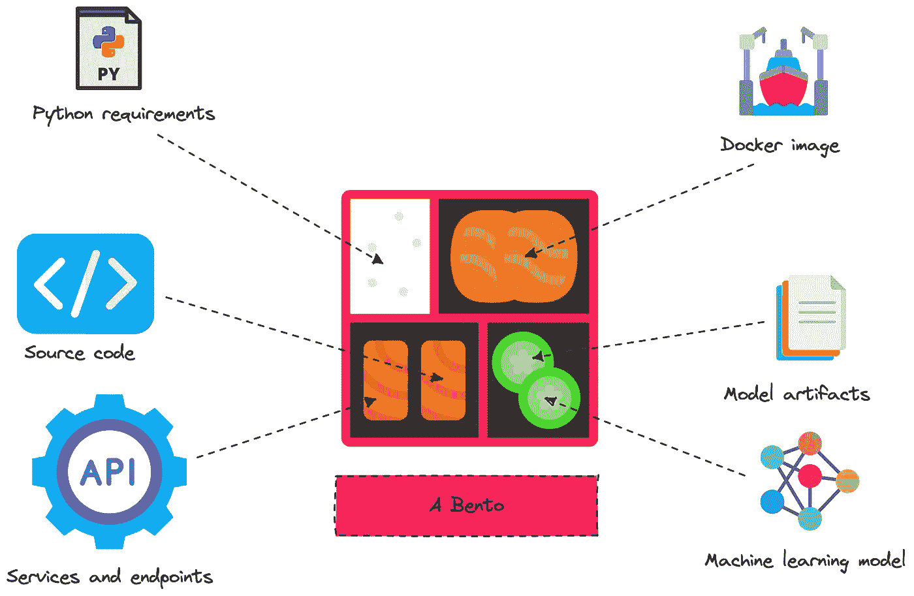**

**BentoML —作者图片**

**一份盒饭也是自带的。这简化了任何云基础架构的模型服务和部署。**

**当你的便当被构建时(我们将在下一节看到这意味着什么)，你可以把它变成一个 Docker 镜像，你可以部署在云上，或者使用`[**bentoctl**](https://github.com/bentoml/bentoctl)` ，它依赖于幕后的 Terraform，并把你的便当部署到任何云服务和基础设施(AWS Lambda 或 EC2，GCP 云运行，Azure 函数，等等)。**

**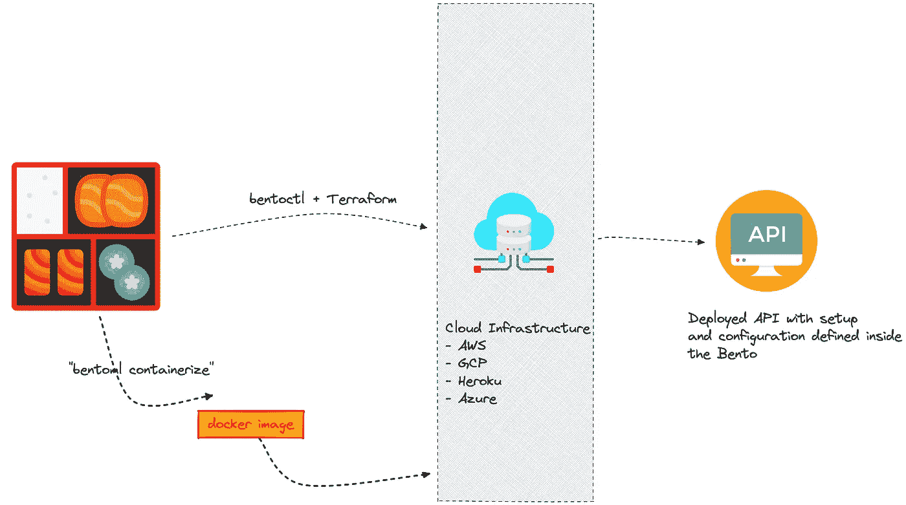**

**如何部署便当—作者图片**

# **2-将模型保存到本地存储并进行版本控制💾**

**首先，你需要运行:`**pip install bentoml**`**

***一旦安装完毕，* `*bentoml*` *命令就会被添加到您的 shell 中:这在接下来的章节中会很有用。***

**当您的模型完成训练时，您通常会开始使用 BentoML(这一部分不受影响)**

**事实上，您可以使用 BentoML 将模型保存在特定的文件夹中(称为模型存储)，而不是保存在文件系统的某个地方。这有助于为模型的每个版本提供唯一的标签，并确保可再现性。**

**在下面的例子中，我们保存了一个在 iris 数据集上训练的 SVC 模型。**

**这将生成一个惟一的模型标记，允许您稍后获取相应的模型。**

**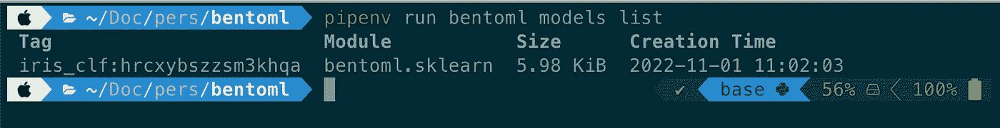**

**它还会创建一个以模型标记命名的文件夹。如果查看这个文件夹，我们会发现二进制文件和一个名为`model.yaml`的 Yaml 文件，它描述了模型元数据。**

**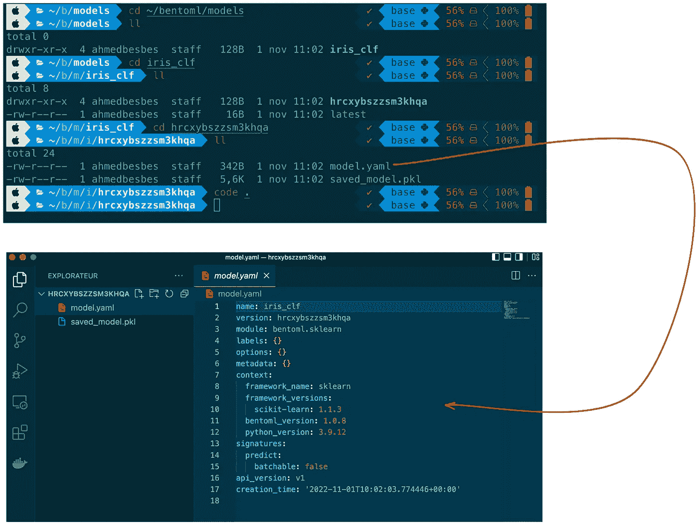**

**作者图片**

# ****3—创建推理服务，将模型公开为 API⚙️****

**一旦模型被创建并保存在模型存储中，您就可以将它转换成您可以请求的 API 端点。要做到这一点，首先必须创建一个调用模型运行器的服务，然后用它来修饰一个函数。**

**在下面的例子中，当有效负载数据(NumpyNdarray 类型)通过 HTTP POST 请求发送到`/classify`端点路径时，用`api`方法修饰的 ***classify*** 函数运行代码。**

**然后，通过使用以下命令运行服务，您可以在本地为模型提供服务:**

```
bentoml serve service:svc --reload
```

**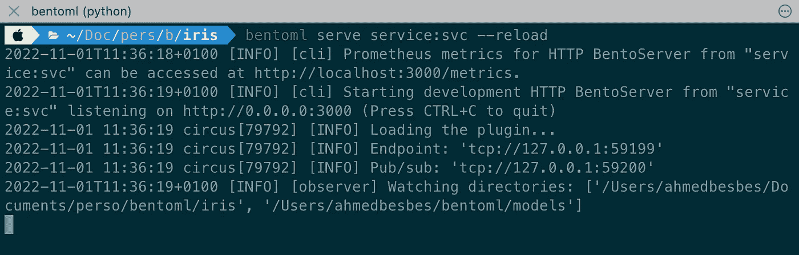**

**这将打开一个 HTTP 本地服务器，您可以使用 Python 请求它**

**或界面(直接访问 [http://localhost:3000)](http://localhost:3000))**

**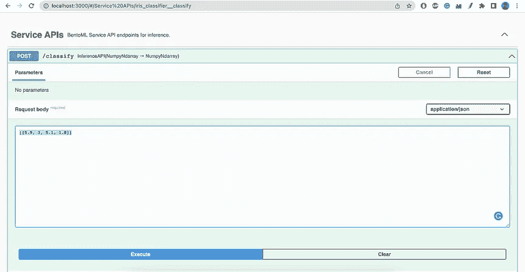****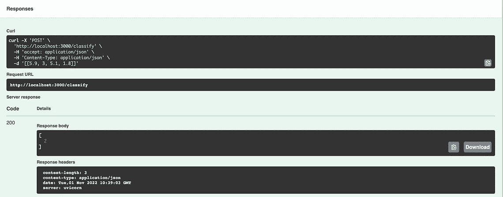**

**通过 Swagger UI 请求—作者提供的图片**

# ****4—制作并定制您的便当🏗****

**在这里你可以构建一个便当，看看里面有什么文件。这为您的所有项目提供了一个独立于底层工具的标准化结构。**

**要构建您的便当，您首先需要创建一个名为`bentofile.yaml`的文件**

**这个文件配置如何构建便当:它包括元数据，列出有用的源代码，并定义包列表。**

**要构建便当，在包含`bentofile.yaml`的文件夹中运行下面的命令。**

```
bentoml build
```

**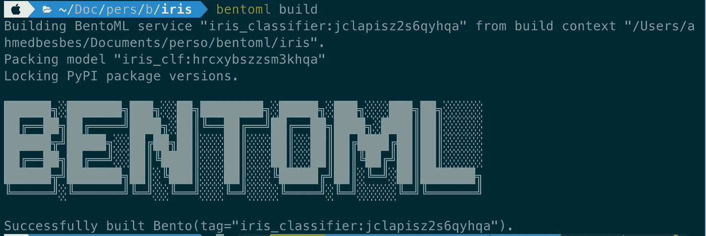**

**作者图片**

**现在，如果我们查看便当并检查里面有什么，我们将看到以下文件夹结构，其中包含以下内容:**

*   **API 的描述和模式**
*   **构建 Docker 映像所需的 Docker 文件**
*   **Python 需求**
*   **经过训练的模型及其元数据**
*   **负责训练模型和定义 API 路线的源代码**
*   **指定便当构建选项的配置(`**bentoml.yaml**`)**

**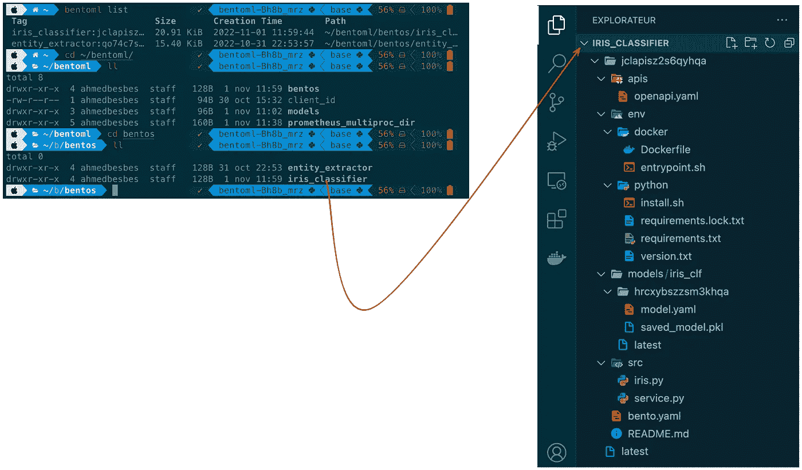**

**作者图片**

# ****5—将便当装入 Docker 图像中🐳****

**一旦创建了便当，您可以使用`dockerize`命令来构建一个健壮的 Docker 映像。这是 bentoml 提供的一个非常有用的特性。如果您使用的是 FastAPI，那么您必须手动完成这项工作。**

**BentoML 提供了这个简单的命令来为您构建图像。**

```
 bentoml containerize iris_classifier:latest
```

**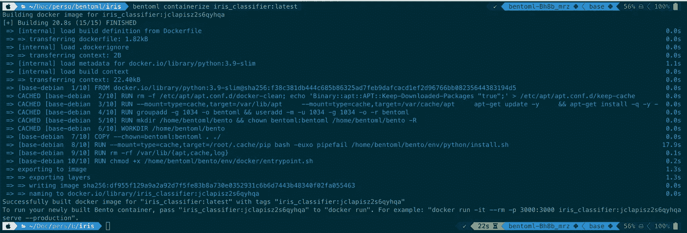**

**将便当容器化——作者的形象**

**一旦构建了映像，您就可以在您的系统上检查它:**

****

**作者图片**

**这个 Docker 映像是自包含的，用于在本地提供便当或将其部署到云中。**

```
docker run -it --rm -p 3000:3000 iris_classifier:jclapisz2s6qyhqa serve --production
```

**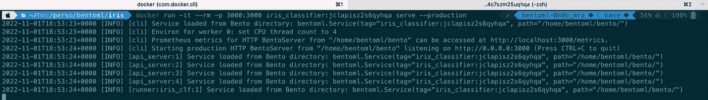**

**从容器到主人端上便当——图片由作者提供**

# ****6——使用跑步者独立于 web 请求扩展推理🚀****

**Runners 是特定于 ML 的计算单元，它允许推理过程独立于 web 服务器进行扩展。**

**这意味着推理和 web 请求处理运行在两个独立的进程上。**

**这也意味着您的推理管道可以有任意数量的运行器，并且可以垂直伸缩(通过分配更多的 CPU)。每个运行器也可以有特定的配置(RAM、CPU 与 GPU 等。)**

**例如，这种架构允许你拥有一个依赖于三个独立的运行者来处理不同事情的服务。**

**在下面的例子中，两个运行器(一个执行 OCR 任务，另一个执行文本分类)在输入图像上顺序运行。**

**你可以在这里了解更多关于跑步者的信息[。](https://docs.bentoml.org/en/latest/concepts/runner.html)**

# ****7 —支持自适应批处理****

**批处理是对一组 N 个输入运行预测而不是启动 N 个顺序预测的术语。
这具有优势:它**提高了性能**和**吞吐量**和**利用加速硬件**(GPU 因加速矢量化运算而闻名)**

**FastAPI、Flask 或 Django 等 Web 框架没有处理批处理的机制。**

**另一方面，BentoML 为此提供了一个很好的解决方案。**

**事情是这样的:**

*   **多个输入请求并行运行**
*   **代理(即负载平衡器)在工作器之间分发请求(工作器是 API 服务器的运行实例)**
*   **每个工作人员将请求分发给负责推理的模型运行人员**
*   **每个运行器通过在延迟和吞吐量之间找到一个折衷，动态地将请求分批分组**
*   **跑步者对每一批进行预测**
*   **然后，批量预测被拆分并作为单独的响应发布**

**这一点的美妙之处在于，对于发送多个并行请求的客户机来说，这是完全透明的。**

**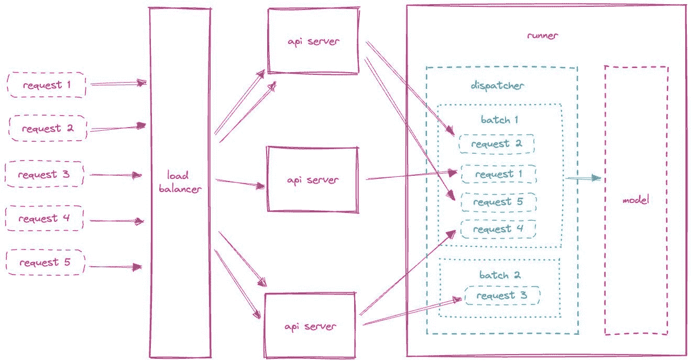**

**图片由作者修改**

**要启用批处理，您需要将`batchable`参数设置为 True。示例:**

**点击 ***了解更多配料 [***。***](https://docs.bentoml.org/en/latest/guides/batching.html)*****

# **8 —平行推理**

**跑步者有一种优雅的气质。您可以根据需要组合它们，以创建可定制的推理图。在前面的例子中，我们看了两个跑步者依次跑步。(OCR ->文本分类)。**

**在这个例子中，我们展示了通过利用异步请求，运行者也可以并发运行。**

**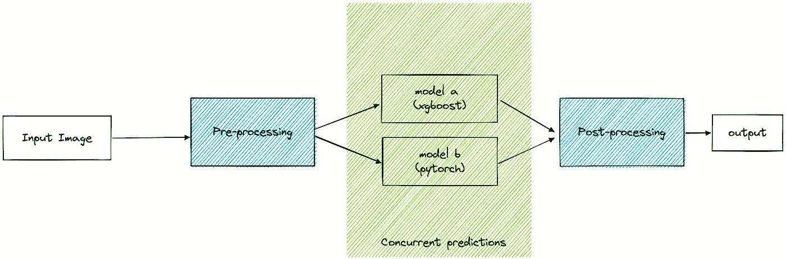**

**平行推理——作者图片**

**想想有多少次你不得不将 ML 模型合并到一个预测管道中。使用 BentoML，您可以同时运行这些模型，并在最后收集结果。**

# **9—部署到任何云基础架构**

****

**如何部署便当—作者图片**

**便当的好处在于，当它被构建时，你可以用两种方式部署它:**

1.  **通过将 Docker 映像推送到注册表并将其部署到云中**
2.  **通过使用 BentoML 团队开发的实用程序库[bento TL](https://github.com/bentoml/bentoctl)来加速部署过程**

**强烈推荐使用 bentoctl。它有助于将任何构建好的便当作为生产就绪的 API 端点部署在云上。它支持许多云提供商(AWS、GCS、Azure、Heroku)以及同一云中的多个服务(AWS Lambda、EC2 等)。)**

**我最近用 spaCy 模型为 AWS Lambda 部署了一个(无服务器)API 端点。它非常管用，我只需要一个现成的便当。**

**你可以通过[文档](https://github.com/bentoml/bentoctl/blob/main/docs/quickstart.md)来让它工作，但是简单来说你需要做的就是下面这些:**

*   **安装 bentoml**
*   **安装 terraform(检查此[链接](https://developer.hashicorp.com/terraform/tutorials/aws-get-started/install-cli)**
*   **设置 AWS CLI 并配置您的凭证(参见[安装指南](https://docs.aws.amazon.com/cli/latest/userguide/getting-started-install.html))**
*   **安装 bentoctl ( `pip install bentoctl`)**
*   **做了你的便当**
*   **安装允许在 AWS Lambda 上部署的 aws-lambda 操作符(bentoctl 也支持其他操作符):`bentoctl operator install aws-lambda`**
*   **运行`bentoctl init`生成部署文件。这一步交互地要求您配置 Lambda 函数的部署(设置区域、内存、超时等)**
*   **通过运行`bentoctl build`
    构建部署所需的映像这一步准备一个 Docker 映像并将其推送到部署注册中心。**
*   **通过运行以下命令部署到 Lambda🚀`bentoctl apply -f deployment_config.yaml`。配置部署后，这一步依赖于 Terraform 来应用更改**

**部署完成后，会提示您一个 API URL，您可以请求它与您的模型进行交互。**

**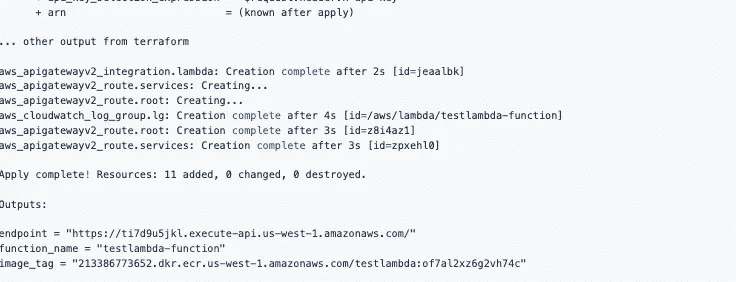**

**作者截图**

**要删除 Lambda 函数，只需运行`bentoctl destroy -f deployment_config.yaml`即可。**

# ****10 —API 文档和交互 UI****

**当您部署 BentoML 服务或在本地为其提供服务时，您可以访问一个 [Swagger](https://swagger.io/tools/swagger-ui/) UI，该 UI 允许您在没有任何实现逻辑的情况下可视化 API 资源并与之交互。**

**这是由带有可视化文档的 OpenAPI 规范生成的，便于后端实现和客户端使用。**

**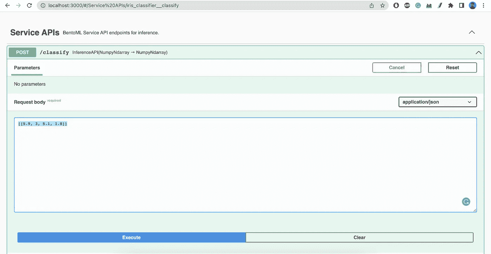**

**大摇大摆的用户界面示例——作者的图片**

# **资源:**

*   **[https://towards data science . com/comprehensive-guide-to-deploying-any-ml-model-as-APIs-with-python-and-AWS-lambda-b441d 257 f1 EC](/comprehensive-guide-to-deploying-any-ml-model-as-apis-with-python-and-aws-lambda-b441d257f1ec)**
*   **[https://towards data science . com/bento ml-create-an-ml-powered-prediction-service-in-minutes-23d 135 D6 ca 76](/bentoml-create-an-ml-powered-prediction-service-in-minutes-23d135d6ca76)**
*   **[https://neptune.ai/blog/ml-model-serving-best-tools](https://neptune.ai/blog/ml-model-serving-best-tools)**
*   **[https://www . Reddit . com/r/mlops/comments/w4v l6 r/hello _ from _ bentoml](https://www.reddit.com/r/mlops/comments/w4vl6r/hello_from_bentoml/)**
*   **[https://docs . bentoml . org/en/latest/concepts/service . html # runners](https://docs.bentoml.org/en/latest/concepts/service.html#runners)**
*   **[https://github.com/bentoml/BentoML/tree/main/examples](https://github.com/bentoml/BentoML/tree/main/examples)**
*   **[https://model serving . com/blog/breaking-with-flask-amp-fastapi-why-ml-model-serving-requires-a-specialized-framework](https://modelserving.com/blog/breaking-up-with-flask-amp-fastapi-why-ml-model-serving-requires-a-specialized-framework)**

# **新到中？你可以每月订阅 5 美元，并解锁各种主题的无限文章(技术、设计、创业……)你可以通过点击我的推荐链接[来支持我](https://ahmedbesbes.medium.com/membership)**

**[](https://ahmedbesbes.medium.com/membership) [## 加入我的介绍链接媒体-艾哈迈德贝斯

### 阅读 Ahmed Besbes 的每一个故事(以及媒体上成千上万的其他作家)。您的会员费直接支持…

ahmedbesbes.medium.com](https://ahmedbesbes.medium.com/membership)**