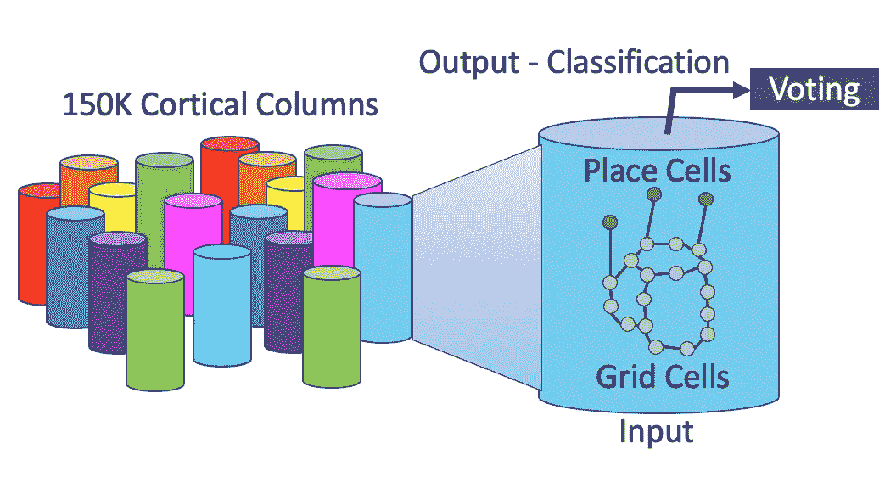
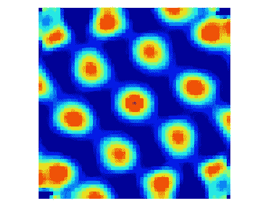
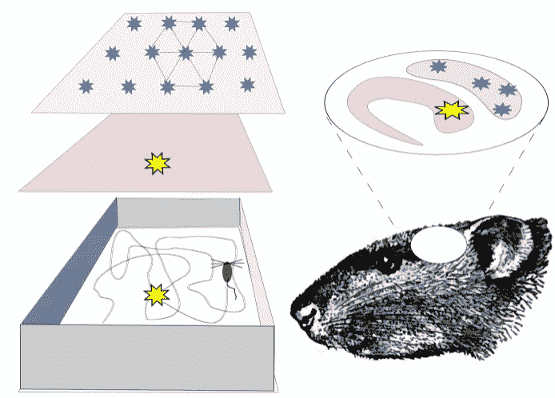

# 一千个大脑和 EKG

> 原文：<https://towardsdatascience.com/1000-brains-and-the-ekg-8ef7b1764ccd>

## 形状检测如何推动分类

每个皮层列都包含用于输入分类的位置单元和网格单元。每个专栏都对识别一个项目并将其连接到参考框架进行投票——作者的说明。

2021 年 4 月，著名的技术专家、企业家和大脑理论家杰夫·霍金斯出版了他的新书《一千个大脑》。这本书描述了杰夫关于人类大脑皮层结构的千脑理论。在这篇博客中，我将回顾这个架构，并讨论它对[企业级知识图](https://dmccreary.medium.com/a-definition-of-enterprise-in-ekgs-561283d37deb) (EKGs)的长期架构的影响。

本文是关于心电图如何成为组织的[中枢神经系统](/the-evolution-of-enterprise-knowledge-graphs-and-the-cns-9c57a0513ecd) (CNS)的一部分的系列文章的一部分。就像我们自己的中枢神经系统一样，心电图可以对环境中的信号做出快速反应，并在正确的时间向正确的人发出正确的通知。

这里最重要的观察是，我们的大脑已经进化到可以帮助我们在世界中穿行。心电图本身不会在世界上移动，但他们需要通过我们的组织跟踪客户、产品和想法的运动，当这种运动需要纠正时，他们需要通知正确的人。

# 杰夫·霍金斯的背景

杰夫·霍金斯的照片(取自 [Numenta 网站](https://numenta.com/))。照片经 Numenta 许可使用。

在过去的 15 年里，杰夫·霍金斯一直是人工智能领域最有影响力的思想家之一。杰夫 2007 年的书《T8 论智力》(T9)是第一批展示人类大脑整体架构的书籍之一，重点是新皮层的分层结构。杰夫强烈的感觉到，不了解人脑就无法了解 AI。他还帮助我们理解，人工智能最难的部分几乎总是知识表示的挑战。在过去的十年里，机器学习在训练神经网络方面取得了长足的进步，但它的优势在于看到数据中的模式，而不是理解我们周围的世界。看完杰夫的书，你会意识到，如果我们不知道如何在计算机内存中表示一个分类的结果，如何归纳，我们就不是在解决 AI 的真正问题。我们可以识别项目，但我们不理解项目在我们分类项目周围的其他项目的上下文中的相关性。

我最喜欢引用杰夫·霍金斯的话如下:

“人工智能的关键一直是表现。”

这个观点，自从我在 1980 年代在人工智能的研究生院工作以来，我一直分享，这就是为什么我一直关注 RDF、NoSQL 和现在的 EKG。

# 千脑架构的关键方面

虽然我不会在这篇博客中涵盖千脑理论的所有方面，但我想指出一些关键的理论元素，它们可能有助于我们关注我们的 EKG 架构。明确地说，心电图不像我们的大脑，就像飞机不像鸟，潜艇不像鱼一样。我们用大脑来理解智能，以及我们的心电图如何才能更智能。心电图是大脑激发的，但是现代 EKG 的建筑与人脑完全不同。

千脑理论试图理解人类大脑皮层的高级结构。该理论假定了以下关键点:

1.  人类的新大脑皮层由大约 150，000 个皮层柱组成。每一列包含数以亿计的神经元，这些神经元读取输入信号，并对输入信号进行更高级别的分类。皮质柱也依次由迷你柱组成，每个迷你柱有数百个神经元。
2.  每列包含两种类型的单元格:网格单元格和位置单元格。这些细胞从早期动物进化而来，帮助它们在世界中导航。
3.  格网单元和位置单元协同工作，通过识别输入的形状和结构来对输入进行分类。皮层列是不断进化的神经网络，将输入数据转化为有用的表示结构。
4.  分类的输出是到一个或多个参考帧的链接。你可以把参照系想象成描述我们世界中物体结构的抽象线框图形。理解什么是参照系，以及它们如何与其他事物联系在一起，是智能中的一个中心问题。
5.  分类过程高度分布在许多皮质柱上。每一个皮质专栏都与其他专栏合作，对他们的信念和输入应该如何分类进行“投票”。学习本质上是不断调整这些投票系统的权重的过程。

千脑结构的一个关键方面是网格细胞和位置细胞是如何工作的。以下是对这些细胞的简要描述

## 网格单元

大鼠网格细胞神经元活动的空间自相关图。图片来自[维基百科](https://en.wikipedia.org/wiki/Grid_cell#/media/File:Autocorrelation_image.jpg)。

[**网格单元格**](https://en.wikipedia.org/wiki/Grid_cell) 是帮助你找到自己在世界上相对位置的单元格。当细胞开始在它们的环境中移动时，它们就进化了。由于植物不经常走动，它们没有进化出这些大脑结构。移动的动物需要发展一种意识，即它们与资源的关系。他们需要走向食物，远离敌对的环境，包括他们的敌人。网格细胞相互连接，构成我们周围世界的“地图”或模型。他们通过另一个叫做位置细胞的细胞连接到他们世界中的特定物品。

位置细胞和网格细胞协同工作，帮助动物导航它们的环境——图片来自[维基百科](https://en.wikipedia.org/wiki/Place_cell#/media/File:RatGPS.svg)。

[**位置细胞**](https://en.wikipedia.org/wiki/Place_cell) 是当你处于环境中的特定位置时会触发的细胞。它们将你世界的地图与你世界中的事物联系起来。他们可能会发出信号，“嘿，这里有食物”或“这个地方有危险。”

这些原始细胞一起工作，告诉动物他们在固定的静态地图上的位置。如果他们的世界改变了，他们需要绘制一张新的地图。

# 我们的大脑如何进化到使用高效的动态地图

在旧地图旁边构建新地图非常简单。您需要将旧地图链接到新地图。每当我们从一个房间走进另一个房间时，我们的大脑就会在地图之间跳跃。但是，如果您的环境在旧地图和新地图中有相似的结构，该怎么办呢？例如，如果旧地图和新地图有相似的食物来源，比如一种你可以吃的植物，会怎么样？动物自然进化出了通过将新地图的一部分重新连接到旧地图来最小化构建新地图所需工作的方法。

在计算机科学中，我们通常称这种技巧为“[可组合性](https://en.wikipedia.org/wiki/Composability)”我们能否将大量重复但相似的业务规则在本体的上层重新链接在一起，从而减少重复？可组合性使得我们的本体学家更容易维护这些规则。

但是在大脑能够将相似的结构连接在一起之前，它必须掌握一些复杂的东西。它必须学会如何识别形状是相似的，并且可以连接在一起。不同的形状被合并成一个更抽象的形状。这些形状的概括就是一个参照系。我们使用参照系来学习如何概括。我们的大脑通过将相似的项目联系在一起来“学习”，以保持大脑的效率。很少有动物掌握了这一技巧，这是智力的标志。抽象的表现是智能的关键。

动物可能会从识别地图中的固定项目开始，并将它们与相同的抽象项目表示联系起来。但是如果物品四处移动呢？大脑现在需要识别物品，即使它们周围有不同的结构。项目识别器需要能够感知上下文。如果它们是视觉细胞，即使有不同的光线和方向，它们也能对物品进行分类。当图需要寻找不变结构时，我们称这些查询为同构查询。

当我想到同构查询时，我想到的是识别事物的抽象形状并可以将这些形状与已知的形状数据库进行比较的查询。这类似于参考框架的工作原理。它们是固定的结构库，我们可以在大脑中建立链接。

现在，让我们盘点一下我们用来构建心电图的各个部分，并寻找千脑理论中各个功能之间的相似之处。

# 顶点、嵌入和规则

当我们建造 EKG 时，我们没有储存在 EKG 中的皮质柱的概念。由于皮质柱是从早期的大脑结构复制而来，以帮助动物适应环境，这并不奇怪。然而，心电图发展很快，我们看到许多不同类型的子图具有专门的功能。

像神经元一样，我们也有顶点和边，用来穿越 EKG。顶点和它们的属性也是从它们卑微的起源进化而来的，穿孔卡片用它们的列填充平面文件。在这个过程中，我们的顶点之间的关系，称为边，也进化了它们的属性。

以及关于我们的关键业务实体(客户、接触点、产品、服务器等)的知识。)，我们还可以在我们的图表中存储关于相似项目如何相关的知识。这些“相似性”向量被称为[嵌入](https://dmccreary.medium.com/understanding-graph-embeddings-79342921a97f)。虽然它们是新的，但是嵌入可以以类似于皮质柱的方式使用。嵌入是快速相似、分类和推荐的关键。分类提问— *这件物品与我们过去见过的其他物品有何相似之处？*我们可以获取任何新的项目，找到它的嵌入，并计算与图中标记项目的距离。关键是使用类似于[FPGA](https://xilinx.github.io/graphanalytics/index.html)的并行计算硬件来近乎实时地(低于 50 毫秒)进行这些计算。

一旦我们对新数据进行了分类，我们就可以添加属性，创建新链接，并执行在正确的时间通知正确的人的功能。

尽管千脑理论还有许多其他结论，但我想重点谈谈这一理论可能会如何影响我们构建心电图的方式，以及机器学习需要如何集成到心电图中，以达到我们企业数据库所需的智能水平。

我们想停下来思考一下我们在企业知识图上运行的查询类型。查询有许多子类型:

1.  在我们的图中查找项目的查询(例如，广度优先搜索、深度优先搜索)。
2.  寻找项目间路径的查询(寻路)。
3.  寻找项目群集(中心性)的查询。
4.  查找相似项目的查询(产品图中的相似产品、兴趣图中的相似项目、医疗保健图中的相似患者)。
5.  寻找相似形状的查询([同构](https://en.wikipedia.org/wiki/Graph_isomorphism)查询)并将它们与参考模式(参考帧)进行比较。
6.  在基于图形的决策树等结构中执行确定性业务规则的查询。这就是本体论派上用场的地方。

请注意，这些算法可以一起工作。您可以编写深度优先搜索，查找与相似形状相关的项目。然后，您可以在这两个形状之间找到一条路径。您也可以用新链接将相似的形状链接在一起。

# 位置和网格单元如何成为分类器

杰夫和他的团队正在研究已经在动物大脑中存在了数亿年的网格和位置细胞是如何进化来解决图像识别、声音识别和危险预测等复杂问题的？杰夫的理论是，这些细胞可以重新用于识别在我们世界中运动的事物的结构。我们可以识别情感、思想、声音、词语、理论以及由其他先前不相关的想法组成的任何想法的结构。随着我们的进化，这些结构变得越来越抽象。

我们大脑中所有 150，000 个皮层列本质上都是分类器回路。它们都从它们的输入端读取并向它们的输出端发送信号，并指示投票过程应该考虑什么参考系。尽管我们过去认为这些是严格的层次结构，但现在我们知道信号在抽象层次结构中上下移动，以帮助我们将注意力集中在我们需要的领域，因为项目的分类变得清晰。

# 心电图是我们公司的中枢神经系统

在我之前的[博客](/the-evolution-of-enterprise-knowledge-graphs-and-the-cns-9c57a0513ecd)中，我讨论了心电图如何慢慢演变，以承担额外的任务，使商业用户能够对变化做出快速反应。添加、更新或删除的任何顶点或边都可以触发规则，这些规则也作为图中的决策树来实现。不再需要将数百万字节的数据移动到外部规则引擎中。在我们的 EKG 中，一切都可以以快速指针跳转的方式执行。

千脑理论帮助我理解了未来几年我们的心电图将如何演变。可视化动物如何进化位置和网格细胞也帮助我可视化 EKG 进化。

经济高效的知识图表的秘密是不断扫描图表中的新模式，以帮助我们做皮层列所做的事情:不断查看发生了什么变化，并利用图表中的共享规则来重新分类和丰富我们的信息。这些规则也需要不断地被扫描，以寻找增加规则可组合性的模式。规则需要不断发展，以变得更高效、更节能、更紧凑。关于心电图中现代规则如何工作的更多信息，请参见我关于知识图规则的[规则的博客。](https://dmccreary.medium.com/rules-for-knowledge-graphs-rules-f22587307a8f)

# 图形机器学习的作用

我们面临的挑战是，随着模式识别决策树中规则数量的增长，它们变得更加复杂，也更加难以管理。这就是机器学习变得越来越重要的地方。像流行的 PyTorch Geometric 这样的图形机器学习库只在[出现了几年](https://github.com/pyg-team/pytorch_geometric/graphs/contributors)，并且通常由小团队驱动。如果不移动大量数据，它们还不容易集成到我们的生产十亿顶点图中。

我坚信，随着这些库的成熟，并以开放标准编码，如 [GQL](https://en.wikipedia.org/wiki/Graph_Query_Language) ，所有企业级分布式图形数据库供应商都将提供它们，作为其开箱即用解决方案的一部分。

# 角色测试和人在回路中

在我们跳出让机器学习自动改变我们的本体和决策树规则的困境之前，我们想强调的是，对于机器学习驱动的过程，可解释性、可解释性、透明度和人类管理的回归测试是我们知识图中质量控制的关键值。本体可能很快变得不稳定，尤其是当高级本体结构被改变时。幸运的是，机器学习还可以对本体变化的影响进行分类，甚至推荐新的回归测试。

# 结论

千脑理论引发了我想象心电图演变能力的巨大飞跃。还有很多未知。获得针对图遍历优化的低成本全定制 ASICs 仍不确定。虽然我仍然希望这种硬件能比当前最先进的分布式图形数据库再提高 1000 倍的性能，但软件和硬件仍有许多地方需要调整。最后，我想说 2022 年可能是心电图非常好的一年。