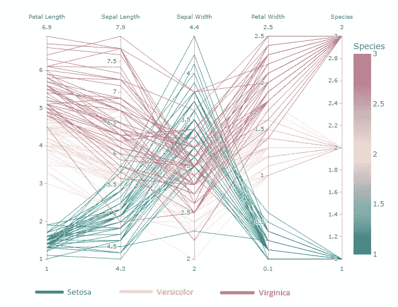
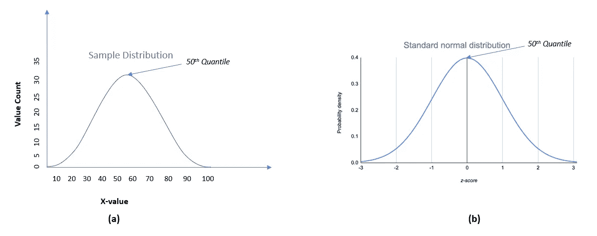
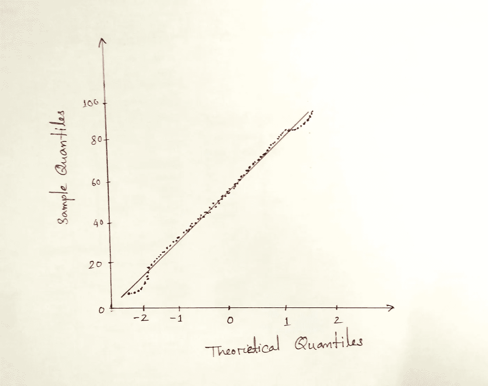
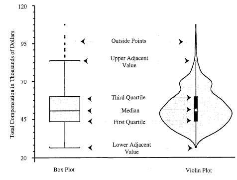
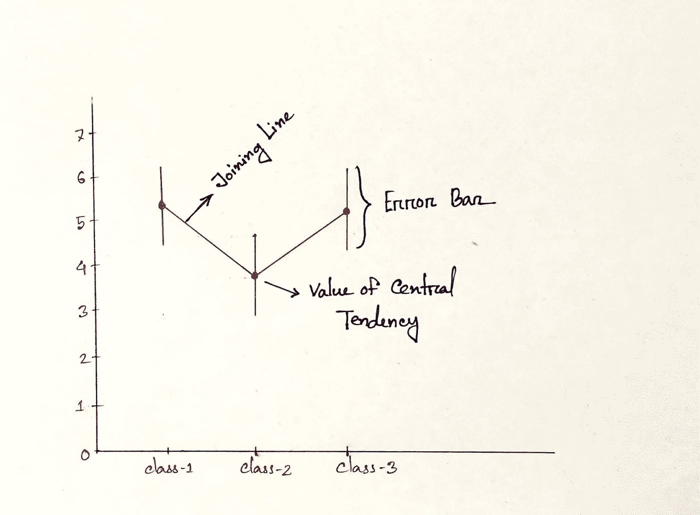
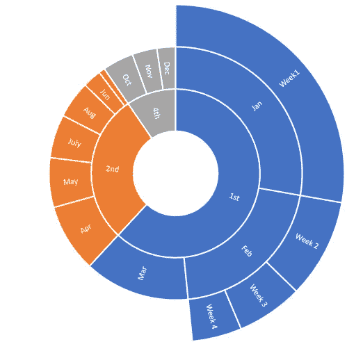
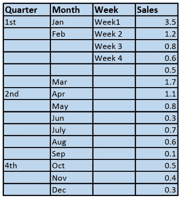

# 11 数据科学的美学数据可视化(第三部分)

> 原文：<https://towardsdatascience.com/11-less-used-but-important-plots-for-data-science-dede3f9b7ebd>

## 一些独特的数据可视化技术，用于深入了解数据

作者图片

## **动机**

数据就是美。当我们想象它的时候，它的美就出现了。可视化是快速了解大量数据的一种更方便的方式。在深入分析的情况下，我们应该有数据的图形表示技术的想法。我们经常使用`bar charts, histograms, pie charts, boxplots, heatmaps, scatter plots, line plots, etc.`这些典型的图对于数据可视化是必不可少的。除了这些被广泛使用的情节，还有许多高超的情节却很少被使用。当我们想到分析数据和艺术地表现数据时，这些图有助于完成工作。

`*[Complete data visualization guideline is available here..]*`

<https://medium.datadriveninvestor.com/ultimate-guide-to-data-visualization-for-data-science-90b0b13e72ab>  

## 目录

1.  `[**Parallel Coordinate Plot**](#1531)`
2.  `[**Hexagonal Binning**](#168a)`
3.  `[**Contour Plot**](#b18d)`
4.  `[**QQ-plot**](#cfea)`
5.  `[**Violin plot**](#57d0)`
6.  `[**Boxenplot**](#1f20)`
7.  `[**Swarm plot**](#5150)`
8.  `[**Point Plot**](#a7a2)`
9.  `[**Word Cloud**](#e209)`
10.  `[**Sunburst Chart**](#dee3)`

## 平行坐标图

实际上，我们可以可视化多达 3 维的数据。但有时，我们需要可视化更多的三维数据来获得洞察力。我们经常使用主成分分析或 t-SNE 来降低维度并绘制它。在降维的情况下，大量的信息可能会丢失。在某些情况下，我们需要考虑所有的特性。平行坐标图有助于做到这一点。但是怎么会！让我们看看..

虹膜数据集的平行坐标图(图片由作者提供)

看上图。横线(平行轴)代表鸢尾花的特征 *(* `*Petal length, Sepal length, Sepal width, Petal width*` *)* 。类别有`*Setosa, Versicolor and Virginica*` *。*上图将物种编码为 ***Setosa →1，Versicolor →2，Virginica →3。*** 每条平行轴包含最小值到最大值*(如花瓣长度从 1 到 6.9，萼片长度从 4.3 到 7.9 等。)*。例如，考虑花瓣长度轴。说明`**Setosa**` 品种的花瓣长度比其他两个品种小，`**Virginica**` 品种的花瓣长度最大。

所以，有了这个图，我们可以很容易地得到数据集的整体信息。数据集看起来像什么？让我们看看。

`*[N.B. — I have used the* [***iris***](https://www.kaggle.com/datasets/uciml/iris) *dataset which is a public domain dataset under “*[*CC0: Public Domain*](https://creativecommons.org/publicdomain/zero/1.0/)*” license.*]`

*让我们用* `***Plotly Express***` *库[1]将数据可视化。* `**Plotly**` 库提供了一个交互式绘图工具。

我们也可以使用其他类似`[**pandas**](https://pandas.pydata.org/docs/reference/api/pandas.plotting.parallel_coordinates.html)**,** [**scikit-learn**](https://learn-scikit.oneoffcoder.com/plot-parallel-coordinates.html), [**and matplotlib**](https://www.geeksforgeeks.org/parallel-coordinates-in-matplotlib)` <https://www.geeksforgeeks.org/parallel-coordinates-in-matplotlib>的库来绘制平行坐标。

## 六角宁滨

六边形宁滨是用**六边形**直观表示`**density of 2D numerical**`个数据点的过程。

我已经考虑了上一节的数据集来绘制上面的六边形宁滨。`[**Pandas**](https://pandas.pydata.org/docs/reference/api/pandas.DataFrame.plot.hexbin.html)`库允许我们绘制六边形宁滨[2]。我已经展示了寻找`sepal_width` 和`sepal_length` 列的密度的图。 `**(df is a pandas DataFrame)**`

如果我们仔细观察这个图，我们会发现总面积被分成无数个六边形。每个六边形覆盖一个特定的区域。我们注意到六边形有颜色变化。一些六边形没有颜色，一些是浅绿色的，一些是深的。根据图右侧显示的色标，颜色密度随密度而变化。刻度表示有颜色变化的数据点的数量。六边形没有填充颜色，这意味着该区域没有数据点。

其他像`[**matplotlib**](https://matplotlib.org/stable/api/_as_gen/matplotlib.pyplot.hexbin.html) **,** [**seaborn**](https://seaborn.pydata.org/examples/hexbin_marginals.html)**,** [**bokeh**](https://www.geeksforgeeks.org/python-bokeh-plotting-hexagon-bins-on-a-graph/)(interactive plot)`这样的库也可以用来出图。

## 等值线图表

2D 等值线密度图是显示特定区域中数据点密度的另一种方式。这样做是为了找出两个数值变量的密度。例如，下图显示了每个阴影区域中有多少个数据点。

为了生成上面的图形，我使用了 [**plotly**](https://plotly.com/python/2d-histogram-contour/) 库，因为它有助于绘制交互式图形。相同的`**iris**` 数据集已用于绘制图表，以显示两个变量`sepal_width`和`sepal_length`的密度。

其他的库，像 [**seaborn**](https://seaborn.pydata.org/generated/seaborn.kdeplot.html) ， **matplotlib，**等等。，也可以使用。

## QQ 图

QQ 情节是另一个有趣的情节。QQ 代表分位数——分位数图*(分位数/百分位数是一个范围，在该范围内，指定百分比的数据下降。例如，第 10 个分位数/百分位数意味着在该范围之下找到 10%的数据，而在该范围之上找到 90%)。*直观检查**数值变量是否正态分布**的一种方式。让我解释一下它是如何工作的。

(a)样本分布(b)标准正态分布(图片由作者提供)

图*是一个样本分布；另一方面*、*、**、*、*、**是标准的正态分布。对于样本分布，数据范围从`**10 to 100**` *(10 到 100 之间的 100%数据)*。但是对于标准的正态分布，100%的数据保持在范围`**-3 to 3 (z-score)**` **之间。**在 QQ 图中，两个 x 轴值都被分成 100 等份(称为分位数)。如果我们将这两个值绘制在 x 轴和 y 轴上，我们将得到一个散点图。*

**

*QQ-Plot(图片由作者提供)*

*散点图位于对角直线上。这意味着样本分布是正态分布。然而，如果散点图位于左边或右边，而不是对角线，这意味着样本不是正态分布。*

**导入必要的库**

**生成正态分布数据。**

**绘制数据点的分布。**

*图表显示数据呈正态分布。所以我们用数据点做 QQ-plot，检查一下是否正态分布。*

*该图显示散点图点位于对角线上。所以，是正态分布的。*

## *小提琴情节*

*小提琴的情节与盒子的情节有关联。我们从小提琴图中得到的另一个信息是密度分布。简单地说，它是一个结合了密度分布的箱线图。所以我们用箱型图来对比一下。*

*在小提琴图中，小提琴中间的一个白点表示中点。实心框表示**四分位数范围(IQR)。**上下相邻值是异常值的围栏。超出范围，一切都是离群值。下图显示了这种比较。*

**

*盒子情节和小提琴情节的共同成分。所有学术级别的总薪酬[3]。*

*让我们看看`**iris**`数据集的`sepal width`的小提琴图。*

*我们还可以通过传递`species` 列名来绘制不同物种的小提琴图。*

*你也可以使用其他库，比如 [plotly](https://plotly.com/python/violin/) 、 [matplotlib](https://matplotlib.org/stable/api/_as_gen/matplotlib.axes.Axes.violinplot.html) 等等。，来图谋小提琴的阴谋。*

## *博兴图*

*Boxenplot 是由 seaborn 库 [**引入的一种新型盒图。对于方框图，方框创建在**四分位数**上。但是在`Boxenplot`中，数据被分成更多的分位数。它提供了对数据的更多洞察。**](https://seaborn.pydata.org/generated/seaborn.boxenplot.html)*

*`**iris**` 数据集的箱线图显示了`**sepal_width**`的数据分布。*

*上图显示的方框比箱形图多。这是因为每个方框代表一个特定的分位数。*

*不同`species`的`sepal_width` 的箱线图。*

## *点图*

*请看下图。有一些被称为误差线的垂直线和一些连接这些垂直线的其他线。让我解释一下它的确切含义。*

**

*点图(图片由作者提供)*

*****点状图*** 是用上图所示的点的位置来表示一个数值变量的*中心趋势*的一种方式，误差条表示变量的不确定性(置信区间【4】。绘制线图是为了比较不同分类值的数值变量的可变性[4]。**

**让我们来看一个实际的例子**

**为了绘制图表，我使用了 seaborn 库和`**iris**` 数据集*(在平行坐标部分提到过)。***

**该图显示了不同种类的**鸢尾**花的萼片宽度的变化。我们还可以绘制多个点图，如文章[4]所示。**

## **群体图**

**虫群剧情是另一个受`‘‘*beeswarm*’’`启发的有趣剧情。有了这个图，我们可以很容易地得到不同的分类值是如何沿着数轴分布的概念[5]。此外，它绘制的数据不会与数据点重叠。但是对于大型数据集来说，效果并不好。**

***Python 实现的蜂群剧情为* ***iris*** *数据集。***

**你会在这里 找到蜂群剧情 [*的不同实现。*](https://seaborn.pydata.org/generated/seaborn.swarmplot.html)**

## **词云**

**单词云情节背后的想法很简单但是很有趣也很有用。假设我们有一大块文本文档。单词很多，有的很频繁，有的很少见。*在词云图中，所有的词都被绘制在一个特定的区域中，频繁出现的词被突出显示(以较大的字体显示)。*有了这个词云，我们可以轻松找到重要的客户反馈、趋势政治议程话题等。，一目了然[6]。**

*****实现字云剧情—*****

**`*[N.B. — I have used* [*Top Games on Google Play Store*](https://www.kaggle.com/datasets/dhruvildave/top-play-store-games) *dataset for creating the cloud. The dataset is open for public use under “*[*Database: Open Database*](http://opendatacommons.org/licenses/odbl/1.0/)*” license.]*`**

**我想在 google play 商店找到游戏的热门类别。这就是为什么我检查了每个类别的频率。**

**我们来画一下。**

**该图显示了所有类别，突出显示了具有最大频率的类别。我们也可以用这个图从文本中找到常用的单词。(文章[6]帮我实现剧情。)**

## **旭日图**

**这是一个定制版的甜甜圈图或饼图，将一些额外的层次信息整合到图中[7]。**

****

**旭日图(图片由作者提供)**

**整个图表分为几个环(内侧到外侧)。它保存了层级信息，其中内环在层级的顶部，外环在较低的顺序[7]。**

****

**上述旭日图的数据(图片由作者提供)**

**如果我们仔细观察数据集，第一列包含一年的季度；每个季度下面都有几个月，每个月都有几周。这个场景用上面的 sunburst 聊天描述。没有层次值的旭日图与饼图或圆环图一样。**

**Python 的`***Plotly***` 库提供了一个简单、美观、交互式的工具来绘制旭日图。**

***旭日图的实现【8】—***

***数据集的样子…***

**`*[N.B. — The tips dataset is* ***plotly’s*** *built in dataset under MIT open source license.]*`**

***绘制数据集的旭日图。***

**sunburst 类的`**path**` 属性提到了层次结构，其中`sex` 位于层次结构的顶部，然后是`day` 和`time`。**

## **结论**

**数据可视化是数据科学不可或缺的一部分。在数据科学中，我们玩数据。手动分析少量数据是可以的，但当我们处理成千上万的数据时，这就变得非常麻烦，有时甚至是不可能的。如果我们找不到数据集的趋势和见解，我们可能无法处理这些数据。希望上面的图可以帮助你更好地形象化数据，并深入了解数据。**

**`***Full notebook is available here***`**

 **** 

## **`Reference`**

1.  **`[https://plotly.com/python/parallel-coordinates-plot/](https://plotly.com/python/parallel-coordinates-plot/)`**
2.  **`[https://pandas.pydata.org/docs/reference/api/pandas.DataFrame.plot.hexbin.html](https://pandas.pydata.org/docs/reference/api/pandas.DataFrame.plot.hexbin.html)`**
3.  **`Hintze, V. P. A Box Plot-Density Trace Synergism. *Am. Stat*, (52), 181 (Open Access Journal).`**
4.  **`[seaborn.pointplot — seaborn 0.12.1 documentation (pydata.org)](https://seaborn.pydata.org/generated/seaborn.pointplot.html)`**
5.  **`[seaborn.swarmplot — seaborn 0.12.1 documentation (pydata.org)](https://seaborn.pydata.org/generated/seaborn.swarmplot.html)`**
6.  **`[Word Cloud in Python | How to Build Word Cloud in Python? (analyticsvidhya.com)](https://www.analyticsvidhya.com/blog/2021/05/how-to-build-word-cloud-in-python/)`**
7.  **`[Create a sunburst chart in Office — Microsoft Support](https://support.microsoft.com/en-us/office/create-a-sunburst-chart-in-office-4a127977-62cd-4c11-b8c7-65b84a358e0c#:~:text=The%20sunburst%20chart%20is%20ideal,similar%20to%20a%20doughnut%20chart.)`**
8.  **`[Sunburst charts in Python (plotly.com)](https://plotly.com/python/sunburst-charts/)`**

****完成数据可视化指南****

**<https://medium.datadriveninvestor.com/ultimate-guide-to-data-visualization-for-data-science-90b0b13e72ab>  

*你也可以朗读美学数据可视化的文章。*

</spread-of-covid-19-with-interactive-data-visualization-521ac471226e>  

*面向数据科学初学者的完整统计指南*

</ultimate-guide-to-statistics-for-data-science-a3d8f1fd69a7> **