# 12 个基本的可视化以及如何实现它们——第 1 部分

> 原文：<https://towardsdatascience.com/12-essential-visualizations-and-how-to-implement-them-part-1-41e40400a740>

## 我们看看如何用 Python、Matplotlib 和 Streamlit 创建 12 个最有用的图形和图表


马体·米罗什尼琴科的照片

> *“当我回顾过去一年为研讨会和咨询项目创作的 150 多幅视觉作品时，我只使用了十几种不同类型的视觉作品”，* Cole Nussbaumer Knaflic 用数据讲述故事

许多人都读过科尔·努斯鲍默·克纳弗里克(Cole Nussbaumer Knaflic)的书《用数据讲述 T4》，根据这本书的前言，克纳弗里克“在这个星球上一些最受数据驱动的组织工作过”，在谷歌教授数据可视化已经有几年了，现在她已经创建了自己的教学公司。

这本书致力于描述如何使用图表和图形进行有效的交流，并提供了大量关于用图形进行交流的许多方面的信息。

但是你在书中学到的第一件事是，作者只依赖 12 种不同类型的可视化。这本书描述了这些视觉效果和它们的用途，但没有深入到实现中，所以这就是我们在这里要做的。

本文的目的是开始描述 12 种视觉效果，并展示如何用 Python 实现它们。本文中使用的所有代码和数据都可以从我的 Github 页面下载。(可下载的代码还可能包含本文中没有包含的其他示例。)

本文将着眼于前 6 种视觉效果:简单的文本、表格、热图、散点图、线图和坡度图。

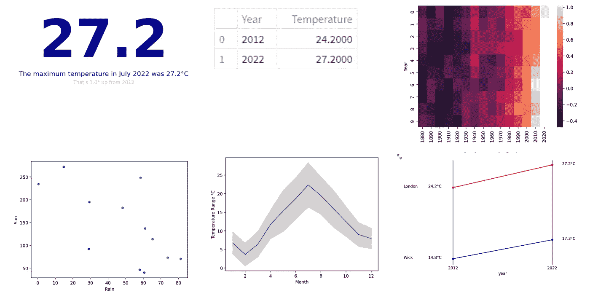

六种视觉效果——作者图片

我将在后续文章中处理剩余的图表。这些将是，垂直和水平条形图，垂直和水平堆积条形图，瀑布图和方形面积图。

# 1.简单文本

正如科尔·努斯鲍默·克纳弗里克(CNK，从现在开始)告诉我们的，有时候，图形并不是必要的，甚至不是交流数据的最佳选择。当只呈现几个值时，简单的文本就可以了，甚至可能比图表更好。我们举个例子。

英国伦敦的天气在夏天似乎越来越热。2022 年 7 月最高气温 27.2 摄氏度，对英国来说相当炎热。2012 年是 24.2 度。

我们将设计一个视觉传达这种仅由文本组成的增加，我们将看到许多不同的设计效果如何。

首先，让我们设置一些代表伦敦这两年最高气温的变量和一些标题。然后我们会用不同的格式展示它们。

```
# Set up variables
years = ['2012','2022']
temps = [24.2,27.2]
caption = f"The maximum temperature in July 2022 was {temps[1]}°C"
caption2 =  f"That's {temps[1]-temps[0]}° up from 2012"
```

现在，看看下面的条形图——它显示了使用我们刚刚设置的日期从 2012 年到 2022 年的温度变化。但是，虽然很明显温度上升了几度，但你不能确切地看到多少或确切地说这些温度是多少。

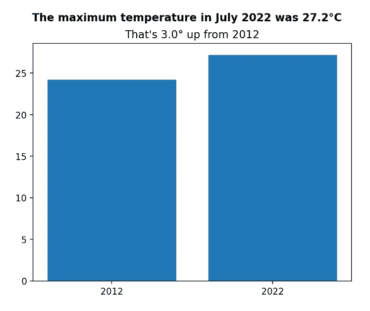

*作者图片*

条形图并不适合呈现这类数据，因此，让我们看看一些纯文本的视觉效果如何让我们更好地了解正在发生的事情。

Streamlit 为我们提供了一种很有吸引力的方法来显示两个值以及它们之间的变化。这为我们提供了一种显示相同数据的吸引人且有效的方式，并且编码非常简单，如下所示:

```
col3.metric("Temperature", temps[1],temps[0])
```

如果我们将它与一些说明性的文字结合起来，并使用一个列布局，我们可以实现一个直观的形象，告诉我们到底发生了什么，而不需要任何形式的图表。

```
col3, col4 = st.columns([1,4])
col3.metric("Temperature", temps[1],temps[0])
col4.markdown(f"#### {caption}")
col4.markdown(caption2)
```

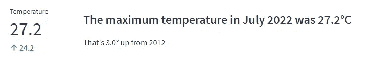

*作者图片*

这种视觉效果提供了与条形图相同的数据，但实际上比图表传达得更好。

使用 markdown，您可以获得类似的结果，如下所示:

```
col1, col2 = st.columns([1,4])
col1.markdown(f"# {temps[1]}")
col2.markdown(f"#### {caption}")
col2.markdown(caption2)
```

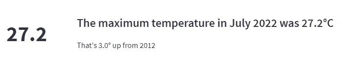

*作者图片*

这两种方法是 Streamlit 特有的。另一种更通用的 Python 方法是在 Matplotlib 图表中定位文本。下面的代码就是这样做的。

您可以看到，我们创建了一个 Mathplotlib 图表，但其中没有绘制任何图形——我们只是将文本放置在正确的位置，并关闭轴、刻度等。用语句`ax2.axis('off')`。

```
fig2, ax2 = plt.subplots(figsize=(5,1))
ax2.text(0, 0.9, temps[1],
        verticalalignment='top', horizontalalignment='left',
        color='red', fontsize=18, fontweight = 'bold')
ax2.text(0.2, 0.9, caption,
        verticalalignment='top', horizontalalignment='left',
        color='Black', fontsize=10)
ax2.text(0.2, 0.55, caption2,
        verticalalignment='top', horizontalalignment='left',
        color='darkgrey', fontsize=6)
ax2.axis('off')
st.pyplot(fig2)
```

这给了我们下图。

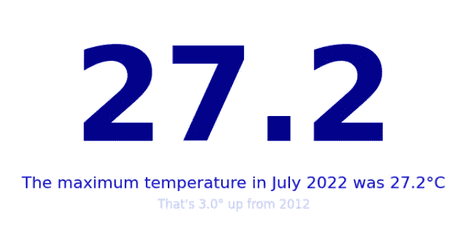

*作者图片*

这比其他两种方法更大胆和引人注目，但是，当然，如果我们愿意，我们可以通过改变字体大小、颜色和文本的位置来制作一个更微妙的小图形。

# 2.桌子

CNK 告诉我们，表格是向不同的受众显示数据的合适的视觉工具，每个受众可能对特定的行感兴趣。她还建议，我们应该让数据成为关注的中心，所以不应该让表格边框太重，而应该使用浅色边框或空白来分隔数据项。

Streamlit 为我们提供了两种显示表格的方法，`st.table()`和`st.dataframe()`。

使用与上一个示例相同的数据，下面是将数据显示为表格的代码。

```
import streamlit as st
import pandas as pd

temps = pd.DataFrame()
temps['Year'] = ('2012', '2022')
temps['Temperature'] = (24.2,27.2)

st.subheader("st.table")
st.table(temps)
```

看起来像这样:


*作者图片*

如果你喜欢的表格太宽了，那么把它放在一个栏里，然后把这个栏调整到你想要的宽度就很简单了。

数据帧非常相似:

```
st.dataframe(temps)
```

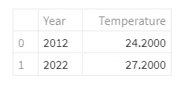

*作者图片*

单击数据框的列标题将按该列对数据框进行排序。

同样，这些是特定于 Streamlit 的方法。用 Mathplotlib 显示一个表格是可能的，但是它实际上是被设计成一个图表的附加物。我在 Matplotlib 中尝试了各种形式的表格，但对结果都不太满意。因此，我不确定这是否为独立的 Python 程序提供了合适的解决方案。

但是，如果您没有使用 Streamlit，那么作为一名数据科学家，您可能会使用 Jupyter 笔记本，它们可以非常简洁地呈现数据帧，例如，您只需在 Jupyter 单元格中写下数据帧的名称:

```
import pandas as pd

temps = pd.DataFrame()
temps['Year'] = ('2012', '2022')
temps['Temperature'] = (24.2,27.2)
temps
```

它是这样呈现的:

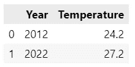

*作者图片*

# 3.热图

热图是一种使用颜色而不是数字来突出表格中数值差异的图形。

我们将看看热图的一个非常合适的用途——我们想要显示热量的增加！嗯，温度，真的。

下图显示了过去 150 年左右的相对全球温度，摘自我的文章[专题图:全球变暖热图](/topical-plots-global-warming-6b5fb80a0371)。(我在这里使用的数据包含在可下载的代码中，可以免费使用——参见注释 2)。

热图是展示过去几十年全球变暖趋势的绝佳工具。随着时间的推移，你可以很容易地看到颜色变浅，这意味着气温上升。(当然，这些数据不是绝对温度，而是相对于 1961 年至 1990 年期间的温度。)

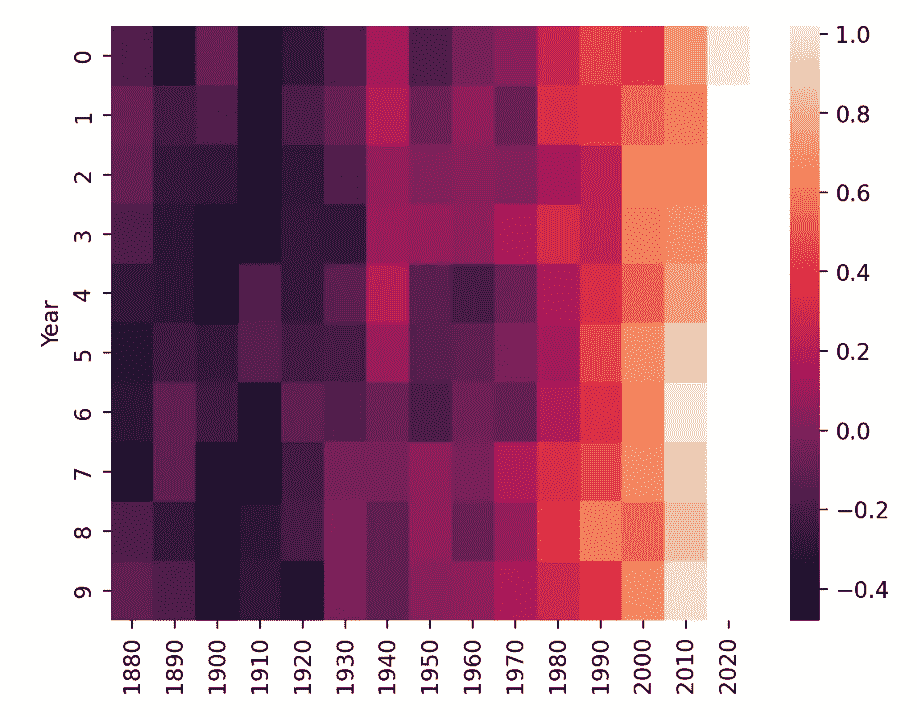

*作者图片*

创建热图最简单的方法之一是使用 Seaborn 库。从下面的代码中可以看到，Seaborn 只是将 Pandas 数据帧作为参数，并将相应的地图显示为 matplotlib 图表。

```
import streamlit as st
import pandas as pd
import matplotlib.pyplot as plt

url='data/bydecade.csv'
gwdec = pd.read_csv(url)
gwdec=gwdec.set_index('Year')
st.table(gwdec)

import seaborn as sns
fig, ax = plt.subplots()
sns.heatmap(gwdec)
st.pyplot(fig)
```

您可以使用 matplotlib 中的`imshow()`函数来实现类似的图表(参见可下载代码中的示例)。

# 4.散点图

散点图用于显示两个变量之间的关系。下面的例子使用了一个数据文件，该文件记录了 2018 年伦敦每个月的天气数据(见注 4)。它绘制了以毫米为单位的降雨量与日照时数的关系。

当然，当下雨的时候，太阳通常是不发光的，所以当下雨的时候，你会看到更少的日照时间。散点图清楚地显示了这种关系。


*作者图片*

下面的代码使用 Matplotlib 散点图来创建图表。

```
import streamlit as st
import pandas as pd
import matplotlib.pyplot as plt

weather =  pd.read_csv('data/london2018.csv')
fig, ax = plt.subplots()
weather.plot.scatter(x='Rain', y='Sun', ax=ax)
st.pyplot(fig)
```

# 5.线条

折线图用于连续数据，通常也用于时间序列数据。

使用与上面相同的天气数据，我们将看三个不同的线图。

首先，我们将绘制一年中的平均温度，然后我们将看看如何通过绘制平均、最高和最低温度将多幅图放在同一个图中。最后，在第三个图表中，我们将看到如何通过绘制平均温度并在周围加上阴影来显示该平均值周围的最大值和最小值范围，从而显示一系列值，您可以使用相同的技术来显示置信水平。

首先，我们读取数据。它包含各种温度、日照时间和降雨量的每月读数。

```
weather =  pd.read_csv('data/london2018.csv')
weather['Tmean'] = (weather['Tmax'] + weather['Tmin'])/2
```

看起来是这样的:

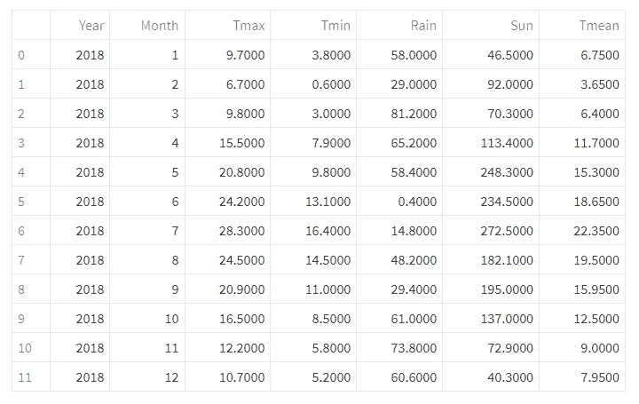

*作者图片*

它最初没有 *mean* 列——我们在上面的第二行代码中创建了它。

现在，简单的线图。

```
fig, ax = plt.subplots()
ax = weather.plot.line(x='Month', y = 'Tmean', ax=ax)
st.pyplot(fig)
```

使用 Pandas 和 Matplotlib 绘制的非常简单的平均温度线图。

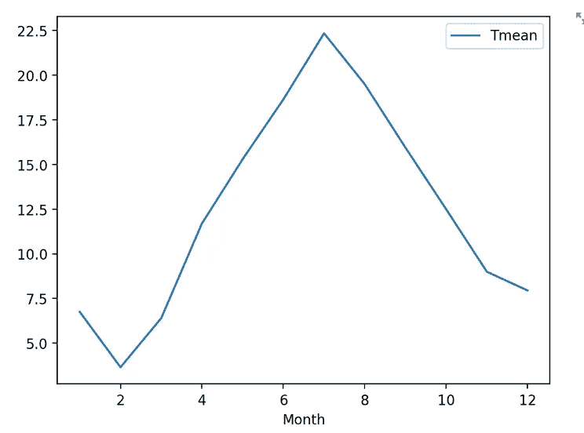

*作者图片*

在同一个图中创建多个图只是为这些图创建新的轴。

```
ax = weather.plot.line(x='Month', y = 'Tmax', color = 'lightgrey', ax=ax)
ax = weather.plot.line(x='Month', y = 'Tmin',  color = 'lightgrey', ax=ax)
st.pyplot(fig)
```

上面的代码为最低和最高温度增加了两个轴——我将这两个轴与*平均值*图进行了不同的着色——然后重新绘制了该图。

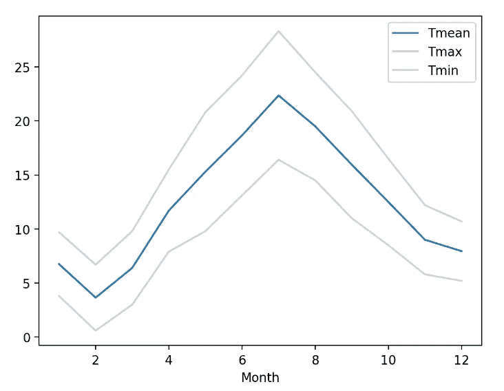

*作者图片*

你可以看到，这给了我们一个范围，但我们可以使它在视觉上更具吸引力，更好地传达一个范围的想法，通过阴影的最大和最小线之间的区域。

我们使用 Matplotlib 函数`fill_between()`如下所示:

```
plt.fill_between(weather['Month'], 
                 weather['Tmax'],
                 weather['Tmin'], color='lightgrey', alpha=0.5)
ax.get_legend().set_visible(False)
ax.set_ylabel('Temperature Range °C')
```

填充颜色设置为`lightgrey`,因此它混合了上下图。我还隐藏了图例，并给 y 轴加了一个标签，以显示我们试图表示的内容。

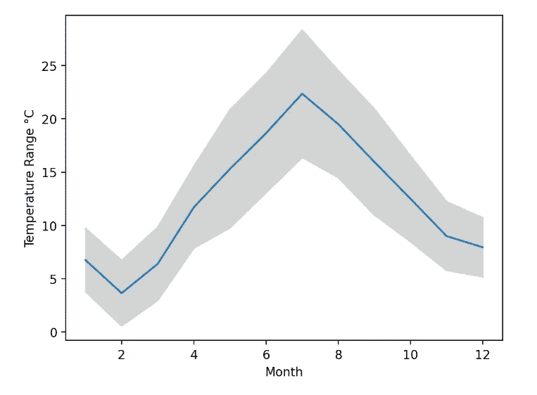

*作者图片*

正如你所看到的，这也是一个非常合适的信心水平表示。例如，您可以使用原始图的固定百分比来创建上图和下图。因此，举例来说，上面的图线可以取中间值加 5%的值，下面的图线取中间值减 5%的值。

# 6.斯洛佩格拉夫

斜率图只是一个符合特定样式的线图，但只比较两组值。

根据 CNK 的说法，“当你有两个时间段或比较点，并想快速显示相对增加和减少时，斜率图会很有用”。

不幸的是，slopegraph 在标准的可视化库中并不常见。你可以简单地用线图来代替，它应该传达同样的意思。我们将这样做，但也通过结合线图和散点图并添加适当定位的文本来创建一个更典型的斜率图。

继续我们的天气主题，我将创建两个图表来显示我们在上面的文字图中看到的温度变化，但这次我们将伦敦与苏格兰的威克进行比较:


*作者图片*

这个数据代表了两个城市在不同年份的最高温度。在下面的代码中，我们在同一个图中绘制了两个图。第一个是数据的简单线图，然后我们叠加一个只有四个点的散点图，以给出斜率图线末端的原型斑点。

```
import streamlit as st
import pandas as pd
import matplotlib.pyplot as plt

st.header("Slope graph")
st.subheader("Here is the data")

df = pd.DataFrame()
df['year']=[2012,2022]
df['London']=(24.2,27.2)
df['Wick']=(14.8,17.3)
st.table(df)

st.subheader("A Slopegraph as a line graph")
fig, ax = plt.subplots()
ax = df.plot(x='year', color = ('red', 'blue'), ax=ax)
ax = df.plot.scatter(x='year',y='London', color= 'red', ax=ax)
df.plot.scatter(x='year',y='Wick', color = 'blue', ax=ax)
plt.xlim(2010,2024)
plt.xticks(df['year'])
ax.set_ylabel('')
st.pyplot(fig)
```

我在这里做的是绘制线条，然后使用散点图在线的末端叠加斑点。我还设置了记号，只显示我们感兴趣的两年，并调整了 x 轴的限制，在图的两边留出一些间距。这些调整中的每一项都使线形图更像斜率图。

它看起来还不错，但不是斜率表的典型形式，当然也不是 CNK 书中描述的那种形式。

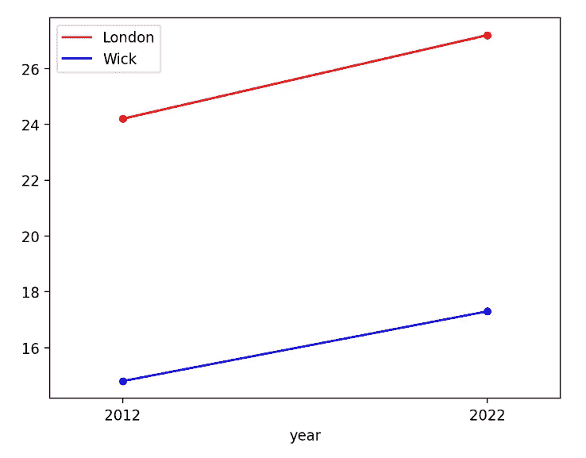

*作者图片*

为了制作一个更传统的 CNK 风格的斜坡图，我们需要用 Matplotlib 做一些操作。

这是 CNK 在书中的渲染类型:

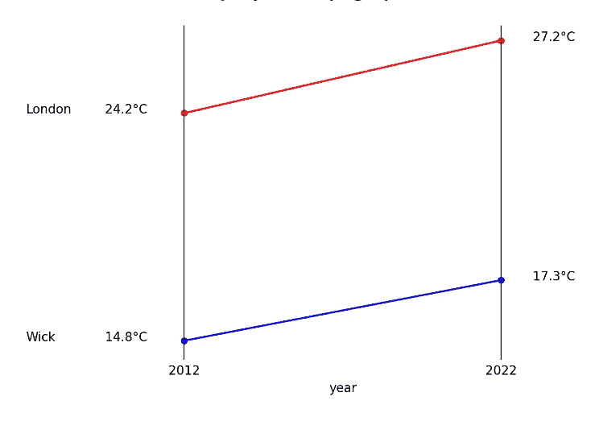

*作者图片*

它不同于传统的折线图，因为 y 值和图例文本被写在线的末端，而传统的轴被移除。

运行这段代码将会显示上面的图表。

```
ax.text(df.year[0] -5, df.London[0], df.columns[1])
ax.text(df.year[0] -2.5,df.London[0], f'{df.London[0]}°C')
ax.text(df.year[1] +1, df.London[1],f'{df.London[1]}°C')
ax.text(df.year[0] -5, df.Wick[0], df.columns[2])
ax.text(df.year[0] -2.5, df.Wick[0],f'{df.Wick[0]}°C')
ax.text(df.year[1] +1, df.Wick[1],f'{df.Wick[1]}°C')

ax.spines['right'].set_visible(False)
ax.spines['left'].set_visible(False)
ax.spines['bottom'].set_visible(False)
ax.spines['top'].set_visible(False)

ax.xaxis.grid(visible=True, color = 'black')
ax.get_yaxis().set_visible(False)

ax.get_legend().set_visible(False)

st.pyplot(fig)
```

前六行将文本和值添加到行尾，接下来我们移除样条线(图表的框架),然后我们添加 x 轴网格，这为我们提供了垂直线。最后，我们隐藏了这个传说。

对于一个没什么不同的结果来说，这是不是太多的努力了？我会让你决定。

这是 CNK 书中的前 6 个视觉效果，以及它们是如何实现的——我希望你会觉得有用。

你可以阅读第二部分，解决接下来的 6 个视觉效果。这里:

[](/12-essential-visualizations-and-how-to-implement-them-part-2-e47c1d4b9784) [## 12 个基本的可视化以及如何实现它们，第 2 部分

### 我们看看如何用 Python 和 Streamlit 创建 12 个最有用的图形和图表

towardsdatascience.com](/12-essential-visualizations-and-how-to-implement-them-part-2-e47c1d4b9784) 

您可以从我的 Github 资源库下载所有代码和数据文件。在我的[网页](http://alanjones2.github.io)上找到它的链接，以及其他文章的信息。

如果你想了解我发表的其他文章，你可以在 Medium 上关注我，或者在 [Substack](http://technofile.substack.com) 上订阅我的时事通讯。

[](https://medium.com/membership/@alan-jones) [## 通过我的推荐链接-阿兰·琼斯加入媒体

### 阅读阿兰·琼斯的每一个故事(以及媒体上成千上万的其他作家)。你的会员费直接支持艾伦…

medium.com](https://medium.com/membership/@alan-jones) 

# 笔记

1.  [*《用数据讲故事》，商业人士数据可视化指南*](https://amzn.to/3dJlMaS) ，科尔·努斯鲍默·克纳弗利奇，威利，2015 年(附属链接*)
2.  全球温度数据包含在可下载的代码中，并来自 HadCRUT 数据集，该数据集跟踪自 19 世纪后期以来的温度变化。你可以从英国气象局哈德利中心下载它的版本，[根据](https://www.metoffice.gov.uk/hadobs/hadcrut5/data/current/download.html)[开放政府许可 v3](http://www.nationalarchives.gov.uk/doc/open-government-licence/version/3/) 免费下载页面(也见下面的注释 3)。
3.  [*使用观测估计集合量化全球和区域温度变化的不确定性:HadCRUT4 数据集*](https://www.metoffice.gov.uk/hadobs/hadcrut4/HadCRUT4_accepted.pdf) ，Colin P. Morice，John J. Kennedy，Nick A. Rayner 和 Phil D. Jones
4.  天气数据来源于英国气象局的文本数据，在这里[找到](https://www.metoffice.gov.uk/research/climate/maps-and-data/historic-station-data)。该数据根据[开放政府许可 v3](http://www.nationalarchives.gov.uk/doc/open-government-licence/version/3/) 发布，并可在相同条件下使用。

*   *如果你通过代销商链接购物，我可能会得到佣金。不会影响你付出的代价。*