# 12 个基本的可视化以及如何实现它们，第 2 部分

> 原文：<https://towardsdatascience.com/12-essential-visualizations-and-how-to-implement-them-part-2-e47c1d4b9784>

## 我们看看如何用 Python 和 Streamlit 创建 12 个最有用的图形和图表


照片由 [Olya Kobruseva](https://www.pexels.com/photo/silver-iphone-6-on-clipboard-with-statistical-data-5561923/) 拍摄

> *“当我回顾过去一年为研讨会和咨询项目创作的 150 多幅视觉作品时，我只使用了十几种不同类型的视觉作品”，* Cole Nussbaumer Knaflic 用数据讲述故事

在《T4》第一部中，我们看了科尔·努斯鲍默·克纳弗里克(CNK)在她的书*用数据讲故事*中确定的 12 种视觉效果中的前 6 种(见注释 1)。在本文中，我们将处理第二个 6 的实现。这些是各种各样的条形图，瀑布图和方形面积图。

所有的实现都使用 Pandas plots 和/或 Mathplotlib，并且是为 Streamlit 编写的，尽管也有一个 Jupyter 笔记本的版本。本文中使用的所有代码(Streamlit 和 Jupyter)和数据都可以从我的 Github 页面下载。可下载的代码可能包括下面没有包括的附加示例。

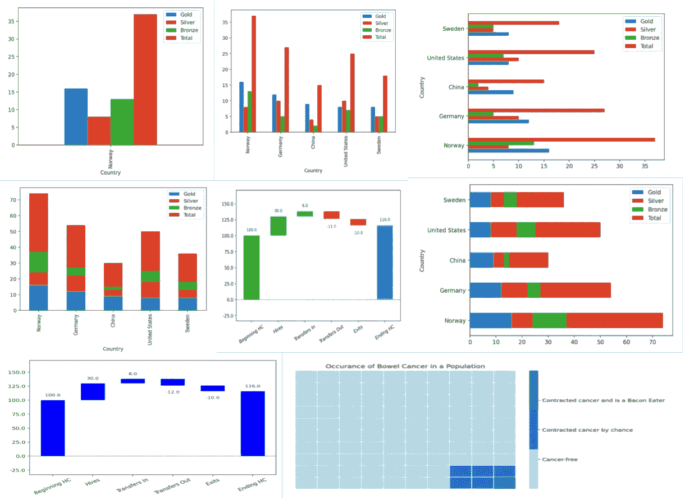

*第二组 6 个视觉效果的变化——作者图片*

# 条形图

CNK 认为，条形图通常被避免使用，因为它们很常见。但这正是它们有用的地方！人们习惯于看到它们，所以它们很容易理解。这意味着你的观众花更少的脑力解释你的图形，更多的精力理解数据。

因此，我们不应该回避条形图，而应该把它作为一种简单的方法，以一种容易理解的方式表达数据的含义。

条形图还具有易于创建的优点，因为它们包含在大多数可视化库中。

CNK 将条形图分为 4 类，垂直、水平、垂直堆叠和水平堆叠，我们将依次来看。

## 零基线问题

但是首先要说一下基线。CNK 坚持认为，所有的条形图都应该有一个零基线，否则它们就有被误导的风险，或者更严重的是，被操纵的风险。

这方面的一个例子是，CNK 让我们注意到了福克斯新闻频道在巴拉克·欧巴马总统任期内发表的一份条形图。他们在考虑如果奥巴马的前任乔治·w·布什的税收改革被允许终止会发生什么。

现实情况是最高税率将从 35%提高到 39.6%——绝对增长 4.6%，相对增长约 13%。

图表看起来像这样:

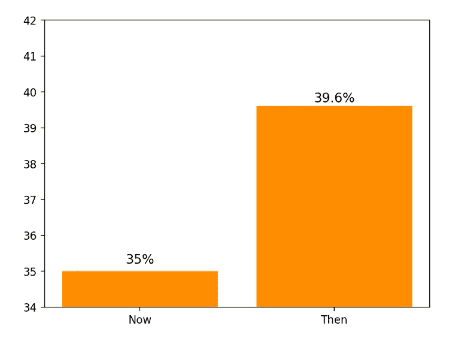

具有非零基线的误导性图表设计—图片由作者提供

基线从 34%开始，因此增长看起来非常巨大。这是因为右边一栏的大小几乎是左边一栏的 5 倍。当然，这并没有恰当地反映实际的增加。

一个类似但基线为零的图表告诉我们真实的情况:

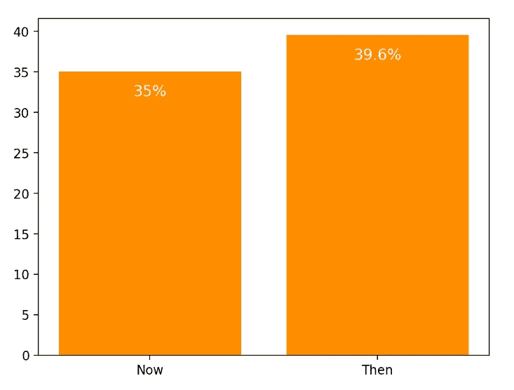

更好的零基线图表设计—作者图片

由此得出的结论是，条形图的基线通常应该为零，如果不是一直为零的话。

## 数据

在我们开始绘图之前，我们需要获得一些数据。我们将使用 2022 年冬季奥运会的奖牌榜作为我们将要查看的各种条形图的数据。这是我们需要的初步代码。这些数据是公开的，我是从[维基百科](https://en.wikipedia.org/wiki/2022_Winter_Olympics_medal_table)的表格中复制的(见注释 2)。

```
import streamlit as st
import pandas as pd
import matplotlib.pyplot as pltmedals =  pd.read_csv('data/2022WinterOlympics.csv')
```

该数据记录了前 5 名国家获得的金牌、银牌和铜牌的数量以及奖牌总数。这是它的样子。

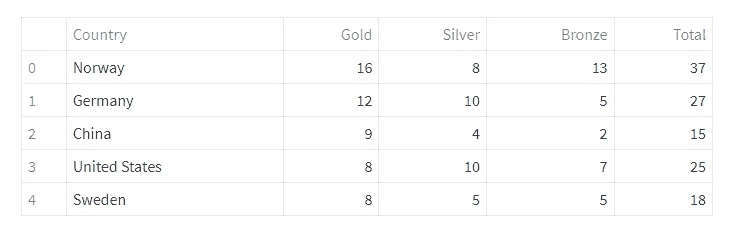

*2022 年冬奥会前 5 名国家奖牌榜—数据来源，* [*维基百科*](https://en.wikipedia.org/wiki/2022_Winter_Olympics_medal_table) *，图片作者*

现在，图表。

# 7.垂直条

垂直条形图是普通的香草口味的条形图。在 Streamlit 中，实现一个简单的熊猫条形图的代码是这样的:

```
fig, ax = plt.subplots()
medals.plot.bar(x='Country', y='Total', ax=ax)
st.pyplot(fig)
```

该图绘制了每个国家获得的奖牌总数的单个条形图系列，x 轴表示国家，y 轴表示获得的奖牌总数。

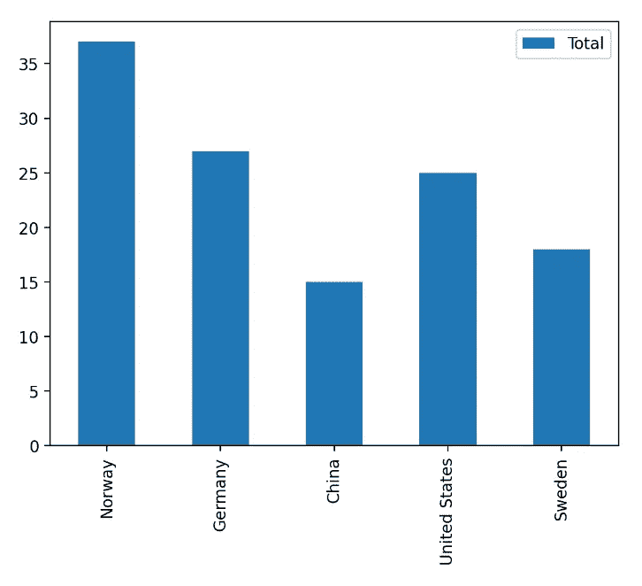

*垂直条形图—作者图片*

*请注意，我使用 Streamlit 和 Pandas 来实现这一点，Streamlit 坚持我们专门创建一个 Matplotlib 图形，它可以作为绘图函数的参数。这就是第一行代码的作用。因此，我们必须将* `*ax=ax*` *添加到熊猫图代码中，以便将该图添加到已经创建的图形中。如果您要使用 Jupyter 笔记本或独立的 Python，就不需要这段代码。查看 Github 上的 Jupyter 笔记本，查看替代代码。*

条形图的一个常见用途是比较一系列条形图中的多个值。下面是显示奖牌表中所有列的条形的代码。注意，由于没有为`y`指定值，Pandas 认为我们想要绘制所有的列。

```
fig, ax = plt.subplots()
medals.plot.bar(x='Country', ax=ax)
st.pyplot(fig)
```

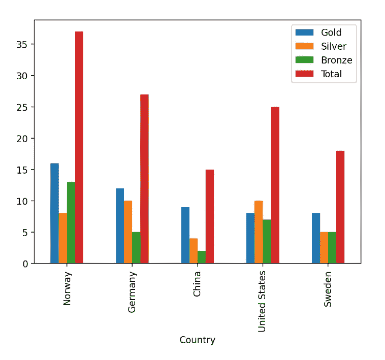

*多条竖条图—作者图片*

要显示列的子集，您应该将`y`设置为您感兴趣的列的列表。下面我们指定列，`Gold`，`Silver`和`Bronze` (即不包括*合计*)。

```
fig, ax = plt.subplots()
medals.plot.bar(x='Country', y = ['Gold','Silver','Bronze'],ax=ax)
st.pyplot(fig)
```

结果是这样的:

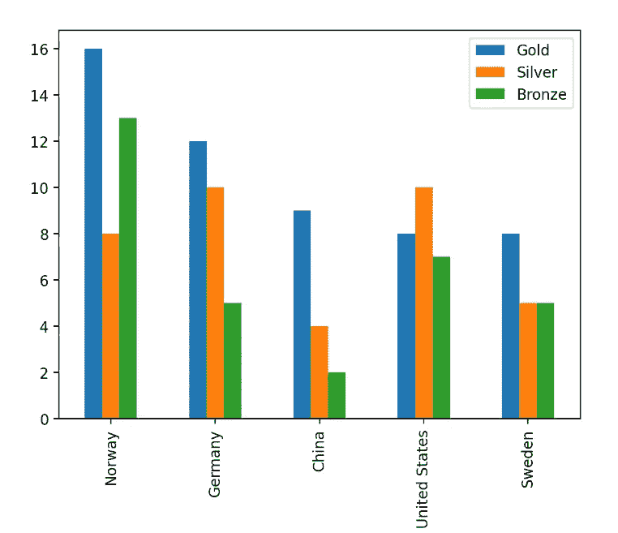

*带有多个特定条形图的垂直条形图—图片由作者提供*

# 8.单杠

CNK 告诉我们，水平条形图是她的条形图版本，因为它更容易阅读。她告诉我们，我们的眼睛自然地以 Z 形运动扫描一页，在页面上来回移动，因此，我们会首先注意到图表上的标签，然后看到与它们相对应的条形。我要指出的是，虽然从西方文化的角度来看这很可能是真的，但它可能不是普遍的(我非常欢迎对此的评论)。

在 Pandas 中，垂直条形图和水平条形图在语法上的唯一区别是函数名中只有一个字母。例如，不调用函数`medals.plot.**bar**(x='Country', ax=ax)` we，而是调用`medals.plot.**barh**(x='Country', ax=ax).`

这里有一个例子，但是上一节中的所有图表都可以通过调用函数的`barh`版本而不是`bar`来呈现为水平图表。

```
fig, ax = plt.subplots()
medals.plot.barh(x='Country', ax=ax)
st.pyplot(fig)
```

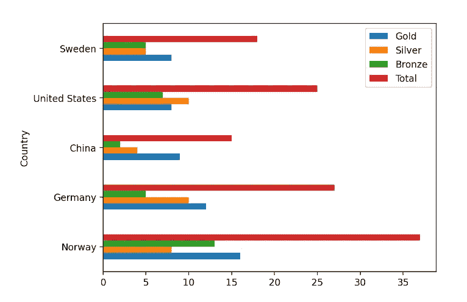

*多条横条图—作者图片*

# 9.堆叠垂直条

堆积条形图不像以前的类型那样常见，但当您想要比较由不同子成分组成的总计时，它会很有用，如下图所示。

在这里，我们将每个国家的不同奖牌类别组合成一个单一的堆叠条形图。除了添加了参数`stacked = True`之外，代码与前面的示例非常相似。

```
fig, ax = plt.subplots()
medals.plot.bar(x='Country', 
                y = ['Gold','Silver','Bronze'],
                stacked = True, ax=ax)
st.pyplot(fig)
```


*垂直堆积条形图—作者图片*

正如 CNK 指出的那样，尽管比较第一个子成分很容易，但较高的子成分就不那么容易比较了，因为它们不是从同一水平开始的。

# 10.堆叠水平条

除了我们调用`barh`函数之外，水平堆叠条形图的编码与垂直堆叠条形图相同。

当然，关于垂直图表的评论也适用于此。

```
fig, ax = plt.subplots()
medals.plot.barh(x='Country', 
                 y = ['Gold','Silver','Bronze'], 
                 stacked = True, ax=ax)
st.pyplot(fig)
```

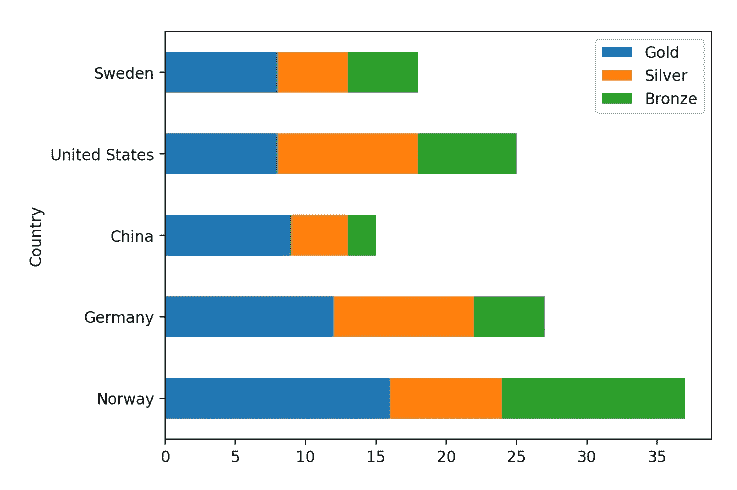

*水平堆积条形图——作者图片*

# 11.瀑布

瀑布图可以用来解构堆积的
条形图，这样我们就可以一次专注于一个部分。此外，瀑布图可以跟踪从起始值到最终结果的增加和减少。

瀑布图通常不作为可视化库的标准部分，尽管它们本质上是由两部分组成的堆叠条，当前值和增量或减量。正如 CNK 所评论的，这些可以通过使酒吧的下部透明来构建。

然而，我们将走一条更容易的路线。Python 库 w *aterfallcharts* 使用 Matplotlib 实现瀑布图，简单易用。

首先，当然，我们安装它。

```
pip install waterfallcharts
```

我们将构建的图表取自*用数据*讲故事，并跟踪一个虚拟公司中人员的增加和减少。下面是数据:

```
a = ['Beginning HC','Hires','Transfers In','Transfers Out','Exits']
b = [100,30,8,-12,-10]
```

List `a`是一组标签，`b`是一个值列表，从当前人数开始，然后列出初始值的增量或减量。

由此产生的图表看起来像这样:

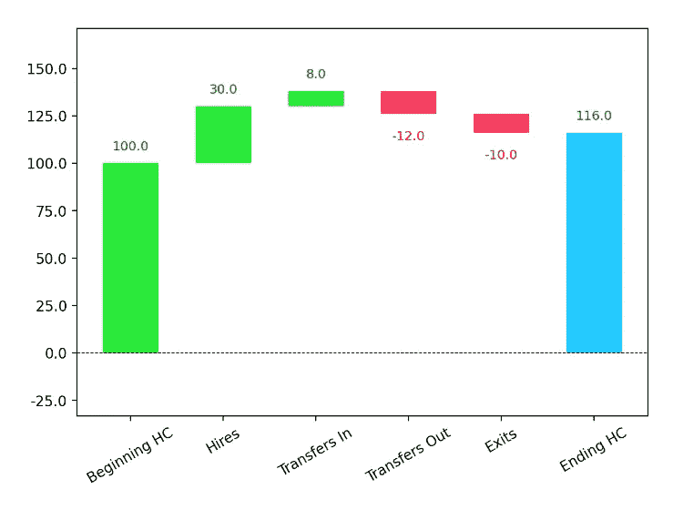

*瀑布图——作者图片*

您可以看到初始值以及由于标签所描述的原因而导致的变化。还添加了最终值。

产生这种结果的代码非常简单。

```
my_plot = waterfall_chart.plot(a, b, net_label = "Ending HC")
st.pyplot(my_plot)
```

我们传入标签和数据点的列表，以及一个将应用于最终计算出的总数的标签。结果是在 Streamlit 中可以用`st.pyplot()`绘制的图形。

您可能会注意到，在条形的视觉编码中有相当多的冗余。第一个柱和正变化标为绿色，负变化标为红色，最后一个柱标为蓝色。但积极和消极的变化已经通过增加或减少整体高度来区分。除此之外，还有数字标签向我们展示变化——这些也是彩色编码的。

此外，我们不需要初始值和最终值是不同的颜色，因为它们是位置编码的:初始值在左边，最终值在最右边。

在她的书里，CNK 把所有的条形都涂成一样的颜色，我认为这样会有更好的效果。因此，这里有一个替代的编码，将所有的条设置为相同的颜色。

```
my_plot = waterfall_chart.plot(a, b, net_label = "Ending HC",
                               blue_color='blue',
                               red_color='blue', 
                               green_color='blue')
st.pyplot(my_plot)
```

这是结果。

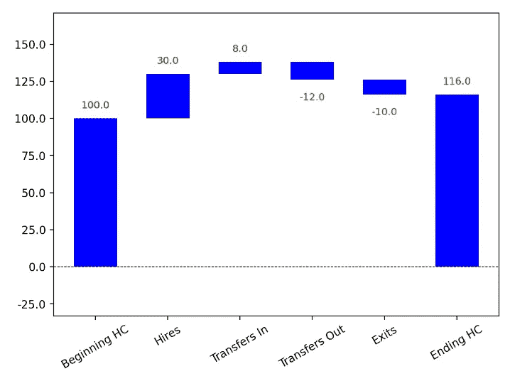

*另一幅瀑布图——作者图片*

# 12.正方形区域

面积图通常存在问题，因为面积通常是不规则的形状，相互堆叠在一起，读者很难将其解释为一个值。

CNK 说她一般不使用它们，除了方形面积图更容易阅读，我们将在这一部分探讨。

## 数据

我们将使用与食用过多加工肉类的健康风险相关的数据。在我的文章 [*可视化健康风险*](/visualizing-health-risk-2a082417f3f2) 中，我讨论了如何有效地呈现这些风险，我从大卫·斯皮格尔哈尔特的优秀著作*统计的艺术*(注 4)中获得了灵感。

2015 年 11 月，国际癌症研究机构(世界卫生组织的一部分)[报告](https://www.iarc.who.int/wp-content/uploads/2018/07/pr240_E.pdf)称，食用 50 克加工肉类——例如培根或香肠——与肠癌风险增加 18%有关(注 3)。

这并不像一些媒体让你认为的那样可怕，因为这是相对风险的增加，而不是绝对风险的增加，而且绝对风险仍然相当小(非常粗略地说是从 6%增加到 7%)。但是仅仅用数字来解释这个想法是很困难的。可视化方法更好，一个好的候选可视化方法是方形面积图。我修改了我最初的方法，创建了一个正方形的面积图，就像 CNK 的书中所描绘的那样。

这是原始数据:每 100 个人中，大约有 6 个人患有肠癌，大约有 1 个人因为吃了太多的加工肉类而患病。

让我们看看用条形图表示的数据。

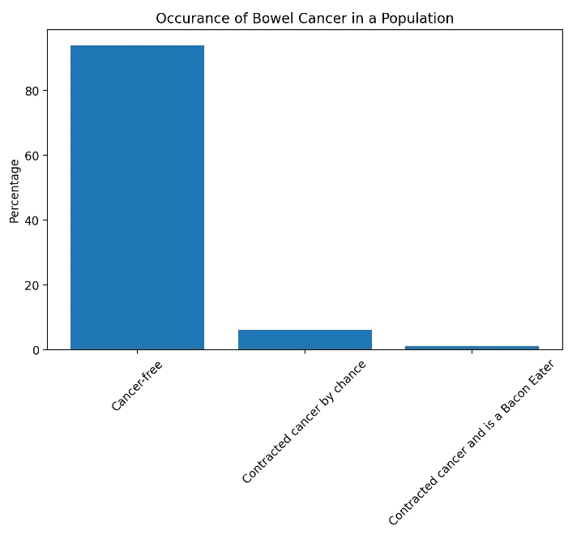

显示癌症实例(但不是很好)的条形图—作者图片

出于兴趣，下面是生成图表的代码。

```
fig, ax = plt.subplots(figsize=(8,5))plt.bar(['Cancer-free','Contracted cancer by chance','Contracted cancer and is a Bacon Eater'],[94,6,1])
plt.xticks(rotation = 45)ax.set_ylabel('Percentage')
ax.set_title('Occurance of Bowel Cancer in a Population')st.pyplot(fig)
```

很明显，最短的棒线和最长的棒线相比很小，但是很难判断到底有什么不同。

让我们试试传统的面积图。下面的是一个单一的堆积酒吧，作为一个矩形面积图。

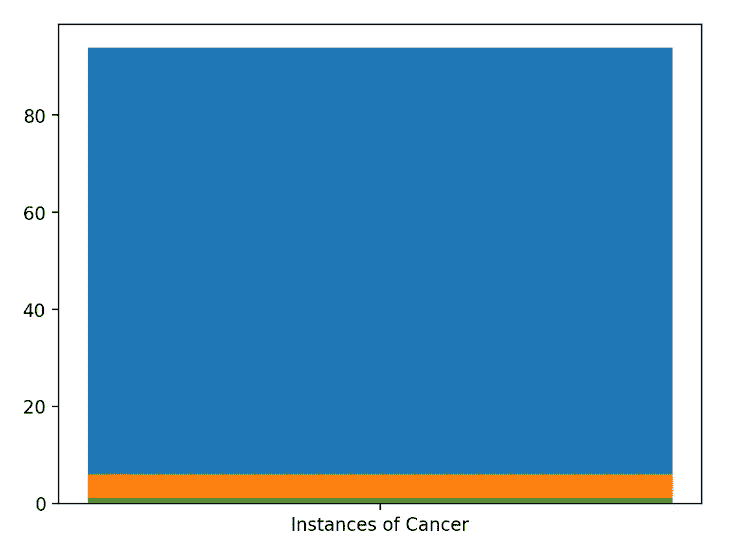

一个条形图作为面积图显示癌症实例-作者图片

同样，这是这个图表的代码。

```
fig, ax = plt.subplots()
ax.bar('Instances of Cancer', 94,label='Cancer-Free')
ax.bar('Instances of Cancer', 6, label='Contracted cancer by chance')
ax.bar('Instances of Cancer', 1, label='Contracted cancer and is a Bacon Eater')
st.pyplot(fig)
```

这本书可能比前一本书可读性强一点，但实际上，它也面临着同样的问题。

当数值存在差异时，方形面积图会让我们对情况有更好的印象。

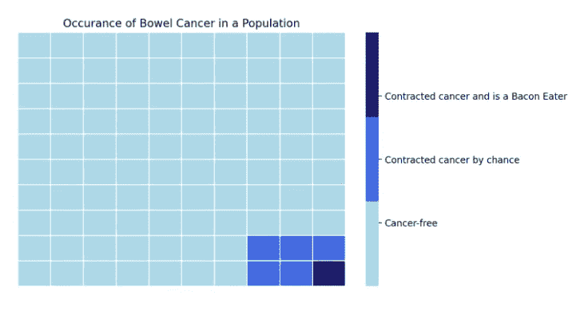

显示癌症实例的方形面积图更清楚地显示了数据——图片由作者提供

在上图中，很容易看出每个类别的相对大小。问题是，我们并不经常将方形面积图视为可视化软件包的标准组件。

在下面的代码中，我利用 Seaborn 热图来创建方形面积图。首先，我创建一个 10 x 10 的 Numpy 数组，用零填充—这代表总人口—我用值 0 代表一个没有癌症的个体。接下来，我用六个 1 填充数组的左下角。值 1 代表患有癌症的个体。最后，为了完成数组，我将左下角的单个数组元素的值设置为 2，表示一个人由于吃了太多加工过的肉而患了癌症。

```
*# construct a 2D array of 0s - total pop*
a = [0]*100
b = np.array(a).reshape((10,10))*# add a 2 by 3 rectangle of 1s representing cancer sufferers*
for i in range(8,10):
    for j in range(7,10):
        b[i,j] = 1*# add a single cell with value 2*
*# representing the number of cancer sufferers* 
*# who eat too much bacon*
b[9,9] = 2*# Plot the grid as a heat map in Seaborn*
fig, ax = plt.subplots(figsize=(8,5))
sns.heatmap(b, 
            linewidths=0.5, 
            yticklabels=False,
            xticklabels=False, 
            cmap=['lightblue','royalblue','midnightblue'],
            ax=ax)*# Customize legend*
colorbar = ax.collections[0].colorbar 
colorbar.set_ticks([0.5,1,1.5])
colorbar.set_ticklabels(['Cancer-free','Contracted cancer by chance','Contracted cancer and is a Bacon Eater'])ax.set_title('Occurance of Bowel Cancer in a Population')
st.pyplot(fig)
```

剩下的代码是为每个类别设置颜色，设置标签等等。

# 结论

因此，我们有 12 个必要的可视化，如科尔·努斯鲍默·克纳弗里克的书*用数据讲故事*中所描述的。大多数图表都很容易阅读和实现，有一两张稍微复杂一点，因为它们通常不包含在标准的可视化软件包或库中。我希望，在这些案例中，我已经帮助您了解了它们是如何实现的。

感谢阅读，我希望它是有用的。所有的代码都可以通过我的[网页](http://alanjones2.github.io)上的链接获得。你还会发现一个 Jupyter 笔记本，实现了每一个视觉效果。还有一个 Streamlit 应用程序演示了你在这里看到的每一个可视化效果。

要了解我所做工作的更多信息，请访问我的[网页](http://alanjones2.github.io)和/或订阅我在[子堆栈](http://technofile.substack.com)上的不定期简讯。

# 笔记

1.  [*《用数据讲故事》，商业人士数据可视化指南*](https://amzn.to/3dJlMaS) ，科尔·努斯鲍默·克纳弗利奇，威利，2015 年(附属链接*)
2.  维基百科上的奖牌榜页面列出了每个参赛国家获得的奖牌。
3.  [IARC 专论评估红肉和加工肉的消费](https://www.iarc.who.int/wp-content/uploads/2018/07/pr240_E.pdf)
4.  [统计的艺术:如何从数据中学习](https://www.amazon.com/Art-Statistics-How-Learn-Data/dp/1541675703/ref=sr_1_1?_encoding=UTF8&amp;camp=1789&amp;creative=9325&amp;crid=1PPXO3JG9UPDR&amp;keywords=the+art+of+statistics&amp;linkCode=ur2&amp;linkId=b71669deca0a471424d5bc6fccbba1b3&amp;qid=1648295722&amp;sprefix=the+art+of+statistics%25252Caps%25252C177&amp;sr=8-1&_encoding=UTF8&tag=alanjones01-20&linkCode=ur2&linkId=fdf08c9a6a07285fa2432673497c25ec&camp=1789&creative=9325)，大卫·斯皮格尔哈特，2021 ( *附属链接*

* *如果你通过代销商链接购物，我可能会得到佣金。不会影响你付出的代价。*