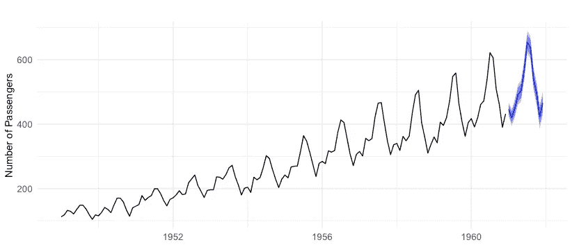
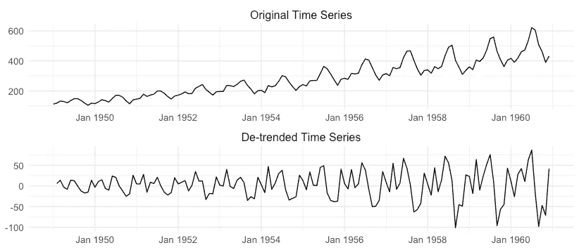
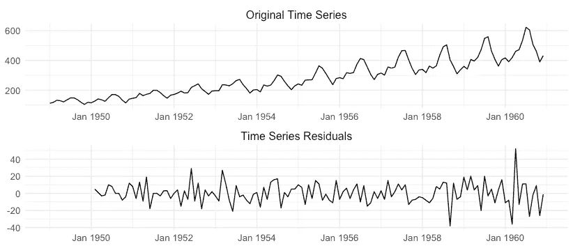
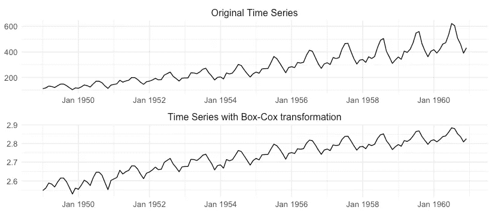

# 关于时间序列你应该知道的 12 件事

> 原文：<https://towardsdatascience.com/12-things-you-should-know-about-time-series-975a185f4eb2>

亚当·米格尔斯基在 [Unsplash](https://unsplash.com?utm_source=medium&utm_medium=referral) 上的照片

对于那些不知道的人来说，时间序列只是一组随时间收集的数字观察值(图 1)。时间序列的例子出现在许多领域，从零售(例如库存计划)到金融(股票价格预测)。时间序列之所以有趣，是因为它们潜在的不确定性——数据会随着时间而变化，这使得人们很难理解它们未来的行为。

图 1:从 1949 年到 1960 年，每月国际航线乘客的数量。蓝色部分代表未来 12 个月的预测。

在这里，我将描述 12 个在建模时间序列时需要考虑的重要属性或成分。以这样或那样的方式，这些特征影响了预测系统开发的数据科学管道中的决策。

如果你着急的话，下面是每个主题的一条线:

1.  **趋势**:数据均值的长期变化；
2.  **季节性**:有规律的、可预测的变化；
3.  **残差**:去季节性和去趋势的序列；
4.  **平稳性**:时间序列性质随时间保持不变时；
5.  **自相关**:与过去观测值的相关性；
6.  **异方差**:方差的变化；
7.  **规律性** : 是否定期采集系列；
8.  **频率** : 观测序列的频率；
9.  **反身性** : 预测影响结果时；
10.  **异常值** : 罕见的但可能有趣的观测值；
11.  **状态和变化检测** : 当数据分布发生变化时；
12.  **维度** : 时间序列中变量的个数。

# 1.趋势

趋势是时间序列的基本组成部分之一。它的**代表了****数据均值的长期变化，如图 1 中的所示。此图显示了一个时间序列示例，它代表了一段时间内某家航空公司每月的乘客人数。时间序列的平均水平随着时间的推移而增加，这代表了一个明显的上升趋势。**

**一些学习算法很难处理时间序列的趋势部分。因此，为了时间序列的最佳建模，通常建议将其移除。您可以使用差分运算来实现这一点。差异仅仅意味着取当前观察值和前一个观察值之间的差异。图 2 显示了通过差分去除趋势后的航空乘客时间序列；经过这一过程后，序列的平均水平变得稳定。**

****

**图 2:应用差异运算后的去趋势时间序列。**

# **2.季节性和周期性模式**

**如果一个时间序列在固定周期(例如每月)内经历**有规律的和可预测的变化，那么它就有季节性成分。航空旅客时间序列显示出一个月的季节性，这是显而易见的周期性振荡。****

**与趋势类似，季节性因素也会破坏平稳性，通常建议将其去除。也可以通过差分来实现，但是我们不是从当前观测值中减去前一个值，而是从同一季节中减去前一个观测值。**

**季节性差异减轻了可预测的波动，这也稳定了序列的平均水平。去除季节性成分后，该时间序列称为*季节性调整*。**

**除了季节效应，时间序列还可以表现为**其他不具有固定周期的可预测振荡**。这种类型的变化是一种**循环模式**。周期模式的典型例子是经济周期，在这个周期中，经济经历增长期和衰退期。**

# **3.残差**

****

**图 3:时间序列的残差部分。这些是在进行消除趋势的差分和消除季节性的季节性差分之后获得的。**

**从时间序列中去除上述三个成分(趋势、季节性、周期模式)后，**剩下的部分称为不规则成分或残差**。图 3 显示了一个例子。残差无法用任何趋势、季节或周期行为来解释，但仍然会对时间序列的动态产生影响。**

**在任何给定的时间点，一个时间序列可以以相加的方式分解成上述的组成部分，如下所示:**

***y =趋势+季节性+周期性+残差***

**根据数据的不同，这种分解也可以通过用乘积运算代替求和运算来实现乘法运算。**

# **4.平稳性**

**趋势或季节性等因素打破了时间序列的平稳性。如果时间序列的属性不依赖于观察数据的时间，则时间序列是**稳定的** **。****

**更正式的说法是，如果均值或方差没有系统的变化，并且周期性变化已经被消除，那么时间序列被认为是平稳的，但不涉及具体细节。**

**许多时间序列技术都是在假设时间序列是平稳的情况下工作的。当它不是时，诸如差分之类的操作被用来使它静止。**

# **5.自相关**

**时间序列的概念意味着对历史数据有某种程度的依赖——我们今天观察到的取决于过去发生的事情。时间序列的自相关根据每个观察值与其过去值的相关性来量化这种依赖性。该属性提供了关于系列的重要结构信息。如果一个时间序列在所有滞后上都表现出低的自相关性，则称之为白噪声。**

# **6.异方差**

**这是一个复杂的词，但概念其实很简单。如果一个时间序列的方差不是常数并且随时间变化，则称该时间序列为异方差的，与同方差的**相反。在飞机乘客的例子中，很明显，数据的可变性随着时间的推移而增加。这种方差变化通常与数据均值水平的变化同时发生，即均值越高，方差通常也越高。异方差在建立数据模型的过程中提出了一个问题，有一些方法可以解决这个问题。幂变换，例如取对数，或者更一般地，Box-Cox 变换，通常被用于稳定方差。图 4 显示了 Box-Cox 方法应用于时间序列的一个例子。****

****

**图 4:应用 Box-Cox 变换后的时间序列**

# **7.规律性和间歇性**

****时间序列通常以固定的时间间隔收集，例如，每天或每小时**。这些被称为规则时间序列，并且大多数时间序列方法在规则性假设下工作。然而，在许多应用中，时间序列本质上是不规则的。例如，自然灾害(如地震)或特定零售产品的销售，它们以不规则的时间间隔发生。**

**通常，对时间序列的不规则性进行插值处理，使序列变得规则。例如，与产品销售相关的时间序列可以转换为某个时间段的销售计数(例如，每小时的产品销售)。这种插值过程可能会产生稀疏或间歇的时间序列，其中有几个值为常数 0 的观察值(例如，在给定的一个小时内没有产品销售)。这种间歇性是库存计划时间序列预测中的一个常见障碍，其中一些产品很少出售。**

# **8.采样频率**

**时间序列的采样频率表示**其采集的规律性，例如，每日或每月**。不同频率的时间序列带来不同的挑战。对于频率较高的时间序列，季节性成分可能更难捕捉。每日或次每日时间序列通常包含多个季节模式，这些模式不易捕捉。**

**就季节性而言，处理低频时间序列更简单。但是，可能还有其他问题需要考虑。相对于高频数据集，低频数据集通常包含较小的样本量。经典的时间序列模型，如 ARIMA 或指数平滑，可以很好地处理这个问题，因为它们有少量的参数。参数多的学习算法可能容易过拟合。**

# **9.自反性**

****如果预测影响事件的展开，时间序列就是自反的。**自反时间序列的经典例子是股票市场数据。预测股价上涨会吸引投资者，从而创造需求并推动股价上涨。这种预测会自我实现。另一方面，由于投资者的恐慌，市场崩溃的预测本身也可能导致市场崩溃。也有弄巧成拙的反身系统，在这种系统中，预测给定事件会降低其可能性。**

**反身性可能会导致意想不到的后果。从业者应该确定它如何出现在他们的时间序列中，并以某种方式将响应纳入他们的预测系统。**

# **10.极端值**

****离群值或异常值是明显偏离其他观测值的罕见事件。**这些实例常见于所有类型的数据，而不仅仅是时间序列。然而，在时间序列中，由于观测值之间的时间依赖性，异常值构成了额外的挑战。**

**时间序列异常值可能只出现在一个实例中(点异常值)，也可能跨越几个时间步(子序列异常值)。在搜索异常时，将上下文考虑在内通常是很重要的。例如，0 度的温度在冬天可能是常见的，但在夏天却是异常的。**

**处理异常值的最合适方法取决于它们的性质。异常值可能由于错误的数据收集或传感器故障而出现。这种异常值表示不符合生成观察值的分布的不需要的数据。然而，也有时间序列异常值，这些异常值本身就是感兴趣的事件。这方面的例子包括股票市场崩盘或欺诈检测，其目标是预测或减轻这些罕见事件的影响。**

# **11.制度和变化检测**

****当时间序列的分布发生变化时，会出现一个变化点，也称为概念漂移。**变化可以重复出现；一个时间序列可以用不同的制度或概念来描述，而数据分布在这些制度之间是变化的。状态转换模型是解决这类问题的流行方法。**

**变化也可以是永久性的。这些被称为结构性断裂。这些变化对学习算法提出了挑战，学习算法必须能够检测到这些变化，并及时做出相应的调整。**

**重要的是不要混淆变化检测和异常值检测。第一个是关于检测管理时间序列的制度的变化。当体制改变时，观测值的分布也随之改变。另一方面，异常值代表明显偏离典型行为的观察结果(或后续观察结果),其中典型行为的特征在于当前的基础制度。**

# **12.维度**

**到目前为止，列出的属性都假设基础时间序列由一个维度表示，其中**维度表示变量**的数量。因此，这些时间序列被称为单变量。然而，有时时间序列包含额外的维度，因此被称为多元时间序列。多变量时间序列中的额外变量可在对时间序列的特定目标变量建模时用作解释变量。**

# **摘要**

**在这篇文章中，我列出了 12 个在构建预测模型时很重要的时间序列属性。从基本组件(如趋势或季节性)到自反性或变化检测，这些特征可能会显著影响预测模型的性能。**

## **进一步阅读**

**[1] Hyndman，Rob J .，和 George Athanasopoulos。*预测:原理与实践*。OTexts，2018。**

**[2]彼得罗保罗斯、福蒂斯等人，“预测:理论与实践”《国际预测杂志》 (2022)。**

**[3]克里斯·查特菲尔德。*时间序列预测*。查普曼和霍尔/儿童权利委员会，2000 年。**

**[4]史密斯，乔治·克莱因。“预测反馈定律。”*美国统计学家*18.5(1964):11–14。**

**[5] Aminikhanghahi、Samaneh 和 Diane J. Cook。"时间序列变点检测方法综述."知识与信息系统 51.2(2017):339–367。**