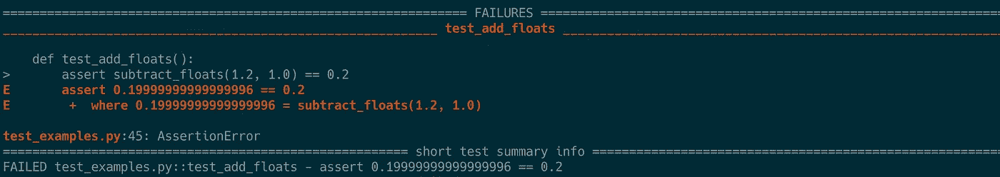
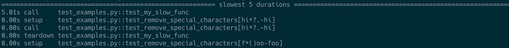
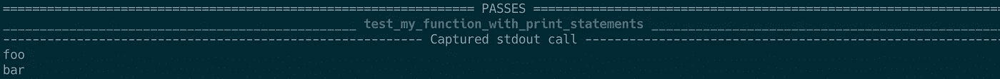
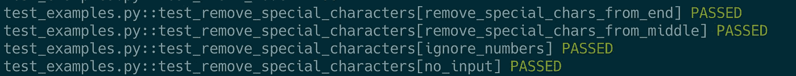

# 使用 PyTest 的 13 个技巧

> 原文：<https://towardsdatascience.com/13-tips-for-using-pytest-5341e3366d2d>


[Unsplash](https://unsplash.com/s/photos/python?utm_source=unsplash&utm_medium=referral&utm_content=creditCopyText) 上 [AltumCode](https://unsplash.com/@altumcode?utm_source=unsplash&utm_medium=referral&utm_content=creditCopyText) 拍摄的照片

单元测试对于软件开发来说是一项非常重要的技能。有一些很棒的 Python 库可以帮助我们编写和运行单元测试，比如 [Nose](https://nose.readthedocs.io/en/latest/) 和 [Unittest](https://docs.python.org/3/library/unittest.html) 。但是我最喜欢的是 [PyTest](https://docs.pytest.org/en/7.2.x/) 。

我最近更详细地阅读了 PyTest 的文档，以便更深入地了解它的特性。

下面是一些我认为有用的模糊特性的列表，我将开始把它们集成到我自己的测试工作流程中。我希望这个列表中有一些你不知道的新东西…

> *💻这篇文章中的所有代码片段都可以在*[*e4ds-snippets GitHub 资源库*](https://github.com/julian-west/e4ds-snippets/tree/master/pytest/pytest_tips) *中找到。*

# 编写测试的一般提示👨‍🎓

# 1.如何编写好的单元测试

好了，这一条并不是专门针对 PyTest 库的，但是第一条建议是浏览一下 [PyTest 的文档](https://docs.pytest.org/en/7.1.x/explanation/anatomy.html)关于构建你的单元测试。这很值得一读。

一个好的测试应该验证某种预期的行为，并且能够独立于其他代码运行。也就是说，测试中应该包含设置和运行要测试的行为所需的所有代码。

这可以概括为四个阶段:

*   **安排** —执行测试所需的设置。例如定义输入
*   **动作** —运行您想要测试的功能
*   **断言** —验证函数的输出是否符合预期
*   **清理**——(可选)清理测试中产生的任何工件。例如输出文件。

例如:

```
# example function
def sum_list(my_list):
    return sum(my_list)
```

```
# example test case
def test_sum_list():
    # arrange
    test_list = [1, 2, 3]
    # act
    answer = sum_list(test_list)
    # Assert
    assert answer == 6
```

虽然这是一个微不足道的例子，但是让所有的测试都有一个通用的结构有助于提高可读性，编写更好的测试。

[https://docs.pytest.org/en/7.1.x/explanation/anatomy.html](https://docs.pytest.org/en/7.1.x/explanation/anatomy.html)

# 2.测试异常

通常，我们首先想到的测试是函数成功运行时的预期输出。

但是，当函数引发异常时，验证函数的行为也很重要。尤其是当您知道哪种类型的输入会引发某些异常时。

您可以使用`pytest.raises`上下文管理器[测试异常](https://docs.pytest.org/en/7.1.x/how-to/assert.html#assertions-about-expected-exceptions)。

例如:

```
import pytest

def divide(a, b):
    """Divide to numbers"""
    return a/b

def test_zero_division():
    with pytest.raises(ZeroDivisionError):
        divide(1,0)
def test_type_error():
    with pytest.raises(TypeError):
        divide("abc",10)
```

[https://docs . pytest . org/en/7.1 . x/how-to/assert . html # assertions-about-expected-exceptions](https://docs.pytest.org/en/7.1.x/how-to/assert.html#assertions-about-expected-exceptions)

# 3.测试记录/打印

PyTest 允许您测试代码中的打印和日志记录语句。

有两个内置的 PyTest fixtures， [capsys](https://docs.pytest.org/en/6.2.x/reference.html#std-fixture-capsys) 和 [caplog](https://docs.pytest.org/en/6.2.x/reference.html#std-fixture-caplog) ，可用于跟踪功能打印到终端的信息。

## 测试打印输出

```
def printing_func(name):
    print(f"Hello {name}")
```

```
def test_printing_func(capsys):
    printing_func(name="John")
    # use the capsys fixture to record terminal output
    output = capsys.readouterr()
    assert output.out == "Hello John\n"
```

[https://docs . py test . org/en/6.2 . x/reference . html # STD-fixture-cap sys](https://docs.pytest.org/en/6.2.x/reference.html#std-fixture-capsys)

## 测试日志输出

```
import logging

def logging_func():
    logging.info("Running important function")
    # some more code...
    logging.info("Function completed")

def test_logging_func(caplog):
    # use the caplog fixture to record logging records
    caplog.set_level(logging.INFO)
    logging_func()
    records = caplog.records
    # first message
    assert records[0].levelname == 'INFO'
    assert records[0].message == "Running important function"
    # second message
    assert records[1].levelname == 'INFO'
    assert records[1].message == "Function completed"
```

[https://docs . pytest . org/en/6.2 . x/reference . html # STD-fixture-cap log](https://docs.pytest.org/en/6.2.x/reference.html#std-fixture-caplog)

# 4.测试彩车

涉及浮点运算的算法会在 Python 中引起问题。

例如，这个简单的函数会导致一个奇怪的错误:

```
def subtract_floats(a,b):
    return a - b

def test_substract_floats():
    assert subtract_floats(1.2, 1.0) == 0.2
```



预期的输出应该是`0.2`，但是 Python 返回了`0.19999999999999996`。

这个函数的逻辑没有任何问题，它应该不会在这个测试用例中失败。

为了消除测试中的浮点舍入误差，您可以使用[近似函数](https://docs.pytest.org/en/7.1.x/reference/reference.html#pytest-approx)

```
import pytest

def test_substract_floats():
    assert subtract_floats(1.2, 1.0) == pytest.approx(0.2)
```

测试现在通过了。

注意，您也可以将`approx`函数应用于 numpy 数组。这在比较数组和数据帧时很有用。

例如:

```
import pytest
import numpy as np

np.array([0.1, 0.2]) + np.array([0.2, 0.4]) == pytest.approx(np.array([0.3, 0.6])) 
```

[https://docs . py test . org/en/7.1 . x/reference/reference . html # py test-approx](https://docs.pytest.org/en/7.1.x/reference/reference.html#pytest-approx)

# 节省您时间的提示⏳

# 5.通过只运行某些测试来节省时间

运行测试应该有助于您的工作流程，而不是一个障碍。长时间运行的测试套件会降低您的速度，让您无法定期运行测试。

通常，您不需要在每次进行更改时都运行整个测试套件，尤其是当您只处理代码库的一小部分时。

因此，能够运行与您正在处理的代码相关的测试子集是很方便的。

PyTest 提供了一些选项来选择要运行的测试:

## 使用`-k`标志

在运行 PyTest 时，您可以使用`-k`标志来只运行匹配给定子串的测试。

例如，如果您有以下测试:

```
def test_preprocess_categorical_columns():
    ...

def test_preprocess_numerical_columns():
    ...

def test_preprocess_text():
    ...

def test_train_model():
    ...
```

您可以使用以下命令只运行包含子字符串' categorical '的第一个测试:

```
# run first test only
pytest -k categorical
```

您可以运行以下命令，只运行包含名称“预处理”的测试(前三个测试):

```
# run first three tests only
pytest -k preprocess
```

逻辑表达式也是允许的。例如，下面将运行包含“预处理”的测试，但排除包含“文本”的测试。这将运行前两个测试，但不会运行第三个:

```
# run first two tests only
pytest -k "preprocess and not text"
```

命令行标志文档中提供了对`-k`标志的有效短语的完整解释:[https://docs . pytest . org/en/7.2 . x/reference/reference . html #命令行标志](https://docs.pytest.org/en/7.2.x/reference/reference.html#command-line-flags)

## 在单个测试文件中运行测试

如果您的测试被拆分到多个文件中，您可以通过在运行 PyTest 时显式传递文件名来从单个文件中运行测试:

```
# only run tests defined in 'tests/test_file1.py' file
pytest tests/test_file1.py
```

## 使用标记

您还可以使用 pytest“标记”来标记某些测试。这对于标记“慢”测试很有用，然后您可以用`-m`标志将其排除。

比如说。

```
import time
import pytest

def my_slow_func():
    # some long running code...
    time.sleep(5)
    return True

@pytest.mark.slow
def test_my_slow_func():
    assert my_slow_func()
```

`my_slow_func`将比其他测试花费更长的时间。

在使用了`@pytest.mark.slow`装饰器之后，我们可以使用`-m`标志来排除每次运行这个测试:

```
# exclude running tests marked as slow
pytest -m "not slow"
```

如果你在某些情况下需要跳过测试，标记也很方便。例如，如果您的 CI 构建使用多个版本的 Python 运行测试，并且您知道某个测试将会在某个版本的 Python 上失败。

```
import sys

@pytest.mark.skipif(sys.version_info < (3, 10), reason="requires python3.10 or higher")
def test_function():
    ...
```

[https://docs.pytest.org/en/7.1.x/example/markers.html](https://docs.pytest.org/en/7.1.x/example/markers.html)T12[https://docs.pytest.org/en/7.1.x/how-to/skipping.html](https://docs.pytest.org/en/7.1.x/how-to/skipping.html)

# 6.仅重新运行失败的测试

当您运行整个测试套件时，您可能会发现少数测试失败了。

一旦您调试了问题并更新了代码，而不是再次运行整个测试套件，您可以使用`--lf`标志只运行上次运行失败的测试。

在再次运行整个测试套件之前，您可以验证更新的代码是否通过了这些测试。

```
# only run tests which failed on last run
pytest --lf
```

或者，您仍然可以运行整个测试套件，但是使用`--ff`标志从上次失败的测试开始。

```
# run all tests but run failed tests first
pytest --ff
```

[https://docs . pytest . org/en/7.1 . x/how-to/cache . html # re running-only-failures-or-failures-first](https://docs.pytest.org/en/7.1.x/how-to/cache.html#rerunning-only-failures-or-failures-first)

# 节省您编写代码的技巧🚀

# 7.参数化测试

当您想要测试特定函数的多个不同输入时，人们通常会在测试函数中编写多个 assert 语句。例如:

```
def remove_special_characters(input_string):
    return re.sub(r"[^A-Za-z0-9]+", "", input_string)

def test_remove_special_characters():
    assert remove_special_characters("hi*?.") == "hi"
    assert remove_special_characters("f*()oo") == "foo"
    assert remove_special_characters("1234bar") == "bar"
    assert remove_special_characters("") == ""
```

在 PyTest 中使用“参数化测试”有一个更好的方法:

```
import pytest

@pytest.mark.parametrize(
    "input_string,expected",
    [
        ("hi*?.", "hi"),
        ("f*()oo", "foo"),
        ("1234bar", "1234bar"),
        ("", ""),
    ],
)
def test_remove_special_characters(input_string, expected):
    assert remove_special_characters(input_string) == expected
```

这有利于减少重复代码。此外，PyTest 为每个参数化的输入运行单独的测试。因此，如果其中一项测试失败，将更容易识别。然而，在使用多个 assert 语句的原始实现中，PyTest 将其作为单个测试运行。如果任何断言语句失败，整个测试将“失败”。

# 8.从文档字符串运行测试

另一个很酷的技巧是直接从 docstrings 定义和运行测试。

您可以如下定义文档字符串中的测试用例:

```
def add(a, b):
    """Add two numbers

    >>> add(2,2)
    4
    """
    return a + b
```

然后，在运行`pytest`命令时，通过添加`--doctest-modules`标志，您可以将 docstring 测试包含到您的测试套件中。

```
pytest --doctest-modules
```

在 docstrings 中定义测试对使用您的代码的其他开发人员非常有帮助，因为它在函数定义中明确显示了函数的预期输入和输出。

我发现这对于使用“简单”数据结构作为输入和输出的函数非常有效。而不是编写向测试套件添加更多代码的全面测试。

[https://docs . pytest . org/en/7.1 . x/how-to/doctest . html # how-to-run-doc tests](https://docs.pytest.org/en/7.1.x/how-to/doctest.html#how-to-run-doctests)

# 9.内置 pytest 夹具

PyTest 包括许多非常有用的内置装置。

我们在技巧 3 中简要介绍了其中的一些装置——capsys 和 cap log——但是完整的列表可以在这里找到:[https://docs . pytest . org/en/stable/reference/fixtures . html # built-in-fixtures](https://docs.pytest.org/en/stable/reference/fixtures.html#built-in-fixtures)

您的测试可以通过简单地将它们作为参数添加到测试函数中来访问这些装置。

在我看来，两个最有用的内置夹具是`request`夹具和`tmp_path_factory`夹具。

你可以在这里查看我关于使用`request`夹具在参数化测试中使用[夹具的文章。](https://engineeringfordatascience.com/posts/pytest_fixtures_with_parameterize/)

`tmp_path_factory` fixture 可以用来创建运行测试的临时目录。例如，如果您正在测试一个需要将文件保存到某个目录的函数。

[https://docs . pytest . org/en/stable/reference/fixtures . html #内置固定装置](https://docs.pytest.org/en/stable/reference/fixtures.html#built-in-fixtures)
[https://docs . pytest . org/en/7.1 . x/how-to/tmp _ path . html # the-tmp-path-factory-fixture](https://docs.pytest.org/en/7.1.x/how-to/tmp_path.html#the-tmp-path-factory-fixture)

# 帮助调试的提示

# 10.增加测试的冗长度

PyTest 的默认输出可能非常小。如果测试失败，增加终端输出中提供的信息量会很有帮助。

这可以通过使用详细标志`-vv`来添加

```
# increase the amount of information provided by PyTest in the terminal output
pytest -vv
```

[https://docs . py test . org/en/7.2 . x/reference/reference . html #命令行标志](https://docs.pytest.org/en/7.2.x/reference/reference.html#command-line-flags)

# 11.显示测试持续时间

如果您的测试套件需要很长时间来运行，您可能想要了解哪些测试运行的时间最长。然后，你可以尝试优化这些测试，或者使用标记来排除它们，如上所示。

您可以使用`--durations`标志找出哪些测试运行时间最长。

您还需要传递 verbosity 标志来显示完整的持续时间报告。

```
# show top 5 longest running tests
pytest --durations=5 -vv
```



[https://docs . py test . org/en/7.2 . x/reference/reference . html #命令行标志](https://docs.pytest.org/en/7.2.x/reference/reference.html#command-line-flags)

# 12.在代码中显示 print 语句的输出

有时，您会在源代码中使用 print 语句来帮助调试函数。

默认情况下，如果测试通过，Pytest 不会显示这些打印语句的输出。

您可以通过使用`-rP`标志来覆盖这种行为。

```
def my_function_with_print_statements():
    print("foo")
    print("bar")
    return True

def test_my_function_with_print_statements():
    assert my_function_with_print_statements() 
```

```
# run tests but show all printed output of passing tests
pytest -rP
```



[https://docs . py test . org/en/7.2 . x/reference/reference . html #命令行标志](https://docs.pytest.org/en/7.2.x/reference/reference.html#command-line-flags)

# 13.为参数化测试分配 id

运行参数化测试的一个潜在问题是，它们在终端输出中以相同的名称出现。即使他们在技术上测试不同的行为。

您可以将 id 添加到您的参数化测试中，为每个参数化测试赋予一个唯一的名称，以帮助识别它。它还增加了测试的可读性，因为你可以清楚地知道你要测试什么。

这里有两个向测试中添加 id 的选项:

## 选项 1:`id`参数

重用技巧 7 中的参数化示例:

```
@pytest.mark.parametrize(
    "input_string,expected",
    [
        ("hi*?.", "hi"),
        ("f*()oo", "foo"),
        ("1234bar", "1234bar"),
        ("", ""),
    ],
    ids=[
        "remove_special_chars_from_end",
        "remove_special_chars_from_middle",
        "ignore_numbers",
        "no_input",
    ],
)
def test_remove_special_characters(input_string, expected):
    assert remove_special_characters(input_string) == expected
```



## 选项 2:使用`pytest.param`

或者使用`pytest.param`包装:

```
@pytest.mark.parametrize(
    "input_string,expected",
    [
        pytest.param("hi*?.", "hi", id="remove_special_chars_from_end"),
        pytest.param("f*()oo", "foo", id="remove_special_chars_from_middle"),
        pytest.param("1234bar", "1234bar", id="ignore_numbers"),
        pytest.param("", "", id="no_input"),
    ],
)
def test_remove_special_characters(input_string, expected):
    assert remove_special_characters(input_string) == expected
```

一般来说，我更喜欢使用选项 1，因为我认为它更整洁。但是，如果您正在运行包含许多行的大量参数化输入，那么使用选项 2 可能更具可读性。

[https://docs . py test . org/en/stable/example/parameter ize . html # different-options-for-test-ids](https://docs.pytest.org/en/stable/example/parametrize.html#different-options-for-test-ids)

# 结论

PyTest 是一个很棒的测试框架，有很多有用的特性。文档通常非常好，我强烈推荐浏览更多信息和其他优秀特性。

我希望您学到了一些新东西——我很想知道您还有哪些使用 PyTest 的技巧。

测试愉快！

> 本文最初发表于[engineeringfordatascience.com](https://engineeringfordatascience.com/posts/tips_for_using_pytest/)