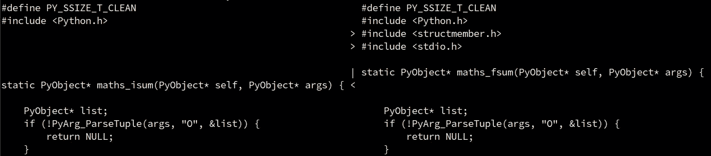

# 您应该知道的 13 个有用的 Shell 命令

> 原文：<https://towardsdatascience.com/13-useful-shell-commands-you-should-know-4a28cfbe5732>

## 提高生产力和增强您的终端技能


用 DALLE-2 生成的图像

对于很多程序员来说，终端就像第二个家，只不过一切都触手可及。想象一下，当你舒舒服服地躺在床上，冲咖啡，用手指轻轻一划就可以毫不费力地拉开窗帘，甚至可以遛狗。这就是开发人员喜欢命令行的原因:您可以快速完成所有工作，而无需点击数十个窗口。

然而，为了提高使用 shell 的效率，您必须习惯于使用纯文本界面执行任务，并且不可避免地要学习一些命令。一旦你知道了像改变目录和文件目录这样的基础知识，是时候学习那些常用的命令了，这些命令会给你的控制台工作效率带来积极的影响。

在本文中，我将向您展示我一直使用的 13 个命令，按用例分组。请注意，有些系统可能没有捆绑所有这些实用程序，但是您可以使用您选择的软件包管理器轻松地安装它们。

## 更好的输出可视化

如果您使用终端已经有一段时间了，那么您肯定会遇到这样的情况:命令输出太大，以至于无法显示在屏幕上，甚至无法显示在终端历史记录中。在读取大型日志文件或列出文件和目录时，通常会出现这种情况。

幸运的是，有三个命令可以解决这个问题:`head`、`tail`和`less`。

`head`仅打印输入的第一行(或字节)。默认打印行数为 10，但您可以通过`-n`选项指定:

```
$ cat large_file.log | head -n 30
```

上面的命令只打印 cat-ted 文件的前 30 行。

`tail`与`head`相反:仅打印给定输入的最后一行(或字节):

```
$ cat large_file.log | tail
```

上面的命令打印给定输入的最后 10 行。

最后，`less`允许您使用箭头键或滚轮、利用快捷方式等，轻松浏览文本，无论是文件还是命令输出。如果你必须浏览大量输出，`less`是你最好的朋友。

不要忘记按`q`从`less`退出，否则你可能会永远被锁在一个仅次于`vim`的无法逃脱的监狱里。在本文的后面，我们将会遇到一些常见的`less`命令的实际应用。

## 计算代码行数

如果您正在进行一个大型项目，您可能会好奇它由多少行代码组成。您可以利用命令行的强大功能来为您完成繁重的工作，而不是打开每一个源代码文件，记下行数，然后手动添加它们。

首先，`wc`命令可以和它的`-l`选项一起使用来计算一个给定文件的行数。然而，代码库是由多个文件和嵌套目录组成的。这就是`find`命令派上用场的地方。

`$ find <dir_name> -name "*.py"`

将查找指定目录及其子目录中扩展名为`.py`的每个文件。除此之外，您可以将结果传输到`sort`以产生更整洁的输出。最后的命令如下所示:

```
$ find . -name "*.cpp" | xargs wc -l | sort -nr
```

上面的命令打印当前目录及其子目录中每个`.cpp`文件的行数，加上总行数，全部以整齐的降序排列。

但是，如果您想在普查中包含其他文件类型，例如头文件，该怎么办呢？`find`允许您指定多个模式进行查找:

```
$ find . -name '*.cpp' -o -name '*.hh' | xargs wc -l | sort -nr
```

这是我在一个 C++项目中用来计算所有代码行的命令，包括源代码和头文件。下面是一个输出示例:

```
1917 total
  768 ./src/processor.cpp
  137 ./headers/processor.hh
  100 ./headers/byte_code.hh
   84 ./src/byte_code.cpp
   75 ./src/memory.cpp
   64 ./src/main.cpp
   55 ./src/registers.cpp
   42 ./headers/registers.hh
   40 ./headers/memory.hh
```

最后，如果你的代码库太大，以至于把所有东西都打印到控制台上变得很糟糕，你总是可以把输出传递给`less`。因此，最终的行计数器命令应该是:

```
$ find . -name '*.cpp' -o -name '*.hh' | xargs wc -l | sort -nr | less
```

如果您厌倦了一直输入它，您可以将它放在 bash 文件中。

## 获取磁盘使用情况和文件大小

如果您想知道您的虚拟或物理存储设备上还有多少空闲空间，您可以使用`df`命令。实际上，您可能希望使用`-h`选项以人类可读的格式打印尺寸。

`$ df -h`

和示例输出:

```
Filesystem      Size  Used Avail Use% Mounted on
dev             1,9G     0  1,9G   0% /dev
run             1,9G   18M  1,9G   1% /run
/dev/sda2       102G   23G   74G  24% /
tmpfs           1,9G  120M  1,8G   7% /dev/shm
/dev/loop1      114M  114M     0 100% /var/lib/snapd/snap/core/13308
tmpfs           1,9G   42M  1,9G   3% /tmp
/dev/sda1       300M  312K  300M   1% /boot/efi
```

如果你想打印一个目录的大小及其内容，你可以使用`du`命令。

```
$ du . -hacS --apparent-size
```

该命令从当前目录开始，以人类可读的格式列出所有文件和目录的大小，并打印总大小。示例输出:

```
1,3K ./src/main.cpp
870 ./src/errors.cpp
22K ./src/processor.cpp
1,7K ./src/memory.cpp
1,2K ./src/registers.cpp
1,8K ./headers/byte_code.hh
4,4K ./headers/processor.hh
1,1K ./headers/memory.hh
16K ./headers
734 ./Makefile
66K total
```

进一步的改进是排除像`.git`这样的目录，并使用`less`输出结果:

```
$ du . --exclude "**/.git" -hacS --apparent-size | less
```

## 定位文件和程序

如果您必须在系统中搜索一个文件，您可以使用`locate`命令来查找模式或确切的文件名。例如，您想找到您计算机上的所有`.jpg`文件:

```
$ locate .jpg
```

和示例输出:

```
/boot/grub/themes/Vimix/archlinux03.jpg
/boot/grub/themes/Vimix/archlinux04.jpg
/boot/grub/themes/Vimix/archlinux06.jpg
/usr/share/app-info/icons/archlinux-arch-community/64x64/freewheeling_freewheeling.jpg
```

然而，如果您想定位可执行文件、源代码或手册页，您可以使用`whereis`命令:

```
$ whereis gcc
```

上面的命令查找以“gcc”作为基本名称的文件:

```
gcc: /usr/bin/gcc /usr/lib/gcc /usr/share/man/man1/gcc.1.gz /usr/share/info/gcc.info.gz
```

当您必须定位某个程序的安装位置时,`whereis`命令会很有用。或者，你可以使用`which`，但是它的功能比较弱:

```
$ which gcc/usr/bin/gcc
```

## 比较文件

假设您必须检查两个文件是否相等，或者，如果它们不相同，您想知道区别在哪里。`cmp`和`diff`就是为此而生。

`cmp`是更简单的选项。它逐字节比较两个文件，并输出第一个不匹配的字节和行号。如果文件相等，它不会输出任何内容:

```
$ cmp maths.c setup.pymaths.c setup.py differ: byte 1, line 1
```

如果您想要更详细的比较，`diff`显示文件的不同之处:

```
$ diff file1.txt file2.txt13c13
<         return NULL;
---
>         return NULLoaoaoaoao;
```

对于并排比较，您可以使用`-y`选项:

```
$ diff -y file1.c file2.c
```



样本输出。需要一个图像来保持输出格式。

## 获取设备状态

`acpi`实用程序显示关于当前电池电量、热量状态、冷却等有用信息。我通常添加`-V`选项来显示所有可用信息:

`$ acpi -V`

```
Battery 0: Full, 100%
Battery 0: design capacity 3691 mAh, last full capacity 2814 mAh = 76%
Adapter 0: on-line
Thermal 0: ok, 45.0 degrees C
Thermal 0: trip point 0 switches to mode critical at temperature 126.0 degrees C
Thermal 1: ok, 51.0 degrees C
Thermal 1: trip point 0 switches to mode critical at temperature 95.0 degrees C
Cooling 0: Fan 0 of 1
```

我经常发现自己在系统特别加载时使用`acpi`来控制温度。

## 测量执行时间

你有没有想过一个命令或一个脚本需要多少时间来执行？无论您想知道一个编译过程持续了多长时间，还是想比较两个命令的性能，`time`实用程序都允许您测量执行时间和其他有用的参数，例如磁盘 io、平均内存使用量、使用的 CPU 百分比等等。

```
$ time makereal 0m6,256s
user 0m5,835s
sys 0m0,383s
```

或者您可以使用`-f`选项指定输出格式:

```
$ time -f "\nInputs: %I\nOutputs: %O\nTime elapsed: %E" locate gimp...Inputs: 9136
Outputs: 0
Time elapsed: 0:00.74
```

## 结论

一旦您知道一些基本的 shell 命令并开始构建工作流，命令行就可以成为您最好的通用工具，让您只需按几个键就可以高效地处理一切。您不必成为系统专家就能从使用终端中获益:您所需要的只是一些有用的命令和应用它们的大脑。

我希望你喜欢这篇文章。如果你有什么要补充的，请在评论中分享你的想法。感谢阅读！

如果你对学习成功的软件开发职业的基本技能感兴趣，看看下面这个故事:

[](https://betterprogramming.pub/the-language-every-programmer-should-master-8d0dfc461284) [## 每个程序员都应该掌握的语言

### 软件开发不仅仅是写代码

better 编程. pub](https://betterprogramming.pub/the-language-every-programmer-should-master-8d0dfc461284)