# 应对数据科学面试的 14 个概率问题

> 原文：<https://towardsdatascience.com/14-probability-problems-for-acing-data-science-interviews-3735025a6425>

## 用风格解密数据科学访谈中的概率问题

由@briansuman 拍摄的关于 unsplash.com 的照片

*关于概率的问题在任何数据科学面试中都很常见。这些问题可能很有挑战性(也很棘手)，但是如果你经过一些练习并且知道基本的公式和概念，这些问题是很容易解决的。在这篇博客中，我分享了一些关于概率中不同概念的练习题(有解答)。*

**关键词** : *概率，二项分布，贝叶斯定理*

博客假设读者知道基本的概率公式和概念。请参考参考资料部分，获得一些关于这些概念的好的阅读材料。我建议读者首先试着在一张纸上自己解决问题，然后去寻找提示和解决方案。注意:同样的问题可能有许多不同的解决方法。提供的解决方案只是其中一种方式(可能是唯一的方式)。

# 基本概率

Q1。 ***正六边形的 3 个顶点(角)随机连接。形成等边三角形的概率有多大？***

注意:在正六边形中，所有的边和角度都是相等的。等边三角形的三条边都相等。*答案= 0.1。*

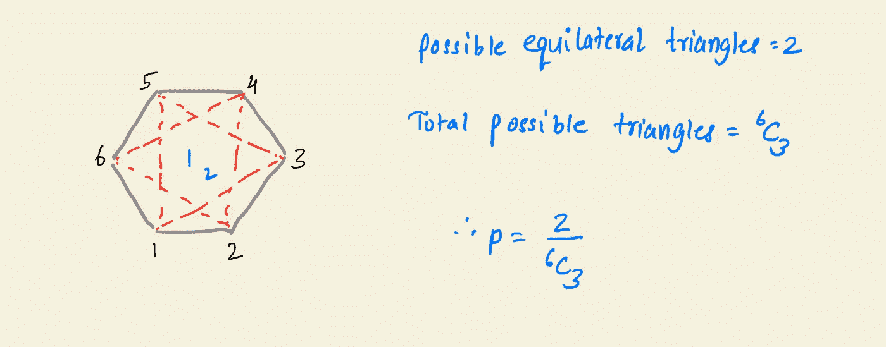

回答 Q1。图片由作者提供。

Q2。 ***甲、乙、丙三人独立向一个目标开火。(I)恰好其中一个击中目标，(ii)至少其中一个击中目标的概率是多少？*** 给定:命中目标的概率。P(A) = 1/6，P(B) = 1/4，P(C) = 1/3。

(I)恰好其中一个击中目标的概率要求另外两个不击中目标。我们可以很容易地看到这一事件发生的三种情况。最后，我们通过对这些情况进行联合来计算概率。

(ii)至少其中一个命中目标的概率是通过创建几个案例并像我们在前面所做的那样取一个并集来解决的。一种更简单的方法是计算同一事件的负值，并将其从 1 中减去。(因为点火是独立的，所以 P(ABC)变成 P(A)P(B)P(C))。

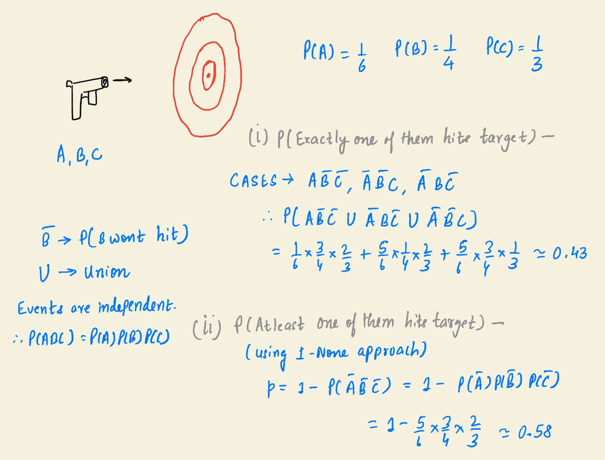

回答 Q2。图片由作者提供。

Q3。 ***老师突击考试的概率是 0.55。如果一个学生缺席两天。他错过一次测试，最多一次测试的概率是多少？***

(一)与上一个问题类似。(ii)错过最多 1 次测试意味着错过 0 次测试或 1 次测试。

PS:这类似于[优步和 Lyft](https://www.quora.com/If-I-call-2-Ubers-and-3-Lyfts-what-is-the-probability-that-all-the-Lyfts-arrive-first) 的问题。

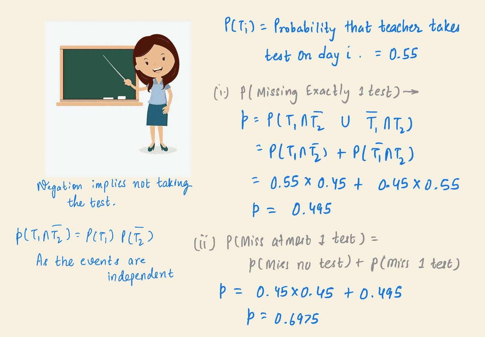

回答 Q3。图片由作者提供。

Q4。 ***一个盒子里装 2 支缺陷笔和 3 支工作笔。笔被逐个测试，直到发现两个有缺陷的笔。在(I)第二次测试，(ii)第三次测试结束时，测试程序结束的概率是多少？***

为了使测试在两次检查结束时结束，前两支起动笔需要有缺陷。为了让测试在三次检查结束时结束，我们可以创建案例并获取联合。

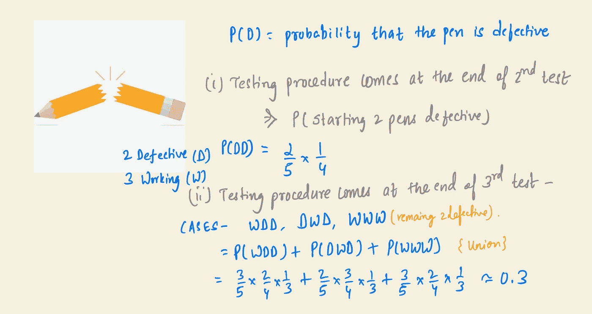

回答 Q4。图片由作者提供。

Q5。 ***如果一个房间里有 30 个人，每个人生日不同的概率是多少？*** *假设一年中有 365 种可能的生日。*

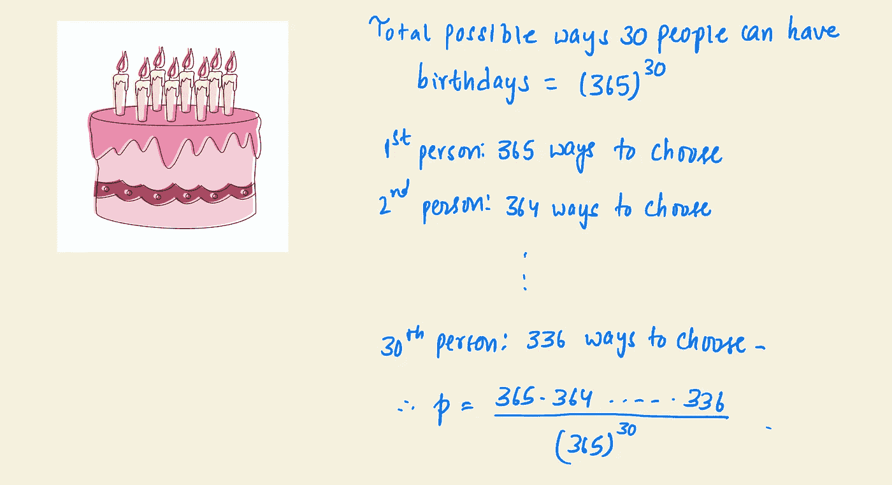

回答 Q5。图片由作者提供。

# 代数问题

Q6。 ***一个变形虫分别有 25%、25%、50%的几率产生 0、1、2 个后代。阿米巴原虫的每个后代也有相同的概率。阿米巴原虫的血统灭绝的概率有多大？***

阿米巴原虫谱系死亡需要产生 0 个后代。如果它产生 1 个后代，那么子代必须产生 0 个后代。两个孩子的后代也是如此。

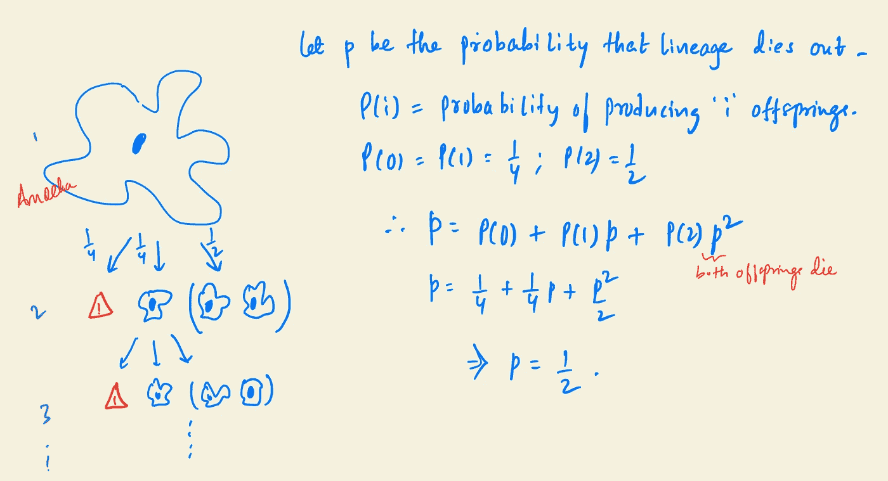

回答 Q6。图片由作者提供。

Q7。2×2 矩阵中的元素是为每个元素独立选择的整数。项为奇数的概率为 p，若行列式的值为偶数的概率为 0.5，求 p .

行列式为奇数/偶数的概率可以通过对奇数/偶数进行分类，然后对这些分类的概率求和来计算。

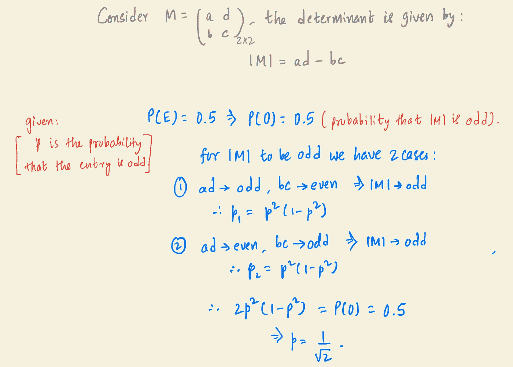

回答 Q7。图片由作者提供。

# 二项分布

Q8。醉汉要么向前一步，要么向后一步。他向前迈一步的概率是 0.4。求 11 步结束时他离起点 1 步的概率？

显然，对于离起点 1 步远的醉汉来说，他可以向前走 5 步(意味着向后走 6 步)从而在起点后 1 步结束，或者他可以向前走 6 步(意味着向后走 5 步)从而在起点前 1 步结束。最后的概率可以通过两个事件的联合来计算。

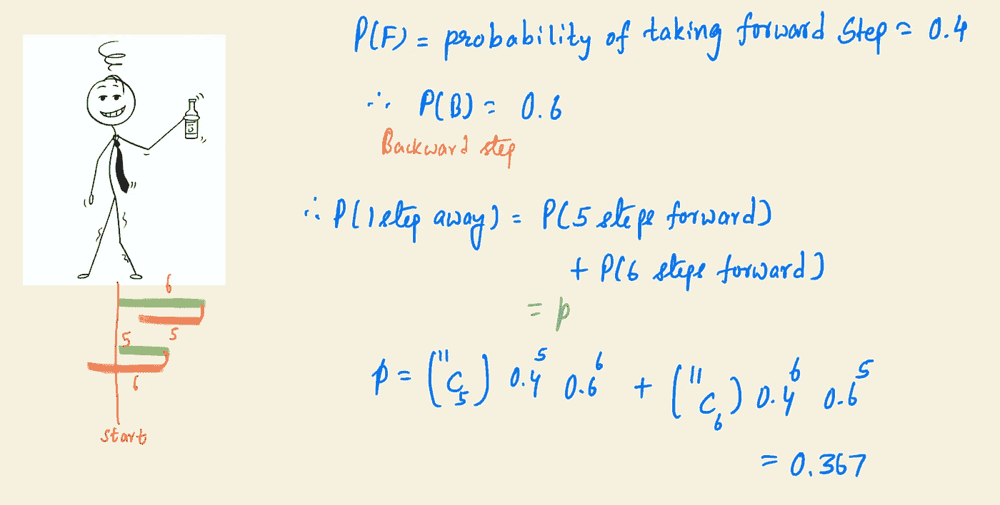

回答 Q8。图片由作者提供。

Q9。在一系列独立的投掷中，一枚硬币正面落地的可能性是反面的两倍。找出第五次投掷时出现第三次投掷的概率。

对于出现在第五次投掷中的第三个头，最初的两个头可以出现在第四次投掷中的任何一次，这成为二项式分布的一种情况。

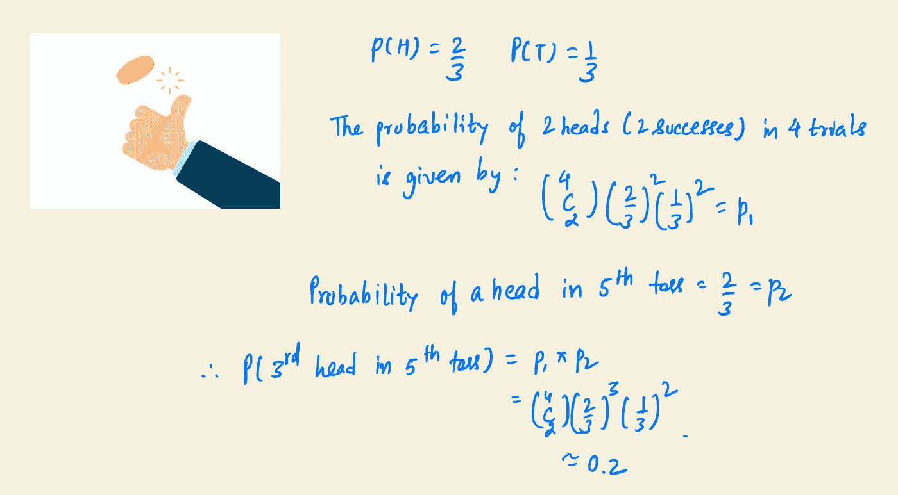

回答 Q9。图片由作者提供。

# 全概率定律

Q10。一位富有的女士在她的钱包里有 4 个夹层。第一格有 1 卢比和 2 枚硬币。第二个有 2 卢比和 3 派斯硬币。第三个有 3 卢比和 4 派斯硬币。第四个有 4 卢比和 6 派斯硬币。

***她随机选择一个隔间&抽取一枚硬币，抽取的硬币是卢比硬币的概率是多少？***

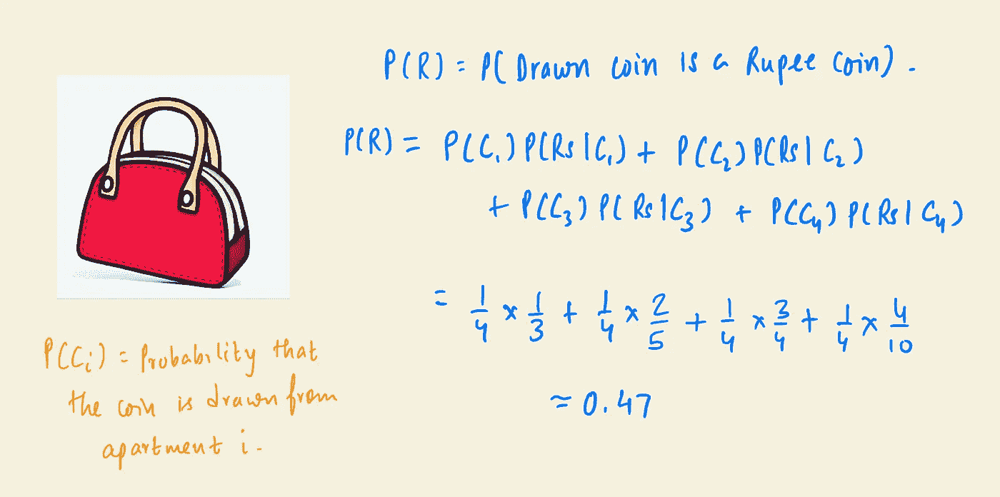

回答 Q10。图片由作者提供。

# 贝叶斯定理

Q11。 ***艾滋病病毒检测准确率达 99%(双向)。只有 0.3%的人口是 HIV +。假设一个随机的人检测为阳性，那么这个人是 HIV 阳性的概率是多少？***

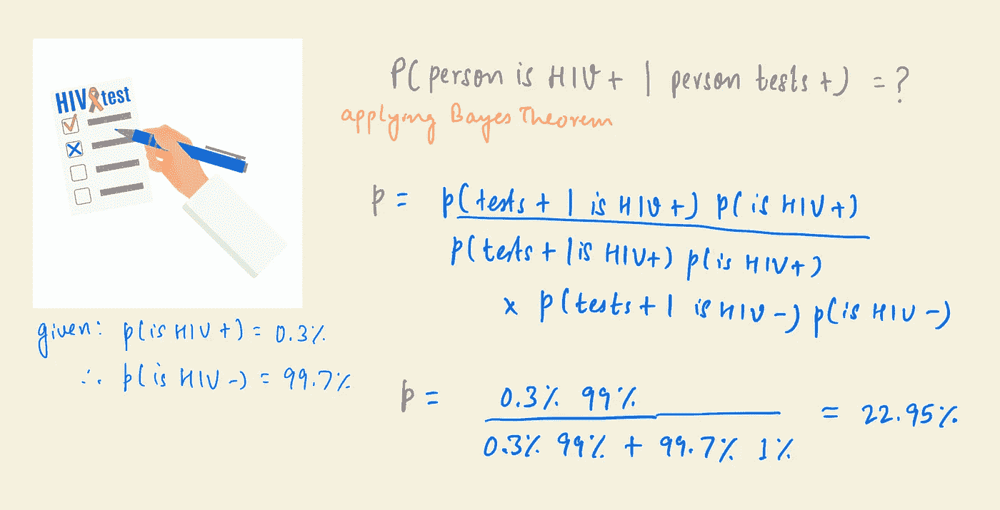

回答 Q11。图片由作者提供。

Q12。 ***A 在 70%的情况下讲真话，B 在 50%的情况下讲真话。找出他们在描述某一事件时会说同样的话的概率？***

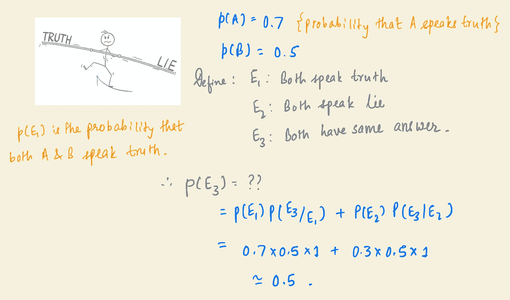

回答 Q12。图片由作者提供。

## 杂项卡问题

Q13。从 52 张洗好的牌中一张一张地发牌。在第一张王牌 *出现之前，恰好发出****【k】张牌的概率是多少？***

我们在间接寻找第一张 ace 出现在第(k+1)张牌中的概率。 **()** 是标准组合的记数法。

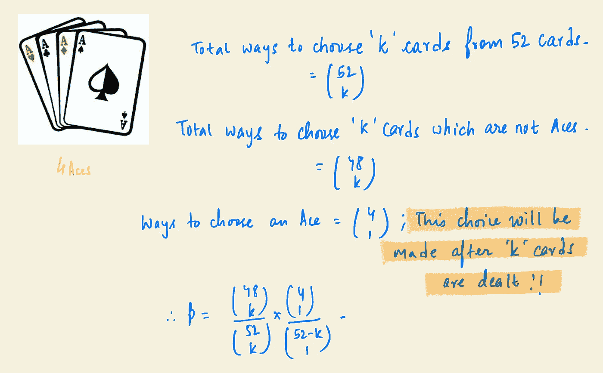

回答 Q13。图片由作者提供。

Q14。从一副 52 张洗好的牌中取出所有的正面牌。从剩下的 40 张牌中，随机抽取 4 张。***4 张牌出自不同花色、不同面额的概率有多大？***

花色总数= 4(黑桃、红心、梅花、方块)；总面额= 13 (2，…，10，A，J，Q，K)。

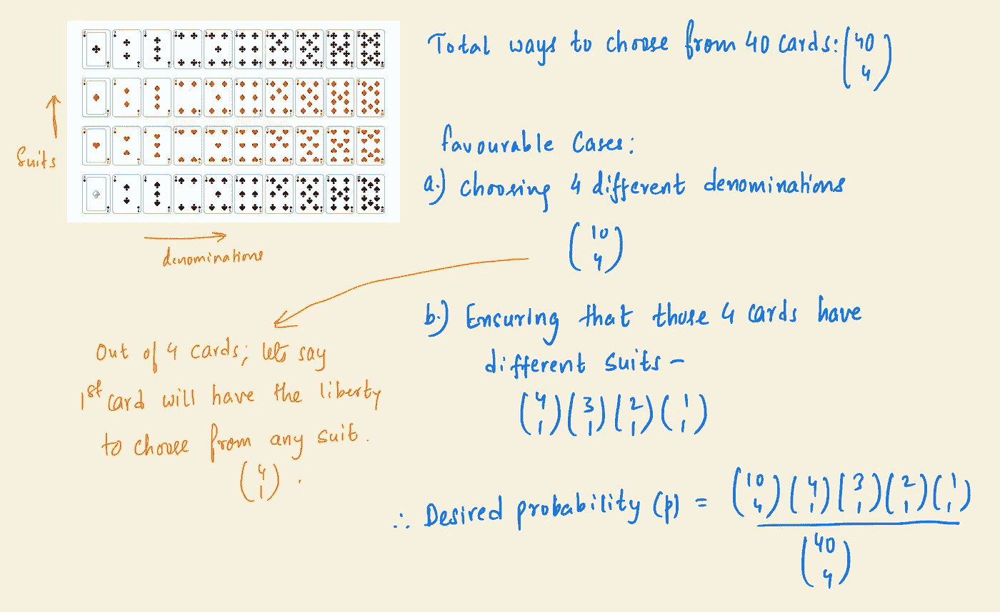

回答 Q14。图片由作者提供。

# 参考

[1].(必读)概率概念的总结理论(包括定律和定理):[https://www.cuemath.com/data/probability/](https://www.cuemath.com/data/probability/)

[2].基本概率概念:[https://seening-theory . brown . edu/basic-Probability/index . html](https://seeing-theory.brown.edu/basic-probability/index.html)(偶然事件、期望等。)

[3].条件概率:[http://www.stat.yale.edu/Courses/1997-98/101/condprob.htm](http://www.stat.yale.edu/Courses/1997-98/101/condprob.htm)

[4].全概率定律:[https://youtu.be/7t9jyikrG7w](https://youtu.be/7t9jyikrG7w)

[5].贝叶斯定理(3 blue 1 brown):[https://youtu.be/HZGCoVF3YvM](https://youtu.be/HZGCoVF3YvM)

[6].二项式分布(汗阿卡德。):[https://youtu.be/WWv0RUxDfbs](https://youtu.be/WWv0RUxDfbs)

[7].排列组合:[https://youtu.be/XJnIdRXUi7A](https://youtu.be/XJnIdRXUi7A)

[8].一些概率统计的 YouTube 频道推荐:@ [jbstatistics](https://www.youtube.com/user/jbstatistics) ，[@ organicchemistrytutor](https://www.youtube.com/c/TheOrganicChemistryTutor)

我希望这是一些关于概率的很好的练习，并且你喜欢解决这些问题。我很高兴知道任何不同的方法来解决上述问题。我很乐意回答任何疑问或讨论上述任何问题。**反馈**非常感谢。拍手声👏🏼也是一个很好的反馈😇。祝你下次数据科学面试好运。你可以通过 Linkedin 联系我。

# 谢谢你！