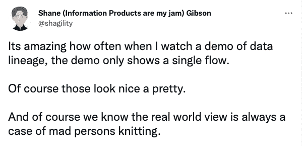

# 评估数据谱系时要问的 14 个问题

> 原文：<https://towardsdatascience.com/14-questions-to-ask-when-evaluating-data-lineage-d7af718b150a>

## 正在寻找数据沿袭工具？这些是您应该询问的关键“问题”和功能。

*照片由* [*克劳福德*](https://unsplash.com/@crawford?utm_source=unsplash&utm_medium=referral&utm_content=creditCopyText) *上* [*下*](https://unsplash.com/?utm_source=unsplash&utm_medium=referral&utm_content=creditCopyText)

数据沿袭可能会很混乱。

就像织毯子一样。线从各个方向来来去去，多得数不清。所有这些都必须以一种复杂的模式完美地结合在一起。弄对了就是艺术，哪怕有一个元素不符合，就是混乱。

沿袭很难得到正确的结果，因为存在大量的变量——来自各种来源(不断变化的旧来源和最新的新来源)的数据，每个阶段的转换，命名和描述数据资产所涉及的复杂语言，编写数据逻辑和代码的不同风格，等等。

尽管这很困难，但我们不能放弃。沿袭在数据团队工具箱中是不可或缺的，它揭示了数据流并支持重要的用例，如影响分析、根本原因分析、治理和法规遵从性。

在您搜索合适的数据沿袭工具以全面评估其**深度**(支持的唯一源的数量)**广度**(每个源支持的字段或对象的数量)，以及**效用**(跨不同数据角色提供洞察力和行动的能力)时，这里有 14 个问题要问。

*作者谢恩·吉布森(*[*@ shag bility*](https://twitter.com/shagility)*)*

# 1.它会自动解析 SQL 查询吗？

许多数据平台都提供了沿袭 API，因此任何沿袭系统都可以轻松地从这些来源获取和使用沿袭。但是，并不是每个平台都这样做。自动 SQL 解析对于填补这些空白并确保您的谱系完整，涵盖所有数据源、流程和资产至关重要。

如果您只在仓库层解析 SQL，那么来自没有本地查询历史的数据源的 SQL 查询(例如像 [PostgreSQL](https://www.postgresql.org/) 和 [MySQL](https://www.mysql.com/) 这样的关系数据库)将会漏网。

**寻找从没有“查询历史”特性的源系统中读取 SQL 查询转储的能力。**

# 2.支持哪些类型的 SQL 语句？

为了避免血统上的差距，从各种类型的 SQL 语句中解析和注册血统是很重要的:

*   `CREATE TABLE`
*   `CREATE TABLE AS SELECT`
*   `CREATE VIEW`
*   `MERGE`
*   `INSERT INTO`
*   `UPDATE`

大多数 SQL 解析器支持 SQL `CREATE`，在某些情况下，还支持`MERGE`语句。但是，很多不支持`INSERT INTO`和`UPDATE`语句。这些说明了数据仓库中的大多数转换，因此它们对于完整的沿袭覆盖非常重要。

**寻找还可以解析** `**MERGE**` **、** `**INSERT INTO**` **和** `**UPDATE**` **语句的血统。**

# 3.沿袭 API 支持程序化的沿袭创建和检索吗？

数据生态系统在不断发展，新的数据源也在不断涌现。以编程方式处理来自不受支持的来源的沿袭(通过一个开放的 API)是扩展沿袭的关键，而不必担心您可以和不可以采用哪些新平台。

**寻找两个关键特征:**

*   能够通过 API 以编程方式检索和创建沿袭。
*   能够**跨任何对象类型发布和检索表和列级沿袭**。

# 4.沿袭是本地的功能，还是由外部合作伙伴提供的？

在沿袭中，处理边缘案例是一种规范，新的边缘案例通常需要定制特性或沿袭供应商的支持。

Lineage 通常被打包为更大的目录或异常检测产品的一部分。有时，这种血统是天生可用的，并得到产品团队的支持。然而，有时它是通过外部合作伙伴来实现的，这会导致帮助和修复速度变慢。

寻找三个关键特征

*   沿袭能力是本地支持的还是外部提供的。
*   产品团队是否**直接控制谱系开发**。
*   **明确支持 SLA 和工程依赖矩阵**(如果存在外部依赖)。

# 5.它如何适应现代数据堆栈的变化？

数据转换工具和过程总是在不断发展。即使客户从旧的堆栈转换到最新的数据工具，沿袭也应该始终保持可靠。

如果源系统发生变化，将沿袭从数据源(例如，从转换过程中)拉得更远会导致问题。从尽可能靠近源头的地方提取血统通常更安全，也更经得起未来的考验。

**寻找从源系统的查询历史中提取的血统(例如，从** [**雪花**](https://www.snowflake.com/en/) **)** 而不是与下游转换工具或过程集成。

# 6.它是否具有云原生的灵活性来扩展 SQL 解析需求？

在沿袭中，很容易出现大规模 SQL 解析需求。(我们亲眼见过每天有超过 100 万次查询的客户。)解析这些查询需要大量的计算资源，所以你的血统能跟上很重要。

云原生产品使用网飞等公司发明的最新设计模式和微服务，实现无限的可扩展性。当心那些不是为云构建的或者有遗留技术债务的平台——它们很难维护，随着你的血统扩展，会导致性能问题。

**寻找支持大规模 SQL 解析的现代云原生架构。**

# 7.它提供向下到列级别的沿袭吗？

表级沿袭被认为是“表桩”，但列级沿袭也应该如此。这对一系列使用情形至关重要:

*   追踪转换后的 PII 数据的敏感数据分类
*   模式变更等因素的影响分析
*   根本原因分析——例如，通过跟踪 BI 字段到数据仓库中的上游列来调查为什么仪表板看起来不正常

如果不能深入到粒度列或字段谱系中，数据工程师和分析师可能会在调查过程中错过关键深度。

**寻找两个关键特征:**

*   **UI 中的原生列级体验**，包括在列级查看图形链接。
*   **支持** `**MERGE**` **、** `**INSERT INTO**` **、** `**UPDATE**`、 SQL 语句，这些语句是列级转换的关键。

# 8.它是否自动将上游 SQL 源与下游 BI 资产连接起来？

通常，沿袭的目标是识别为什么最后一英里的某些东西看起来不对劲。作为公司数据的管理者，数据工程团队负责确保提供给最终用户资产的数据是可信和可靠的。当这个失败时，血统是一个重要的诊断工具。

并不是所有血统都会天生连接到你选择的 BI 工具(例如 [Looker](https://www.looker.com/) 、 [Tableau](https://www.tableau.com/) 、 [Power BI](https://powerbi.microsoft.com/en-us/) 等)。有些依赖耗时的手动脚本和资产推送，即使对于主要的 BI 工具也是如此。

**寻找能够自动连接到您选择的 BI 工具的本机连接器或自动化脚本。**

# 9.它是否支持 BI 仪表板的字段级沿袭？

任何进行根本原因分析的人都需要深入到一个不正确的字段(即维度、度量、计算字段等。)中，并向后工作以集中在上游字段或损坏的列上。这仅适用于 BI 工具的字段级沿袭。

字段级沿袭对于影响分析也很重要。如果数据工程师试图进行模式更改，他们需要了解将受到影响的特定下游列和字段，而不仅仅是哪些仪表板将以某种未指明的方式受到影响。

一些平台支持一些字段的沿袭，但是没有深入到对这些类型的分析至关重要的 BI 字段。

**寻找两个关键特征:**

*   涵盖 SQL 源的**列级沿袭和 BI 字段级沿袭**。
*   **您的 BI 工具的对象是否在沿袭**中被支持和公开。(例如在 Looker 中，lineage 是否会覆盖所有你关心的字段/对象，比如仪表盘、外观、浏览、磁贴、字段、视图？)

# 10.它能否使用 Salesforce 中的数据创建上游沿袭(在对象和字段级别)？

我们经常听说 [Salesforce](https://www.salesforce.com/) 是“狂野西部”,没有人知道 ETL 管道中的数据发生了什么。然而，开放 Salesforce(和其他关键的 SaaS 源系统)可以改变游戏规则，帮助数据和业务团队进行协作。影响分析是这里的一个主要用例，因为 Salesforce 字段一直在变化，并对下游造成严重破坏。

如果可能，确保调查 Salesforce 血统的深度。一些沿袭始于存储层(即数据仓库、湖等)。能否在存储层上游为 Salesforce 等 SaaS 工具生成沿袭？

如果有，深入到什么程度？一些系统不能深入到 Salesforce 对象和字段级别，这对于使下游沿袭有用和理解下游数据资产的上下文至关重要。

**从 Salesforce 到数据仓库层寻找对象和字段级沿袭。**

# 11.它能与现代数据集成工具集成吗？

在数据仓库的上游建立血统是困难的。大规模地这样做，尤其是当您从多个源系统中提取数据时，会更加困难。

如果您遵循 ELT 方法，那么您的血统能够与现代数据集成工具(如 [Fivetran](https://www.fivetran.com/) )连接是非常重要的。这使您可以构建上游沿袭，创建真正的端到端沿袭，并显示数据在进入存储层之前发生了什么。

**看看它是否能本地连接到 Fivetran 或其他现代数据集成工具。**

# 12.它能与数据块集成并为 Spark 作业生成血统吗？

[火花](https://spark.apache.org/)血统难以生成。但是，如果您使用 Databricks，这是了解您的转换并创建可用血统的关键，以帮助数据科学家、工程师和分析师处理 Databricks 中的 ML 和分析工作负载。

寻找两个关键特征:

*   它是否从**数据块** [**Unity 目录**](https://www.databricks.com/product/unity-catalog) **API** (包括 Spark、Scala 和 SQL)中获取血统
*   是否支持数据块下游 BI 工具中的**字段级沿袭**。

# 13.它是否结合了其他类型的元数据来为谱系图中的资产提供额外的上下文？

孤立地看，血统只讲述了故事的一部分，因此，只提供了价值的一部分。当与关键元数据和上下文结合时，沿袭变得可操作:

*   **操作元数据**:资产是如何以及何时被编排的？
*   **质量和异常元数据**:资产处于什么状态？他们可靠吗？
*   **业务/语义元数据**:资产如何链接到关键业务术语或 KPI？
*   **所有者和专家元数据**:在故障诊断过程中，您应该与谁联系或合作？
*   **社交元数据**:该资产的人文背景是什么——例如关于该资产的相关[闲散](https://slack.com/)讨论或[吉拉](https://www.atlassian.com/software/jira)门票？这是机器本身会错过的。

有时候谱系图看起来是另一种孤立的视图。如果没有这些资产的其他元数据，就很难将沿袭放在上下文中。

**寻找三个关键特征:**

*   **开放性**:一个“设计开放”的可扩展平台，您可以通过 API(包括定制的连接器)从任何来源获取数据和元数据。
*   **灵活性**:支持来自这些来源的广泛的技术、操作、异常/质量和业务/语义元数据。
*   **个性化**:个性化的数据体验，每个角色都能看到适合自己的元数据，而不是淹没在所有的元数据中。

# 14.它不仅可以用来调查问题，还可以有计划地推动行动吗？

除了支持数据人员的工作，lineage 还可以支持自动化系统操作和工作流。

例如，如果上游表有数据质量问题，那么自动向下游 BI 仪表板添加公告就很重要。这可以防止业务用户创建“垃圾输入，垃圾输出”的分析，并节省数据分析师和工程师手动发送警报或警告的时间。

一些平台没有底层架构和可伸缩性来执行基于血统的自动化操作。

寻找开放 API、构建或定制自动化工作流的能力，以及读取元数据更改事件并触发整个谱系图中链接资产的更改的能力。

**发现这个有用吗？** [**阅读我们的完整数据谱系电子书，获取五个额外问题和更多信息。**](https://atlan.com/resources/data-lineage/)

**本博客由 Mark Pavletich(销售工程总监)和 Swaminathan Kumar(战略&情报)在**[**Atlan**](https://atlan.com/)**共同撰写。**