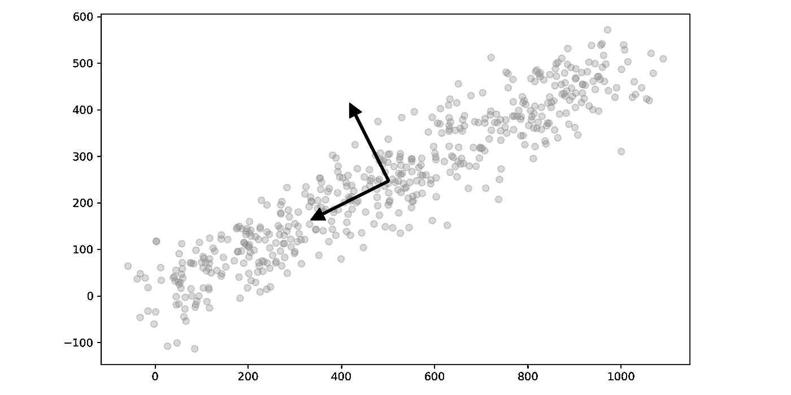
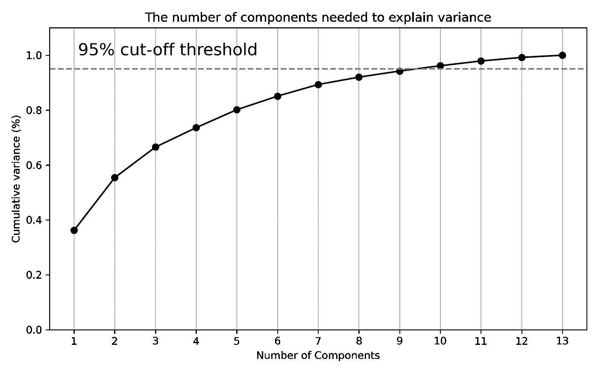
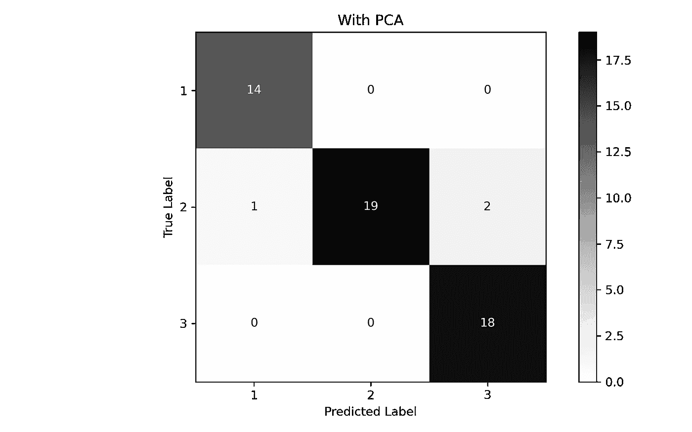
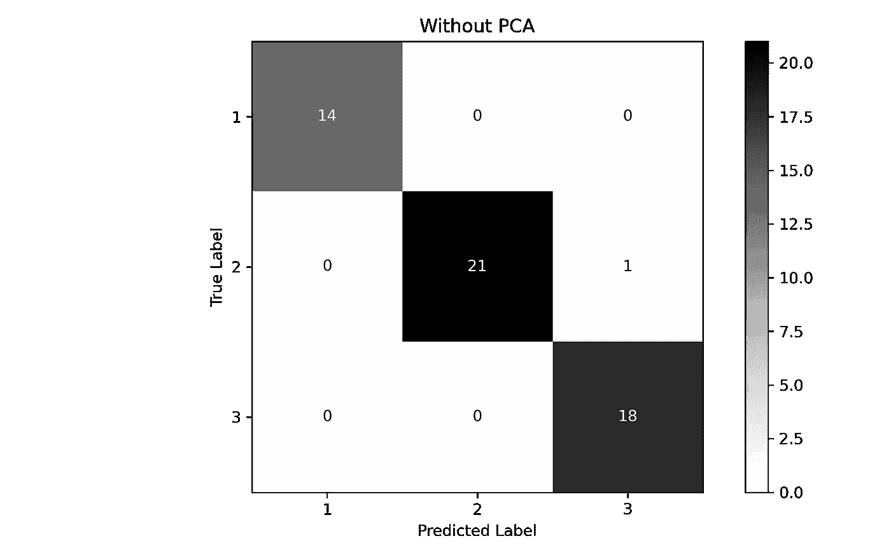

# 可视化 PCA 的两种美丽方式

> 原文：<https://towardsdatascience.com/2-beautiful-ways-to-visualize-pca-43d737e48ff7>

## 加上模型调整和评估，以选择最佳数量的组件。


[K8](https://unsplash.com/@k8_iv?utm_source=medium&utm_medium=referral) 在 [Unsplash](https://unsplash.com?utm_source=medium&utm_medium=referral) 上拍照

# 什么是 PCA？

**主成分分析**或 **PCA** 是一种*降维技术*，用于具有许多特征或维度的数据集。它使用线性代数来确定数据集最重要的特征。在识别出这些特征后，您可以仅使用最重要的特征或那些*解释最大差异*的特征，来训练机器学习模型，并在不牺牲准确性的情况下提高模型的计算性能。

PCA 找到具有最大方差的轴，并将这些点投影到该轴上。PCA 使用称为**特征向量**和**特征值**的线性代数概念。[栈交换](https://stats.stackexchange.com/questions/2691/making-sense-of-principal-component-analysis-eigenvectors-eigenvalues/140579)上有个帖子很漂亮的解释了一下。

这是一个用特征向量绘制的二维数据的快速视图。您可以看到其中一个向量是如何与方差最大的维度对齐的，而另一个向量是正交的。然后将数据投影到该轴上，减少数据量，但保持总体方差。



作者图片

最近我写了一篇关于 PCA 如何用于图像压缩的文章。这次我想通过可视化来谈谈 PCA 的一些基础知识。当我在学习 PCA 以及它作为机器学习工具箱中的一个工具有多么强大时，我遇到了两种不同的方法来可视化 PCA ，最终让它为我所用。我想我会与你分享这两种方法，并进一步展示模型如何在使用和不使用降维的情况下执行*和*。这两种方法是:**

1.  **解释方差累积图**:这个简单但是强大。它会立即告诉您数据中有多少方差是由每个分量解释的，以及不同分量的组合如何构成总方差。
2.  **原始数据叠加的主成分**:这个是我绝对喜欢的。你可以看到每一个主成分是如何带来稍微多一点的信息的，反过来，也就很难区分不同的成分。该图是解释方差累积图的完美伴侣。

你听够了吗？我们走吧！

# 入门指南

我们将使用的数据集是来自加州大学欧文分校机器学习知识库的[葡萄酒数据集](https://archive.ics.uci.edu/ml/datasets/wine)。数据集包含关于葡萄酒质量的数据。该数据集获得了[知识共享署名 4.0](https://creativecommons.org/licenses/by/4.0/legalcode) 国际(CC BY 4.0)许可。

当然，我们将从**导入**所需的包和**加载数据**开始。

```
import numpy as np
import pandas as pd
import warnings
warnings.filterwarnings('ignore')

# Machine Learning
from sklearn import metrics
from sklearn.metrics import ConfusionMatrixDisplay
from sklearn.pipeline import Pipeline
from sklearn.pipeline import FeatureUnion
from sklearn.preprocessing import StandardScaler
from sklearn.decomposition import PCA
from sklearn.decomposition import IncrementalPCA
from sklearn.model_selection import GridSearchCV
from sklearn.model_selection import cross_val_score
from sklearn.model_selection import train_test_split
from sklearn.neighbors import KNeighborsClassifier
from sklearn.ensemble import RandomForestClassifier
from sklearn.linear_model import LogisticRegression

# Plotting
import seaborn as sns
import matplotlib.pyplot as plt
%matplotlib inline
```

```
df = pd.read_csv("wine.csv")
```

这个特殊的数据集有 **13 个特征**和一个名为**类**的目标变量，我们可以用它来进行[分类](https://medium.com/@broepke/go-beyond-binary-classification-with-multi-class-and-multi-label-models-6ce91ca08264)。每个值都是连续的，因此我们可以直接将 PCA 应用于所有变量。通常我们会在更高维的数据集上使用 PCA，但是这个数据集将显示概念。

```
df.info()
```

```
[OUT]
<class 'pandas.core.frame.DataFrame'>
RangeIndex: 178 entries, 0 to 177
Data columns (total 14 columns):
 #   Column                Non-Null Count  Dtype  
---  ------                --------------  -----  
 0   Class                 178 non-null    int64  
 1   Alcohol               178 non-null    float64
 2   Malic acid            178 non-null    float64
 3   Ash                   178 non-null    float64
 4   Ash Alcalinity        178 non-null    float64
 5   Magnesium             178 non-null    int64  
 6   Total phenols         178 non-null    float64
 7   Flavanoids            178 non-null    float64
 8   Nonflavanoid phenols  178 non-null    float64
 9   Proanthocyanins       178 non-null    float64
 10  Color intensity       178 non-null    float64
 11  Hue                   178 non-null    float64
 12  OD280/OD315           178 non-null    float64
 13  Proline               178 non-null    int64  
dtypes: float64(11), int64(3)
memory usage: 19.6 KB
```

快速检查不平衡数据向我们展示了这个数据集，不像大多数数据集，是相当平衡的。在这次演示中，我们将保持原样。

```
df['Class'].value_counts()
```

```
2    71
1    59
3    48
Name: Class, dtype: int64
```

让我们创建我们的`X`和`y`变量，其中`X`是除了类之外的每个特性，`y`是类。

```
y = df['Class'].copy()
X = df.drop(columns=['Class']).copy().values
```

# 查找解释的差异

第一步是找到每个主成分的**解释方差**。我们通过首先用`StandardScalar`缩放我们的数据，然后用 PCA 模型拟合缩放后的数据来计算解释方差。[标准缩放器](https://scikit-learn.org/stable/modules/preprocessing.html#preprocessing-scaler)是一个简单的转换，它将数据标准化为具有`0`和`0`单位方差的平均值，或`1`的标准偏差。

您还会注意到，主成分的总数*等于数据集中特征的总数*。然而，需要注意的一件重要事情是，主要组件不是数据集的列；相反，主成分分析正在构建新的特征来最好地解释数据。**

```
*def get_variance(X, n):
    scaler = StandardScaler()
    pca = PCA(n_components=n)

    pca.fit(scaler.fit_transform(X))

    return pca.explained_variance_ratio_.cumsum()[-1:]*
```

```
*for i in range(1,14):
    print('Components:\t', i, '=\t', get_variance(X, i), 
          '\tCumulative Variance')*
```

```
*Components:  1 =     [0.36198848]   Cumulative Variance
Components:  2 =     [0.55406338]   Cumulative Variance
Components:  3 =     [0.66529969]   Cumulative Variance
Components:  4 =     [0.73598999]   Cumulative Variance
Components:  5 =     [0.80162293]   Cumulative Variance
Components:  6 =     [0.85098116]   Cumulative Variance
Components:  7 =     [0.89336795]   Cumulative Variance
Components:  8 =     [0.92017544]   Cumulative Variance
Components:  9 =     [0.94239698]   Cumulative Variance
Components:  10 =    [0.96169717]   Cumulative Variance
Components:  11 =    [0.97906553]   Cumulative Variance
Components:  12 =    [0.99204785]   Cumulative Variance
Components:  13 =    [1.]           Cumulative Variance*
```

*此外，每个主要分量加在一起，所有分量的总和将等于`1`。当您浏览累积差异列表时，您会看到第*个组件是最重要的*，最后一个组件是最不重要的；换句话说，第一个成分对方差的贡献最大。随着我们包含越来越多的组件，每个组件的贡献量开始减少。让我们通过绘制累积方差来形象化这一点。*

# *绘制解释方差的阈值*

*虽然这些值的打印输出是一个良好的开端，但我们可以通过绘制这些值来改进。此外，我们将绘制一条线，代表解释的方差的`95%`。虽然没有规则规定模型中需要包含多少解释方差，但`95%`是一个很好的起点。稍后，我们将执行网格搜索，以找到在模型中使用的最佳组件数量。*

```
*scaler = StandardScaler()
data_rescaled = scaler.fit_transform(X)

pca = PCA().fit(data_rescaled)

plt.rcParams["figure.figsize"] = (8,5)

fig, ax = plt.subplots()
xi = np.arange(1, 14, step=1)
y = np.cumsum(pca.explained_variance_ratio_)

plt.ylim(0.0,1.1)
plt.plot(xi, y, marker='o', linestyle='-', color='black')

plt.xlabel('Number of Components')
plt.xticks(np.arange(1, 14, step=1)) 
plt.ylabel('Cumulative variance (%)')
plt.title('The number of components needed to explain variance')

plt.axhline(y=0.95, color='grey', linestyle='--')
plt.text(1.1, 1, '95% cut-off threshold', color = 'black', fontsize=16)

ax.grid(axis='x')
plt.tight_layout()
plt.savefig('pcavisualize_1.png', dpi=300)
plt.show()*
```

**

*作者图片*

*在绘制了累积解释方差后，我们可以看到曲线在`6`或`7`成分附近变得平缓。在我们为`95%`绘制的线处，总的解释偏差大约在`9`分量处。这就是解释差异可视化！让我们继续绘制实际的组件。*

# *绘制每个组件与原始数据的对比图*

*下一步是可视化每个组件产生的数据，而不是解释的差异。我们将使用 PCA 模型的`inverse_transform`方法，这将获取每个组件并将它们转换回原始数据规模。我们将绘制来自`1-13`的整个元件范围，并用原始数据覆盖它们。*

```
*# Function to perform PCA with n-Components
def transform_pca(X, n):

    pca = PCA(n_components=n)
    pca.fit(X)
    X_new = pca.inverse_transform(pca.transform(X))

    return X_new*
```

```
*# Plot the components
rows = 4
cols = 4
comps = 1

scaler = StandardScaler()
X_scaled = scaler.fit_transform(X)

fig, axes = plt.subplots(rows, 
                         cols, 
                         figsize=(12,12), 
                         sharex=True, 
                         sharey=True)

for row in range(rows):
    for col in range(cols):
        try:
            X_new = transform_pca(X_scaled, comps)
            ax = sns.scatterplot(x=X_scaled[:, 0], 
                                 y=X_scaled[:, 1], 
                                 ax=axes[row, col], 
                                 color='grey', 
                                 alpha=.3)
            ax = sns.scatterplot(x=X_new[:, 0], 
                                 y=X_new[:, 1], 
                                 ax=axes[row, col], 
                                 color='black')
            ax.set_title(f'PCA Components: {comps}');

            comps += 1
        except:
            pass
plt.tight_layout()
plt.savefig('pcavisualize_2.png', dpi=300)*
```

**

*在我们的图中，灰色数据是原始数据，黑点是主成分。仅显示一个组件**,它以一组点的形式投影在一条线上，这条线沿着原始数据中方差最大的轴。随着越来越多的组件被添加，我们可以看到数据开始与原始数据相似，即使显示的信息更少。当我们进入上限值时，数据开始与原始数据相匹配，最终，在所有 13 个分量上，它与原始数据相同。***

*这是我最喜欢的视觉化 PCA 的方式！现在让我们用一个机器学习分类模型把它付诸行动。*

# *比较主成分分析和非主成分分析分类模型*

*让我们对数据集运行三个分类器，应用和不应用 PCA，看看它们的性能如何。为了有趣起见，我们将只使用前两个组件(`n_components=2`)来比较它们。我们将比较`KNeighborsClassifier`、`RandomForestClassifier`和`LogisticRegression`作为我们的分类器，看看它们的表现如何。*

*和往常一样，我们将使用一个[管道](/using-pipelines-in-sci-kit-learn-516aa431dcc5)将我们的数据预处理和 PCA 合并到一个单独的步骤中。我们将使用之前使用的相同的`StandardScaler`来缩放数据，然后用一定数量的组件来拟合数据。由于我们将在工作流程中多次使用该功能，因此我们将其设置为灵活的。*

```
*def create_pipe(clf, do_pca=False, n=2):

    scaler = StandardScaler()
    pca = PCA(n_components=n)

    if do_pca == True:
        combined_features = FeatureUnion([("scaler", scaler), 
                                          ("pca", pca)])
    else:
        combined_features = FeatureUnion([("scaler", scaler)])

    pipeline = Pipeline([("features", combined_features), 
                         ("clf", clf)])

    return pipeline*
```

*接下来是循环不同的分类器并执行**交叉验证**。如上所述，我们将尝试三种不同的分类器，并在应用和不应用 PCA 的情况下分别测试它们。*

```
*models = {'KNeighbors' : KNeighborsClassifier(),
          'RandomForest' : RandomForestClassifier(random_state=42),
          'LogisticReg' : LogisticRegression(random_state=42),
          }

def run_models(with_pca):
    for name, model, in models.items():
        clf = model
        pipeline = create_pipe(clf, do_pca = with_pca, n=2)
        scores = cross_val_score(pipeline, X, 
                                 y, 
                                 scoring='accuracy', 
                                 cv=3, n_jobs=1, 
                                 error_score='raise')
        print(name, ': Mean Accuracy: %.3f and Standard Deviation: \
             (%.3f)' % (np.mean(scores), np.std(scores)))

print(68 * '-')
print('Without PCA')
print(68 * '-')
run_models(False)
print(68 * '-')
print('With PCA')
print(68 * '-')
run_models(True)
print(68 * '-')*
```

```
*--------------------------------------------------------------------
Without PCA
--------------------------------------------------------------------
KNeighbors : Mean Accuracy: 0.944 and Standard Deviation: (0.021)
RandomForest : Mean Accuracy: 0.961 and Standard Deviation: (0.021)
LogisticReg : Mean Accuracy: 0.972 and Standard Deviation: (0.021)
--------------------------------------------------------------------
With PCA
--------------------------------------------------------------------
KNeighbors : Mean Accuracy: 0.663 and Standard Deviation: (0.059)
RandomForest : Mean Accuracy: 0.955 and Standard Deviation: (0.021)
LogisticReg : Mean Accuracy: 0.972 and Standard Deviation: (0.028)
--------------------------------------------------------------------*
```

***魔法！**我们看到，在没有 PCA 的情况下，所有三个模型都表现得相当好。然而，只有前两个组件，`RandomForest`的性能几乎相同，而`LogisticRegression`的性能与原始组件完全相同！并不是所有的用例都是这样的，但是希望这能让我们一窥 PCA 的威力。如果你回头看看上面的图，每一个部分都重叠了，你可以看到需要的数据少了多少。*

# *找到组件的最佳数量*

*对于这一部分，我们将使用`train_test_split`函数将数据集分割成`70/30%`个分区，然后使用`GridSearch`特性找到最佳参数。我们想要验证的最关键参数是各种 **PCA 组件号**的性能。*

*正如我们从上面的散点图中看到的，当我们接近更高的数字(如`9`)时，转换后的数据集看起来很像原始数据集，其中`95%`是由转换后的数据集解释的变化。我们还看到只有`2`组件表现良好，因此我们可以从`1-13`开始测试整个范围并找到最佳设置。*

```
*# Make training and test sets 
X_train, X_test, y_train, y_test = train_test_split(X, 
                                                    y, 
                                                    test_size=0.3, 
                                                    random_state=53)*
```

# *调整模型*

*接下来，我们将执行所谓的**超参数调整**。在利用默认参数基于交叉验证选择模型之后，我们执行网格搜索来微调模型并选择最佳参数。我们将循环三件事*

*查看`LogisticRegression`的[文档](https://scikit-learn.org/stable/modules/generated/sklearn.linear_model.LogisticRegression.html)，了解更多参数信息。*

```
*def get_params(parameters, X, y, pipeline):

    grid = GridSearchCV(pipeline, 
                        parameters, 
                        scoring='accuracy', 
                        n_jobs=1, 
                        cv=3, 
                        error_score='raise')
    grid.fit(X, y)

    return grid*
```

```
*clf = LogisticRegression(random_state=41)
pipeline = create_pipe(clf, do_pca=True)

param_grid = dict(features__pca__n_components = list(range(2,14)),
                 clf__C = [0.1, 1.0, 10, 100],
                 clf__solver = ['liblinear', 'saga'],
                 clf__penalty = ['l2', 'l1'])

grid = get_params(param_grid, X_train, y_train, pipeline)

print("Best cross-validation accuracy: {:.3f}".format(grid.best_score_))
print("Test set score: {:.3f}".format(grid.score(X_test, y_test))) 
print("Best parameters: {}".format(grid.best_params_))*
```

```
*Best cross-validation accuracy: 0.976
Test set score: 0.944
Best parameters: {'clf__C': 10, 'clf__penalty': 'l1', 
'clf__solver': 'liblinear', 'features__pca__n_components': 2}*
```

*就这么简单——在执行网格搜索后，我们可以看到一些执行得最好的设置。我们可以看到最好的参数是`C=10`、`penalty='l1'`、`solver='liblinear'`和`n_components=2`。我们还可以看到，测试集得分接近最佳交叉验证得分。我们还可以看到，从`0.972`到`0.976`，交叉验证的准确性有所提高。*

*顺便提一下，这是典型的超参数调优。你*不会得到巨大的改进*；它是小的、渐进的改进，最大的收获是通过*特征工程*和*模型选择*。*

# *模型验证*

*执行最终拟合，并用新参数进行测试。一个用于我们优化的组件数量(`2`)，另一个用于一组没有进行 PCA 的数据。我们将打印出一份**分类报告**并生成一个**混淆矩阵**来比较结果。*

```
*def fit_and_print(pipeline):

    pipeline.fit(X_train, y_train)
    y_pred = pipeline.predict(X_test)

    print(metrics.classification_report(y_test, y_pred, digits=3))

    ConfusionMatrixDisplay.from_predictions(y_test, 
                                            y_pred, 
                                            cmap=plt.cm.Greys)

    plt.tight_layout()
    plt.ylabel('True Label')
    plt.xlabel('Predicted Label')
    plt.show;*
```

```
*clf = LogisticRegression(C=10, 
                         penalty='l1', 
                         solver='liblinear', 
                         random_state=41)
pipeline = create_pipe(clf, do_pca=True, n=2)
fit_and_print(pipeline)*
```

```
 *precision    recall  f1-score   support

           1      0.933     1.000     0.966        14
           2      1.000     0.864     0.927        22
           3      0.900     1.000     0.947        18

    accuracy                          0.944        54
   macro avg      0.944     0.955     0.947        54
weighted avg      0.949     0.944     0.944        54*
```

**

*作者图片*

```
*clf = LogisticRegression(C=10, 
                         penalty='l1', 
                         solver='liblinear', 
                         random_state=41)
pipeline = create_pipe(clf, do_pca=False)
fit_and_print(pipeline)*
```

```
 *precision    recall  f1-score   support

           1      1.000     1.000     1.000        14
           2      1.000     0.955     0.977        22
           3      0.947     1.000     0.973        18

    accuracy                          0.981        54
   macro avg      0.982     0.985     0.983        54
weighted avg      0.982     0.981     0.982        54*
```

**

*作者图片*

*最后，虽然 PCA 的性能低于完整数据集，但我们可以看到，仅使用前两个组件，我们就能够非常接近。如果我们有一个更大、更高维的数据集，我们可以显著提高性能，而不会显著降低精度。*

# *结论*

*PCA 是一种不可思议的工具，可以自动将数据转换为更简单的表示，而不会丢失太多信息。您可以将 PCA 应用于数据集中的连续变量，然后通过网格搜索进行优化，为您的模型和用例找到最佳数量的组件。虽然这只是一个简单的概述，但我希望这对您有用！*

*这篇文章的所有代码都可以在 [GitHub](https://github.com/broepke/PCA/blob/main/PCA.ipynb) 上找到。*

*如果你喜欢阅读这样的故事，并想支持我成为一名作家，考虑注册成为一名媒体会员。一个月 5 美元，让你可以无限制地访问成千上万篇文章。如果您使用 [*【我的链接】*](https://medium.com/@broepke/membership) *注册，我会为您赚取一小笔佣金，无需额外费用。**

# *参考*

*Dua，d .，& Graff，C. (2017)。UCI 机器学习知识库。加州大学欧文分校信息与计算机科学学院。[http://archive.ics.uci.edu/ml](http://archive.ics.uci.edu/ml)*