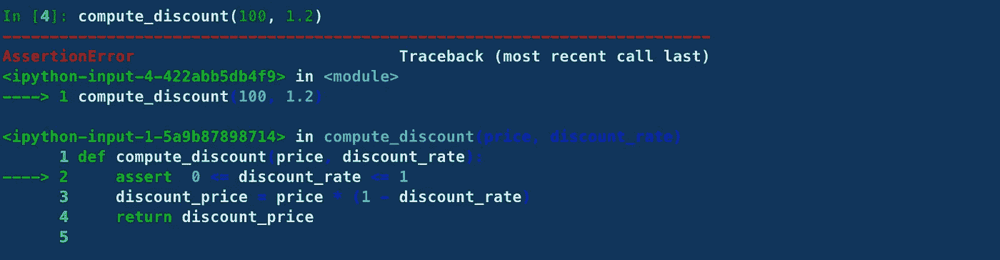
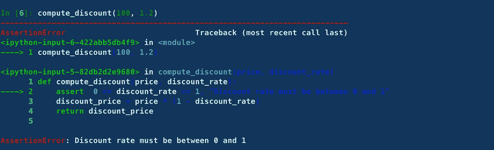
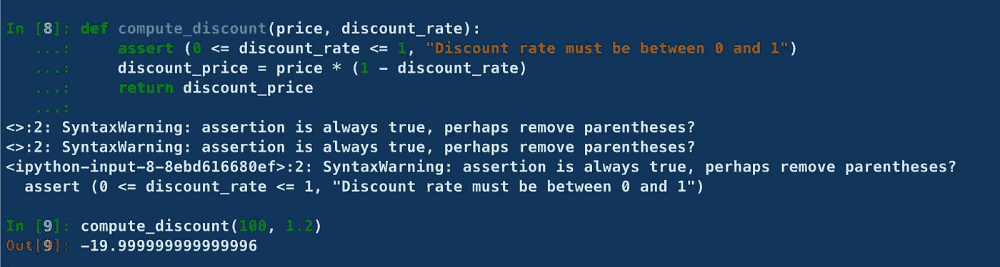

# 使用 Python Assert 语句时要避免的 2 个警告

> 原文：<https://towardsdatascience.com/2-caveats-to-avoid-when-using-python-assert-statement-8060e123c26a>

## 消除这些可能发生的无声错误


照片由[Olav Ahrens rtne](https://unsplash.com/@olav_ahrens?utm_source=medium&utm_medium=referral)在 [Unsplash](https://unsplash.com?utm_source=medium&utm_medium=referral) 上拍摄

Python 中的`assert`语句允许您运行内部单元测试，并提供测试条件的调试帮助。

```
**syntax: assert condition [, Error Message]**
```

如果条件为真，则什么都不会发生。否则，会引发一个带有可选错误消息的`**AssertionError**`异常。

# assert 语句有用的示例

假设您想根据费率计算折扣价。

为了使其正常工作，贴现率必须介于 0 和 1 之间。

为了检查可能导致折扣率高于 1 的潜在错误，我们可以添加以下断言。

如果我们对 100 美元应用 40% (0.4)的贴现率，这将产生预期的结果。


作者图片

现在，如果我们应用 120%的贴现率(！)，这会导致以下异常:



作者图片

为了使异常更加明确，我们可以在`assert`语句中添加一条错误消息:

再次运行前面的示例会将错误消息添加到控制台。



作者图片

如果您查看 stacktrace，您会看到解释器指出了断言条件失败的确切行。这对于调试非常有用:对于你和与你合作的其他队友。

此外，当您将错误消息添加到 assert 语句中时，这可以作为代码的文档。

# 陷阱 1:使用断言进行数据验证

虽然`assert`语句可以帮助您调试代码并在内部进行测试，但是应该谨慎使用，不要依赖它们来验证数据或应用安全检查。

原因很简单:出于性能原因，可以在生产中禁用`assert`语句。因此，如果代码的关键部分使用了它们，将会忽略对条件的检查。

让我们看看下面这个使用`assert`语句检查管理员权限的例子:

如果使用`-O`和`—OO`命令行开关启动执行该函数的 python 程序，断言**将被全局禁用。**

这种特殊情况**引入了安全漏洞。**

→避免这个问题的正确方法是永远不要使用断言进行数据验证。相反，我们可以使用 if 条件，并在必要时引发异常。

# 陷阱 2:使用括号使断言永远不会失败

如果你使用了`assert`语句，但对语法不太确定，你可能会像这样加上括号。

不幸的是，这导致了一个无声的错误。事实上，在写的时候:

```
**assert (condition, error_message)**
```

**`**assert**`**语句不检查条件，如果为假则打印错误信息。它实际做的是将** `**(condition, error_message)**` **整个元组作为一个条件进行求值。****

**因为在 Python 编程语言中元组的计算结果为 True，所以该语句:**

```
**assert (condition, error_message)**
```

**永远不会引发错误 si **(条件，错误消息)**始终为真。**

**注意 ipython 解释器如何引发关于括号的语法警告异常。**

****

**作者图片**

# **参考**

*   **[https://careerkarma.com/blog/python-assert/](https://careerkarma.com/blog/python-assert/)**
*   **[https://www . programiz . com/python-programming/assert-statement](https://www.programiz.com/python-programming/assert-statement)**

# **结论**

**`assert`用于调用函数的*程序员*出错的情况，与*用户*相反。在这种情况下使用`assert`可以确保程序员在测试过程中正确使用你的函数。**

**请记住，`assert`并不是为了防止运行时出现错误，因此不应该用于执行数据验证。**

**此外，不要在条件和错误消息之间使用括号，因为 Python 总是将元组求值为 True，断言永远不会失败。**

# **新到中？你可以每月订阅 5 美元，并解锁各种主题的无限文章(技术、设计、创业……)你可以通过点击我的推荐链接[来支持我](https://ahmedbesbes.medium.com/membership)**

**[](https://ahmedbesbes.medium.com/membership)  

照片由[卡斯滕·怀恩吉尔特](https://unsplash.com/@karsten116?utm_source=medium&utm_medium=referral)在 [Unsplash](https://unsplash.com?utm_source=medium&utm_medium=referral) 上拍摄**