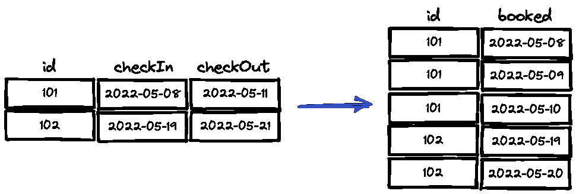
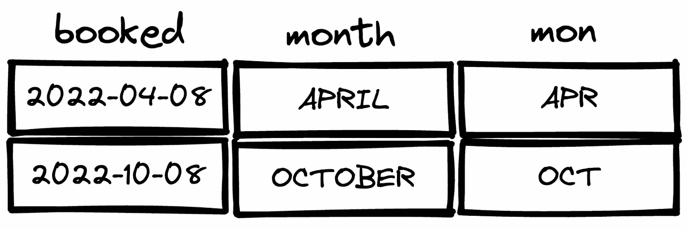

# 2 个必须知道的 PostgreSQL 函数

> 原文：<https://towardsdatascience.com/2-must-know-postgresql-functions-50bbcc30032b>

## 举例说明


(布莱恩·布里登在 [Unsplash](https://unsplash.com/s/photos/life-saver?utm_source=unsplash&utm_medium=referral&utm_content=creditCopyText) 上拍摄的

考虑到存储在关系数据库中的大量结构化数据，数据科学家和分析师几乎每天都要与关系数据库进行交互。我们使用 SQL 来进行这些交互，这使得它成为数据科学中最受欢迎的技能之一。

有许多不同的关系数据库管理系统(RDBMS)使用 SQL 与关系数据库中的数据进行交互和管理。流行的 RDBMSs 之一是 PostgreSQL，它是开源的，在可靠性、特性健壮性和性能方面享有很高的声誉。

在本文中，我们将学习 2 个 PostgreSQL 函数，它们简化了复杂的操作，在许多情况下派上了用场。我称它们为救生功能。

# 1.生成 _ 系列

该函数可用于创建带有数字和日期的有序表格。日期的一个典型用例是，您有一个事件的开始和结束日期，并且需要将其扩展为一个日历。

让我们看一个例子。我们有一个包含酒店预订的预订表。它包括预订 id、入住和退房日期。我们希望扩展它，以便更容易计算占用率。

```
SELECT
    id,
    generate_series(
        checkIn, 
        checkOut, 
        INTERVAL '1 day'
) AS booked
FROM booking
```

上述查询将包括实际上不被视为已预订的退房日期。因此，为了准确标记预订的天数，我们需要在生成序列之前从退房日期中减去一天。

这是如何做到的:

```
SELECT
    id,
    generate_series(
        checkIn, 
        (checkOut - INTERVAL '1 day'), 
        INTERVAL '1 day'
) AS booked
FROM booking
```

这段代码的作用如下所示:



(图片由作者提供)

我们可以将左边的桌子连接成日历桌，就这样！我们有一个标有预定日期的日历。

# 2.收件人 _ 字符

to_char 函数可用于将时间戳、时间间隔或数值转换为格式化字符串。我发现它在从时间戳或日期中提取信息时最有用。

其语法如下:

```
TO_CHAR(expression, format)
```

我们可以用它来提取月份名称和月份缩写，分别使用' month '和' MON '格式。假设我们有一个预订表，其中有一个名为“已预订”的日期列。我们可以使用 to_char 函数提取这些片段，如下所示:

```
select
     booked,
     to_char(booked, 'MONTH') AS month,
     to_char(booked, 'MON') AS mon,
from booking
```



(图片由作者提供)

我们还可以获得字符串形式的年月信息:

```
select
     booked,
     to_char(booked, 'YYYY-MM') AS yearmonth
from booking
```

如果日期是 2022–10–08，则年月值将是 2022–10。

还有一些与日期相关的有用格式。例如，我们可以提取日期名称和数字。

```
select
     booked,
     to_char(booked, 'DY') AS day_name,
     to_char(booked, 'DD') AS day,
from booking
```


(图片由作者提供)

对于不同的任务，还有其他可能有用的格式。您可以查看官方文档，了解 to_char 函数支持的其他格式。

我们已经介绍了 PostgreSQL 的两个重要功能。它们主要用于数据预处理，或者使原始数据更好地适合您随后要做的任务。这些函数实际上表明 SQL 不仅仅是一种查询语言，还是一种高效的数据分析和操作工具。

*你可以成为* [*媒介会员*](https://sonery.medium.com/membership) *解锁我的全部写作权限，外加其余媒介。如果你已经是了，别忘了订阅*[](https://sonery.medium.com/subscribe)**如果你想在我发表新文章时收到电子邮件。**

*感谢您的阅读。如果您有任何反馈，请告诉我。*