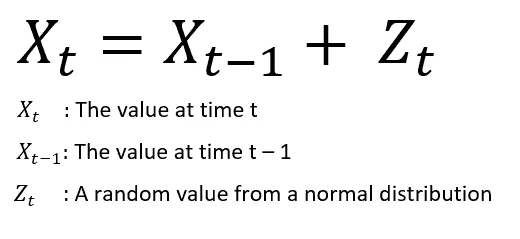
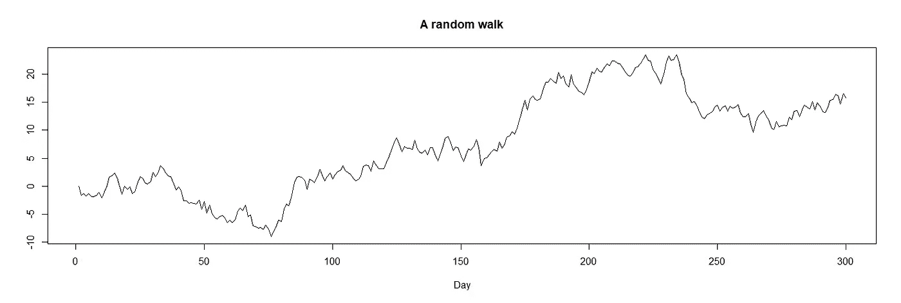
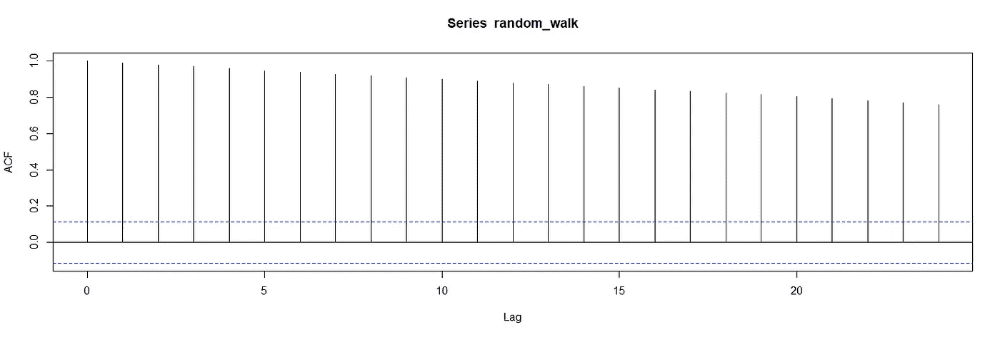
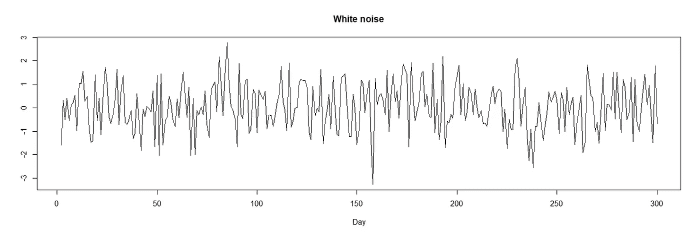
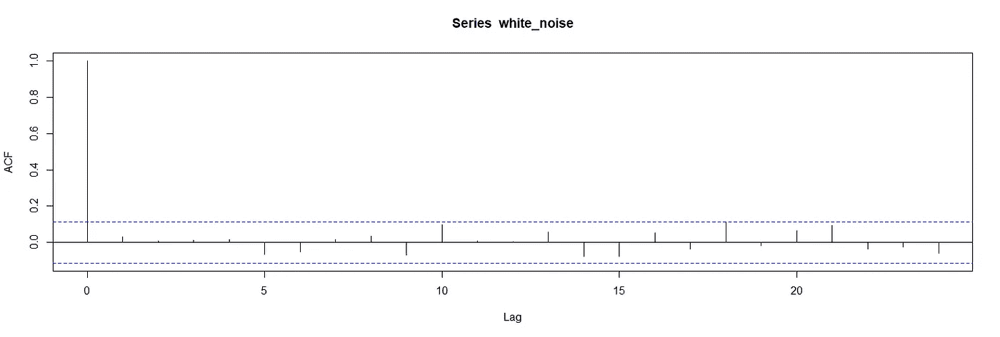

# 2 个必须知道的时间序列模型及其特性

> 原文：<https://towardsdatascience.com/2-must-know-time-series-models-and-their-properties-e92953bd8c5a>

# 2 个必须知道的时间序列模型及其特性

## 随机游走和白噪声


马克西姆·霍普曼在 [Unsplash](https://unsplash.com/s/photos/stock?utm_source=unsplash&utm_medium=referral&utm_content=creditCopyText) 上的照片

时间序列分析或预测是数据科学中极具挑战性的任务。这方面有几种模型。在本文中，我们将讨论随机游走和白噪声。

与其他模型相比，随机游走和白噪声可以被认为是简单的。然而，它们是基本的，并且被用于许多领域，例如金融、数学、计算机科学等等。

而且，对随机游走和白噪声有一个全面的了解，将有助于理解更复杂的模型。

> 如果你想在我发表新文章时收到电子邮件，别忘了订阅。

# 随机游动

随机游走模型假设时间序列从初始值开始，并在每个时间间隔采取随机步骤。因此，时间 t 的值等于时间 t-1 的值加上一个随机值。



随机行走模型

在每个时间间隔，来自正态分布(即随机噪声)的值被加到先前的值上。因此，无论你在哪里，你的下一个位置就是你的当前位置加上一个随机噪声。

时间间隔的长度取决于时间序列。例如，股票价格的随机游走模型可以有每日股票价值。在这种情况下，今天的股票价值等于昨天的价值加上随机噪声。

下面的线图包含一个随机游走。



(图片由作者提供)

在平稳时间序列中，均值和方差等统计属性不会随时间而改变。

在上面的图中，我们清楚地观察到均值和方差随时间的系统性变化。因此，随机漫步不是一个平稳的时间序列。

因为 t 时刻的值等于 t-1 时刻的值加上一个随机噪声，所以随机游走中的值取决于它们以前的值。因此，连续值之间存在相关性。

我们可以使用 ACF 图来显示这种相关性，ACF 图显示了不同时间滞后的自相关系数。



随机漫步的 ACF 图(图片由作者提供)

自相关系数总是从 1 开始。我们观察到两个连续值之间有很强的相关性。

随着时间差或滞后时间的增加，自相关系数也会降低。这是有意义的，因为每一个时间步长都会给初始值引入一个额外的随机噪声。

# 白噪声

花点时间检查一下上面随机漫步的情节。数值先下降，然后在 150 多天内保持上升。然后，我们观察到突然下降。因此，数据中有一个明显的趋势。

如果我们以某种方式从随机游走模型中移除这种趋势，我们最终会得到白噪声。我们可以通过取连续值之间的差来实现。

下面的线图显示了我们上面的随机漫步模型中连续步骤之间的差异。这些值的计算方式如下:

*   X1-X0，
*   X2-X1，
*   X3-X2，
*   诸如此类。



(图片由作者提供)

这是一个纯粹的随机过程，也称为白噪声。这是一个平稳的过程，因为我们看不到均值或方差随时间的任何系统性变化。

让我们也创建白噪声的 ACF 图，并将其与随机游走的 ACF 进行比较。



白噪声的 ACF 图(图片由作者提供)

值之间的自相关系数非常小，不显著，因为蓝色虚线表示显著性水平。

我已经创建了随机游走和白噪声时间序列以及 R 的图。如果你想自己练习，这里是生成这些图的 R 代码。

```
# Create a time-series with 300 values
x <- NULL
x[1] <- 0 # starts with 0for (i in 2:300) {
  # add a random value from a standard normal distribution
  x[i] <- x[i-1] + rnorm(1) 
}# converting to time-series
random_walk <- ts(x)# line plot
plot(random_walk, main="A random walk", xlab="Day", ylab="")# acf plot
acf(random_walk)# create white noise by taking the differences
white_noise <- diff(random_walk)# line plot
plot(diff(random_walk), main="White noise", xlab="Day", ylab="")# acf plot
acf(white_noise)
```

时间序列分析有它自己的技术和动态。如果你打算在一个需要相当水平的时间序列分析的领域工作，比如金融和零售，我建议学好基础知识。

*别忘了* [*订阅*](https://sonery.medium.com/subscribe) *如果你想在我发表新文章时收到电子邮件。*

*你可以成为* [*媒介会员*](https://sonery.medium.com/membership) *解锁我的全部写作权限，外加其余媒介。如果您使用以下链接，我将收取您的一部分会员费，无需您支付额外费用。*

[](https://sonery.medium.com/membership) [## 通过我的推荐链接加入 Medium-Soner yl DRM

### 作为一个媒体会员，你的会员费的一部分会给你阅读的作家，你可以完全接触到每一个故事…

sonery.medium.com](https://sonery.medium.com/membership) 

感谢您的阅读。如果您有任何反馈，请告诉我。