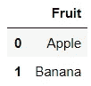
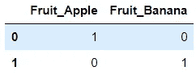
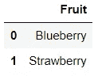
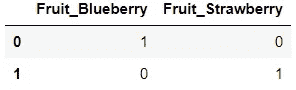
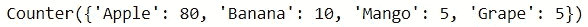
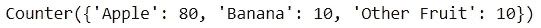
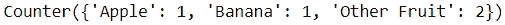

# 两种方法来建立自己的自定义 Scikit 学习变形金刚

> 原文：<https://towardsdatascience.com/2-ways-to-build-your-own-custom-scikit-learn-transformers-a8aeefbf8bf8>

## 如何(以及为什么应该)创建定制的变压器

照片由[欧根·斯特伦](https://unsplash.com/@eugen1980?utm_source=medium&utm_medium=referral)在 [Unsplash](https://unsplash.com?utm_source=medium&utm_medium=referral) 上拍摄

Scikit 学习转换器(不要与深度学习转换器混淆)是 Scikit 学习包中的类，有助于给定数据集中的转换。

这些转换器可以执行各种操作，如归一化和主成分分析。但是，某些情况下可能需要使用所提供的工具无法执行的操作。

对于这种情况，用户可以选择创建满足其特定需求的自定义函数。然而，对于机器学习应用程序来说，有一个更好的选择:创建定制的转换器。

在这里，我们探索在 Scikit 中使用定制转换器而不是定制函数的好处——了解并回顾用户创建它们的两种不同方式。

## 为什么要定制变压器(相对于函数)？

Scikit 学习变压器设计高效。他们实现了`fit`方法和`transform`方法，前者从训练集获得所需的模型参数，后者使用这些模型参数来转换训练集和测试集。

此外，Scikit Learn 包提供了 Pipeline 和 ColumnTransformer 之类的类。这些工具与变压器携手并进，使用户能够构建一个整洁有序的特征工程程序。

自定义函数的主要问题是它们不能集成到前面提到的许多 Scikit 学习工具中。结果，用户将被迫以一种既低效又容易出错的方式把这些功能硬塞到他们的特征工程过程中。

一个更好的选择是使用定制转换器执行定制操作。这将确保它们可以通过管道等工具与其他变压器一起使用。

## 你真的需要定制变压器吗？

下一个要考虑的问题是，您是否首先需要一个定制的转换器。Scikit 学习包可能没有您需要的转换器，但这并不意味着您必须额外工作来创建自己的转换器。

有许多专门研究与 Scikit Learn 兼容的特征工程的开源 Python 包，如 [feature_engine](https://feature-engine.readthedocs.io/en/latest/) 和 [category_encoders](https://contrib.scikit-learn.org/category_encoders/) 包。这些软件包提供了自己的一套变压器，可以满足您的需求。

因此，在你开始考虑编写任何额外的代码之前，要彻底地探索所有可用的工具。从长远来看，稍微挖掘一下可以省去你很多麻烦。

## 在 Scikit-Learn 中创建自定义转换器

创建一个 transformer 的想法可能看起来令人望而生畏，但是由于 Scikit Learn 包的巨大特性，它几乎不需要任何努力。

对于那些希望构建自己的定制转换器的人来说，有两个主要的选择。

## 选项 1 -使用 FunctionTransformer

Scikit 学习模块提供了 [FunctionTransformer](https://scikit-learn.org/stable/modules/generated/sklearn.preprocessing.FunctionTransformer.html) 类，顾名思义，该类将函数转换成转换器。此外，转换是通过一个简单的一行程序实现的！

FunctionTransformer 可用于将预先存在的 numpy 或 pandas 函数转换为转换器。

它还可以用于将自定义函数转换为转换器。如果感兴趣的函数需要参数，可以在`kw_args`参数中输入。

例如，如果我们想要创建一个将所有值乘以给定数字的转换器，我们可以创建一个执行该任务的函数，然后将其转换为转换器。

一旦该函数被转换成一个转换器，它就拥有了`fit`和`transform`方法，这使得它很容易与其他转换器一起使用。

也就是说，FunctionTransformer 有一个明显的限制。

不幸的是，它不存储用于拟合训练数据的参数，这对于某些需要保留模型参数的操作来说可能是一个问题，例如规范化和一次热编码。

因为可能很难将这个缺陷概念化，所以使用一个例子将是有益的。我们可以使用通过转换`pandas.get_dummies`函数创建的转换器对数据集执行一次性编码。

假设我们有以下数据。

代码输出(由作者创建)

我们可以将`get_dummies`函数转换成一个转换器，然后使用它的`fit_transform`方法对数据进行编码。

代码输出(由作者创建)

输出显示列“水果 _ 苹果”和“水果 _ 香蕉”。为了使转换器可行，它需要在处理不可见数据时生成相同的列。

然而，我们的变压器是这样吗？它将如何处理以下包含不可见数据的数据集？

代码输出(由作者创建)

代码输出(由作者创建)

转换器现在生成“Fruit_Blueberry”和“Fruit_Strawberry”列，它们与定型集的输出不匹配。这是因为新列来自测试数据，而不是定型数据。

另外，我在另一篇文章中讨论了这个难题的解决方案:

  

总而言之，FunctionTransformer 类是一种将函数转换为转换器的简单方法，但对于必须保留来自训练数据的参数的情况，它并不理想。

## 选项 2—从头开始创建 Scikit 学习转换器

第二种选择是从头开始创建一个转换器。同样，这种前景并不像看起来那么具有挑战性。

说明这种方法的最好方式是用一个例子。

假设我们正在构建一个转换器，通过将少数类别转换成一个特定的类别来解决高基数(即，太多的唯一值)问题。

变压器将利用以下模块:

首先，我们可以创建名为`ReplaceMinority`的类。为此，我们需要继承两个导入的基类`BaseEstimator`和`TransformMixin`。

然后，我们需要用`__init__`构造函数初始化属性。这个转换器将有`threshold`参数和`replace_with`参数，前者规定了非少数民族类别的最小比例，后者规定了少数民族应该被替换的类别。

接下来，我们可以创建`fit`方法。对于这个应用程序，我们需要输入数据，并记录给定数据框中每一列的所有非少数类别。

之后，我们可以创建`transform`方法。在这里，我们用每列的`replace_with`参数中的参数替换所有少数类别，并返回结果数据集。

就是这样！

当我们把所有的东西放在一起，这就是这个类的样子。

那并不需要太多的工作，不是吗？

让我们来测试一下变压器。假设我们有一个水果数据集，其中有几个少数群体。

代码输出(由作者创建)

我们可以通过使用这个转换器将少数民族替换为“其他水果”来减少独特类别的数量。

让我们创建一个`ReplaceMinority`对象，然后使用`fit_transform`方法将少数民族替换为“其他水果”。

代码输出(由作者创建)

在这里，变形金刚已经将“苹果”和“香蕉”识别为非少数民族。所有其他水果都换成了“其他水果”。这导致唯一值的数量减少。

转换器现在将根据训练数据中的参数处理任何看不见的数据。我们可以通过转换测试集数据来证明这一点:

代码输出(由作者创建)

仅在测试集中，*没有一个*类别是少数，但是转换器已经将“苹果”和“香蕉”识别为唯一的非少数类别，因此任何其他类别都将被替换为“其他水果”。

代码输出(由作者创建)

此外，我们可以将新的转换器嵌入到 Scikit 学习管道中。在这里，我们可以用一个`OneHotEncoder`对象来链接它。

总的来说，从零开始构建一个转换器使用户能够为更具体的用例执行过程。它还使用户能够基于来自训练集的参数来转换测试集。然而，这种方法更费时，而且容易出错。

## 结论

照片由 [Prateek Katyal](https://unsplash.com/@prateekkatyal?utm_source=medium&utm_medium=referral) 在 [Unsplash](https://unsplash.com?utm_source=medium&utm_medium=referral) 上拍摄

总的来说，Scikit Learn transformers 功能强大，因为它们的效率以及与 Pipeline 和 ColumnTransformer 等工具的兼容性。为了保持这种效率，最好坚持使用与 Scikit Learn 功能工程兼容的变压器。

如果 Scikit Learn 中没有一个变形金刚可以完成这项工作，请探索其他兼容的软件包。如果所需的转换器不可用，您可以选择将自定义函数转换为转换器，或者从头开始创建自己的 Scikit Learn 转换器。

我祝你在数据科学的努力中好运！