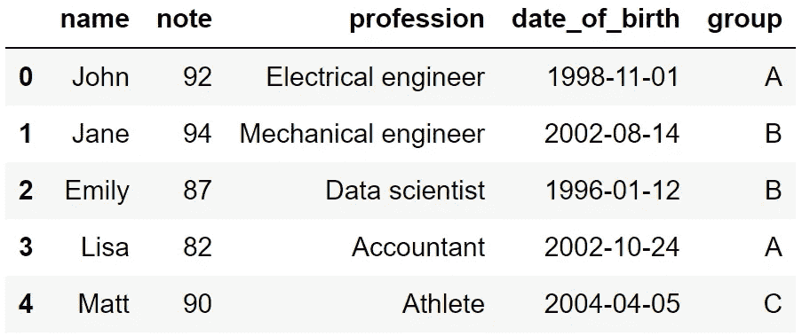

# 掌握熊猫数据帧过滤的 20 个例子

> 原文：<https://towardsdatascience.com/20-examples-to-master-filtering-pandas-dataframes-df6fabfe126f>

## 实用指南


法国人 Daphné Be 在 [Unsplash](https://unsplash.com/s/photos/filtering?utm_source=unsplash&utm_medium=referral&utm_content=creditCopyText) 上的照片

我们倾向于收集尽可能多的数据，因为数据是非常有价值的资产。我们拥有的数据越多，我们能够创造的解决方案和产品就越强大。

近年来，收集和存储的数据量急剧增加。这背后的两个主要原因是:

1.  收集和存储数据变得更加便宜和容易。
2.  我们有强大的工具来处理大量的数据。

然而，我们并不总是使用手头的所有数据。数据的收集可能有多种目的，其中一部分对于特定目的来说可能是多余的。

我们有时会从大型数据集中抽取一小部分样本来进行探索性数据分析。这使得熟悉数据的特征和结构变得更加容易。

对于这种情况，拥有一个高效的工具来过滤数据是非常重要的。Pandas 是最好的数据分析和操作工具之一，它为我们提供了加速和简化过滤表格数据的功能。

在这个例子中，我们将讨论 20 个例子，包括在过滤熊猫数据帧时使用的函数和技术。

让我们从导入 Pandas 和创建一个示例数据框架开始。

```
import pandas as pddf = pd.DataFrame({ "name": ["John","Jane","Emily","Lisa","Matt"],
    "note": [92,94,87,82,90],
    "profession":["Electrical engineer","Mechanical engineer",
                  "Data scientist","Accountant","Athlete"],
    "date_of_birth":["1998-11-01","2002-08-14","1996-01-12",
                     "2002-10-24","2004-04-05"],
    "group":["A","B","B","A","C"]})
```



df(作者图片)

我们现在可以开始举例了。

**示例 1:选择列的子集**

```
df[["name","note"]]**# output**

   name note
0  John   92
1  Jane   94
2 Emily   87
3  Lisa   82
4  Matt   90
```

**示例 2:用 loc 选择行和列的子集**

loc 方法用于使用行和列标签进行筛选。以下代码行返回前 3 行以及 name 和 note 列。

```
df.loc[:3, ["name","note"]]**# output** name note
0  John   92
1  Jane   94
2 Emily   87
```

**示例 3:使用 iloc 选择行和列的子集**

iloc 方法类似于 loc 方法，但它使用行和列索引，而不是标签。以下代码行返回前 3 行和第 3 列(索引从 0 开始)。

```
df.iloc[:3, 2]**# output**0    Electrical engineer
1    Mechanical engineer
2         Data scientist
Name: profession, dtype: object
```

您可能已经注意到，我们使用相同的表达式(":3 ")来选择具有 loc 和 iloc 方法的行。原因是 Pandas 默认为行分配整数标签。除非指定特定的标签，否则一行的索引和标签是相同的。

**示例 4:对列值使用比较运算符**

```
df[df.note > 90]**# output** name  note           profession  date_of_birth  group
0 John    92  Electrical engineer     1998-11-01      A
1 Jane    94  Mechanical engineer     2002-08-14      B
```

**示例 5:对字符串使用比较运算符**

```
df[df.name=="John"]**# output** name  note           profession  date_of_birth  group
0 John    92  Electrical engineer     1998-11-01      A
```

**示例 6:带有字符串访问器的字符串条件**

字符串访问器有几个函数可以处理字符串。例如，我们可以基于包含特定单词或字符序列的列进行过滤。

```
df[df.profession.str.contains("engineer")]**# output** name  note           profession  date_of_birth  group
0 John    92  Electrical engineer     1998-11-01      A
1 Jane    94  Mechanical engineer     2002-08-14      B
```

**示例 7:另一个带有字符串访问器的字符串条件**

```
df[df.name.str.startswith("L")]**# output** name  note  profession  date_of_birth  group
3 Lisa    82  Accountant     2002-10-24      A
```

**示例 8:多类型字符串方法**

我们可以通过链接来组合多个 str 方法。例如，如果我们不确定是否所有的名字都以大写字母开头，我们可以先将它们转换成小写字母，然后进行过滤。

```
df[df.name.str.lower().str.startswith("l")]**# output** name  note  profession  date_of_birth  group
3 Lisa    82  Accountant     2002-10-24      A
```

**示例 9:波浪号(~)运算符**

波浪号运算符表示“非”逻辑。它让我们得到不符合给定条件的行。

```
df[~df.profession.str.contains("engineer")]**# output** name  note      profession  date_of_birth  group
2  Emily    87  Data scientist     1996-01-12      B
3   Lisa    82      Accountant     2002-10-24      A
4   Matt    90         Athlete     2004-04-05      C
```

**示例 10:dt 访问器**

dt 访问器为我们提供了许多处理日期和时间的方法。但是，我们不能将 dt 访问器应用于具有 string 数据类型的列，因此我们首先需要更改数据类型。

```
df.date_of_birth = df.date_of_birth.astype("datetime64[ns]")df[df.date_of_birth.dt.month==11]**# output** name  note           profession  date_of_birth  group
0 John    92  Electrical engineer     1998-11-01      A
```

我们已经从一个日期中提取了月份信息，并将其用于过滤。

**例 11:dt 访问器(2)**

```
df[df.date_of_birth.dt.year > 2000]**# output** name  note           profession  date_of_birth  group
1  Jane    94  Mechanical engineer     2002-08-14      B
3  Lisa    82           Accountant     2002-10-24      A
4  Matt    90              Athlete     2004-04-05      C
```

**例 12:多个条件(与)**

我们可以用逻辑运算符组合多个条件。以下代码行用“与”逻辑组合了两个条件。

```
df[(df.date_of_birth.dt.year > 2000) &  
   (df.profession.str.contains("engineer"))]**# output** name  note           profession  date_of_birth  group
1  Jane    94  Mechanical engineer     2002-08-14      B 
```

**例 13:多个条件(or)**

下面一行代码返回数据科学家或注释超过 90 的人。

```
df[(df.note > 90) | (df.profession=="Data scientist")]**# output** name  note           profession  date_of_birth  group
0  John    92  Electrical engineer     1998-11-01      A
1  Jane    94  Mechanical engineer     2002-08-14      B
2 Emily    87      Data scientist      1996-01-12      B
```

**例 isin 方法**

isin 方法是另一种使用多个条件进行过滤的技术。它将该值与值列表进行比较。

```
df[df.group.isin(["A","C"])]**# output** name  note           profession  date_of_birth  group
0  John    92  Electrical engineer     1998-11-01      A
3  Lisa    82           Accountant     2002-10-24      A
4  Matt    90              Athlete     2004-04-05      C
```

当我们有几个值用于过滤时，isin 方法非常有用。

**例 15:查询功能**

查询函数接受字符串作为过滤器。

```
df.query("note > 90")**# output** name  note           profession  date_of_birth  group
0 John    92  Electrical engineer     1998-11-01      A
1 Jane    94  Mechanical engineer     2002-08-14      B
```

**例 16:查询功能(2)**

```
df.query("group=='A' and note > 89")**# output** name  note           profession  date_of_birth  group
0 John    92  Electrical engineer     1998-11-01      A
```

例 17:最小的函数

它允许根据给定的列选择 n 个最小值。

```
df.nsmallest(2, "note")**# output** name  note           profession  date_of_birth  group
3  Lisa    82           Accountant     2002-10-24      A
2 Emily    87       Data scientist     1996-01-12      B
```

**例 nlargest 函数**

```
df.nlargest(2, "note")**# output** name  note           profession  date_of_birth  group
1 Jane    94  Mechanical engineer     2002-08-14      B
0 John    92  Electrical engineer     1998-11-01      A
```

**例 isna 函数**

isna 函数可用于选择指定列中缺少值(即 null)的行。让我们首先在数据帧中添加一个空值。

```
import numpy as npdf.loc[0, "profession"] = np.nan
```

以下代码行返回职业值为空的行。

```
df[df.profession.isna()]**# output** name  note  profession  date_of_birth  group
0 John    92         NaN     1998-11-01      A
```

**例 notna 函数**

这与 isna 的功能正好相反。我们可以用它来过滤掉缺少值的行。

```
df[df.profession.notna()]**# output** name  note           profession  date_of_birth  group
1  Jane    94  Mechanical engineer     2002-08-14      B
2 Emily    87       Data scientist     1996-01-12      B
3  Lisa    82           Accountant     2002-10-24      A
4  Matt    90              Athlete     2004-04-05      C
```

我们已经做了 20 个例子，展示了几种过滤熊猫数据帧的工具和技术。

*你可以成为* [*介质成员*](https://sonery.medium.com/membership) *解锁我的全部写作权限，外加其余介质。如果你已经是了，别忘了订阅*[](https://sonery.medium.com/subscribe)**如果你想在我发表新文章时收到电子邮件。**

*[](https://sonery.medium.com/membership) [## 通过我的推荐链接加入 Medium-Soner yl DRM

### 作为一个媒体会员，你的会员费的一部分会给你阅读的作家，你可以完全接触到每一个故事…

sonery.medium.com](https://sonery.medium.com/membership) 

感谢您的阅读。如果您有任何反馈，请告诉我。*