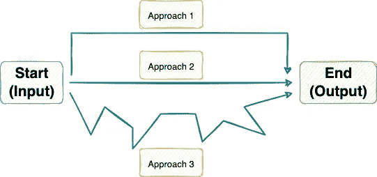
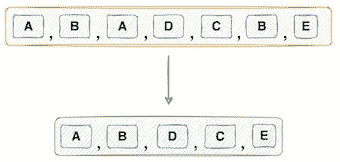
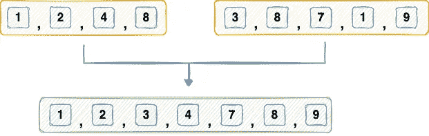
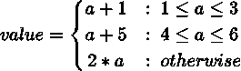

# 即使是熟练的 Python 程序员也会犯的 20 个新手错误

> 原文：<https://towardsdatascience.com/20-newbie-mistakes-that-even-skilled-python-programmers-make-6879048731a4>

## 用 Python 编码时应该避免的一些常见错误

安德烈·德·森蒂斯峰在 [Unsplash](https://unsplash.com?utm_source=medium&utm_medium=referral) 上拍摄的照片

编程(不仅仅是用 Python，而是任何编程语言)的最大好处是，通常有多种方法来实现同一个解决方案。

使用不同的方法达到相同的输出(图片由作者提供)

当然，有些方法比其他方法更好，这可能是由于各种原因，如:

*   更少的内存使用
*   运行时高效
*   较少的代码行
*   容易理解
*   简单的逻辑等。

在这篇文章中，我将向您介绍 20 种特定的情况，在这些情况下，Python 程序员不知不觉地陷入编写大型、不优雅和复杂的 Python 代码的陷阱——这最终阻碍了他们释放 Python 的真正潜力。

除此之外，我还将为所提出的问题提供另一种解决方案，以帮助您纠正这些错误。

你可以在这里找到这篇文章的代码。

我们开始吧🚀！

# #1 使用多个打印语句

## 天真的方法

如果您想要打印多个变量，那么简单的方法建议每个变量应该有自己的`print()`语句。

## 优雅的方法

根据我的经验，使用多个 print 语句通常是编码人员(尤其是新手)在用 Python 编码时最常犯的错误。

然而，他们不知道的是，有了`print()`，你可以在一条打印语句中打印多个变量，如下所示:

上面的`sep`参数指定了使用相同的`print`语句打印的各种变量之间的分隔符(上面的`a`、`b`和`c`)。

> 请注意，`end`参数用于指定打印语句的结束字符。

在上面的代码中，`end='\n---\n’`参数打印新的行字符，接着是`---`，然后是一个新的行字符。

# #2 使用 FOR 循环打印相同的变量

## 天真的方法

顾名思义，目标是多次打印同一个变量。

当然，您应该创建一个 FOR 循环，并迭代您希望打印变量的次数，对吗？我是说，这有什么错？

## 优雅的方法

虽然写一个 FOR 循环没有坏处，而且一切运行良好，但是没有必要写一个 FOR 循环多次打印同一个变量。

# # 3–4 创建一个单独的变量来跟踪循环中的索引

## 天真的方法— 1

为了实现这一点，通常需要定义一个新变量(`idx`)来跟踪索引值，并在每次迭代中递增，如下所示:

## 天真的方法— 2

如果不是上面的方法，人们会创建一个`range`迭代器来跟踪索引，如下面的代码所示:

## 优雅的方法

感谢开发了`enumerate()`方法的开发者。

本质上，使用这种方法，您可以跟踪索引(`idx`)和值(`i`)，如下所示:

# #5 使用 FOR 循环将列表转换为字符串

字符串列表(作者图片)

## 天真的方法

使用 FOR 循环，如下所示，我们可以一次收集一个列表元素。

## 优雅的方法

将列表转换为字符串的巧妙方法是使用 join()方法，如下所示:

这不仅可以让你避免编写一些不必要的长代码，而且和 *for-loop* 方法一样直观。

# #6 使用 FOR 循环从列表中删除重复项

从列表中删除重复项(按作者排序的图像)

## 天真的方法

FOR-loop 再次出手相救！

最简单的方法是迭代输入列表，并将唯一的元素存储在一个新列表中。

## 优雅的方法

但是，使用一行 Python 代码就可以从列表中删除重复项，如下所示:

以上返回一个集合，您可以获得如下列表:

# #7 使用 for 循环搜索列表中的元素

## 天真的方法

假设您想知道一个元素是否存在于一个列表(或集合)中，并返回一个布尔响应(如果存在，则返回`True`，否则返回`False`)。

下面演示了这种简单的方法:

啊！代码太多了吧？

## 优雅的方法

让我们使用`in`关键字将其简化为一行实现:

# #8 使用索引变量迭代两个相同大小的可迭代对象

## 天真的方法

类似于我们在第 3-4 节中所做的，也就是说，专门为索引定义一个变量，这里最简单的方法就是在这里采用相同的方法，如下所示:

## 优雅的方法

明智的方法是使用`zip()`函数，将两个可重复项中的相应值配对。

# #9 使用 FOR 循环反转列表

反转列表(作者图片)

## 天真的方法

您可能已经猜到了，我们可以对列表进行反向迭代，并将元素追加到一个新列表中，如下所示:

## 优雅的方法

如果您理解 Python 中的切片，这个优雅的解决方案只是一个简单的单行程序:

不要循环！

# #10 使用 FOR 循环检查回文

## 天真的方法

扩展上述情况的想法(#9 —反转列表)，我们可以检查反转列表是否与输入列表相同。

## 优雅的方法

如上所述，优雅的方法是使用切片并将其与输入列表进行比较:

# #11 使用 FOR 循环统计 iterable 中元素的出现次数

## 天真的方法

寻找元素频率的简单方法是使用 FOR 循环遍历列表，并计算出现的次数。

## 优雅的方法

在这种情况下，节省我们编写 FOR 循环的优雅方法是使用`count()`方法:

您也可以在字符串输入上使用`count()`方法:

# #12 使用 FOR 循环获取字符串的子字符串

## 天真的方法

这里的目标是返回长度为`n_chars`的子串，从位置`start_index`开始。

新手解决这个问题的方法是使用 FOR 循环，如下所示:

## 优雅的方法

然而，一行程序的方法是使用切片，这样您就不用编写 FOR 循环了。

# #13 定义长整型常量

假设你想声明一个值为 10 的整型变量。

## 天真的方法

理想情况下，一个人可以连续地写零，并在打字时计数。

但是说别人想参考这个代码。让他们把所有的零都数出来岂不是很麻烦？

## 优雅的方法

为了提高可读性，可以用`_`(下划线)分隔一组零，如下所示:

但这仍然是一个麻烦，不是吗？为什么有人要数零呢？

如果数字可以用`a^b`的形式表示，你应该使用`pow()`的方法。

# #14 使用 IF 条件交换字符串的大小写

给定一个字符串，目标是使大写字母小写，反之亦然。

## 天真的方法

一种简单的方法是检查每个元素的大小写，然后为每种情况设置特定的条件。

输出没有问题，但是为什么要这样做呢？

## 优雅的方法

请改用`swapcase()`方法。

# #15 获得两个集合的并集

两个集合的联合(图片由作者提供)

## 天真的方法

迭代两个集合，并将元素添加到一个新集合中。

代码行太多了，不是吗？

让我们把它简化成一行。

## 优雅的方法

Python 中的集合数据结构为两个集合的并集提供了一个`union()`方法。

此外，您可以将其扩展到任意数量的输入集:

是不是很酷？想象一下，为了合并这四个集合，您需要编写多少 FOR 循环。

# #16 获取两个集合的交集

## 天真的方法

与上面讨论的联合案例类似，我们可以发现两个集合之间的公共元素如下:

## 优雅的方法

但是，您可以使用`intersection()`方法来达到同样的目的:

# #17 在 IF 语句中编写多个条件

为了详细说明这一点，假设您想要实现以下逻辑。输入是一个整数`a`。

将输入映射到输出的函数(图片由作者提供)

## 天真的方法

在这里，我们将使用多个或独立的条件来实现上述逻辑。

## 优雅的方法

避免多重条件的一个聪明方法是使用`in`关键字，如下所示:

# #18 更改列表中所有元素的数据类型

给定一个表示整数的字符串列表，目标是通过改变数据类型将它们转换成整数列表。

## 天真的方法

使用 FOR 循环遍历列表，并对单个元素进行类型转换。

## 优雅的方法

一个聪明的方法是使用`map()`，如下所示:

作为第一个参数，`map()`方法接受一个函数(`int`)，第二个参数是一个可迭代函数(`input_list`)。

# #19 交换变量

给定两个变量，目标是将第一个变量的值传递给第二个变量，将第二个变量的值传递给第一个变量。

## 天真的方法

大多数 C/C++程序员在这里采用的方法是定义一个新的变量(`temp`)，他们通常也会在 Python 中扩展这个变量。

## 优雅的方法

幸运的是，Python 允许在一个语句中进行多次赋值，消除了对任何临时变量的需求。

# #20 使用嵌套循环生成两个列表的所有组合

给定两个列表(长度为`n`的`a`和长度为`m`的`b`，生成所有的`nxm`组合。

## 天真的方法

编写两个嵌套的 FOR 循环，并将所有组合追加到一个列表中。

## 优雅的方法

优雅的方法是使用 itertools 库中的`product()`方法，如下所示:

# 结论

总之，在这篇文章中，我展示了 20 种不同的场景，我相信大多数 Python 程序员都经历过这些场景，并且可能采取了错误的方法来编写解决方案。

如果您注意到，在大多数情况下，优雅的方法主要集中在消除前一种方法中使用的 FOR 循环的显式编码。

作为这篇文章的关键，你应该永远记住，在大多数情况下，你想出的第一个解决方案不会是一个理想的方法。因此，快速的谷歌搜索总是有益的:)。

这就是为什么采用不完美主义者的心态对于成为一名优秀的程序员至关重要(不仅仅是 Python，而是任何语言)。

附:我将很快发布这篇文章的第二部分！

**一如既往，感谢阅读！**

[🧑‍💻**成为数据科学专家！获取包含 450 多个熊猫、NumPy 和 SQL 问题的免费数据科学掌握工具包。**](https://subscribepage.io/450q)

✉️ [**注册我的电子邮件列表**](https://medium.com/subscribe/@avi_chawla) 不要错过另一篇关于数据科学指南、技巧和提示、机器学习、SQL、Python 等的文章。Medium 会将我的下一篇文章直接发送到你的收件箱。