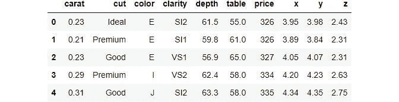
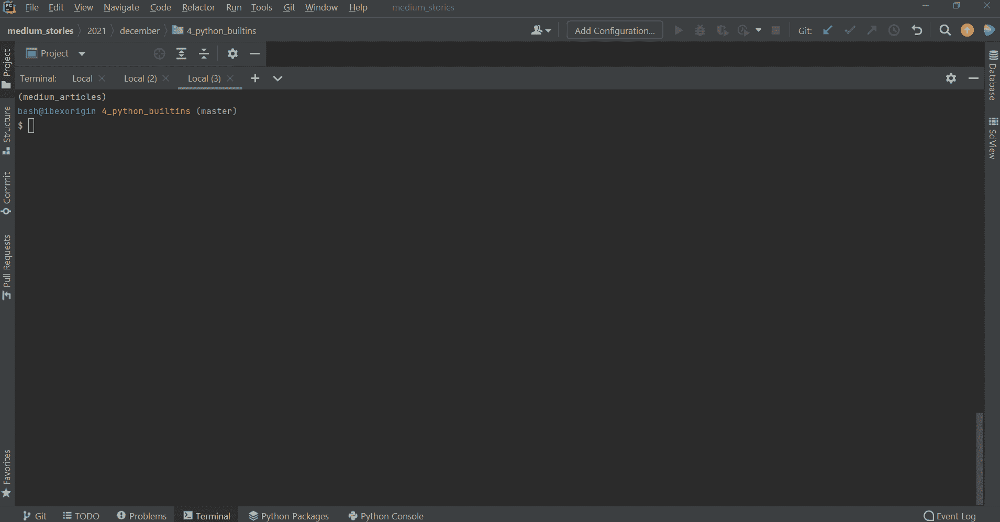
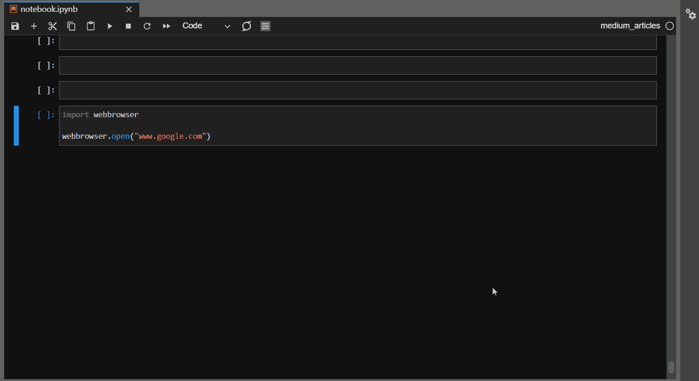

# 20 个 Python Gem 库埋藏在装置中等待被发现

> 原文：<https://towardsdatascience.com/20-python-gems-buried-in-the-installation-waiting-to-be-found-96034cad4d15>

## 前所未有地了解 Python 的标准库

照片由 [Dids](https://www.pexels.com/photo/pink-and-white-stones-2942855/) 拍摄

## 介绍

大多数人认为 Python 的大规模统治地位是因为它像 NumPy、Pandas、Sklearn、XGBoost 等强大的包。这些是由专业开发人员编写的第三方包，通常借助于其他更快的编程语言，如 C、Java 或 C++。

因此，憎恨 Python 的人可能会抛出的一个无力的论点是，一旦你剥夺了这些第三方包带来的所有荣耀，Python 就不会那么受欢迎了。我要说的是，标准 Python 已经足够强大，可以与任何语言媲美。

我提请您注意 Python 安装中内置的 20 个轻量级包，它们离被释放只有一步之遥。

<https://ibexorigin.medium.com/membership>  

获得由强大的 AI-Alpha 信号选择和总结的最佳和最新的 ML 和 AI 论文:

<https://alphasignal.ai/?referrer=Bex>  

## 1️.上下文库

处理外部资源，如数据库连接、打开的文件或任何需要手动打开/关闭的操作，可能会变得非常棘手。上下文管理器很好地解决了这个问题。

上下文管理器是 Python 的一个定义特性，其他语言中没有，非常受欢迎。您可能见过与`open`函数一起使用的`with`关键字，并且您可能不知道您可以创建作为上下文管理器的函数。

下面，您可以看到一个充当计时器的上下文管理器:

将一个用特殊语法编写的函数包装在来自`contextlib`的`contextmanager`装饰器下，将它转换成一个可以和`with`关键字一起使用的管理器。您可以在我的独立文章中阅读更多关于定制上下文管理器的内容。

## 📚文档:[https://docs.python.org/3/library/contextlib.html](https://docs.python.org/3/library/contextlib.html)

## 💻演示:[链接](/how-to-build-custom-context-managers-in-python-31727ffe96e1)

## 2️.functools

想要更强大、更短小、多功能的*功能*？那么，`functools`已经为你准备好了。这个内置的库包含许多方法和装饰器，您可以包装现有的方法和装饰器来添加额外的特性。

其中之一是`partial`，它可以用来克隆函数，同时用自定义值保留它们的一些参数。下面，我们从 Pandas 复制了`read_csv`,这样我们就不必重复传递相同的参数来读取某些特定的 CSV 文件:

我最喜欢的另一个是缓存装饰器。一旦包装完毕，`cache`会记住每个映射到输入的输出，这样当相同的参数传递给函数时，结果立即可用。`streamlit`图书馆充分利用了[这样一个功能](https://docs.streamlit.io/library/advanced-features/caching)。

## 📚文件:[https://docs.python.org/3/library/functools.html](https://docs.python.org/3/library/functools.html)

## 3️.itertools

如果您发现自己正在编写嵌套循环或复杂的函数来迭代多个 iterable，那么检查一下`itertools`库中是否已经有一个函数。也许，你不必重新发明轮子——Python 想到了你的每一个需求。

下面是库中一些方便的迭代函数:

## 📚文件:[https://docs.python.org/3/library/itertools.html](https://docs.python.org/3/library/itertools.html)

## 4️.一团

对于喜欢 Unix 风格的模式匹配的用户来说，`glob`库应该有宾至如归的感觉:

`glob`包含所有相关的功能，可以同时处理多个文件而不会有麻烦(或者使用鼠标)。

## 📚文件:[https://docs.python.org/3/library/glob.html](https://docs.python.org/3/library/glob.html)

## 5️.pathlib

说得好听点，Python `os`模块糟透了...幸运的是，核心 Python 开发者听到了数百万人的呐喊，并在 Python 3.4 中引入了`pathlib`库。它为系统路径带来了方便的面向对象方法。

它还拼命解决与*(放在形容词里)* Windows 路径系统相关的所有问题:

## 📚文件:[https://docs.python.org/3/library/pathlib.html](https://docs.python.org/3/library/pathlib.html)

## 6️.sqlite3

令数据科学家和工程师高兴的是，Python 通过`sqlite3`包内置了对数据库和 SQL 的支持。只需使用一个连接对象连接到任何数据库(或创建一个)并启动 SQL 查询。该软件包运行良好。

## 📚文档:[https://docs.python.org/3/library/sqlite3.html](https://docs.python.org/3/library/sqlite3.html)

## 7️.哈希里布

Python 已经在网络安全领域产生了很深很深的根基，不仅仅是在人工智能和人工智能领域。这方面的一个例子是`hashlib`库，它包含了最常见的(也是最安全的)加密散列函数，比如 SHA256、SHA512 等等。

## 📚文档:[https://docs.python.org/3/library/hashlib.html](https://docs.python.org/3/library/hashlib.html)

## 8️.秘密

我喜欢推理小说。你读过 [*巴斯克维尔的猎犬*](https://en.wikipedia.org/wiki/The_Hound_of_the_Baskervilles) 吗？太棒了，去读吧。

虽然实现自己的消息编码函数可能会非常有趣，但它们可能达不到与`secrets`库中久经考验的函数相同的标准。

在那里，您将找到生成最复杂的密码、安全令牌和相关机密的随机数和字符所需的一切:

## 📚文件:[https://docs.python.org/3/library/secrets.html](https://docs.python.org/3/library/secrets.html)

## 9️.argparse

你擅长命令行吗？那么，你是为数不多的。还有，你会爱上`argparse`图书馆。您可以让静态 Python 脚本通过 CLI 关键字参数接受用户输入。

该库功能丰富，足以为您的脚本甚至包创建复杂的 CLI 应用程序。

我强烈推荐阅读 RealPython 文章，以获得对该库的全面概述。

## 📚文件:[https://docs.python.org/3/library/argparse.html](https://docs.python.org/3/library/argparse.html)

## 💻演示教程:[真实 Python](https://realpython.com/command-line-interfaces-python-argparse/)

## 10.随意

> 这个世界上没有巧合——乌龟。

也许这就是为什么科学家使用伪随机性，即纯粹的随机性是不存在的。

不管怎样，Python 中的`random`模块应该足够模拟基本的*机会*事件了:

## 📚文档:[https://docs.python.org/3/library/random.html](https://docs.python.org/3/library/random.html)

## 1️1.泡菜

正如数据集的大小变得越来越大，我们也需要更快、更高效地存储它们。Python 安装自带的平面 CSV 文件的替代方案之一是`pickle`文件格式。事实上，它在 IO 上比 CSV 快 80 倍，占用的内存也更小。

下面是一个 pickles 数据集并将其加载回来的示例:

## 📚文档:[https://docs.python.org/3/library/pickle.html](https://docs.python.org/3/library/pickle.html)

## 💻Dario Radecic 的比较文章:[链接](/stop-using-csvs-for-storage-pickle-is-an-80-times-faster-alternative-832041bbc199)

## 1️2.舒蒂尔

`shutil`库代表 *shell 实用程序，*是一个用于高级文件操作的模块。使用`shutil`，您可以复制、移动、删除、存档或执行任何您通常在文件浏览器或终端上执行的文件操作:

## 📚文件:[https://docs.python.org/3/library/shutil.html](https://docs.python.org/3/library/shutil.html)

## 13.统计数字

有了`statistics`模块，谁还需要 NumPy 或 SciPy？(其实大家都有——我只是想写一个戏剧性的句子)。

这个模块可以方便地在纯 Python 数组上执行标准的统计计算。如果你需要的只是做一个简单的计算，就没有必要安装第三方的包。

## 📚文件:[https://docs.python.org/3/library/statistics.html](https://docs.python.org/3/library/statistics.html)

## 14.千兆周

Python 真是使出浑身解数。它伴随着一切——从包管理器到垃圾收集器。

是的，你没听错。一旦启用，`gc`模块就充当 Python 程序中的垃圾收集器。在低级语言中，这个烦人的任务留给了开发人员，他们必须手动分配和释放程序所需的内存块。

`collect`函数返回在名称空间中找到并清除的不可达对象的数量。简单地说，该函数释放未使用对象的内存槽。你可以在下面阅读更多关于 Python 内存管理的内容。

## 📚文档:[https://docs.python.org/3/library/gc.html](https://docs.python.org/3/library/gc.html)

## 💻Python 中的内存管理— [链接](/memory-management-and-garbage-collection-in-python-c1cb51d1612c)

## 15.pprint

来自某些操作的一些输出看起来太可怕了。帮你的眼睛一个忙，使用`pprint`包获得智能缩进和漂亮的输出:

对于更复杂的输出和自定义打印选项，您可以使用`pprint`创建打印机对象并多次使用它们。细节在文件里。

## 📚文档:[https://docs.python.org/3/library/pprint.html](https://docs.python.org/3/library/pprint.html)

## 16.pydoc

> 代码更多的是被阅读而不是被编写——Guido Van Rossum。

你猜怎么着？我喜欢文档，喜欢为自己的代码编写文档(不要惊讶；我有点强迫症)。

讨厌它或者喜欢它——记录你的代码是一件必要的坏事。对于较大的项目来说，这变得非常重要。在这种情况下，您可以使用`pydoc` CLI 库在浏览器上自动生成文档，或者使用您的类和函数的文档字符串将其保存到 HTML。

作者 GIF

在将您的文档部署到 Read the Docs 等其他服务之前，它可以作为一个初步的概述工具。

## 📚文件:[https://docs.python.org/3/library/pydoc.html](https://docs.python.org/3/library/pydoc.html)

## 💻[编写代码指南——真正的 Python](https://realpython.com/documenting-python-code/)

## 17.日历

这个九月到底发生了什么？

作者截图

显然，英国 1752 年 9 月有 19 天。3，4，… 13 去哪了？嗯，这是关于从儒略历转换到格里高利历的巨大混乱，英国在 18 世纪 50 年代之前对此非常顽固。这里可以看[。](https://youtu.be/IJhgZBn-LHg)

这种情况只发生在英国。世界上的其他人是有感觉的，并且正在遵循正确的时间进程，这可以从使用`calendar`模块中看出:

Python 很重视时间。

## 📚文件:[https://docs.python.org/3/library/calendar.html](https://docs.python.org/3/library/calendar.html)

## 18.网络浏览器

想象一下从 Jupyter 笔记本或 Python 脚本直接跳到 StackOverflow。你为什么要这么做？

嗯，因为你可以…用`webbrowser`模块。

作者 GIF

## 📚文档:[https://docs.python.org/3/library/webbrowser.html](https://docs.python.org/3/library/webbrowser.html)

## 19.记录

你正在寻找一个经验丰富的开发人员的标志之一是他们的代码中缺少 print 语句。普通的`print`函数不仅仅适用于你在编码和调试时必须处理的无数用例。你需要使用更复杂的工具，比如`logging`。

此模块允许您记录具有不同优先级和自定义格式时间戳的消息。下面是我每天使用的一个:

## 📚文档:[https://docs.python.org/3/library/logging.html](https://docs.python.org/3/library/logging.html)

## 💻Python 登录优秀教程:[真正的 Python](https://realpython.com/python-logging/)

## 20.并行未来

我把一些有趣的东西留到了最后。这个库是关于并发执行操作的，就像多线程一样。

下面，我向一个 URL 发送 100 个 GET 请求并得到响应。这个过程缓慢而乏味，因为解释器要等到每个请求返回，这就是你使用循环的结果。

一个更聪明的方法是使用并发，并使用机器上的所有内核。`concurrent.futures`包使你能够做到这一点。下面是基本语法:

运行时间减少了 12 倍，因为并发允许使用所有内核同时发送多个请求。你可以在下面的教程中读到更多关于并发性的内容。

## 📚文档:[https://docs.python.org/3/library/concurrent.futures.html](https://docs.python.org/3/library/concurrent.futures.html)

## 💻演示教程:[文章](/concurrency-in-python-how-to-speed-up-your-code-with-threads-bb89d67c1bc9)作者 Dario Radecic

## 结论

没必要把事情过分复杂化。如果您不需要它们，就没有必要让您的虚拟环境充满沉重的软件包。有几个内置的包可能就足够了。记住，“简单胜于复杂”Python 的禅宗。

<https://ibexorigin.medium.com/membership>  

在 LinkedIn(领英)或 Twitter(T2)上与我进行友好的交谈。或者你可以读我的另一个故事。这些怎么样:

</comprehensive-tutorial-on-using-confusion-matrix-in-classification-92be4d70ea18>  </advanced-tutorial-how-to-master-matplotlib-like-an-absolute-boss-aae2d4936734> 