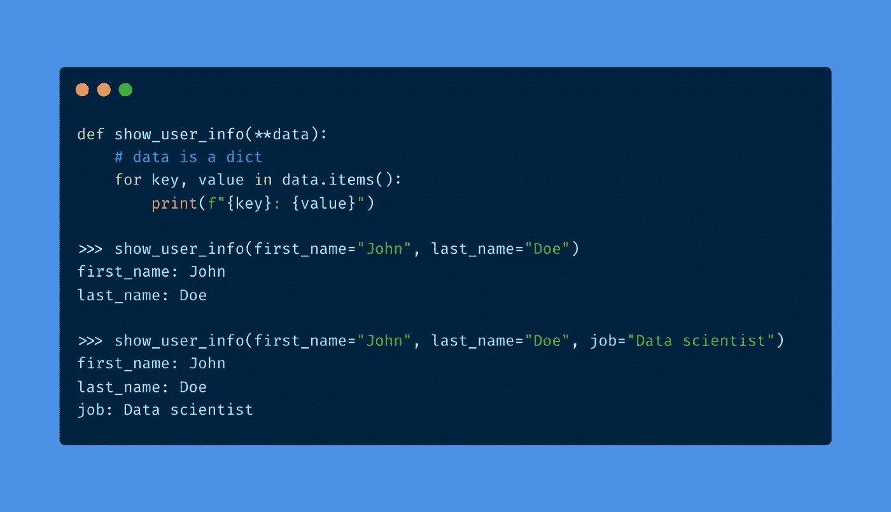
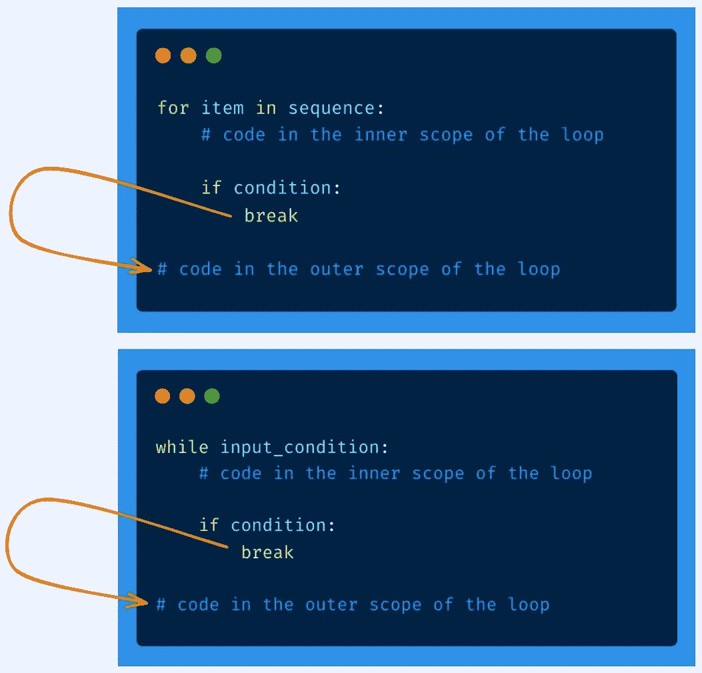
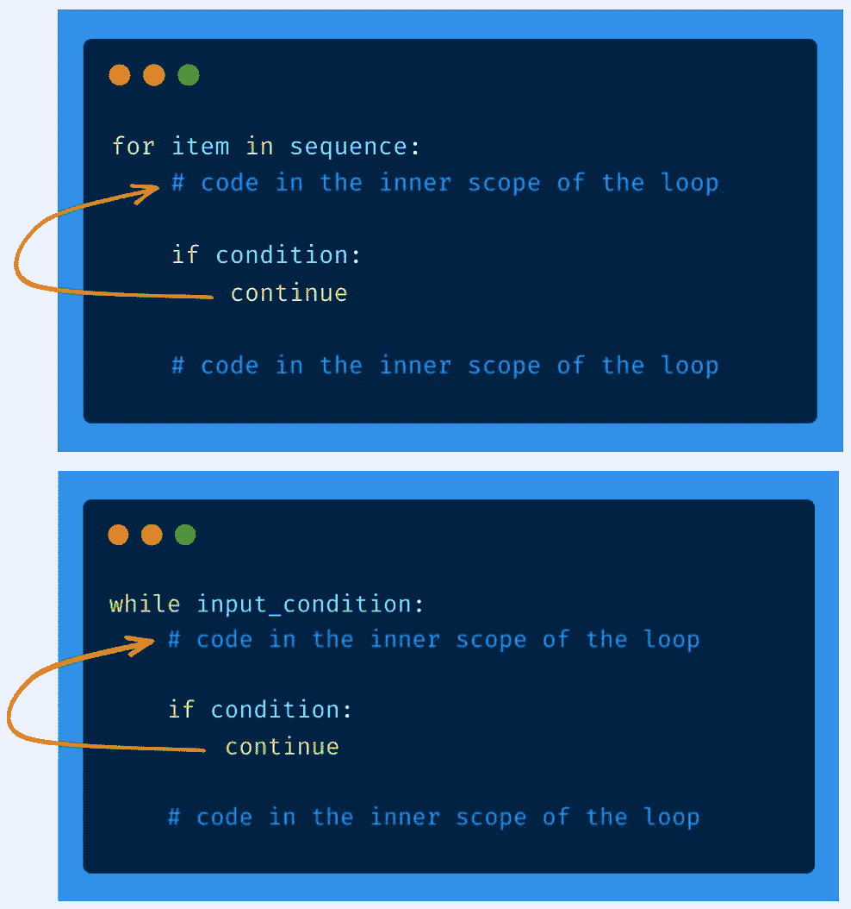

# 挑战你知识的 20 个 Python 面试问题

> 原文：<https://towardsdatascience.com/20-python-interview-questions-to-challenge-your-knowledge-cddc842297c5>

## 对数据结构、编程概念和最佳实践的一瞥


照片由[克里斯里德](https://unsplash.com/@cdr6934?utm_source=medium&utm_medium=referral)在 [Unsplash](https://unsplash.com?utm_source=medium&utm_medium=referral) 拍摄

在不断学习我最喜欢的编程语言的来龙去脉的同时，我总是在多个概念页面上跟踪有趣的东西。

> *在本文中，我将我的一些笔记变成了* ***20 个面试问题，涵盖了数据结构、核心编程概念和 Python 最佳实践。*** *有趣的是，这些问题很多都是在数据科学面试中被问到的。*

希望您能浏览其中的一些，并提高您的 Python 技能。

事不宜迟，让我们直接开始吧。🏊

<https://medium.com/membership/@ahmedbesbes>  

# 1—列表和元组有什么区别？你应该在什么时候使用它们？

列表是可变的数据结构，而元组是不可变的。
Python 中的可变对象具有改变其值的能力。

列表是动态的:您可以向其中添加项目，或者覆盖和删除现有的项目。
元组是固定大小的:它们没有`append`或`extend`方法。您也不能从中删除项目。
元组和列表都支持索引，并允许使用`in`操作符来检查其中的现有元素。

**→有些情况我觉得元组可能有用。**

*   如果您声明了一个您知道永远不会改变的项集合，或者您将只循环而不改变其值，请使用元组。
*   如果考虑性能，元组比列表更快，因为它们是只读结构。如果不需要写操作，可以考虑使用元组。
*   如果您想防止意外写入不需要更改的数据，元组可以使您的代码更安全。

下面的代码示例展示了元组与列表的不同之处。

# 2 —多重处理和多线程有什么区别？你应该在什么时候使用它们？

多重处理和多线程是旨在提高代码速度的编程范例。

当您使用多重处理时，您可以在多个进程上并行化您的计算。进程是独立的，相互之间不通信:它们不共享同一个内存区域，之间有严格的隔离。就应用程序而言，多处理适合 CPU 密集型工作负载。但是，它确实拥有与进程数量成比例的大量内存。

另一方面，在多线程应用程序中，线程存在于单个进程中。因此，它们共享相同的内存区域:它们可以修改相同的变量，也可以相互干扰。虽然进程是严格并行执行的，但在 Python 中，在给定的时间点上只执行一个线程，这是由于全局解释器锁( [GIL](http://wiki.python.org/moin/GlobalInterpreterLock) )。多线程适合于 IO 绑定的应用程序，比如 web 抓取或从数据库中获取数据。

→如果你想了解更多关于多线程和多重处理的知识，我推荐你去看看这篇精彩的博客[帖子](https://medium.com/contentsquare-engineering-blog/multithreading-vs-multiprocessing-in-python-ece023ad55a)，它全面地描绘了这两个概念。

# 3 —模块、包和库之间有什么区别？

模块只是一个 Python 文件，可以导入到脚本或其他模块中。它包含函数、类和全局变量。

包是在一个文件夹中组合在一起以提供一致功能的模块的集合。包可以像模块一样导入。它们通常有一个`__init__.py`文件，告诉 Python 解释器像这样处理它们。

库是包的集合。

# python 中的多线程有什么问题？

全局解释器锁(或 GIL)防止 python 解释器同时执行多个线程。简而言之，在 Python 中，GIL 强制在任何时间点只执行一个线程。

在依赖多线程代码的 CPU 受限的应用程序中，这是一个很大的性能瓶颈。

# 5 —什么是装修工？你能描述一个值得使用装饰者的情况吗？

装饰器是一个函数，它接收一个函数作为输入，返回一个函数作为输出。装饰器的目标是扩展输入函数的行为，而不改变其核心机制。

使用装饰器也可以防止你重复自己。它迫使你写一次通用代码，然后将它应用到每个需要它的函数中。

装饰者大放异彩的一个典型用例是**日志**。

例如，假设您希望将传递给程序中调用的每个函数的所有参数值记录到终端。你可以检查每一个函数定义并把它写下来，或者你可以只写一个完成这个日志记录任务的装饰器，并把它应用到所有需要它的函数上。

对一个函数应用装饰器只是在该函数的定义上添加一行代码。

```
**# without decorator** **def my_awesome_function():     
    # do awesome stuff** **# with a decorator** **@my_awesome_decorator 
def my_awesome_function():    
    # do even more awesome stuff**
```

下面的代码示例创建了一个名为`log`的装饰器，它记录传递给函数的参数值。

装饰器还可以用于其他目的，比如计时功能、验证输入数据、实施访问控制和认证、缓存等。

、缓存等。

# 6 —如何正确地将数据写入文件？否则会出什么问题？

> 使用上下文管理器是关键。

当您在没有上下文管理器的情况下使用`open`语句，并且在关闭文件之前发生了一些异常(关闭文件是您在以这种方式打开文件时必须记住的事情)时，可能会发生内存问题，并且文件可能会在此过程中损坏。

当您使用`with`打开一个文件并且出现异常时，Python 保证该文件是关闭的。

# 7 —函数参数是通过引用传递还是通过值传递？

在 Python 中，所有的函数参数都是通过引用传递的:这意味着如果您将一个参数传递给一个函数，该函数将获得对同一对象的引用。

如果对象是可变的，并且函数改变了它，那么参数将在函数的外部范围内发生变化。让我们看一个例子:

# 8-如何覆盖对象的打印方式？

使用`__str__`和`__repr__`邓德方法。

这里有一个例子，演示了如何在将 Person 类的实例打印到控制台时很好地进行格式化。

# 9 —编写一个计算整数 n 的阶乘的函数

> 递归是关键

# 10—is 和==运算符之间有什么区别？

`==`是测试等式的运算符，而`is`是测试等式的运算符。

两个对象可以具有相等的值，而不一定是相同的(即具有相同的存储器地址)。

记住`a is b`是`id(a) == id(b)`的语法糖。

# 11 —什么时候不应该使用 assert 语句？

`assert`语句对于内部测试和健全性检查非常有用。

但是，它不应该用于执行数据验证或错误处理，因为出于性能原因，它通常在生产代码中被禁用。

想象一下，如果您使用 assert 检查管理员权限:这可能会在生产中引入一个大的安全漏洞。

您可以抛出一个自定义错误，而不是使用`assert`语句。

# 12-什么是 Python 生成器？

Python 生成器是一个生成项目序列的函数。

生成器看起来像典型的函数，但它们的行为是不同的。首先，他们没有使用`return`语句，而是使用了`yield`语句。

然后，调用生成器函数并不运行该函数:它只创建一个生成器对象。只有当`next`函数被应用到生成器对象或者生成器被迭代时，生成器的代码才会执行(在这种情况下，`next`函数被隐式调用)

在生成器对象上调用`next`函数的次数等于在生成器函数中调用`yield`语句的次数。

您可以使用 for 循环或生成器表达式来定义生成器。

# 13 —类方法和静态方法的区别是什么？什么时候应该使用哪个？

静态方法是知道调用它的类或实例的任何信息的方法。这是一个逻辑上属于类的方法，但是没有隐式参数。
静态方法既可以在类上调用，也可以在它的任何实例上调用。

类方法是一种传递给被调用的类的方法，就像`self`传递给类中的其他实例方法一样。**类方法的强制参数不是类实例:它实际上是类本身。**

类方法的一个典型用例是提供另一种构造实例的方法:这样做的类方法被称为类的*工厂。*

这里有一个 Employee 类，它使用一个类方法来创建一个实例，该方法与该类的主构造函数略有不同。

# 14-举例说明如何使用 zip 和 enumerate

`zip`函数将多个可迭代对象作为输入，并将它们聚集在一个元组中。例如，如果您想同时遍历两个列表，这可能会很有用。

`enumerate`函数允许循环遍历一个 iterable 并同时访问运行索引和 item。

# 15 —在给定的函数中，如何使用*args 和**kwargs？

*args 和**kwargs 通过接受可变数量的参数使 Python 函数更加灵活。

*   *args 在列表中传递可变数量的非关键字参数
*   **kwargs 在字典中传递可变数量的关键字参数

这里有一个函数的例子，它接受可变数量的关键字参数，这些参数被收集在一个名为`data`的字典中(注意，它不需要被命名为`kwargs`



作者提供的图片—使用**kwargs 的函数

# 16-给出一个使用 map 的函数式编程的例子

# continue 和 break 语句之间有什么区别

`break`语句终止包含它的循环。程序立即移动到循环外部范围内的代码部分。



作者图片

另一方面，`continue`语句跳过当前迭代的剩余代码，并转移到下一次迭代。



作者图片

# 18 —如何防止函数被调用不必要的时间？

> 使用缓存。

如果与给定输入相关联的输出在一段时间内没有变化，那么使用缓存对函数来说是有意义的。

一个典型的场景是查询一个 web 服务器:如果您第一次查询一个 URL，并且您知道响应不会改变，那么您可以缓存结果。

# 19 —给出一些 PEP8 准则

*   每个缩进层次使用 4 个空格。
*   进口应按以下顺序分组:

1.  标准库导入。
2.  相关第三方进口。
3.  特定于本地应用程序/库的导入。

*   函数名和变量名应该小写并用下划线隔开
*   类名使用 CapWords 约定。

# 20 —如何在一台内存为 2GB 的电脑上读取一个 8GB 的 Python 文件？

这个解决方案适用于任何大(甚至更大)的文件。

当您打开文件时，您需要做的就是将 file 对象用作迭代器:在遍历这个 file 对象时，您将一次获取一行，前面的行将从内存中清除(即它们被垃圾收集)。

这样，文件永远不会完全加载到内存中，您的处理将在移动中完成。

# 参考📖

*   [https://www . analytixlabs . co . in/blog/python-interview-questions-for-data-science/](https://www.analytixlabs.co.in/blog/python-interview-questions-for-data-science/)
*   [http://wiki.python.org/moin/GlobalInterpreterLock](http://wiki.python.org/moin/GlobalInterpreterLock)
*   [https://stack overflow . com/questions/986006/how-do-I-pass-a-variable-by-reference](https://stackoverflow.com/questions/986006/how-do-i-pass-a-variable-by-reference)
*   [https://medium . com/content square-engineering-blog/multi threading-vs-multi processing-in-python-ECE 023 ad 55 a](https://medium.com/contentsquare-engineering-blog/multithreading-vs-multiprocessing-in-python-ece023ad55a)
*   [https://peps.python.org/pep-0008/](https://peps.python.org/pep-0008/)
*   [https://stack abuse . com/python-class method-and-static method-explained/](https://stackabuse.com/pythons-classmethod-and-staticmethod-explained/)

# 感谢阅读🙏

这是我在面试中经常看到的一些问题的概述。我希望你已经从他们身上学到了一些东西。

我错过了什么重要的事情吗？请在评论中告诉我。

今天就这些了。以后的帖子再见！👋

# 新到中？你可以每月订阅 5 美元，并解锁各种主题的无限文章(技术、设计、创业……)你可以通过点击我的推荐[链接](https://ahmedbesbes.medium.com/membership)来支持我

<https://ahmedbesbes.medium.com/membership> 