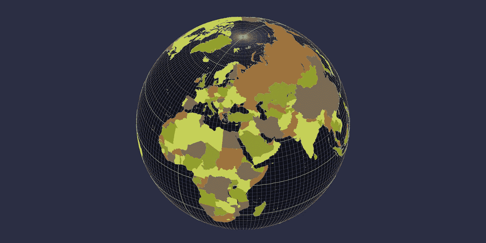
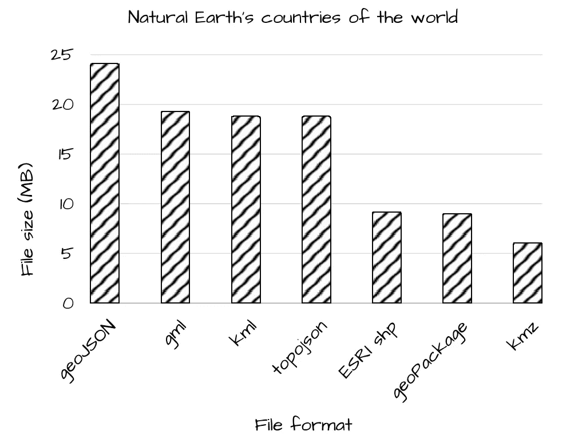
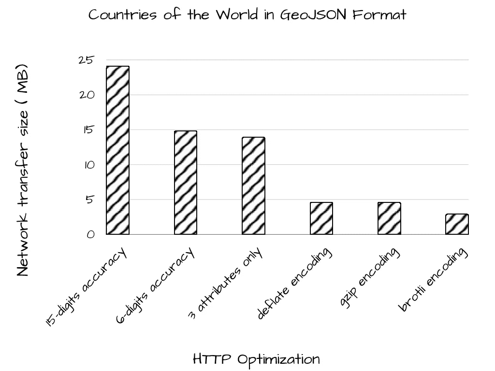
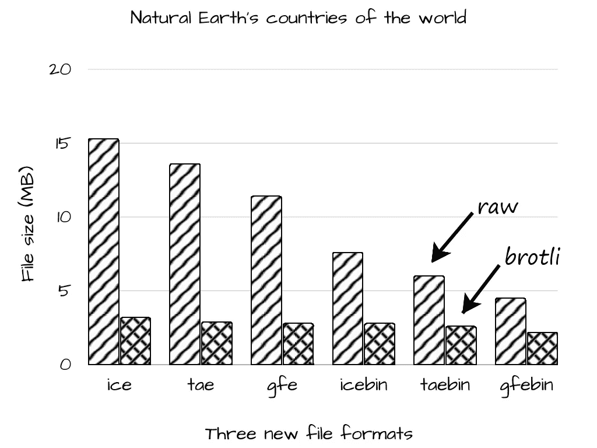

# 更好地压缩 GIS 要素

> 原文：<https://towardsdatascience.com/2022-051-better-compression-of-gis-features-9f38a540bda5>

## 深潜

## 替换 JSON、XML 和 Shapefile 格式，以改善访问者的体验


压缩大型数据集可能是获得和失去潜在用户的区别。(图片由约瑟夫·洪顿提供。)

使用在线地理信息系统(GIS)制图工具讲述数据密集型故事需要仔细规划。如果我们提供的数据太少，我们的故事就不会产生应有的影响。如果我们提供太多的数据，我们就有失去不耐烦的用户的风险，这些用户不愿意为下载大型 GIS 文件多等几秒钟。

因此，我们工作的一个重要部分是确保我们将 GIS 数据打包成尽可能紧凑的形式。

我一直在使用全球数据集，用地球的交互式正投影(T2)来讲述故事。以下是一些有用的策略，用于优化使用基于 web 的可视化工具访问大型 GIS 文件所需的时间。

## 基线案例

作为案例研究，使用了世界的[个国家的自然地球形状文件`(ne_10m_admin_0_countries)`。以下是它包含的内容:](https://www.naturalearthdata.com/downloads/10m-cultural-vectors/10m-admin-0-countries/)

*   258 个表示国家及其外围区域轮廓的要素。
*   每个特征的 161 个属性:名称、人口、地图颜色等。
*   474，443 个经度/纬度坐标对。
*   shapefile 坐标的基线文件大小为 8.39 MB，加上其 dBase 属性的 794 KB。



在 10 米分辨率的交互式世界正投影上显示世界上的国家。(图片由约瑟夫·洪顿提供。)

作为一个案例研究，这是一个很好的优化候选。它太大了，不适合在 HTTP 连接上使用，尤其是与其他类似大小的数据集结合使用时。

## GIS 文件格式的比较

[ESRI shapefile](https://www.esri.com/content/dam/esrisites/sitecore-archive/Files/Pdfs/library/whitepapers/pdfs/shapefile.pdf) 格式已经存在很长时间了，并且被每一个主要的 GIS 平台所支持。这对于希望分享作品的创作者来说非常有利。他们可以分发 shapefiles，并保证以最少的努力获得尽可能多的受众。

shapefile 格式最初是在 20 世纪 90 年代开发的，当时 GIS 还只是一项地方性事务。当时没有人想到可以远程执行 GIS，所以没有考虑优化文件传输时间。

随着 Web 2.0 运动的发展，在新千年开始时，XML 编码标准成为了惯例。[地理标记语言](https://www.ogc.org/standards/gml) (GML)是一种 XML 文件格式，当时被认为是一种无所不包的交换格式。GML 计划成为开发新一代网络地图应用的催化剂。

几年后，谷歌开始使用另一种 XML 文件格式——[Keyhole Markup Language](https://developers.google.com/kml/documentation/kmlreference)(KML)——用于其新生的 Keyhole Earth 浏览器(现在称为谷歌地球)。大型 KML 文件很冗长，所以实际上它们通常被压缩成 KMZ 文件。

如今，JSON 文件通常用于网站数据，而不是 XML 文件。这主要是因为如此多的语言方便地支持解析和序列化。geoJSON 格式顺应了这一趋势。尽管 geoJSON 文件很方便，但它几乎和 XML 文件一样冗长。

geoJSON 的替代方案是由 Mike Bostock 和 Calvin Metcalf 开发的 topoJSON 文件格式。它利用了共享公共边界的要素之间存在的拓扑冗余。这对于多边形数据(如世界各国)尤其有利。

另一个选择是 [GeoPackage](https://www.geopackage.org/spec/) 格式，它不会占用太多空间。它由跨平台 SQL 数据库中的一组标准化表定义组成。这意味着不需要特殊的导出和导入代码。文件经过优化，可供提供商和用户直接使用。

以下是每种格式的文件大小比较:



XML 和 JSON 文件的大小是原始 ESRI shapefile 的两倍。只有拉链 KML 更小。(使用 QGIS 生成的比较文件。)

## 属性最小化

当从 QGIS 保存为 geoJSON 文件时，默认坐标设置为 15 位十进制数字，我们的案例研究文件膨胀到 24.1 MB，是其初始大小的三倍！更好的坐标设置是 6 个十进制数字，这仍然可以在全球范围内提供 1 米的精度，但文件大小只会增加到 14.8 MB。

作为第一个优化——不管我们使用 XML、JSON 还是其他编码——我们可以删除所有无助于讲述我们故事的属性。对于这个案例研究，只保留了 3 个属性:`NAME, MAPCOLOR7, POP_EST`。当其他 158 个属性被删除时，geoJSON 文件大约减少 1MB，变成 13.9 MB。

对于 countries 数据集，大部分文件都是由经度/纬度坐标消耗的，因此节省的空间并不大。但相比之下，另一个常用的数据集，世界城市地区`(ne_10m_urban_areas)`包含 11，878 个要素。因此，对于该数据集，最小化每个要素的属性数量会导致更显著的减少。

## Web 服务器压缩

将坐标精度降低到 6 位小数，并删除未使用的属性，这仅仅是个开始。考虑网络压缩技术的可用性也很重要。

Web 服务器压缩几乎总是能够大幅减少通过网络传输的字节数。所有 web 服务器和浏览器都理解三种`content-encoding`可能性:deflate、gzip 和 brotli。

作为比较，以下是使用`accept-encoding`请求头获取优化的 13.9 MB geoJSON 文件时，通过网络传输的实际字节数:

*   `deflate` 4.59 兆字节
*   `gzip` 4.59 兆字节
*   `brotli` 2.90 MB

相对较新的 brotli 方案在最小化传输的字节方面是明显的赢家。不利的一面是，brotli 方案需要在服务器上花费额外的时间来执行其相当复杂的压缩，因此必须预先缓存并准备好提供，这样才能真正节省时间。



HTTP 内容编码很容易获胜。请让您的 DevOps 工作人员进行设置。(显示的 Web 压缩统计数据来自 [RWSERVE HTTP/2 服务器](https://rwserve.readwritetools.com/)。)

如果您无法完成配置 web 服务器的任务，请让您的 DevOps 工作人员将这些设置添加到您的配置文件中:

```
content-types {
        geojson     application/geojson
        topojson    application/topojson
    }
    content-encoding {
        application/geojson  br,gzip,deflate
        application/topojson br,gzip,deflate
    }
    cache-control {
        `*.geojson`   *instructions='public, max-age=86400'
        `*.topojson`  *instructions='public, max-age=86400'
    }
```

另外，请记住在服务器和用户浏览器上都启用缓存。在服务器上缓存意味着将预压缩的数据集保存在一个可以立即访问的地方，而不必在每次请求时都重新压缩它。浏览器上的缓存意味着设置`cache-control`响应头，这样用户就不必检索他们上次访问你的网站时保存的数据。

## 三种新的 GIS 编码

JSON 的便利已经变成了一根拐杖，我们经常会蹒跚而行，而不是昂首阔步。我们可以做得更好。

由于对当前的技术水平不满意，我对这个问题进行了深入的研究，并确定了几个改进的机会。

*   JSON 文件语法很多，逗号、引号、花括号和方括号遍布其中。
*   每个特征的属性名称都是重复的*。*
*   两个相邻要素之间的边界共享一个公共坐标序列，一个沿顺时针方向，另一个沿逆时针方向。
*   生成的格网上的经度和纬度由多个要素共享，这是一个明显的冗余，应该加以利用。
*   文本文件存储数字效率低下，精度有限。
*   文本文件需要分隔符(空格或逗号)来分隔数据。

接下来的三种文件编码是我对这些问题和机会的解决方案:

1.  地理要素编码(GFE)
2.  索引坐标编码
3.  拓扑弧编码(TAE)

它们在 GDAL 的`ogr2ogr`转换工具中还不可用；尽管如此，因为它们是用 JavaScript 编写的，所以使用 [gcsio](https://www.npmjs.com/package/gcsio) 包的序列化器和解析器在浏览器和 Node.js 主机上都是可用的。

**地理要素编码(GFE)**

地理要素编码文件格式删除了所有额外的双引号、花括号、硬括号和逗号，它们在 JSON 文件中占据了大量空间。在内部，该文件仍然是纯文本，因此任何文件编辑器都可以用来显示其内容或进行微小的编辑。

当打开查看时，GFE 文件看起来有点像一个老派的制表符分隔的文件，但有了新的面貌。这里有一个展示文件自描述性质的例子。文件的其余部分包含经度、纬度和我们选择保留的三个属性值。

```
!gfe 1.0
!dataset ne_10m_admin_0_countries
!geometry Polygon
!properties 5
lngRings,latRings,NAME,MAPCOLOR7,POP_EST
lngRings,latRings,string,string,string
!features 258
. . .
```

除了自描述的特性，GFE 格式还能够在同一个文件中序列化和解析多个数据集。这对于顶点、边和面的规则模式共享公共坐标的情况尤其重要。

**索引坐标编码(ICE)**

ICE 格式更进一步，利用了具有重合折点的数据集。这是通过构建由多个要素共享的经度和纬度值的索引列表来实现的。

ICE 文件看起来类似于 GFE 文件，但是增加了一个保存唯一经度和纬度值的部分。在这种方案中，单个要素将其坐标存储为短整数索引，而不是长浮点值。

**拓扑弧编码(TAE)**

一些面(如案例研究文件)具有很长的经度/纬度对序列，这些序列通常定义两个相邻要素之间的公共边界。如果这些序列可以被识别，那么它们可以被两个特征重复使用。

TAE 分析器能够识别两个要素共有的公共弧。有了这些信息，特征被重新加工成一系列圆弧参考，而不是一系列坐标对。圆弧参照是简单的整数值。

TAE 文件使用与前两种格式相同的通用自识别方案，并增加了一个拓扑弧部分。

**二进制序列化**

GFE、ICE 和 TAE 文件都存在文本文件固有的低效问题。第一，数字占用空间太大。其次，相邻的属性仍然需要用某种类型的空格来分隔，这样解析器才能正常工作。

它们互补的*二进制*文件格式是:

1.  地理要素编码二进制(GFEBIN)
2.  索引坐标编码二进制
3.  拓扑弧编码二进制(TAEBIN)

对于二进制文件，浮点数没有这个问题。数字可以紧凑地存储在 1 字节、2 字节或 4 字节序列中。对 GIS 文件特别重要的是，经度和纬度都可以存储为一个 4 字节的压缩数字。压缩浮点值具有足够的精度，可以以 11 厘米的精度定位地球上任何地方的对象。相比之下，具有同等精度的十进制经度值“-179.876543”在文本文件中将占据 11 个字节。

二进制文件不需要空白分隔符——制表符、换行符和逗号在二进制文件中不起作用。

## 选择最佳优化

考虑最佳优化时，应考虑几个正交因素:要素数量、每个要素的属性数量、每个要素的平均折点数、所需的坐标精度以及拓扑共享程度。

以下是一些有帮助的指导方针:

*   线和点数据集通常使用简单的 GFE 编码效果最佳。
*   当要素位于共享同一经度或纬度的规则格网上时，ICE 编码将非常有用。
*   具有共享边界的多边形数据集可以利用拓扑，因此 TAE 是一个不错的选择。
*   二进制编码的压缩效果总是比文本编码好，所以大多数情况下选择 GFEBIN、ICEBIN 或者 TAEBIN。
*   当人的可读性很重要时，退回到基于文本的 GFE、ICE 和 TAE；例如，当调试数据集时，或者当预计要手动编辑要素时。

对于案例研究，结果文件大小为:

*   `ICE` 15.3 MB 原始/ 3.2 MB brotli
*   `TAE` 13.6 MB 原始/ 2.9 MB brotli
*   `GFE` 11.4 MB raw / 2.8 MB brotli
*   `ICEBIN` 7.6 MB 原始/ 2.8 MB brotli
*   `TAEBIN` 6.0 MB raw / 2.6 MB brotli
*   `GFEBIN` 4.5 MB 原始/ 2.2 MB brotli



这三种新格式的二进制编码的大小是文本的一半，brotli 压缩又将文件大小减少了一半。

不管文件格式如何，brotli 网络压缩无疑是赢家。但是要小心，因为服务器端的压缩需要时间。请确保预先缓存压缩文件，以便可以毫不延迟地提供该文件。

至于文件格式本身，“哪种格式把最多的数据挤进最小的空间”这个问题没有简单的答案。最好的工作流程是自动将源数据集转换为每种受支持的格式，然后比较它们的结果大小。当这不可能时，GFEBIN 是最好的通用默认设置。