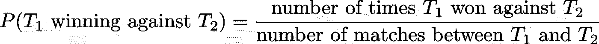
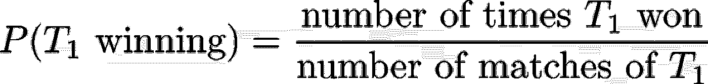
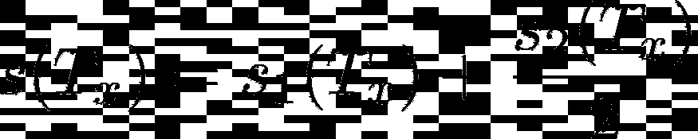
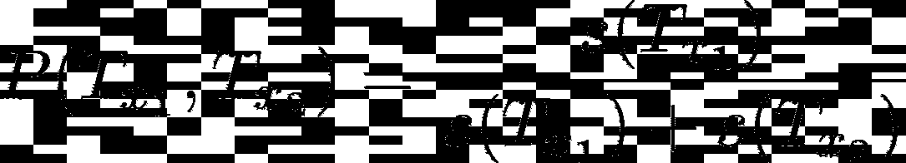
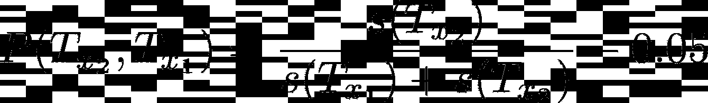
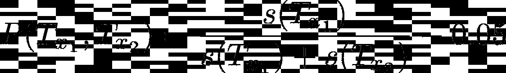

# 2022 世界杯模拟器使用数据科学，用 Python

> 原文：<https://towardsdatascience.com/2022-world-cup-simulator-using-data-science-with-python-6bf56a543436>

## 以下是我如何建立一个世界杯模拟器，并预测下一届世界杯冠军

照片由[瑞德·路易斯](https://unsplash.com/@historysoccerof?utm_source=unsplash&utm_medium=referral&utm_content=creditCopyText)在 [Unsplash](https://unsplash.com/s/photos/world-cup?utm_source=unsplash&utm_medium=referral&utm_content=creditCopyText) 拍摄

> **免责声明 1** :请勿将此用于博彩目的。这只是一个数据科学家做的数学实验。我不是一个给小费的人，我也不想对你的赌注提出任何建议。
> 
> **免责声明 2:** 本文与这些天卡塔尔发生的所有事件没有任何关系，也不是 2022 年卡塔尔世界杯的赞助商或反赞助商

所以，2020 年我们夺得欧洲杯后，**意大利出局世界杯。作为一名意大利人，这让我非常失望。我们的国家是一个每天吃饭、睡觉、聊天、踢足球的国家。我记得意大利上一次赢得世界杯时，我还是个孩子。当我和家人在罗马我叔叔家的小电视上看这场比赛时，我还不到 10 岁。**

我现在 25 岁了，住在美国，但那段记忆却永远印在了我的灵魂里。尽管本届卡塔尔世界杯给我们带来了诸多争议，但我仍然相信世界杯本身就是一个神奇的时刻。

问题是，今天我也是一名研究人员，我每天都在使用数据科学。我生命中的最后 4 年在大学里做数据科学和机器学习，我完全爱上了它。

所以我决定做的是建立一个数据科学算法(我不会恰当地称之为机器学习，但你将是裁判)来预测下一届世界杯版本的获胜者和整个锦标赛。

所以让我用几句话告诉你，你会在这篇文章中看到什么:

1.  我们将**为匹配结果建立某种概率函数**
2.  我们将**基于我们提取的概率运行一个模拟**
3.  我们将**多次运行模拟**并提取一些统计数据

那就开始吧！

# 1.第一步

让我们先导入一些库:

我使用的数据集是一个关于**比赛**和一个国家队赢得或通过小组赛次数的数据集，我们将会看到。

现在我来做一些探索。让我们从显而易见的开始，看看每支球队之前赢得过多少次世界杯:

我们已经知道了，对吧？巴西 5 胜，意大利 4 胜，阿根廷 2 胜(迭戈)。

我们可以探索的另一件很酷的事情是，在 matches 数据集中，我们还有锦标赛的阶段。探究这一点很有意思，因为一个国家通过小组赛的次数明显地表明了该队的水平。

让我们来看看:

所以我们有很多小组赛，但只有几个淘汰赛。这完全有道理，因为，当然，你有多个小组，但只有一个淘汰阶段。

# 2.模拟概率分布

现在无聊的部分做完了，让我们进入我们将要如何模拟这届世界杯的细节。

我们有我们的球队和他们的比赛。假设你有团队 1(t1)和团队 2(T2)。一队赢这场比赛的可能性有多大？

作者图片

T2 和**图**也是一样。

现在，关于**抽签:**当然，两队在小组赛阶段可以抽签，但在淘汰赛阶段不能抽签。稍后我会告诉你如何处理。😉

类似于我之前所说的，我们可以找到一般情况下 t1 获胜的概率如下:

作者图片

当然，无论输赢都是一样的。
为此，我们需要下面的匹配列，我们称之为“结果”:

现在我们必须选出参加卡塔尔世界杯的队伍。这不是一个很大的工作量，我们可以从网站上复制和粘贴它。我是为你做的。

现在，我们必须将现有的数据与团队列表进行匹配。我们必须确保数据集中有所有将去卡塔尔的球队。

具有讽刺意味的是，卡塔尔是我们数据集中唯一没有的球队。我们以后再处理这个。我们暂且补充一个卡塔尔 _ 概率字典，这是一种杜撰的卡塔尔在世界杯上实际能赢多少场比赛的现实概率。

现在，如果我们想做概率转换，让我们使用以下函数:

让我们绘制一些随机结果:

现在，这一切都很酷，但我们需要做的是**比赛**的概率，而不仅仅是单个团队的概率。我们以下列方式应用上述规则:

现在，这个概率只有在两个匹配有匹配历史的情况下才有效。例如，这在法国和意大利行得通:

但是在这种情况下我们该怎么办呢？

现在。这是一个真正的问题。我没有答案，因为很难自动预测两支从未交手过的球队的结果。我们能做的是为每一次建立一个**分数**，并比较两个分数，以将它们转换为团队 1 获胜、团队 2 获胜或两个团队平局的概率。

我认为一个球队的好成绩就是球队**通过小组赛**的(归一化)次数。这当然是一个很好的点，表明了一个团队的质量。我们称之为 1 分。另一个需要考虑的重要事情是一支球队实际赢得世界杯的次数。我们称之为 2 分。由于 score_1 介于 0 和 1 之间，而 score_2 可以是 2、3 或 4，因此让我们将其乘以 0.5。所以给定一个团队 T，我们将有:

作者图片

所以如果我们有两个队，T_x1 和 T_x2，我们把 T_x1 赢的概率定义为 P(T_x1，T_x2)，我们可以说:

作者图片

并且:

作者图片

但是这个概率的定义不允许我们画。所以我们宁愿说两个从未打过比赛的球队之间的平局概率是固定的，比如说 0.10。那么我们会说:

作者图片

作者图片

他们抽到的概率是:

作者图片

让我们以下面的方式实现这个想法:

**1。获取团队分数的函数**

**2。将两个队的得分转换成概率的函数**

> *我们可以看到，卡塔尔的得分是 0.09。我从所有分数 1 分布的第一个 0 . 25 四分位数得到的。对于一支从未参加过世界杯的球队来说，这是一个合理的(低)数值。

**3。用于提取比赛中两个队之间的结果概率的函数***

例如:

> *我还确信，通过增加一些(小的)输赢概率，一个团队不可能有 100%的胜算

# 3.乐趣！

现在是时候让我们的模型运行了。我们必须为卡塔尔世界杯组建准确的小组。我们将让这个小组运行，一个小组将根据我们建立的概率赢、平或输。

我们还将建立算法淘汰阶段(A 组第一队对 B 组第二队，B 组第一队对 A 组第二队)。

我们将多次运行这个算法，然后选出获胜者。

让我一步一步来。让我们来定义这些组:

并将它们组合在一起:

例如，这是 B 组的概率:

基于这些概率，我们可以按以下方式运行模拟:这是针对给定组的:

这适用于所有组:

让我们为各组进行模拟:

让我们展示一些结果:

这些都是:

我不知道你怎么想，但是我认为这些结果是非常真实的。

让我们继续前进！

从分组来看，这是淘汰阶段:

这是整个锦标赛模拟:

这是整个锦标赛模拟的一个例子:

我们可以运行 10，000 次:

(需要一段时间)

**以下是获胜者的统计:**

其中一些令人惊讶(塞内加尔，哥斯达黎加，厄瓜多尔…，巴西和阿根廷不包括在内)，一些相当可靠(西班牙，德国，英国)

我们可以稍微改变一下函数来决定冠军和亚军。

这实际上非常令人兴奋，我们可以得出很多结论。例如，荷兰在决赛中发挥很大作用，英格兰也是如此。尽管如此，西班牙在决赛中的胜场比这两支球队都多。我们可以继续分析。比如，伊朗进入了决赛(至少一次)，但从未获胜。

# 4.考虑

在这篇文章中，我们模拟了下一届世界杯冠军。我们实际上模拟了整个比赛，我们抽取了冠军和第二队。

为此，我们采取了以下措施:

1.  提取团队的**统计数据**
2.  为几乎没有比赛记录的队伍建立一个**分数**系统
3.  建立分组选择和淘汰阶段的**算法**
4.  **多次运行模拟**。
5.  提取**结果**。

有很大的改进空间。例如，我们可以考虑球队的实际质量，考虑他们的球员、教练和他们的状态。同时，让我们享受一些精彩的足球。🥰

# 5.结论

如果你喜欢这篇文章，你想了解更多关于机器学习的知识，或者你只是想问我一些问题，你可以:

A.在 [**Linkedin**](https://www.linkedin.com/in/pieropaialunga/) 上关注我，我在那里发布我所有的故事
B .订阅我的 [**简讯**](https://piero-paialunga.medium.com/subscribe) 。这会让你了解新的故事，并给你机会发短信给我，让我收到你所有的更正或疑问。
C .成为 [**推荐会员**](https://piero-paialunga.medium.com/membership) ，这样你就不会有任何“本月最大数量的故事”了，你可以阅读我(以及成千上万其他机器学习和数据科学顶级作家)写的任何关于现有最新技术的文章。