# 人们在不告诉你的情况下使用的 25 种先进的熊猫功能

> 原文：<https://towardsdatascience.com/25-advanced-pandas-functions-people-are-using-without-telling-you-b65fa442f0f4>

## ExcelWriter，因式分解，分解，挤压，T，遮罩，idxmax，剪辑，…


来自 [Pexels](https://www.pexels.com/photo/man-wearing-black-blazer-3051576/) 的 Caleb Oquendo 的照片

“我希望我能在熊猫身上做这个手术……”

很有可能，你可以！

Pandas 是如此的庞大和深入，它使您能够执行几乎任何您能想到的表格操作。然而，这种巨大有时会成为劣势。

许多优雅、高级的特性解决了罕见的边缘情况和独特的场景，但这些特性在文档中消失了，被更频繁使用的特性所掩盖。

这篇文章旨在重新发现这些特征，并向你展示熊猫比你所知道的更令人敬畏。

<https://ibexorigin.medium.com/membership>  

获得由强大的 AI-Alpha 信号选择和总结的最佳和最新的 ML 和 AI 论文:

<https://alphasignal.ai/?referrer=Bex>  

# 1.`ExcelWriter`

`ExcelWriter`是创建 excel 文件的通用类(带工作表！)并将数据帧写入其中。假设我们有 2:

它有额外的属性来指定要使用的日期时间格式，您是否想要创建一个新的 excel 文件或修改一个现有的文件，当一个工作表存在时会发生什么，等等。查看[文档](https://pandas.pydata.org/pandas-docs/stable/reference/api/pandas.ExcelWriter.html)中的详细信息。

# 2.`pipe`


**照片由** [**莉亚·凯利**](https://www.pexels.com/@leah-kelley-50725?utm_content=attributionCopyText&utm_medium=referral&utm_source=pexels) **上** [**佩克斯**](https://www.pexels.com/photo/grayscale-photo-of-man-holding-tobacco-pipe-192473/?utm_content=attributionCopyText&utm_medium=referral&utm_source=pexels)

`pipe`是 Pandas 中以简洁紧凑的方式进行数据清理的最佳功能之一。它允许您将多个自定义函数链接到一个操作中。

例如，假设你有接受自己参数的函数`drop_duplicates`、`remove_outliers`、`encode_categoricals`。以下是如何在一次操作中应用这三种方法:

我喜欢这个函数如何类似于 [Sklearn 管道](/how-to-use-sklearn-pipelines-for-ridiculously-neat-code-a61ab66ca90d)。你可以用它做更多的事情，所以查看一下[文档](https://pandas.pydata.org/docs/reference/api/pandas.DataFrame.pipe.html)或者这篇[有用的文章](/a-better-way-for-data-preprocessing-pandas-pipe-a08336a012bc)。

# 3.`factorize`

这个功能是 Sklearn 的`LabelEncoder`的熊猫替代品:

与`LabelEncoder`不同，`factorize`返回两个值的元组:编码列和唯一类别列表:

# 4.`explode`—🤯🤯🤯


**照片由** [**约书亚·苏科夫**](https://unsplash.com/@joshuas?utm_source=unsplash&utm_medium=referral&utm_content=creditCopyText) **上**[**Unsplash**](https://unsplash.com/s/photos/explode?utm_source=unsplash&utm_medium=referral&utm_content=creditCopyText)

一个名字很有趣的函数叫`explode`。先看个例子再解释:


`dirty`列有两行，其中的值被记录为实际列表。您可能经常在调查中看到这种类型的数据，因为有些问题接受多个答案。

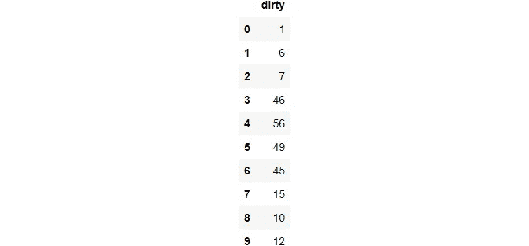

`explode`获取一个具有类似数组的值的单元格，*将它分解*成多行。将`ignore_index`设置为 True 以保持数字索引的顺序。

# 5.`squeeze`


**图片由**[**cotton bro**](https://www.pexels.com/@cottonbro?utm_content=attributionCopyText&utm_medium=referral&utm_source=pexels)**上** [**Pexels**](https://www.pexels.com/photo/close-up-photo-of-sausage-5875701/?utm_content=attributionCopyText&utm_medium=referral&utm_source=pexels)

另一个有着时髦名字的函数是`squeeze`,用于非常罕见但令人讨厌的边缘情况。

其中一种情况是从用于数据帧子集的条件返回单个值。考虑这个例子:


即使只有一个单元格，它也会作为 DataFrame 返回。这可能很烦人，因为现在您必须再次使用`.loc`和列名和索引来访问价格。

但是，如果你知道`squeeze`，你就不必。函数使您能够从单个单元格数据帧或系列中删除坐标轴。例如:

```
>>> subset.squeeze()326
```

现在，只返回标量。也可以指定要移除的轴:

注意`squeeze`仅适用于单值的数据帧或序列。

# 6.在...之间


**照片由** [**贾斯汀做梦**](https://unsplash.com/@jujudreaminx?utm_source=unsplash&utm_medium=referral&utm_content=creditCopyText) **上** [**像素**](https://unsplash.com/s/photos/between?utm_source=unsplash&utm_medium=referral&utm_content=creditCopyText)

一个相当漂亮的函数，用于对一个范围内的数字特征进行布尔索引:

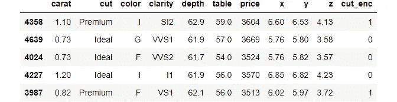

# 7.`T`


**照片由**[**Pixabay**](https://www.pexels.com/@pixabay?utm_content=attributionCopyText&utm_medium=referral&utm_source=pexels)**上的** [**像素**](https://www.pexels.com/photo/close-up-of-illuminated-text-against-black-background-258083/?utm_content=attributionCopyText&utm_medium=referral&utm_source=pexels) 组成

所有数据帧都有一个简单的`T`属性，代表*转置*。您可能不经常使用它，但是我发现它在显示`describe`方法的数据帧时非常有用:

```
>>> boston.describe().T.head(10)
```

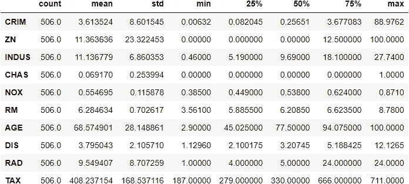

作者图片

波士顿住房数据集有 30 个数值列。如果您按原样调用【the DataFrame 将会水平拉伸，从而很难比较统计数据。进行转置将会切换轴，从而以列的形式给出汇总统计数据。

# 8.熊猫造型

你知道熊猫允许你设计数据框架吗？

它们有一个`style`属性，打开了只受你的 HTML 和 CSS 知识限制的定制和样式的大门。我不会讨论你可以用`style`做什么的全部细节，而只会向你展示我最喜欢的功能:

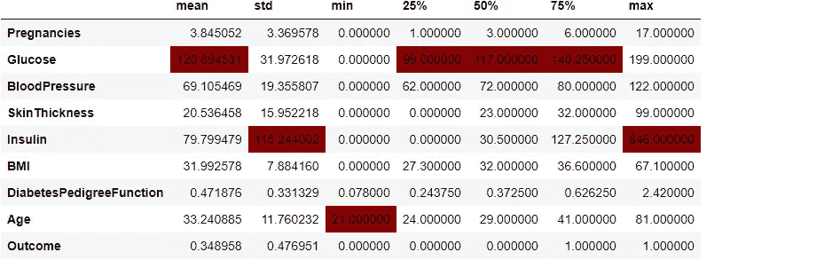

作者图片

上面，我们突出显示了保存一列最大值的单元格。另一个很酷的样式器是`background_gradient`，它可以根据列的值给列一个渐变的背景颜色:

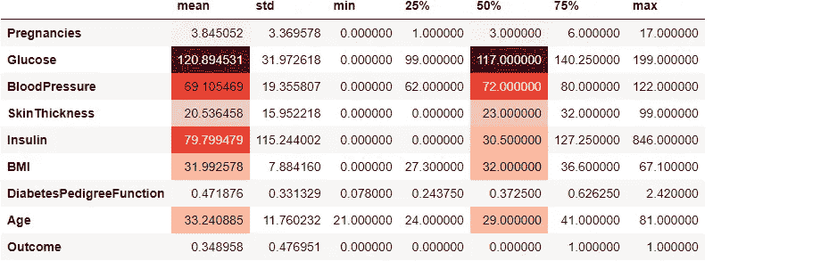

当您在一个有许多列的表上使用`describe`并想要比较汇总统计数据时，这个特性特别方便。点击查看 styler [的文档。](https://pandas.pydata.org/docs/reference/style.html)

# 9.熊猫选项

与 Matplotlib 一样，pandas 也有全局设置，您可以调整这些设置来更改默认行为:

这些设置分为 5 个模块。我们来看看`display`下有哪些设置:

`display`下有很多选项，但我主要使用`max_columns`和`precision`:

你可以查看[文档](https://pandas.pydata.org/pandas-docs/stable/user_guide/options.html)来深入了解这个奇妙的特性。

# 10.`convert_dtypes`

我们都知道 pandas 有一个令人讨厌的倾向，就是将一些列标记为`object`数据类型。您可以使用试图推断最佳数据类型的`convert_dtypes`方法，而不是手动指定它们的类型:

不幸的是，由于不同日期时间格式的限制，它不能解析日期。

# 11.`select_dtypes`

我一直在用的一个函数是`select_dtypes`。我认为从它的名字可以明显看出这个函数是做什么的。它有`include`和`exclude`参数，您可以使用它们来选择包含或排除某些数据类型的列。

例如，仅选择带有`np.number`的数字列:

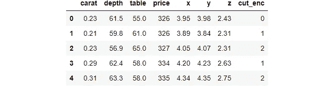

作者图片

或者`exclude`他们:


作者图片

# 12.`mask`


**照片由**[**Pixabay**](https://www.pexels.com/@pixabay?utm_content=attributionCopyText&utm_medium=referral&utm_source=pexels)**上的** [**像素组成。**](https://www.pexels.com/photo/photo-of-guy-fawkes-mask-with-red-flower-on-top-on-hand-38275/?utm_content=attributionCopyText&utm_medium=referral&utm_source=pexels)

`mask`允许您快速替换自定义条件为真的单元格值。

例如，假设我们有从 50-60 岁人群中收集的调查数据。


作者图片

我们将把 50-60 范围之外的年龄(有两个，49 和 66)视为数据输入错误，并用 NaNs 替换它们。


作者图片

所以，`mask`用`other`替换不满足`cond`的值。

# 13.沿着列轴的`min`和`max`

尽管`min`和`max`函数是众所周知的，但它们对于某些边缘情况还有另一个有用的属性。考虑这个数据集:

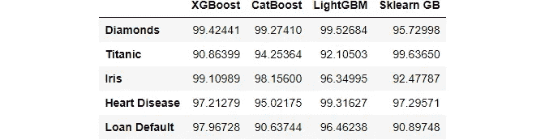

作者图片

上面的假数据帧是 4 个不同梯度增强库在 5 个数据集上的点性能。我们希望找到在每个数据集上表现最好的库。以下是你如何用`max`优雅地做到这一点:

只需将轴更改为 1，就可以得到行方向的最大值/最小值。

# 14.`nlargest`和`nsmallest`

有时，您不仅仅需要列的最小值/最大值。你想看一个变量的前 N 个或者~(top N)个值。这就是`nlargest`和`nsmallest`派上用场的地方。

让我们来看看最贵和最便宜的五大钻石:

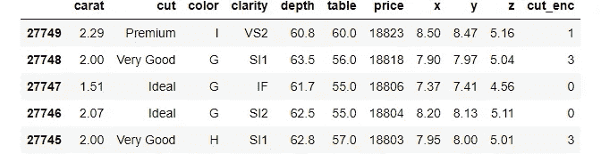

作者图片

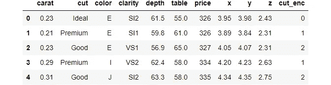

作者图片

# 15.`idxmax`和`idxmin`

当您在列上调用`max`或`min`时，pandas 返回最大/最小值。然而，有时您想要最小/最大值的*位置*，这对于这些功能是不可能的。

相反，你应该使用`idxmax` / `idxmin`:

您还可以指定`columns`轴，在这种情况下，函数会返回列的索引号。

# 16.`value_counts`同`dropna=False`

寻找缺失值百分比的常见操作是将`isnull`和`sum`链接起来，然后除以数组的长度。

但是，你可以用相关的参数对`value_counts`做同样的事情:

埃姆斯住宅数据集的壁炉质量包含 47%的零。

# 17.`clip`


**照片由** [**安 H**](https://www.pexels.com/@ann-h-45017?utm_content=attributionCopyText&utm_medium=referral&utm_source=pexels) **上** [**Pexels**](https://www.pexels.com/photo/a-lot-of-paper-clips-2448452/?utm_content=attributionCopyText&utm_medium=referral&utm_source=pexels)

异常值检测和去除在数据分析中很常见。

`clip`函数使得找出超出范围的异常值并用硬限制替换它们变得非常容易。

让我们回到年龄的例子:


这一次，我们将把超出范围的年龄替换为 50 岁和 60 岁的硬性限制:

```
>>> ages.clip(50, 60)
```


快速高效！

# 18.`at_time`和`between_time`

当处理高粒度的时间序列时，这两种方法会很有用。

`at_time`允许您在特定日期或时间对值进行子集化。考虑这个时间序列:


作者图片

让我们选择下午 3 点的所有行:

```
>>> data.at_time("15:00")
```


作者图片

很酷吧。现在，让我们使用`between_time`来选择自定义间隔内的行:


作者图片

注意，这两个函数都需要一个 DateTimeIndex，并且它们只处理时间(如在*点*)。如果你想在日期时间间隔内子集化，使用`between`。

# 19.`bdate_range`

`bdate_range`是一个创建具有工作日频率的时间序列指数的简写函数:

工作日频率在金融界很常见。因此，当使用`reindex`功能重新索引现有时间序列时，该功能可能会派上用场。

# 20.`autocorr`

时间序列分析的一个关键部分是检查变量的自相关性。

自相关是[简单的相关系数](https://towardsdev.com/how-to-not-misunderstand-correlation-75ce9b0289e)，但它是用时间序列的滞后版本计算的。

更详细地说，时间序列在`lag=k`的自相关计算如下:

1.  时间序列移动到`k`周期:


作者图片

2.计算原始`tip`和每个`lag_*`之间的相关性。

你可以使用熊猫的`autocorr`功能，而不是手动完成所有这些操作:

你可以从这篇[文章](/advanced-time-series-analysis-in-python-decomposition-autocorrelation-115aa64f475e)中了解更多关于自相关在时间序列分析中的重要性。

# 21.`hasnans`

Pandas 提供了一种快速的方法来检查一个给定的序列是否包含任何带有`hasnans`属性的空值:

根据其[文档](https://pandas.pydata.org/pandas-docs/stable/reference/api/pandas.Series.hasnans.html)，它可以实现各种性能提升。注意，该属性仅在`pd.Series`上有效。

# 22.`at`和`iat`

这两个访问器比`loc`和`iloc`快得多，但有一个缺点。它们一次只允许选择或替换一个值:

# 23.`argsort`

当您想要提取将对数组进行排序的索引时，应该使用此函数:

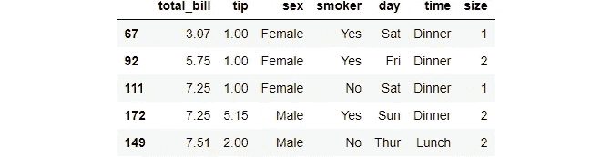

作者图片

# 24.`cat`访问器

众所周知，Pandas 允许使用像`dt`或`str`这样的访问器对日期和字符串使用内置的 Python 函数。

Pandas 还有一个特殊的`category`数据类型用于分类变量，如下所示:

当一个列为`category`时，您可以使用`cat`访问器来使用几个特殊的函数。例如，让我们看看钻石切割的独特类别:

还有类似`remove_categories`或`rename_categories`等功能。：

你可以在这里看到`cat`访问器[下的完整函数列表。](https://pandas.pydata.org/pandas-docs/stable/reference/series.html#categorical-accessor)

# 25.`GroupBy.nth`

该功能仅适用于`GroupBy`对象。具体来说，分组后，`nth`从每个组中返回第 n 行:

```
>>> diamonds.groupby("cut").nth(5)
```

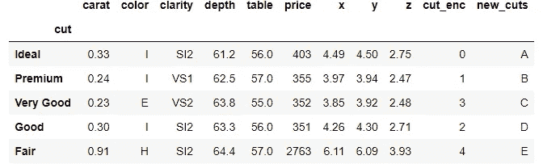

# 摘要

尽管像 Dask 和 datatable 这样的库正在以其处理海量数据集的闪亮新功能慢慢赢得 Pandas，Pandas 仍然是 Python 数据科学生态系统中使用最广泛的数据操作工具。

该库是其他软件包模仿和改进的榜样，因为它很好地集成到了现代 SciPy 堆栈中。

感谢您的阅读！

<https://ibexorigin.medium.com/membership>  <https://ibexorigin.medium.com/subscribe>  

更多来自我的故事…

</forget-roadmaps-here-is-how-to-dominate-the-data-science-stack-blazingly-fast-a49e62f2bcf>  <https://ibexorigin.medium.com/28-weekly-machine-learning-tricks-and-resources-that-are-pure-gems-1-8e5259a93c94>  </18-non-cliché-datasets-for-beginner-data-scientists-to-build-a-strong-portfolio-c59743b2a829>  </advanced-tutorial-how-to-master-matplotlib-like-an-absolute-boss-aae2d4936734> 