# 2D 旋翼直升机机械和 PID 控制一体化

> 原文：<https://towardsdatascience.com/2d-rotorcopter-mechanics-and-pid-control-with-unity-a3d9a3951a8a>

## 模拟二维飞行，并在 Unity 引擎的帮助下学习 PID 控制回路

这篇文章介绍了如何使用 Unity 游戏引擎和 PID 控制器来实现一个二维四轴飞行器的飞行控制。这是最近实现的，这里记录了细节，希望对其他人有所帮助。

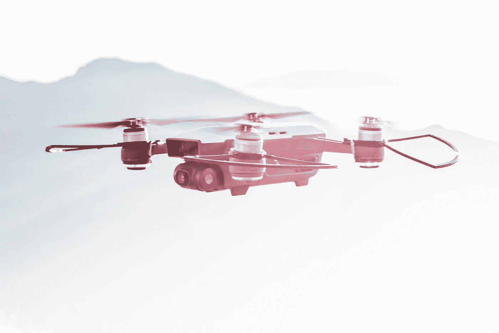

阿莱西奥·索格蒂在 [Unsplash](https://unsplash.com/s/photos/drone?utm_source=unsplash&utm_medium=referral&utm_content=creditCopyText) 上拍摄的照片

# 预期成果

遵循本教程中的演练应该*希望*提供以下内容:

1.  模拟二维四轴飞行器飞行的统一环境，准备进行实验。
2.  对 PID 控制器如何在 Unity(和其他地方)中作为控制系统使用有一个基本的了解。
3.  旋翼机二维动力学基础。

所有覆盖的代码以及工作项目都可以在这个 GitHub 的资源库中找到。如果您不关心如何以及为什么获取代码的演练，可以直接跳到**模拟**部分。

# 开始之前

为这个模拟做了一些决定。

**为什么统一？** [Unity](https://unity.com/) 配备了一个复杂的物理引擎，使快速开发和实验变得快速简单。

**为什么只有二维？**旋翼机控制的问题很复杂，去除一个维度可以显著简化。一旦掌握了二维的控制，三维就能被解决。

**为什么把** [**PID 控制器**](https://en.wikipedia.org/wiki/PID_controller) **？有经验的 Unity 开发者可能想知道为什么使用 PID 控制而不是传统的路径技术。我们的目标是使用一个可以转化为现实世界的控制器。PID 控制器是自动调节系统的首选控制回路。**

# 2D 四轴飞行器的基本知识

通过以 2 维而不是 3 维开始模拟，复杂性显著降低。

***重要:*** *本文中，纵轴称为* ***y*** *，横轴称为******【x****。这样做是为了保持与****x-y****2D 轴的一致性。在标准符号中，水平轴将被称为* ***y*** *，垂直轴将被称为* ***z*** *(或****x =>****和***y =>***)。***

****现役部队****

**无人机在任何给定时间都有三个合力作用于其上:**

1.  ****每个**推进器垂直于机架向上的可变向上力**
2.  **恒定的重力直接向下，与框架的方向无关。**

****

**作者图片**

**只要四轴飞行器被定义为有质量的刚体，Unity 就照顾到了引力。转子的力(或推力)是控制系统必须管理的。**

****控制****

**模拟四轴飞行器的加速可以通过改变旋翼的推力来控制。**

**当四轴飞行器与地面水平时，加速度仅沿 **y** 轴施加。在这个方向上增加旋翼的推力会使四轴飞行器加速上升，而减少推力会使其加速下降。**

**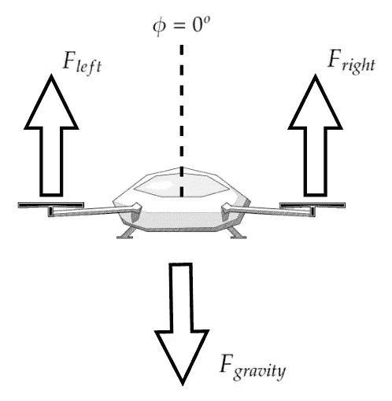**

**作者图片**

**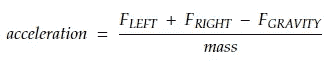**

**作者图片**

**当四轴飞行器相对于地面倾斜一个角度(我们将这个角度称为**φ**或 **𝜙** )时，来自螺旋桨的力开始施加水平和垂直加速度。保持这个方向的推力增加了水平速度(y 轴)。**

**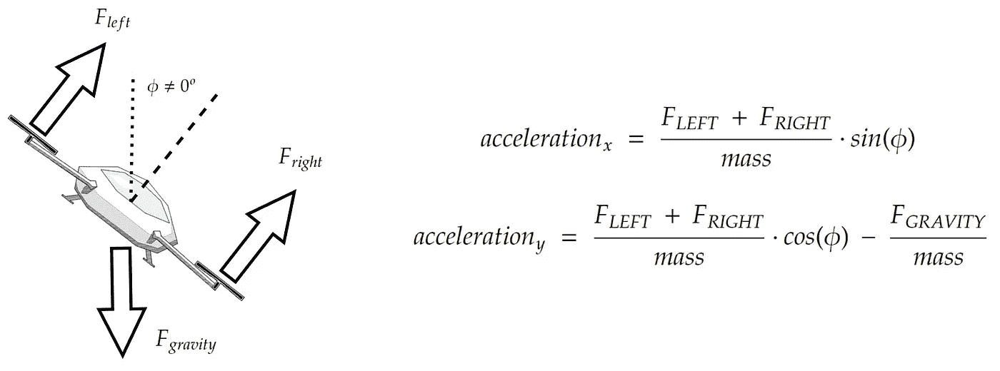**

**作者图片**

**或者…**

**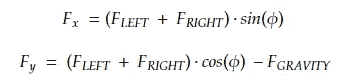**

**作者图片**

**最后，为了改变四轴飞行器(或**滚转**)的角度方向，转子之间的推力需要变化，以产生扭矩(或 [**力矩**](https://en.wikipedia.org/wiki/Moment_%28physics%29) **)** 。该力矩与力和转子之间的距离之差成比例。**

****

**作者图片**

**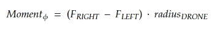**

**作者图片**

*****注:*** *三维四轴飞行器还需要控制***即电机旋转产生的扭矩(或力矩)。幸好只有 2D 没有第三次元让无人机向* ***左右偏航*** *。****

**上述动力学允许一个相当简单的控制系统，其中只需要确定四轴飞行器线性加速度的总推力和转子之间的旋转力差。这通常用 **u1** 和 **u2** 来表示，其中 **u1** 表示总推力，而 **u2** 表示总力矩。**

**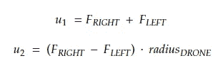**

**作者图片**

**这些是 PID 控制器需要确定的值。**

# **该控制系统**

**[PID 控制器](https://en.wikipedia.org/wiki/PID_controller)是一种控制回路方法，持续向系统提供输入(如推力、电压、电阻等)。)并基于系统随时间的表现来调整该输入。**

**总体思路是为 PID 控制器提供 3 个系数——位置、积分和微分。算法使用这些系数来确定当系统接近或远离其目标时如何缩放输出控制值。我们不会深入研究 PID 控制器工作原理背后的细节，但是强烈建议获得更多关于这个主题的知识。我发现这里的[系列](https://www.youtube.com/watch?v=wkfEZmsQqiA)是一个很好的介绍。**

**系统采用 2 个 PID 控制器来解决 2D 四轴飞行器的控制问题；**

****高度控制器**——为无人机提供将四轴飞行器驱动到所需高度所需的推力值。**

****姿态控制器**——为无人机提供力矩值，帮助稳定飞机。**

**这是控制循环的样子。注意，只有所需的高度(y 轴)被提供作为整个系统的输入。控制器的工作是驾驶四轴飞行器到那个高度，同时确保平衡的方向。**

**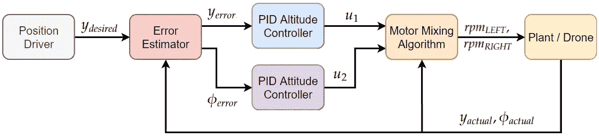**

**作者图片**

****位置驱动**——代表总控制回路输入——**高度。****

****误差估计器** —负责向 PID 控制器提供期望状态(**高度**和**中性方位**)和实际值之间的偏差的组件。**

****PID 高度控制器** —该 PID 控制器使用来自**误差估计器**的位置误差来导出一个 **u1** 值或总体期望的**垂直推力**。**

****PID 姿态控制器** —该 PID 控制器使用来自**误差估计器**的方位误差来导出 **u2** 值或所需的**扭矩**。**

****马达混合算法(MMA)** —该算法使用 **u1、u2** 并将它们与无人机的**当前方位**相结合，以确定每个旋翼所需的总推力。**

****工厂/无人机** —与环境交互并向系统提供实际状态值反馈的物理(或虚拟)无人机。**

# **代码**

**所有这些都完成后，让我们开始构建实际的模拟。[使用 Unity](https://unity.com/) 是由于其内置的物理引擎。GitHub 库可以在这里找到，包含了一个模拟的工作实例。**

**一个人可能没有任何 Unity 的经验，但是强烈建议你至少熟悉一下，即使你没有任何游戏开发的愿望。Brackeys 有一些奇妙的资源，比如这个[一个](https://www.youtube.com/watch?v=on9nwbZngyw)可以让你开始。**

## **文件夹结构**

**该项目被组织成以下文件结构。**

```
**├───**Prefabs**
│   ├───Quadcopter - prefab of the complete quadcopter
│   └───Thruster - prefab for a thruster object
├───**Scenes**
│   └───Main - the only scene in the project
├───**Scripts**
│   ├───PIDController - PID script obejcts
│   ├───Quadcopter - script for the quadcopter object
│   ├───FlightController - script to bring everything together
│   └───Thruster - script containing control for rotor objects**
```

## **现场**

**所有场景和摄影机默认值都将保留，场景仅使用以下对象进行更新:**

**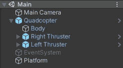**

**作者图片**

****四轴飞行器**——四轴飞行器，包含一个飞行控制器、一个刚体框架和两个推进器。**

****平台**——为四轴飞行器提供稳定起飞面的静态刚体。**

****事件系统** —默认事件系统对象，由于未使用而被禁用。**

****主摄像机** —默认摄像机对象。**

## **代码**

**这里可以找到<https://github.com/adidinchuk/2d-unity-quadcopter-sim>****。**脚本对象是用几行值得注意的代码进行高级描述的。****

******推进器. cs******

****该脚本与每个旋翼相关联，并为四轴飞行器提供推力。在每个物理引擎滴答时，转子脚本使用**推力系数**和**模拟叶片速度**计算它应该产生的力。****

****可以通过调用 **setRevolutionTarget()** 函数并传递所需的 RPM 值来更新转子推力。然后，推进器使用 **updateRevolutionRate()** 功能不断更新 RPM 值，直到达到目标值。****

******四轴飞行器. cs******

****该脚本代表四轴飞行器对象，它被映射到附加的转子对象，并包含**马达混合器算法**代码**。******

****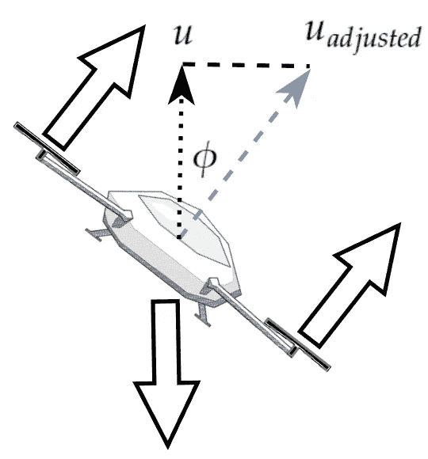****

****作者图片****

****通过乘以**Cos(φ)**来调整 **u1** 值，以说明重力，其中**φ**是无人机当前的**角度方位角**。 **u2** 值(力矩输入)正施加于左侧转子，负施加于右侧，以产生所需的力矩。****

******注意，这些值作为力的单位直接传递给转子。这是可以做到的，因为 PID 控制系统的一般灵活性。**控制回路根据系统的反应调整输入的大小。****

******PIDController.cs******

****这是主 PID 控制脚本，核心逻辑打包到 **GetPIDOutput()** 函数中。每次需要估计新值时，都会调用此方法。 **p** 、 **i** 和 **d** 是增益幅度， **kP** 、 **kI** 和 **kD** 是可以通过 **FlightController.cs** 脚本调整的系数，以改变 PID 控制器的性能。****

****[这里的](https://www.youtube.com/watch?v=wkfEZmsQqiA)是学习 PID 控制逻辑的绝佳资源。****

****使用模型的先前积分值更新积分项，并且旨在为模型提供一种“记忆”。这有助于系统适应未知的变量，但也会给我们带来麻烦。例如，如果无人驾驶飞机离目标目的地仍有一段距离，但已经达到其最大速度，则积分项将继续增长超过最大值。这将导致次优减速，因为系统将不得不撤销卷起的过剩。更详细的解释可以在[这里](https://youtu.be/NVLXCwc8HzM?t=163)找到，它讨论了如果 PID 输出超过系统能力阈值，通过箝位(或停止累加)积分项来防止这种过饱和的概念。****

******FlightController.cs******

****这是将所有内容整合在一起的脚本。期望的位置和推力，以及滚转 PID 系数都可以通过这个对象来设置。****

****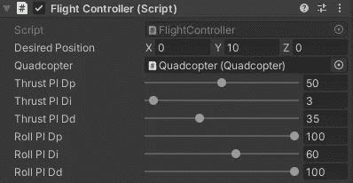****

****作者图片****

****在每次物理引擎更新时，该脚本计算当前的错误状态，将错误传递给 PID 控制器，并将产生的 **u1** 和 **u2** 值传递给无人机马达混合器算法。****

# ****模拟****

****[repo](https://github.com/adidinchuk/2d-unity-quadcopter-sim) 中的代码应该按原样运行，但是如何操作模拟的参数将在下面介绍。****

## ****推进器****

****无人机有左和右推进器，它们可以单独操纵，但是为了获得最佳效果，它们的参数应该是相同的。每个推进器也有一个具有规定质量**(0.3)的刚体，这个刚体通过一个 **2D 固定接头**连接到主无人机机身上。******

******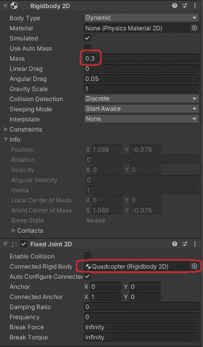******

******作者图片******

******要配置的主推进器. cs 参数将是**推力系数**、**最大 RPM、**和**旋转速率**。******

## ******四轴飞行器******

******四轴飞行器还有一个质量确定的刚体**(1)以及一个简单的碰撞器，以防止它穿过地表平台。********

********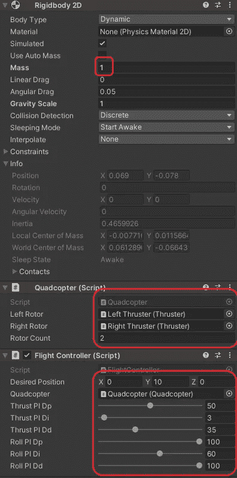********

********作者图片********

********旋翼和旋翼数在 **Quadcopter.cs** 脚本中设置，目标位置和 PID 控制系数在 **FlightControl.cs** 脚本中设置。********

## ******运行代码******

******当场景运行时，四轴飞行器离开地面，向指定的高度移动，并停留在那里。******

********红色的* ***线*** *是显示推力的调试线。*******

******可以修改 **P** 推力值，以改变无人机达到所需高度的速度。******

************

******比例项= 25，积分项= 2.5，导数项= 4 —图片由作者提供******

********D** 推力值决定了我们的轨迹有多平滑，可以用来以收敛速度较慢为代价最小化超调。******

************

******比例项= 25，积分项= 2.5，导数项= 11 —图片由作者提供******

********I** 推力值允许系统克服环境中不可预见的干扰，实现更平稳的恢复。无人机使用积分项值 2.5，这允许它考虑模型中完全忽略的重力。这是积分项设置为 0 时的情况——无人机未能达到目标高度 10。******

************

******比例项= 25，积分项= 0，导数项= 11 —图片由作者提供******

******除了俯仰之外，滚转 PID 系数提供相同的作用。这是当无人机的方向和位置受到干扰时的样子。******

******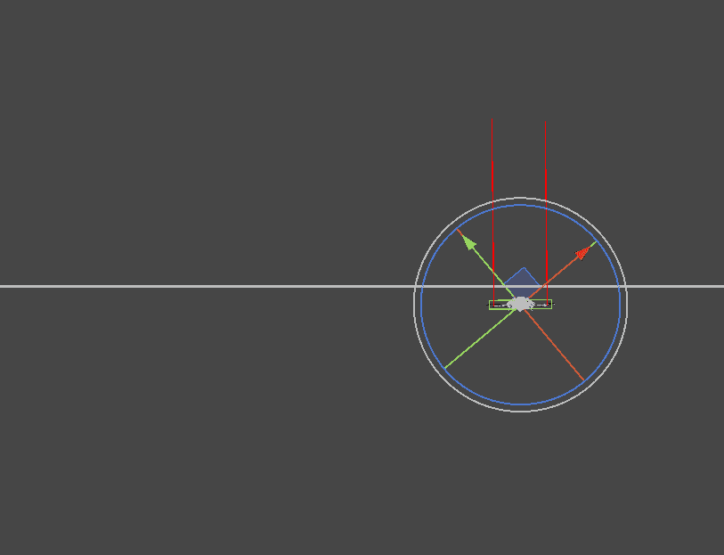******

******作者图片******

# ******结论******

******如果你走到这一步，你应该有一个工作的 2D 四轴飞行器 Unity 模拟，或者至少知道如何创建一个。在未来的文章中，我希望增加这种模拟的复杂性，包括自动运动规划和适应 3 维。******

******如果我有任何错误或遗漏了什么，请让我知道。也可以随意发表任何问题作为评论。******

******编码快乐！******

*******原载于 2022 年 2 月 1 日 https://theappliedarchitect.com*<https://theappliedarchitect.com/learning-2d-rotorcopter-mechanics-and-control-with-unity/>**。********