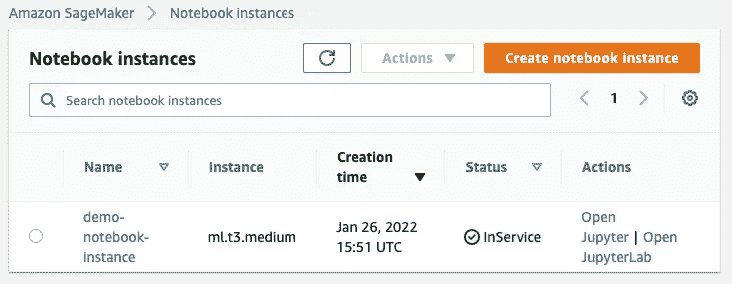
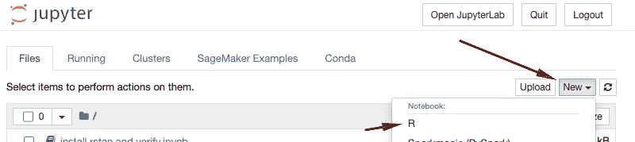
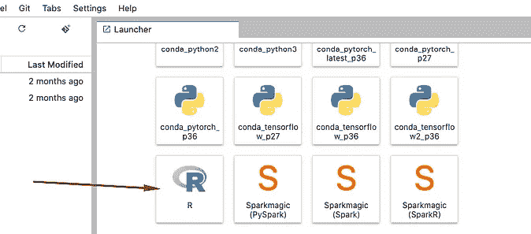
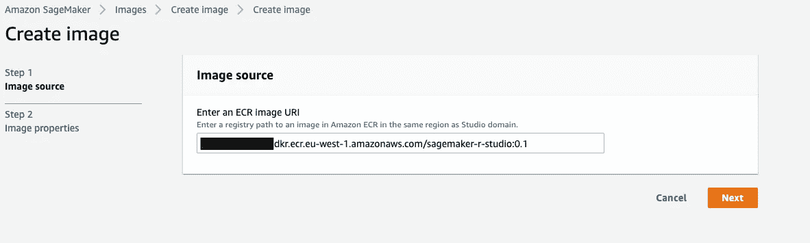
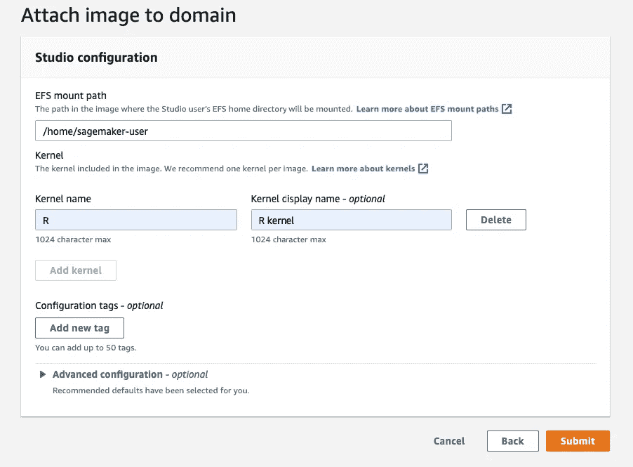
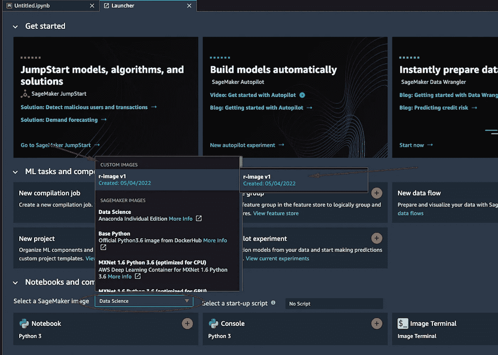
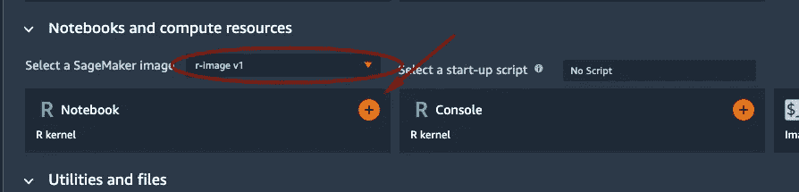

# 在亚马逊 SageMaker 上运行 R 的 3 + 1 方式

> 原文：<https://towardsdatascience.com/3-1-ways-of-running-r-on-amazon-sagemaker-13034a8f3686>

## 借助云的力量点燃您的 R 工作负载；如何使用 SageMaker 笔记本、Studio、Jobs 和 RStudio

图片来源于 unsplash.com

R 编程语言是科学领域中最常用的语言之一，是机器学习中最常用的语言之一(可能仅次于 python ),也可以说是数学家和统计学家中最流行的语言。它易于上手，免费使用，支持许多科学和可视化库。

虽然 R 可以帮助您分析数据，但您拥有的数据越多，您需要的计算能力就越强，您的分析就越有效，就越需要可重复性和再现性。分析师和数据科学家需要找到满足这些要求的方法。进入云端。

在这篇文章中，我们简要描述了在云上运行 R 工作负载的主要方式，利用 Amazon SageMaker，这是 AWS 的端到端机器学习云产品。众所周知，AWS 为开发人员和科学家如何使用他们的产品提供了选择和灵活性，所以对于 SageMaker 来说这也是事实，不要感到惊讶。让我们看看怎么做。

# SageMaker 经典笔记本

通过提供笔记本实例，SageMaker 在云上提供了完全托管的 Jupyter 笔记本体验。作为一项服务，与它的年轻兄弟 SageMaker Studio 相比，它的功能范围可能更小，但笔记本实例仍然是在 AWS 云上开始使用 jupyter 笔记本的最简单方式。

除了非常容易上手之外，您还获得了对 R 内核的开箱即用支持。

要尝试这一点，您可以打开一个笔记本实例，方法是转到 SageMaker 控制台>笔记本实例，然后创建笔记本实例(如果您还没有)，保持默认设置。然后点击打开 Jupyter 或打开 JupyterLab

进入后，单击新建并选择 r。

*在 Jupyter 启动 R 动力笔记本—左|在 Jupyterlab 启动 R 动力笔记本—右*

就是这样！开始写你的 R 代码吧！

# SageMaker 工作室笔记本

[亚马逊 SageMaker Studio](https://aws.amazon.com/sagemaker/studio/) 是一个完整的云端机器学习 IDE。它是一个托管的 JupyterLab 环境，具有许多专门为允许您与 SageMaker 服务的其余部分进行交互而开发的附加特性。在 Studio 中，您可以快速启动 Jupyter 笔记本，只需几次点击，您就可以选择底层计算、关闭或共享笔记本。它附带了许多预制的内核，但它们都是 python 特有的。

幸运的是，就像几乎所有其他 SageMaker 服务一样，我们可以通过自带容器来定制它。

你猜对了——我们可以带来自己的支持 R 的容器，并定制 Studio 来满足我们的 R 需求。

要做到这一点，你可以按照下面的 [GitHub 库](https://github.com/aws-samples/sagemaker-studio-custom-image-samples/tree/main/examples/r-image)上的说明，或者按照下面你自己的账户上的简单步骤:
在 Jupyter 笔记本上(是的，它可以是使用 python 的 Sagemaker Studio 笔记本)或者你的本地终端上设置了 AWS 凭证，

1.  从上面的链接下载 DockerFile 文件，并运行以下几个命令:

2.等待上述命令运行完毕，这可能需要几分钟时间。

3.在 SageMaker 控制台中，点击“*图像*，然后点击“*创建图像*”。键入您在步骤 1 中创建的图像的 URI(如果步骤 1 成功运行，将在最底部打印图像 uri)。一旦你点击*下一个*，输入一个容易记忆的图像名称，比如***studio-custom-r-image***然后点击创建。

4.将映像附加到域。点击 SageMaker 域>向下滚动一点>附加图像。根据下面的截图，选择图像源作为您刚刚创建的图像。

单击下一步和下一步，然后在提交之前，为内核名称和内核显示名称键入一个容易记住的名称。然后点击提交。

5.打开 SageMaker Studio，使用新创建的内核创建一个笔记本。R-coding 快乐！

**注意:如果您不能立即看到可用的自定义图像，您可能需要重新启动您的工作室(数据不会丢失)*

# SageMaker 工作 APIs 处理、培训和部署

使用 SageMaker APIs，您可以加速处理和训练作业在临时集群上运行，为您提供可能需要的所有计算资源，而您只需为作业运行的秒数付费。为实时消费、批量推理、异步或无服务器推理部署您的模型也变得很容易。

对于您需要的计算运行时，您可以从支持的列表中选择，或者以 docker 容器的形式自带。

带上你自己的 R 容器，可以让你的 R 代码无缝地运行在 SageMaker 上。您可以按照这个 [GitHub](https://github.com/aws-samples/rstudio-on-sagemaker-workshop/tree/main/03_SageMakerPipelinesAndDeploy) 示例来看看端到端会是什么样子。阅读我的中型博客[如何为 SageMaker 作业创建可重用的 R 容器](/how-to-create-reusable-r-containers-for-sagemaker-jobs-a3d481daf5cd)以详细了解如何在 AWS 帐户中创建这些容器，并重用它们来满足所有 R 需求。

# SageMaker 上的 RStudio

[陈京达](https://unsplash.com/@jingdachen?utm_source=medium&utm_medium=referral)在 [Unsplash](https://unsplash.com?utm_source=medium&utm_medium=referral) 上的照片

正如所承诺的，在 SageMaker 上有一个运行 R 的**奖励**方式，这是通过在 SageMaker 上使用 *RStudio 实现的。SageMaker 上的 RStudio 是 SageMaker 服务家族中相对较新的产品，本质上是将您熟悉的 RStudio Workbench IDE 带到了云上。
如果您已经拥有 RStudio Workbench 的许可，您可以使用相同的许可在 SageMaker 上启用 RStudio。
关于如何开始的更多细节，你可以阅读亚马逊 SageMaker 上的博客【RStudio 入门。*

这个工具允许你结合两个世界的优点。作为一名 R 开发人员，所有您喜欢的工具，以及您梦想中的云的所有处理云。

如果你对这个工具感兴趣，我强烈推荐你观看 Rstudio.com 网站上的一个很棒的视频。

# 结论

在这篇博客中，我们探索了几种在 Amazon SageMaker 的云上运行 R 代码的可能方式。
你更喜欢哪一个？
如果您想讨论您的使用案例以及如何在云上部署您自己的 R 工作负载，请联系我！