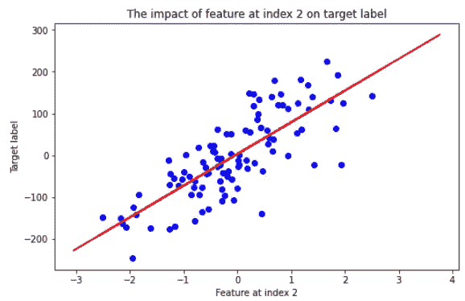
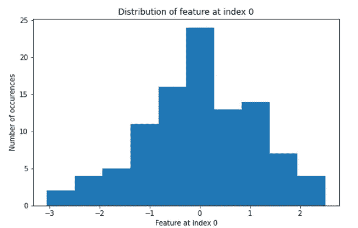
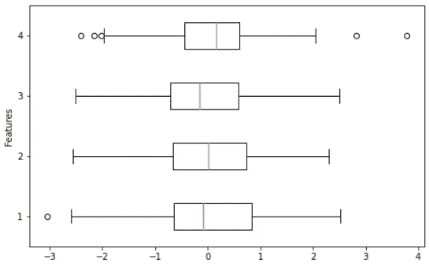

# 用 Python 表示数字数据的 3 种美观方式

> 原文：<https://towardsdatascience.com/3-aesthetically-pleasing-ways-to-represent-numerical-data-in-python-ebc3572bd7db>

## 数据可视化的艺术


Firmbee.com 在 [Unsplash](https://unsplash.com?utm_source=medium&utm_medium=referral) 上[的照片](https://unsplash.com/@firmbee?utm_source=medium&utm_medium=referral)

以易读的格式呈现数据对于正确的解释至关重要；我们经常利用数据可视化技术来排列数据，以便可以从视觉角度清楚地获得数据中包含的信息。这是因为我们理解视觉信息更自然——当视觉信息呈现给我们时，我们能更好地识别趋势、模式、异常值等。

了解可视化数据的最佳方式是一项挑战。有几种方法来表示一条信息，但在某些情况下，有些方法比其他方法更能提供信息。有一个清晰的问题，你试图用可视化来回答，这是朝着正确的方向迈出的一步。从那时起，你必须做的就是选择强调你想要研究的信息的图表。

本文的重点是数字数据。我们将介绍三种常见的图表，您可以用它们来表示数字数据。我们还将介绍它们的用法，如何解释它们，以及用 Python 实现它们。

```
**Table of Contents** --> [The data](#31b7)
--> [Scatter plot](#9c66) 
--> [Histogram](#3835)
--> [Box Plot](#8461)
```

# 数据

为了演示我们将在本文中涉及的一些图表，我们使用 scikit-learn 的`[make_regression](https://scikit-learn.org/stable/modules/generated/sklearn.datasets.make_regression.html)`函数生成了一个数据集。

我们的数据集将由 100 个样本和四个特征组成，其中四个是信息性的。我们还将高斯噪声的标准偏差应用于输出 10，并将`random_state`设置为 25——但这些只是随机决定。

```
import numpy as np
import matplotlib.pyplot as plt
from sklearn.datasets import make_regression# Generate a regression problem
X, y = make_regression(
    n_samples=100,
    n_features=4,
    n_informative=4,
    noise = 10,
    random_state=25
    )# view first 5 observations
print(X[:5])"""
array([[-0.30756146,  0.88820421, -0.50315008,  0.89552899],        [ 0.49830983, -1.35889534, -0.53652108, -1.14732055],        [-0.58739664,  1.02036419,  0.56016947,  0.04803703],        [-0.92340049, -0.56273293,  0.00384206, -0.41429594],        
[ 0.46763613, -0.01500773,  0.02000411, -0.5443902 ]])
"""
```

# 散点图

散点图是可视化两个数值变量之间关系的重要工具。我们可以用它来更好地理解一个变量如何影响另一个变量。图中的每个点用来代表一个单独的观察值。

```
# generate line of best fit
m, b = np.polyfit(X[:, 2], y, 1)
best_fit = m*X + b# plotting
plt.subplots(figsize=(8, 5))
plt.scatter(X[:, 2], y, color="blue")
plt.plot(X, best_fit, color="red")
plt.title("The impact of feature at index 2 on target label")
plt.xlabel("Feature at index 2")
plt.ylabel("Target label")
plt.show()
```



**作者图片**

我们主要关注两个变量之间的关系。这意味着你用散点图回答的主要问题是是否有关系。

从你与同事、朋友和家人的关系中你可能知道，并不是所有的关系都是一样的。如果两个变量之间存在关系，您可以开始剖析这种关系的动态，以便更深入地了解数据。

关于您的变量，您可能想知道的一些事情有:
→关系的强度
→关系是正还是负
→关系是线性还是非线性
→是否存在任何异常值

上面的图像显示我们的数据集有一个积极的，相当强的，线性关系。在我们的数据中似乎也没有任何异常值，但是我们可以用[箱线图](#8461)进行复查。

# 柱状图

你可能还记得高中数学课上的直方图；直方图可能是表示统计数据最常用的图表。它们是了解数据集中数字要素总体分布的好方法。

它的工作原理是通过宁滨把数据分成不同的区间。然后将每个观察值放入一个适当的区间，通过每个条形的高度可以看到这个区间。直方图可用于了解我们正在处理的数据的密度，以及如何描述变量的分布。

```
plt.subplots(figsize=(8, 5))
plt.hist(X[:, 0], bins=10) #10 bins is the default
plt.xlabel("Feature at index 0")
plt.title("Distribution of feature at index 0")
plt.ylabel("Number of occurences")
plt.show()
```



**作者图片**

一些需要注意的事情包括**偏斜度**和**模态**:

*   **偏度**是一个实值随机变量关于其均值的概率分布的不对称性的度量**来源** : [维基百科](https://en.wikipedia.org/wiki/Skewness)。特征的偏斜度可由以下四种偏斜度定义:**正/右偏斜度**、**负/左偏斜度、对称/无偏斜度或未定义。**
*   **模态**描述了数据集中的峰值数量。数据集可能是:**单峰**，这意味着它在数据分布中只有一个主峰，**双峰**，这意味着分布有两个主峰，**均匀**表示没有主峰，或者**多峰**表示分布有两个以上的主峰。

我们看到的数据看起来好像是对称的单峰的。

另一件要注意的事情是，我们为直方图选择的条块宽度是完全随机的。调整用于表示数据的条柱数量可以改变直方图所讲述的故事:太宽会丢失信息，太窄会越来越难以确定总体分布。理想的箱宽度对问题是主观的。

# 箱线图

箱线图是另一个很好的图表，可以更好地理解数据的分布。他们在突出异常值、四分位数范围和群体的中位数方面做得很好。此外，使用的空间要少得多，因此可以更容易地在同一个图表上比较不同组之间的分布。

```
plt.subplots(figsize=(8, 5))
plt.boxplot(X, vert=False)
plt.ylabel("Features")
plt.show()
```



**作者图片**

我们可以使用箱线图来确定每个特征的偏斜度、异常值以及组的最小值和最大值。

在数据的可视化中，我们可以确定我们所有的特征都是对称的。我们还可以看到，我们的第一个和第四个特征中存在异常值，这需要在现实场景中进一步研究。

数据可视化对于高效和有效地共享见解至关重要。非常有必要让我们的视觉化图像容易被设计的受众理解。实现这一点的一个关键因素是使用你的图表来回答听众感兴趣的问题。虽然我们没有在本文中分享一个全面的图表列表，但是您现在已经有了一个良好的基础，可以开始分享高质量的视觉洞察。

*感谢阅读。*

如果你喜欢阅读这样的故事，并希望支持我的写作，可以考虑[成为一名灵媒](https://kurtispykes.medium.com/membership)。每月支付 5 美元，你就可以无限制地阅读媒体上的故事。如果你使用[我的注册链接](https://kurtispykes.medium.com/membership)，我会收到一小笔佣金。

已经是会员了？[订阅](https://kurtispykes.medium.com/subscribe)在我发布时得到通知。

[](https://kurtispykes.medium.com/subscribe) [## 每当 Kurtis Pykes 发表文章时都收到一封电子邮件。

### 每当 Kurtis Pykes 发表文章时都收到一封电子邮件。通过注册，您将创建一个中型帐户，如果您还没有…

kurtispykes.medium.com](https://kurtispykes.medium.com/subscribe)