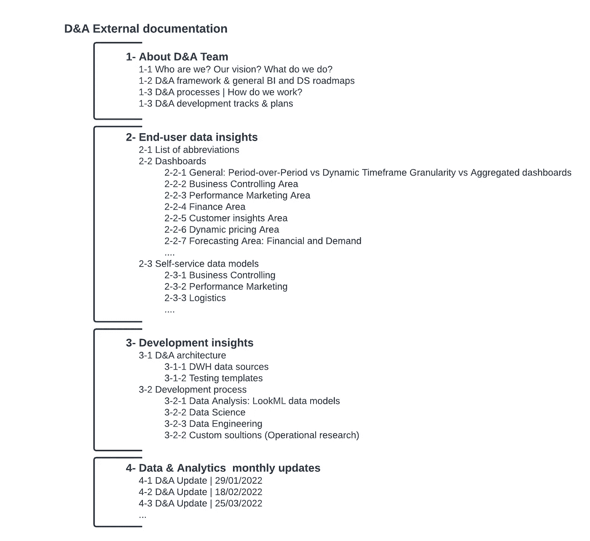
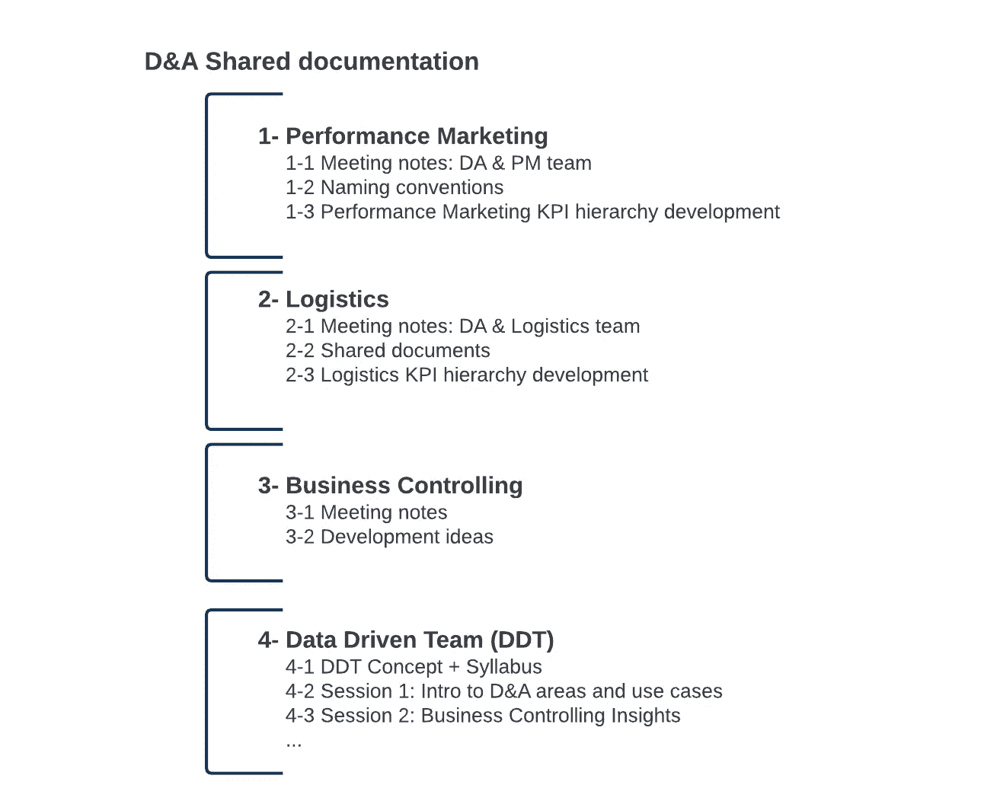
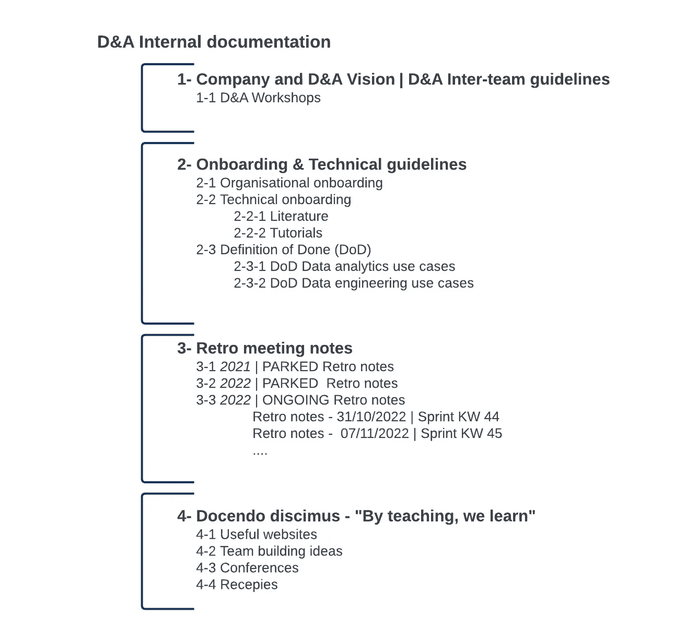

# 面向数据和分析团队的 3 个知识库模板集群

> 原文：<https://towardsdatascience.com/3-clusters-of-knowledge-base-templates-for-data-and-analytics-teams-1d87cc26c93a>

## 以系统的方式创建外部、共享和内部文档

由 [Hubi 拍摄的照片。在](https://unsplash.com/@hubiimg?utm_source=medium&utm_medium=referral) [Unsplash](https://unsplash.com?utm_source=medium&utm_medium=referral) 上的 img

数据和分析团队的任务是开发推动决策的洞察力。这些见解通常基于从整个组织的多个来源收集的数据集，包括客户数据库、销售历史、营销活动、财务报告等。

庞大的信息量会使寻找所需答案变得非常困难，尤其是当数据和分析团队随着时间的推移而增长时。

因此，许多组织最终会得到一个支离破碎或重复的信息架构，使得他们的数据团队很难在部门间和跨部门级别上交换知识。

每个数据角色的重要部分是记录开发过程和结果。或者，换句话说，根据不同的领域创建技术和非技术文档；数据工程、数据科学和数据分析。

说实话，编写文档并不是什么新鲜事。然而，如果事先没有明确的指导方针，这可能会非常耗时。

考虑到这一点，数据专业人员应该创建**模板，以确保系统和透明的文档交付**。

> 因为让我们面对它，预定义的模板已经完成了一半的工作。

随后，这篇博文旨在从外部、共享和内部文档的角度展示如何创建和模板化数据和分析知识库。

# 知识库组织

知识库应该是数据和分析以及其他团队的中央协作中心。这是团队的信息、方法和技术/业务知识存储的地方，并相应地与不同的业务用户组共享。

考虑到不同的用户群，我们的数据和分析(D&A)团队将知识库文档模板分为三组: ***D &外部文档，D &共享文档，D &内部文档。***

让我们从阐述每个文档组及其模板开始。

# D&A 外部文件

作为数据和分析团队，拥有透明的流程和标准至关重要。无论你是在进行新的开发还是支持现有的开发，记录团队是如何运作的都是很重要的，这样组织中的每个人都理解[分析开发过程](https://medium.com/@martosi/clarifying-the-analytical-development-process-to-business-users-b40b684f7e5b)。

这是**外部文档**的主要目标——分享关于团队组织、跨部门数据洞察、发展洞察和团队发展更新的一般信息。

考虑到这一目标，我们的 D&A 外部文档由以下结构组成:

数据和分析外部文档结构[图片由作者提供]

如上图所示，外部文档有四个主要部分:

*   **#1:关于 D &团队—** 该部分涵盖了数据和分析团队的一般信息，以及商业智能和数据科学领域的开发框架和路线图。此外，该部分向所有业务用户解释了[分析开发流程](https://medium.com/@martosi/clarifying-the-analytical-development-process-to-business-users-b40b684f7e5b)，并包含我们的季度和年度开发跟踪。
*   **#2:终端用户数据洞察—** 该部分详细解释了所使用的分析和业务缩写、不同类型的仪表板列表(趋势或演变仪表板)以及不同的业务领域。此外，这里还为有权访问自助服务数据模型的用户提供了每个数据模型的解释。
*   **#3:开发洞察** —该部分涵盖数据工程、数据科学/分析和定制开发笔记。本节还介绍了数据和分析架构，以及解释的数据源和测试模板。
*   **#4:数据&分析每月更新** —该部分涵盖根据不同数据和业务领域开发的票据的每月更新。

在详细描述了外部文档结构之后，我们现在可以切换到详细描述共享文档结构。

# D&A 共享文档

跨团队合作与数据和分析团队相关，因为每天/每周/每月都需要交换业务和开发更新。

为此，我们的数据和分析团队创建了共享文档来记录会议笔记、开发想法和团队相关的业务知识，以便规划未来的分析用例。

我们的 D&A 共享文档由以下结构组成:

数据和分析共享文档结构[图片由作者提供]

如上图所示，共享文档包含以组织中其他团队/圈子命名的部分，并包含不同的子部分，用于加速分析和业务开发。

根据行业和组织类型的不同，您的数据和分析团队将在此列出完全不同的部分和子部分。然而，主要目标是让共享文档**中的部分仅对特定的用户组(团队)**可见。

说到这里，我们现在可以转到解释知识库的最后一部分——内部文档。

# D&A 内部文件

内部数据和分析团队文档更加详细和具体，因为它应该包含团队专用的相关信息。

它应该是数据和分析团队成员的参考中心，以持续监控团队的组织和技术发展计划。此外，它还可以包含新团队成员的组织和技术指南，以及团队可以共享有用资源的地方。

我们的 D&A 内部文件由以下结构组成:

数据和分析内部文档结构[图片由作者提供]

如上图所示，内部文档有四个主要部分:

*   **#1:公司和 D &愿景| D &团队间指导方针** — 该部分包含与组织愿景一致的数据和分析愿景。它还包含预订假期和下班时间的相关指导原则，以及核心工作时间的信息。
*   **#2:入职&技术指南** —该部分有一个关于组织入职的子部分，其中包含时间管理系统、了解公司结构的资源以及访问所有相关数据源和其他部门联系人的链接。这里还提供了一个技术入门子部分，它包含了相关的教程和文献以跟上当前的发展。最后，这里还列出了每个不同数据区域的完成标准的定义。
*   **#3:回顾会议记录** —可能是数据和分析团队中使用最多的部分，因为它包含每周组织和团队间更新、sprint(重新)计划的任务以及过去几周已完成任务的总结。
*   **#4: Docendo discimus 或“通过教学，我们学习”** —这个部分背后的想法是分享有用的日常资源和与工作无关的想法或会议计划。

我们将总结使用此零件构建知识库的“最佳实践”。

# 总结一下:让它变得可见并成为惯例

让我们通过分享为什么应该在任何(数据)团队中实现三个不同的知识库集群(外部、内部和共享文档)的好处来结束这篇博客:

*   所提供的知识库结构**使得数据和分析** **工作流** **对业务中的每个人来说都是透明且易于参考的**。
*   所提供的知识库结构包含数据和分析更新、会议记录、开发文档等。，**可供业务用户随时使用**。这将避免数据和分析团队成员重复共享更新。
*   所提供的知识库结构**通过确保团队中的任何人始终关注当前(和过去)sprints 中的计划任务，消除了团队间的发展瓶颈**。
*   提供的知识库结构**简化了团队领导的团队间信息共享**，因为每个团队成员都可以轻松访问组织和技术指南。
*   提供的知识库结构**简化了新团队成员** **和具有数据洞察力的新业务用户**的入职。
*   最后，提供的知识库结构**节省了创建新文档的时间，**为每个部分创建了模板。

最后，这篇文章旨在帮助数据团队构建他们的知识库文档，因为即使这样的小事也可以在信息透明度和知识共享方面产生巨大的组织差异。