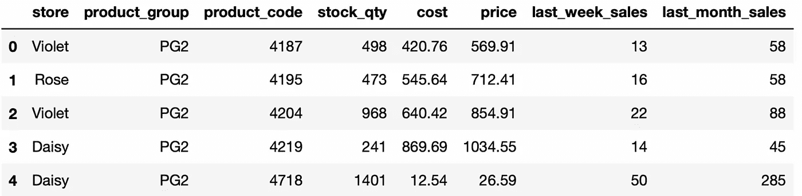
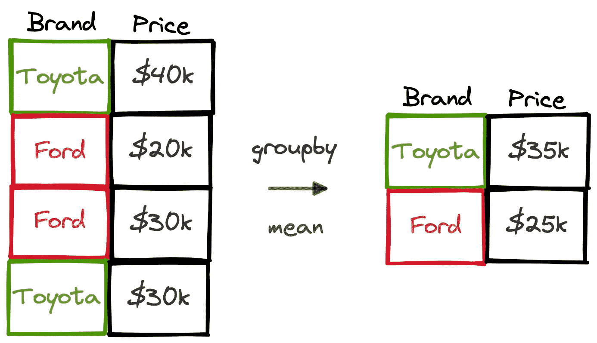
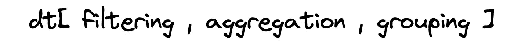
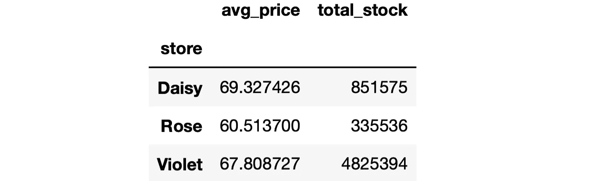

# 使用三种常用工具进行三种常用数据分析操作

> 原文：<https://towardsdatascience.com/3-common-data-analysis-operations-with-3-common-tools-9288ce61a40f>

## 熊猫，数据表和 SQL


杰克·亨特在 [Unsplash](https://unsplash.com/s/photos/three?utm_source=unsplash&utm_medium=referral&utm_content=creditCopyText) 上的照片

我们分析数据以提取见解，找到有价值的信息，或者发现仅仅通过浏览看不见的东西。数据分析过程的复杂程度取决于数据的特征和结构。

但是，有一些基本操作是经常做的。这些可以被认为是数据分析的基础:

*   分组
*   过滤
*   整理

在本文中，我们将学习如何使用 3 种最常用的数据分析工具来完成这些操作:

*   熊猫换蟒蛇
*   R 的数据表
*   结构化查询语言

我们的目标不是比较这些工具，也不是将一个工具归类为优于其他工具。在您的数据科学职业生涯中，您可能需要使用它们中的任何一个或全部，因为这些工具被许多公司使用。

像往常一样，我们将通过做例子来学习，所以我们需要一个数据集来处理。我用模拟数据准备了一个销售数据集。你可以从我的 GitHub 页面上的[数据集](https://github.com/SonerYldrm/datasets)库中下载。叫做“销售 _ 数据 _ 与 _ 商店”。以下是该数据集的前 5 行:



sales_data_with_stores(作者图片)

# 分组

在探索性数据分析中，通常根据一列或多列中的不同值或类别对数据点(即表格数据中的行)进行分组。



(图片由作者提供)

通过分组可以计算出一些东西:

*   各品牌平均汽车价格
*   每月平均收入
*   一周中销售量最高的一天

回到我们的数据集，我们可以找到每个商店上周的平均销售额，如下所示:

**熊猫**

我们使用 groupby 和 mean 函数。首先，按照商店列对行进行分组。然后，我们选择要聚合的列，并应用相关的函数。

```
import pandas as pddf = pd.read_csv("sales_data_with_stores.csv")df.groupby("store")["last_week_sales"].mean()# output
store
Daisy     66.544681
Rose      64.520000
Violet    99.206061
Name: last_week_sales, dtype: float64
```

**数据表**

数据表包的语法比熊猫简单一点。要执行的操作用逗号分隔在方括号中，如下所示:



数据表语法结构(图片由作者提供)

```
library(data.table)dt <- fread("sales_data_with_stores.csv")dt[, mean(last_week_sales), store]# output
    store       V1
1: Violet 99.20606
2:   Rose 64.52000
3:  Daisy 66.54468
```

**SQL**

假设我们有一个名为 sales 的表，其中包含我们的数据集中的数据。我们使用 select 和 group by 语句如下:

```
SELECT
   store,
   AVG(last_week_sales)
FROM sales
GROUP BY store
```

输出将与其他示例中的相同。

在所有的例子中，聚集的列没有一个自解释的列名，这不是理想的情况，尤其是在与其他人一起工作时。让我们再做一系列例子，找出每个商店的平均产品价格和总库存数量。我们还将为聚合列分配名称。

熊猫

我们将使用 agg 函数。要聚合的列和聚合函数写在元组中，如下所示:

```
df.groupby("store").agg(

    avg_price = ("price", "mean"),
    total_stock = ("stock_qty", "sum"))# output
```



(图片由作者提供)

**数据表**

语法的结构是相同的，但是有一些小的改动。聚合写在前面带点的括号内。

```
dt[, 
   .(
     avg_price = mean(price),
     total_stock = sum(stock_qty)
     ),
   store
   ]
```

**SQL**

它与另一个 SQL 示例非常相似。我们只需要添加列名。

```
SELECT
   store,
   AVG(price) AS avg_price,
   SUM(stock_qty) AS total_stock
FROM sales
GROUP BY store
```

# **过滤**

过滤是数据分析中另一种常见的操作。大多数工具都提供了基于字符串、数字和日期值过滤原始数据的函数和方法。

我们将做一个包含字符串和数字过滤器的例子。让我们选择数据点(即行),其中:

*   商店是紫色的
*   产品组是 PG1、PG3 或 PG5
*   上个月销售额超过 100 英镑

**熊猫**

我们把过滤条件写在方括号内。在有多个条件的情况下，每个条件都写在括号内，并且条件用适当的逻辑运算符组合(例如& for end，| for or logic)。

```
df[
    (df["store"] == "Violet") &
    (df["product_group"].isin(["PG1","PG3","PG5"])) & 
    (df["last_month_sales"] > 100)
]
```

这段代码的输出是一个数据帧，其中的行符合给定的一组条件。

**数据表**

逻辑也差不多。在这种情况下，我们使用 and 运算符组合多个条件。

```
dt[
    store == "Violet" &
    product_group %in% c("PG1","PG3", "PG5") &
    last_month_sales > 100
  ]
```

**SQL**

条件在 where 语句中指定。在这种情况下，我们使用 and 关键字来组合多个条件。

```
SELECT *
FROM sales
WHERE store = "Violet" AND
      product_group in ("PG1", "PG3", "PG5") AND
      last_month_sales > 100
```

# 整理

我们有时需要根据一列或多列中的值对行进行排序。例如，我们可能希望根据价格对产品进行降序排序。

熊猫

sort_values 函数用于此任务。我们只需要编写将用于排序的列。默认情况下，Pandas 按升序排序，但是可以使用 ascending 参数改变这种行为。

```
df_sorted = df.sort_values(by="price", ascending=False)
```

**数据表**

使用了 order 函数。要从升序改为降序，我们只需要在列名前面加一个减号。

```
dt_sorted <- dt[order(-price)]
```

**SQL**

order by 语句在 SQL 中用于对行进行排序。像 data.table 和 Pandas 一样，这些行按升序排序。我们可以使用 desc 关键字进行降序排序。

```
SELECT *
FROM sales
ORDER BY price DESC
```

我们已经学习了如何使用数据科学生态系统中的 3 种常用工具进行 3 种基本的数据分析操作。我们已经讨论了简单的情况，但是所使用的函数和方法也能够完成更复杂的任务。在学习细节之前，最好先掌握基本知识。

*你可以成为* [*媒介会员*](https://sonery.medium.com/membership) *解锁我的全部写作权限，外加其余媒介。如果你已经是了，别忘了订阅*<https://sonery.medium.com/subscribe>**如果你想在我发表新文章时收到电子邮件。**

*感谢您的阅读。如果您有任何反馈，请告诉我。*