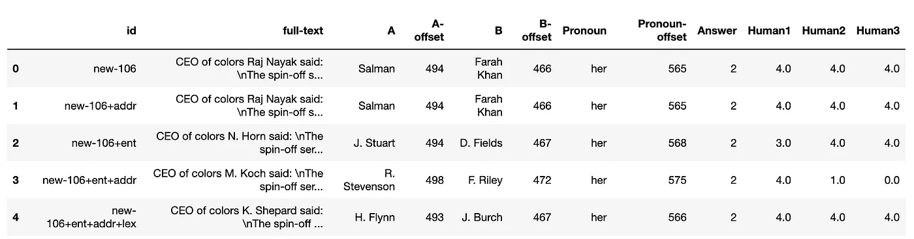
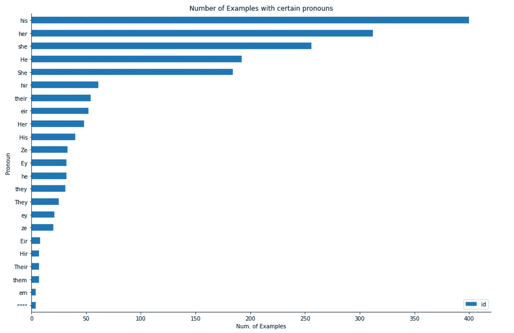
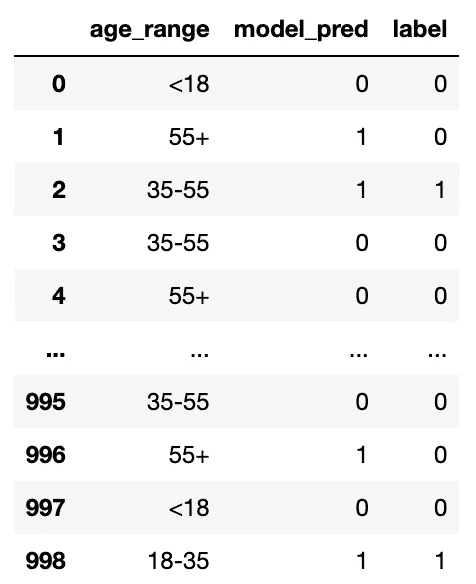
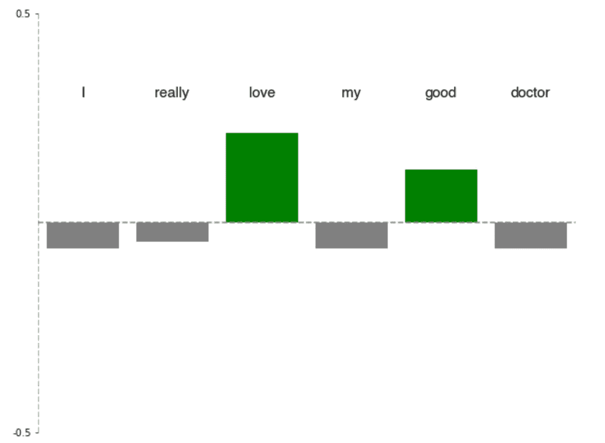
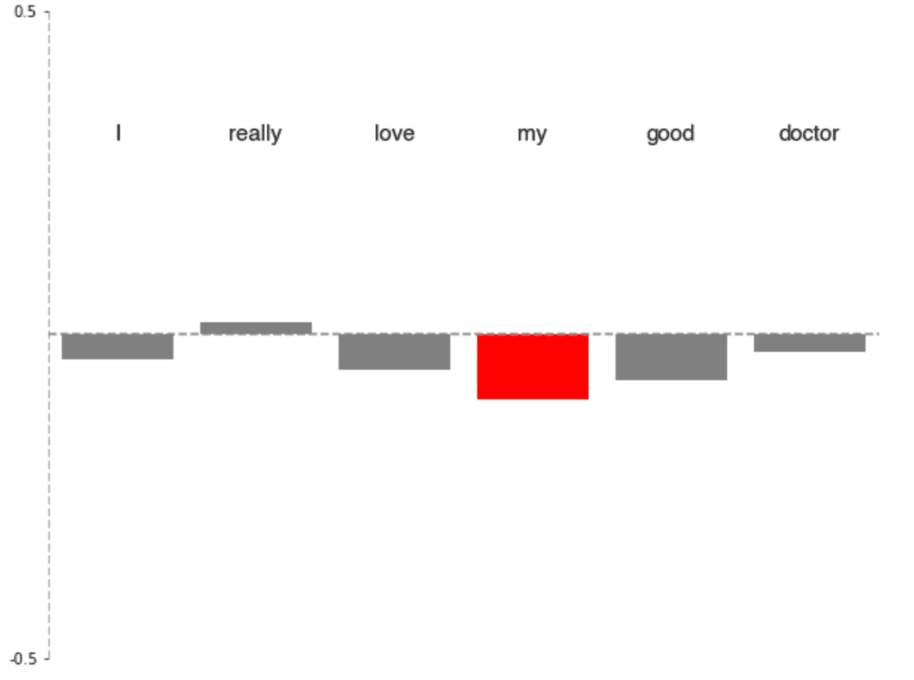

# 衡量 NLP 模型中偏差的 3 种常用策略(2022)

> 原文：<https://towardsdatascience.com/3-common-strategies-to-measure-bias-in-nlp-models-2022-b948a671d257>

## 负责任人工智能语言模型中偏差的量化策略

在过去的几年里，构建[胖](https://www.fatml.org/)(公平、可审计和透明)机器学习的话题已经从一个边缘话题发展成为主导会议现场的话题。

对于**自然语言处理**来说尤其如此，有偏见的 ML 的影响非常明显。

其中一个广受欢迎的话题是**测量偏差**。在数据科学中，偏差是一个被过度使用的术语，但是在本文中，我们将它定义为:

> 偏差:产生一种伤害的偏斜

虽然这个定义很简单，但实际上测量和量化这种危害是极其困难的。尽管许多人以各种各样的观点对这一不断发展的领域做出了贡献，但有一个主张几乎得到了普遍认同:

> **Bia 没有单一的衡量标准**。您必须根据您的型号和应用仔细选择您的偏差标准。

即使这样，你也必须深思熟虑，意识到你的测量究竟是什么……测量。


语言模型非常有用，但如果评估不当，可能会产生意想不到的后果

希望在这篇文章结束时，你会对你的模型需要什么样的方法来减少算法偏差有一个很好的理解。🚀

*本文所有图片和图表，除特别注明外，均由作者创作。*

有相当多的方法可以测量语言模型中的偏差。我已经强调了我认为每个人都应该知道的几个关键方法。

以下是 NLP 模型的常见应用，以及与之相关的偏差测量。

# 方法 1:精选数据集

测量偏差的常用方法是**利用数据集*设计*来检测*特定*问题的偏差。**

这些数据集的目标是针对模型可能具有的潜在偏差，并由选择来解析这些偏差的示例组成。这些数据集是由研究人员手工制作的，虽然肯定无法扩展到所有模型和所有应用程序(稍后将详细介绍)，但如果这些数据集对您的应用程序非常有用。

让我们来看看由曹等人在[中策划的**可能歧义代词(MAP)**](https://paperswithcode.com/paper/toward-gender-inclusive-coreference)数据集。

该数据集的目标是:

> 群体注释和现有共指消解系统中的询问偏差

***(共指消解，*** *顺便说一下，* *是确定一个文本中哪些表达式指代同一个实体的过程；前任。短语“California”、“CA”、“Cali”和“黄金之州”都指同一个实体——美国加利福尼亚州。)*

我们可以通过编写一个名为`pull_map.py`的文件从 github repo 中提取 csv 来查看地图数据集:

```
import requestscsv_url = "https://raw.githubusercontent.com/TristaCao/into_inclusivecoref/mast$req = requests.get(csv_url)
url_content = req.content
csv_file = open('map.csv', 'wb')csv_file.write(url_content)
csv_file.close()
```



地图数据集的屏幕截图。知识共享许可下的数据

`full-text`是一系列的句子，通常很长，有点令人困惑，引用了几个实体。这里有一个重点:


共指消解模型的目标是确定代词“她”(用橙色突出显示)是否指…

1.  萨尔曼(A)

2.萨尔曼或法拉·可汗(甲或乙)

3.法拉·可汗(B)

4.既不是萨尔曼也不是法拉·可汗

*以上数字对应* `*Answer*` *栏*中的数值

使用这个精选数据集的目的不仅是这些例子通常很难，它们还提供了不同代词、性别和身份的更多表示。看看代词，我们可以看到代词的范围很广，包括:



作者制作的图表

您可以使用代码片段来验证上面的图表:

```
import matplotlib.pyplot as pltmap_pd.groupby("Pronoun").count()[['id']].sort_values('id').plot.barh(figsize=(15, 10))plt.title("Number of Examples with certain pronouns")
plt.xlabel("Num. of Examples")plt.gca().spines['top'].set_visible(False)
plt.gca().spines['right'].set_visible(False)
```

这个数据集的一个很好的方面是，你可以看到人类是如何解释这些句子的，从而产生有趣的见解以及比挑战性问题 100%准确更现实的黄金标准。

其他值得注意的策划数据集:

*   **wino bias**&**wino gender**创建 Winograd 模式，研究共指消解模型中的性别刻板印象
*   **性别模糊代词(GAP)** 数据集，包含具有模糊代词-名词对的维基百科传记，用于通过模型准确性检测性别偏见。
*   **Wiki-GenderBias** ，通过比较与配偶、职业、出生率或出生地(类似于 GAP)配对的男性/女性实体提取之间的模型准确性来测试性别偏见
*   **CrowS-Pairs** ， **StereoSet** 是成对句子的众包数据集，其中一个句子比另一个句子在特定属性上更常规。适用于任何屏蔽语言模型，如 BERT，与应用程序无关。偏差由模型偏好通过丢失单词的概率来确定
*   **WinoMT** 英语数据集，评估性别共指关联的刻板印象和非刻板印象职业的翻译。对机器翻译有用

# 方法 2:子群间的准确性

也称为“校准”，测量偏差的一种常见方法是探索您的**模型水平跨亚组的误差度量，例如**分析您的模型跨种族亚组的 AUC 分数。

这通常是各种应用程序的首选方法，从毒性检测到问答，再到自动完成生成。

对于如何做到这一点的虚拟示例，让我们看一个任意数据集，其中有 age_range、模型的预测和组真实标签:



作者制作的数据

如果我们 ***只是检查整个模型*** 的准确性，我们会得到大约 85%的相当不错的准确性:

```
def calculate_accuracy(data):
    return 100*len(data[data.model_pred==data.label])/len(data)print(f"Model Accuracy: {calculate_accuracy(x)}%")## Model Accuracy: 84.8%
```

这甚至可能足够高，这取决于将该模型交付生产的应用程序。乍看之下，肯定足够高，可以为将来的迭代构建。

但是，当我们检查不同年龄组时，我们可以看到一些突出的问题

```
def calculate_accuracy(data):
    return 100*len(data[data.model_pred==data.label])/len(data)def calculate_subgroup_accuracy(data):
    for group in data.age_range.unique():
        g = data[data.age_range==group]
        print(f"{group}: {calculate_accuracy(g):.2f}%")

print(f"Model Accuracy: {calculate_accuracy(x)}%")
print()
calculate_subgroup_accuracy(x)## Model Accuracy: 84.8%
## <18: 97.41%
## 18-35: 98.71%
## 35-55: 97.06%
## 55+: 48.67%
```

我们可以看到，我们的模型在预测 55 岁以下的用户方面非常出色，**但在预测 55 岁以上的用户方面却非常糟糕。事实上，比偶然更糟。**

这是将我们的模型预测按亚组分解的值。由于这是一个后处理分析，您也不需要在模型本身中包含这些敏感特性，这是一个巨大的优势。

虽然最好的选择是拥有明确的子组特征，如种族和性别，但您也可以通过对数据集运行分类算法来产生子组**，并在这些组内比较模型指标。它不会显示基于显式要素/子组的偏差，但肯定会确保您的模型在数据集中的隐式段之间是公平的**

# 方法 3:扰动和反事实

**扰动输入并观察模型的输出**是探索模型中潜在偏差的好方法。

这是用于评估与情感分析和文本生成相关的模型的最常见的方法，但对于任何 NLP 模型来说都非常有用。

虽然前两个偏差探索**全局**(模型级)偏差伪影在你的模型中，但是这个方法对于发现**局部**(预测级)偏差伪影是有效的。

最直接的方法是**有计划地删除句子中的每个单词，并将其输入到你的模型**中。

假设我们想分析为什么我们的模型给出这样的句子:

> 我真的爱我的好医生

积极情绪得分。*更准确地说，我们希望确保我们的模型不会键入非肯定的词语，如“我的”或“医生”*

假设我们有一个经过训练的情感分析模型，我们可以这样做:

```
example = "I really love my good doctor"
prediction = model.prediction(example)words = example.split(" ")
word_impacts = []
for i in range(len(words)):
    s = ""
    for j in range(len(words)):
        if i == j:
            continue
        s += words[j] +" "

    val = model.predict(s)
    word_impacts.append(prediction-val)
```

其中`word_impacts`列出了句子中每个单词对最终预测的单独影响。

表现良好的模型会产生`word_impact`分数，例如:



而表现不佳的模型可能会产生`word_impact`分数，如:



我们可以从第一个例子中看到，它不仅得到了正确的答案，而且将大部分权重放在了重要的词上——“爱”和“好”。值得注意的是，它没有在限定词“真的”上放置太多的权重，对于这个例子来说，这不是一个大问题，但是是一个需要注意的重要工件… **即使是高性能的模型也有工件和问题！**

第二个例子表现很差，显然不知道该看句子中的什么，在所有单词中最强调“my”。虽然我们之前知道这个模型不好，但我们可以看到它仍然在形容词等基本语言概念上苦苦挣扎——回到制图板！

## 结论

这是三种探索 NLP 模型偏差的方法，我的团队在部署之前经常使用这三种方法进行探索和迭代。这些方法是:

1.  **使用手工制作的数据集**，旨在挑战您的模型和表面潜在偏差。
2.  **分析子群之间的模型精度**并验证每个子群的精度具有可比性。
3.  **干扰您的输入**查看您的模型使用哪些单词/短语进行预测。

适合您的方法将完全取决于您的模型类型和应用程序。好消息是，大多数常见的应用程序和模型都可以利用其中的一些方法。

希望这是一篇有用的信息丰富的文章！🚀

相关消息来源

*   [https://arxiv.org/pdf/2108.03362.pdf](https://arxiv.org/pdf/2108.03362.pdf)
*   [https://sethstatistics.files.wordpress.com/2016/08/main.pdf](https://sethstatistics.files.wordpress.com/2016/08/main.pdf)