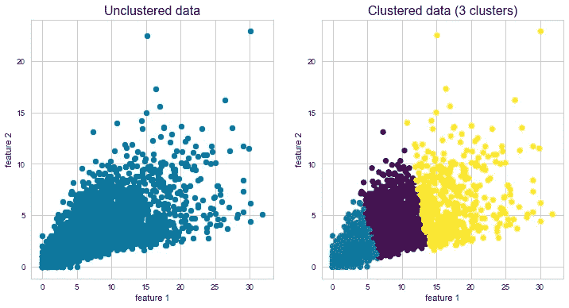
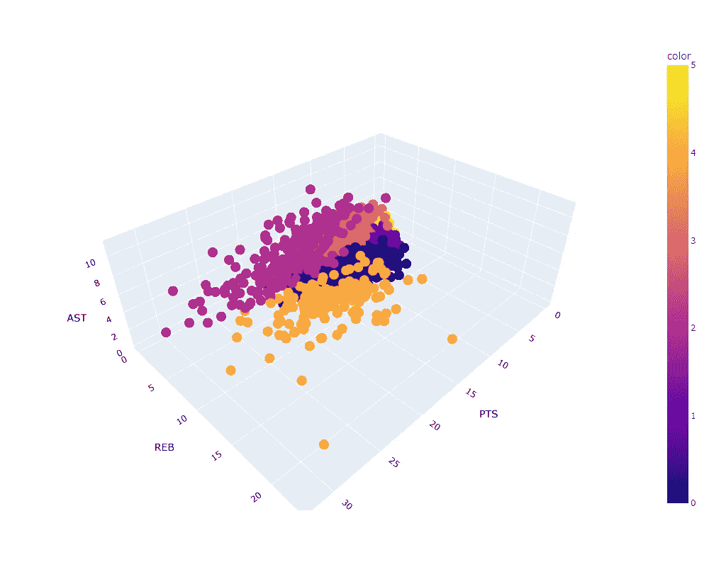
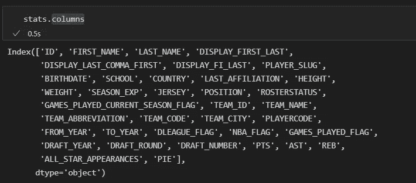
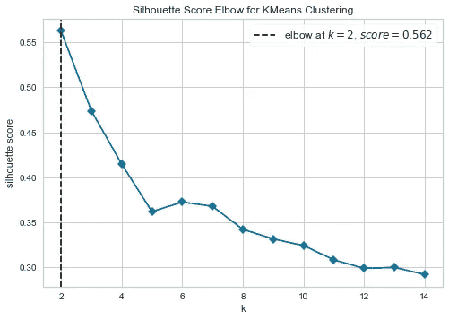
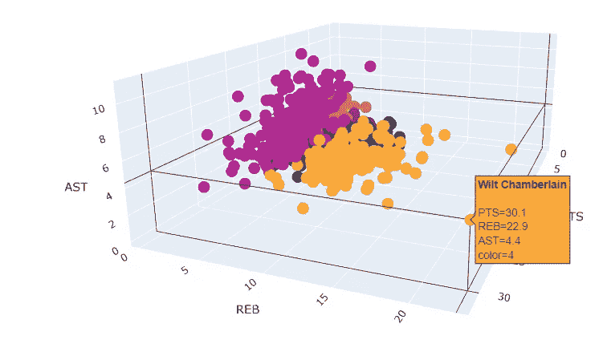
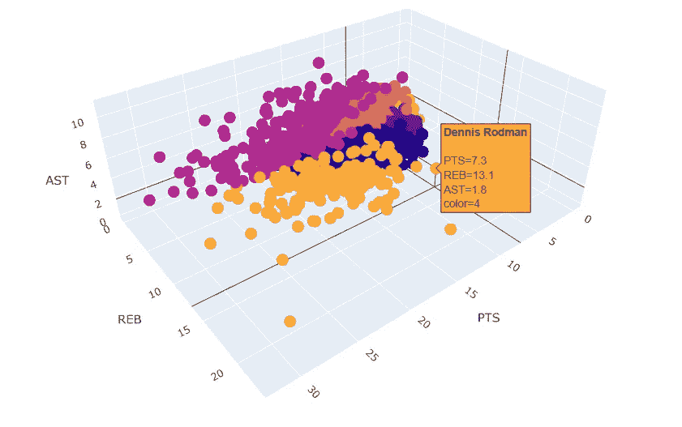
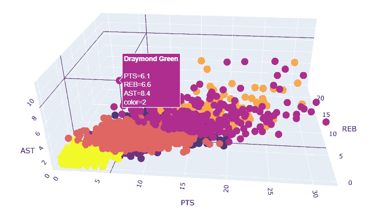

# 基于 Plotly 和 K-Means 的 NBA 球员三维聚类

> 原文：<https://towardsdatascience.com/3-d-clustering-of-nba-players-with-plotly-and-k-means-6ee7644f2a6c>

## 如何建立一个关注可解释性的聚类模型


肯尼·埃利亚松在 [Unsplash](https://unsplash.com?utm_source=medium&utm_medium=referral) 上的照片

聚类是一种无监督学习的机器学习技术，用于识别给定数据集中的相似数据点组。理论上，这些组将具有相同的属性，有助于数据的可解释性和模式识别。现实生活中的集群应用包括客户和产品细分、设施位置优化、推荐系统、医学成像、体育侦察等等。

无监督学习中最常用的算法之一是 K-Means，我们将在本文中使用它。K-Means 是一种简单的算法，它从随机选择的质心开始对相似的数据点进行分组，并对它们进行迭代以优化质心的位置。当质心稳定或达到最大迭代次数时，算法停止迭代。


迭代过程中优化位置的质心示例。来源:[https://commons . wikimedia . org/wiki/File:K-means _ convergence . gif](https://commons.wikimedia.org/wiki/File:K-means_convergence.gif)

虽然它可以应用于高维数据，但聚类的一种常见形式是选取数据的两个变量，应用聚类算法(在我们的情况下是 K-means ),然后用区分聚类的颜色绘制散点图。下图显示了一个具有三个集群的应用程序:



k-表示散点图中显示的 2 个特征的聚类。来源:作者

有了标记的组，就可以从那里做出业务决策。想象一下，一家在线零售商的客户最近在婴儿服装和尿布上花了钱。我们可以将该客户标记为对婴儿用品感兴趣，并使用推荐系统来提供婴儿用品组的其他人购买的产品，如玩具或摇篮。

或者想象一下，你是一个篮球队的球探，负责根据球员的数据来确定一个青年联盟的最佳人才。你可以定义最重要的统计数据和球员集群。之后，应该有可能识别出你应该仔细观察的一组优秀球员和那些不会被进一步评估的球员。

图形库 [Plotly](https://plotly.com/python-api-reference/plotly.express.html) 有一个散点三维方法，允许我们在数据可视化中超越 2D 障碍，并提高 K-Means 聚类的可解释性。由于数据是以三维散点图绘制的，因此可以直观地将聚类与要素相关联，并识别数据点的共同属性，这些属性导致算法形成这些组。以下是一个包含六个集群的示例:



使用 Plotly 的三维 K 均值聚类示例。来源:作者

在本文中，我们将演示如何构建如上所示的交互式 3D 聚类可视化。为此，我选择了 Kaggle (CC BY-SA 4.0 许可证)的[篮球数据集](https://www.kaggle.com/datasets/wyattowalsh/basketball)，因为它应该可以使用 4000 多名前任和现任国家篮球协会(NBA)球员的统计数据来说明篮球运动员的例子。此外，我们还将探讨一种定义理想集群数量的方法。最后，随着交互式可视化的建立，我们将讨论每个组的属性，增加模型的可解释性。

所以让我们开始加载数据。我们的数据集存储在数据库中，因此我们必须使用 SQLite 创建到数据库的连接，并定义其路径。然后，在 SQL 中，我们必须编写查询来提取所需的数据，或者在我们的例子中，提取存储在 *Player_Attributes* 表中的球员统计数据。因为我们还不知道哪些特性将用于聚类，所以用*提取整个表是个好主意。使用 pandas read_sql 方法，可以将 sql 查询的输出存储在 pandas 数据框中，我们可以研究该数据框并为聚类选择最佳特征。

将 Player_Attributes 表存储在 Pandas 数据帧中。

下面是我们构建三维聚类的可用功能:



数据集的列。来源:作者

看看这些特征，大部分都是分类的，但我们在“PTS”、“AST”和“REB”中有我们想要的统计数据，它们是场均得分**(PPG)、**助攻** (APG)和**篮板** (RPG)的缩写，这是一个篮球运动员最常见的三个统计数据。因此，在本文中，我们将用 PPG、RPG 和 APG 这三个维度来构建 4000 多名过去和现在的 NBA 球员的三维聚类。**

**当一名球员击球时，他就得了一分。如果一名球员在三分线后投篮，他可以一杆得三分，如果他在三分线内投篮，他可以得两分，如果他在罚球线得分，只有在犯规后才能得分。当一名球员在投篮不中后抢到球时，就是抢篮板球。投篮可以是自己的，也可以是队友的。当一名球员将球传给另一名队友，后者立即得分时，就会出现助攻。**

**现在我们必须回答这样一个问题:对于超过 4000 个玩家，我们应该有多少个集群来进行优化分组？逻辑告诉我们，聚类越多，模型解释的变异就越多。这是真的，除了在某个点之后，模型会过度拟合。一般来说，必须选择分类的数量，以便添加另一个分类不会给数据建模增加太多。我们的目标是找到最佳点，有一种称为剪影方法的启发式方法可以帮助我们，并且 [Yellowbrick](https://www.scikit-yb.org/en/latest/) lib 有一个功能可以实现它。下面是使用 K-Means 和三个特性的代码:**

**轮廓分数是所使用的度量，它是计算点被分组到聚类中的程度的度量，从-1 到 1。1 是最佳分组，而-1 是可能的最差分组。轮廓得分的公式是 S = *(b — a)/max(a，b)* 其中*“*b*”是聚类的质心之间的平均距离，而“ *a* ”是每个聚类内的数据点之间的平均距离。剧情是这样的:***

******

***来源:作者。***

***得分最高的是两个聚类，但是不仅仅是使用得分最高的聚类的数量，还需要考虑数据的上下文。在本文中，我们将根据 4000 多名 NBA 球员的数据对他们进行聚类。如果我们只将数据集分成两个集群，这个模型就没有太多的可解释性，因为它只是高于平均水平的玩家集群和低于平均水平的玩家集群。因此，我们需要一个更高的聚类数，以便稍后清楚地观察导致 K-Means 算法形成每个聚类的属性。***

***如果我们观察从五个到六个聚类的步骤，模型增加了它的轮廓分数，这意味着六个聚类是比五个更好的分组。考虑到我们的目标是在保持良好轮廓分数的同时拥有最高数量的聚类，我们将为我们的模型选择六个聚类。稍后，当我们解释每个集群的属性时，将有可能更好地理解为什么这是最佳选择。***

***定义了聚类数后，是时候使用 Plotly 并构建我们的三维聚类了，因此我们必须构建一个函数:***

***详述该功能的步骤:***

1.  ***删除所选要素列上有 nan 的行。***
2.  ***使用函数输入将数据框的维度缩减为三个要素。***
3.  ***实例化标准缩放器。我们需要标准化我们的聚类数据，因为我们的要素尺度不同，我们不希望其中一个要素仅仅因为尺度更大而对聚类产生更多影响。***
4.  ***使用标准缩放器拟合和转换数据框，并将其转换为 NumPy 数组。***
5.  ***定义将在三维散点图上使用的悬停。在我们的例子中，我们使用了包含玩家全名的“*DISPLAY _ FIRST _ LAST”*列。***
6.  ***使用聚类数的函数输入创建 K 均值模型，并将最大迭代次数设置为 100。***
7.  ***使阵列适合模型。***
8.  ***在缩减的数据框中创建一个列，其中包含模型为每个数据点提供的标签。***
9.  ***使用之前定义的悬停和标签列作为颜色参数，使用 Plotly 的" *scatter_3d"* 创建可视化。***
10.  ***展示可视化。***

***现在构建了这个函数，我们只需要用前面讨论过的特性和集群数来调用它，然后看看结果。***

```
*clusterization_nba_players = clusterized_scatter(stats,6,'PTS','REB','AST')*
```

***我们得到了这样的视觉化图像:***

***除了聚类 1(紫色)和 5(黄色)之外，这六个聚类在三维空间中分布良好。两者都接近原点，所以我们可以假设这些数据点是没有 PPG，RPG 和 APG 高统计的玩家。***

***在解释聚类之前，我们必须讨论篮球，以便为我们的聚类解释创建一个上下文。篮球有三个位置:后卫、前锋和中锋。后卫通常是更小更快的球员，负责组织球队，带球和投篮。虽然后卫因为远离篮筐而没有很高的篮板统计，但这个位置上最好的球员通常都有很高的得分和助攻统计，因为他们大多数时间都有球。前锋比后卫高，但比中锋矮。他们是灵活的球员，可以传球，投篮，必要时也可以靠近篮筐，得分或者抢篮板。另一方面，中锋是球队中最高的球员，主要任务是抢篮板和在篮下得分。所以，从他们身上，我们必须期待更高的篮板和得分数据，但更低的助攻。***

***现在，我们将研究六个集群中的每一个，并尝试解释将它们与篮球比赛中的位置相关联的属性:***

***黄色(5)——**第四梯队球员**——根据统计数据，这个集群中的球员是那些在他们的 NBA 职业生涯中没有太大影响的球员*。*有趣的是，我们观察到黄色星团是一个非常密集的星团，有 1693 个数据点。这意味着数据集中超过三分之一的玩家符合这个等级。即使他们设法在联盟中比赛，他们的影响并不显著*。* ***均值 PPG: 2.5，均值 RPG: 1.3，均值 APG: 0.6******

***深紫色(1)——**第三梯队球员**——这个集群的球员也没有令人难忘的职业生涯，但比第四梯队的球员对自己效力的球队贡献更大*。*深紫色是也是一个密集的集群，有 968 名玩家 ***。场均 PPG: 5.7，场均 RPG: 3.4，场均 APG: 0.9******

***蓝色(0)——**第二梯队前锋/中锋**——拥有坚实的 NBA 数据的球员专注于篮板而不是助攻，由此我们可以假设这是主要由前锋和中锋组成的群体*。* ***均值 PPG: 10.5，均值 RPG: 5.9，均值 APG: 1.6******

***橙色(3) — **第二梯队后卫**——同样是球员 *s* 有稳定的数据，但特别是在助攻方面，APG 的数据比蓝色集群好，但在篮板方面最差*。*因此我们可以假设集群上的球员主要是后卫 *s.* ***均值 PPG: 8.4，均值 RPG: 2.3，均值 APG: 2.9******

***芥茉(4)——**一线前锋/中锋——**这组球员场均得分高，篮板突出，尽管在助攻上并不出彩，因为这组球员的平均 APG 甚至低于二线后卫。因此，可以肯定地说，这个集群中的球员都是联盟*历史上的精英前锋和中锋。这是一个只有 152 名玩家的低密度集群。* ***场均 PPG: 17.2，场均 RPG: 9.9，场均 APG: 2.6******

***浅紫色(2)——**——第一梯队后卫——**这一组由精英后卫组成，表现为低篮板、高助攻和场均高得分。这组球员的平均 APG 是第一梯队前锋/中锋的两倍以上，但 RPG 不到一半，而 PPG 接近。也不是只有 236 名玩家的密集集群*。*如果我们将精英玩家所在的芥末色和浅紫色聚类相加，我们在这些聚类中只有大约 9%的数据集*。* ***均值 PPG: 16.8，均值 RPG: 4.0，均值 APG: 5.4******

***现在总结一下，只是对一些异常值的随机观察:***

*   *****威尔特·张伯伦** ( **一线前锋/中锋)** —这位在 60 年代和 70 年代初打球的历史中锋在三维散点图中表现突出，他的数据点与其他任何人都相距甚远。正如剧情所证明的那样，在他那个时代，威尔特在得分和篮板方面都很有统治力。在 1961-62 赛季，他场均得分超过 50 分，抢下超过 25 个篮板，被广泛认为是体育史上最伟大的人物之一。***

******

***来源:作者。***

*   ***丹尼斯·罗德曼(**第一梯队前锋/中锋)**——尽管“只有”2 米，这对于他的位置来说是个矮个子，但他被认为是联盟历史上最好的篮板手之一，并且是五次冠军。尽管他在进攻端得分和助攻方面合作不多，但他在篮板方面的完全统治力保证了他在精英群体中的一席之地。如果数据没有在聚类过程中进行缩放，Dennis 可能不会与 PPG 要素在同一个精英聚类中，在该聚类中，他只有 7.3 个 PPG，范围更广，并且会对 K-Means 算法产生更大的影响。***

******

***来源:作者。***

*   ***德雷蒙德·格林(**第一梯队后卫)**——格林是一名特殊的球员。他身高 1.98 米，和丹尼斯·罗德曼一样矮，除了他不擅长抢篮板，而是擅长助攻。他被认为是帮助改变比赛的球员之一，他的传球和空间能力，快速移动球。德雷蒙德是如此擅长传球，以至于我们的模型把他归为第一梯队后卫，尽管他是一名前锋，有时也打中锋。绿色是另一种情况，如果数据没有标准化，他将不会在第一层集群中排名，因为他的 PPG 低。***

******

***来源:作者。***

***深入研究细节，理解每个聚类的属性，并创建一个可解释的上下文，将聚类分析扩展到可视化之外。可解释性是数据科学社区中经常讨论的话题，因为数据科学家可能会关注模型而不是问题，可解释性可能会丢失。***

***我希望你喜欢这篇文章，我可以回答更多的问题和讨论！***