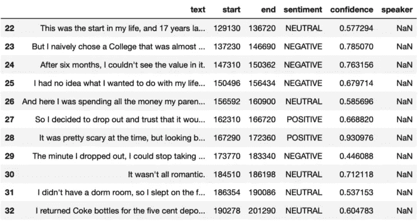

# 使用 Python APIs 可以完成的 3 个数据科学项目

> 原文：<https://towardsdatascience.com/3-data-science-projects-you-can-do-using-python-apis-d51714a76e55>

## 使用 Python APIs 立即启动数据科学项目


[斯特凡·斯特凡·契克](https://unsplash.com/@cikstefan?utm_source=medium&utm_medium=referral)在 [Unsplash](https://unsplash.com?utm_source=medium&utm_medium=referral) 拍摄的照片

作为一名数据科学家，您需要知道如何使用 API。通过使用 API，您不仅能够收集真实世界的数据，还可以使事情变得更简单，并加快您的数据科学项目的开发。

比方说你想用 Python 实现情感分析，不想从头构建自己的模型，只想快速解决。在这里，一个 API 可以帮助你完成繁重的工作，只留给你分析的部分。

在本文中，我将向您展示一些 Python APIs，它们将帮助我们实现情感分析、文本摘要和数据收集。您可以将它们视为开始或开发您的数据科学项目的捷径。

# 1.情感分析

情感分析帮助我们分类文本数据是正面的、负面的还是中性的。通常你会用 Python 构建一个机器学习模型来实现这种 NLP 技术(正如我在本指南中所做的那样)，但是用 Python 实现情感分析有一种更简单的方法。

## 如何用 API 轻松解决这个项目

为了在 Python 中轻松实现情感分析，你可以使用 [AssemblyAI API](https://www.assemblyai.com/) 。这个 API 自动将音频和视频文件转换成文本。一旦我们有了文本数据，实现情感分析就像发送一个`post`请求并将`sentiment_analysis`特性设置为`True`一样简单。

[在这篇文章](https://medium.datadriveninvestor.com/sentiment-analysis-speech-recognition-made-simple-in-python-a1911edecb55)中，我展示了如何使用这个 API 进行情感分析，但是在此之前，你需要通过创建一个免费的 AssemblyAI 帐户来获得你的 API 密钥。每个 API 都需要一个密钥来与它们交互。一旦有了密钥，就可以发送请求了。

在下面的例子中，你可以看到我是如何使用这个 API 对著名的史蒂夫·乔布斯在斯坦福的演讲进行情感分析的。我得到的输出是一个 JSON 文件，我把它变成了熊猫的数据帧。



作者图片

正如您在上面看到的，API 返回了文本、情绪(中性、积极和消极)以及预测的置信度。

你不需要建立自己的模型就可以获得所有这些，而是依赖于一个随时可以使用的尖端人工智能模型。

# 2.文本摘要

文本摘要包括对大量文本进行摘要，以便从中获取最重要的信息。

我们可以使用 NLTK、Gensim 和 Sklearn 等库在 Python 中实现文本摘要。但是，您也可以使用 API 将文本分成几章，并获得每一章的摘要。

## 如何用 API 轻松解决这个项目

我们可以使用 AssemblyAI API 在 Python 中轻松实现文本摘要。除此之外，我们还可以将音频和视频文件分成章节，这要归功于这个 API 的语音转文本功能。

[在本指南](/how-to-easily-summarize-audio-and-video-files-in-python-13f42be00bf2)中，我将展示如何通过 3 个步骤轻松总结音频和视频文件。像往常一样，首先你需要获得你的 API 密钥，然后你必须使用 Python 代码上传你的音频文件，提交脚本请求并保存脚本和摘要。所有这些都是通过`post`和`get`请求完成的，您可以在我之前提到的指南中看到详细信息。

在下面的例子中，我使用 API 为史蒂夫·乔布斯在斯坦福的演讲创建章节，并为每一章生成摘要。这是我在 JSON 文件中得到的一个章节:

```
{
"**summary**": "The only way to do great work is to love what you do. Keep looking and don't settle. Like any great relationship, it just gets better and better as the years roll on.",
"**headline**": "The only way to do great work is to love what you do.",
"**start**": 514536,
"**end**": 534430,
"**gist**": "don't settle"
},
```

# 3.数据收集

开始一个数据科学项目必须要有数据。如果你在一家大公司工作，你的老板很可能会提供你需要的数据。也就是说，你并不总是有数据可用于你将要从事的所有项目——这时你需要从互联网上收集真实世界的数据。

收集数据最安全、最实用的方法是使用目标网站的 API。这将帮助您轻松地为您的数据科学项目构建自己的数据集。

## 如何用 API 收集数据

现在大多数流行的网站都有自己的 API。尽管您必须了解它们中每一个的来龙去脉才能正确提取数据，但是用于与 API 交互的库和技术是相似的。

假设您想从 YouTube 视频中收集指标，如观看次数、链接、不喜欢和评论数。在这种情况下，您可以使用 YouTube API 提取数据并构建数据集。

[这里有一个关于如何使用 YouTube API](https://www.kdnuggets.com/2021/09/python-apis-data-science-project.html) 的指南，它也将帮助你使用 API。请记住，在从 YouTube 频道收集数据之前，您需要申请一个 API 密钥(这个[指南](https://www.slickremix.com/docs/get-api-key-for-youtube/)可能会有所帮助)。

现在，假设您想将 YouTube 上的一个视频转换成文本，并收集这些文本数据。在这里，您可以使用 AssemblyAI 的语音到文本 API 将音频/视频文件转换为文本数据。在本指南中，我用这个 API 转录了我自己的 YouTube 视频的介绍。您也可以观看下面的视频，一步步了解如何使用这个 API。

如果你检查指南/视频，你会看到 API 用转录把它钉死了！

[**加入我的电子邮件列表，与 10k 以上的人一起获取我在所有教程中使用的 Python for Data Science 备忘单(免费 PDF)**](https://frankandrade.ck.page/bd063ff2d3)

如果你喜欢阅读这样的故事，并想支持我成为一名作家，可以考虑报名成为一名媒体成员。每月 5 美元，让您可以无限制地访问数以千计的 Python 指南和数据科学文章。如果你使用[我的链接](https://frank-andrade.medium.com/membership)注册，我会赚一小笔佣金，不需要你额外付费。

[](https://frank-andrade.medium.com/membership) 