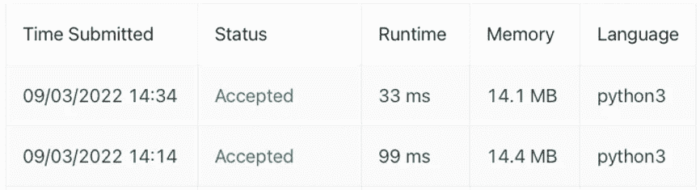
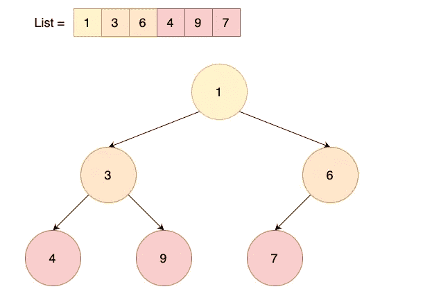
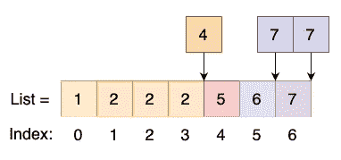

# 更快的 Python 列表的 3 种数据结构

> 原文：<https://towardsdatascience.com/3-data-structures-for-faster-python-lists-f29a7e9c2f92>

## 明智地选择你的清单


格伦·卡斯滕斯-彼得斯在 [Unsplash](https://unsplash.com?utm_source=medium&utm_medium=referral) 拍摄的照片

我们都知道列表是条目的集合，但是也存在其他类似列表的数据结构，可以根据您打算如何使用列表来优化您的 Python 代码。

默认的 Python 列表确实有它的魅力——它简单、易于理解和使用。然而，在 LeetCode 上花了一些时间后，我意识到在某些情况下它可能不是最好的数据结构。例如在这个 [LeetCode challenge](https://leetcode.com/problems/numbers-with-same-consecutive-differences/) 中，保持相同的逻辑但是简单地使用另一个数据结构将我的提交运行时间从[99 毫秒](https://leetcode.com/submissions/detail/790170154/)减少到了[33 毫秒](https://leetcode.com/submissions/detail/790183509/)！这可能看起来不算多，但是想象一下如果它被扩展，可以节省多少时间。我还必须补充一点，运行时间可能是随机的，匆忙得出它总能提供 3 倍加速的结论是不正确的。



图 1:使用列表的提交运行时(下图)与 heapq(上图)——作者图片

本文将介绍另一种类似列表的数据结构，何时使用它们，以及如何通过 Python 示例应用它们。

# 目录

*   [维护优先级列表](https://medium.com/p/f29a7e9c2f92/#e9a2)
*   [维护排序列表](https://medium.com/p/f29a7e9c2f92/#cda4)
*   [维护列表中的顺序和容量](https://medium.com/p/f29a7e9c2f92/#490f)

# 维护优先级列表

> 使用`**heapq**`更快地检索列表中最小和最大的项目(以及更多)



图 2: [堆](https://en.wikipedia.org/wiki/Heap_(data_structure))队列结构——作者图片

`**heapq**`使用堆队列算法，二叉树的设计使得任何子节点的值都大于父节点的值。这导致最小的元素位于树的根节点，任何新项目的插入都将通过“洗牌”找到它在树中的位置。在理解了二叉树是如何设计的之后，重要的是要注意这并不能保证一个*精确的*排序列表，而仅仅是一个排序的二叉树，类似于图 2。堆队列也称为优先级队列，因为优先级被给予树顶部的项目，并且移除该项目很容易“洗牌”或重新排列剩余节点的优先级。

为了进行高层次的比较，在通常的 Python 列表中，条目是按顺序添加的，比如`appends`在列表的后面添加一个新条目，而`pop`移除并返回列表中的最后一个条目。在堆队列结构中，`heappop`移除并返回列表中最小的*项，`heappush`向列表中添加新项，同时保持已排序的二叉树结构。*

何时使用`**heapq**`，

*   用于检索和删除列表中最小的项目
*   用于检索列表中最小和最大项目的编号
*   用于在添加新项目或合并两个堆后保留排序的二叉树

为了使用`**heapq**`，我们可以将一个空的或填充的列表转换成一个堆，

```
import heapq

heap = [5, 2, 4, 7, 6]

heapq.heapify(heap)
# heap = [2, 5, 4, 7, 6] -> sorted binary tree
#      2
#   5     4
#  7  6
```

为了转换堆，可以这样进行对堆的项目的检索和添加，

```
# Pop (retrieve and remove) smallest item
smallest_item = heapq.heappop(heap)   # smallest_item = 2

# Retrieve n-number of smallest and largest item
smallest2 = heapq.nsmallest(2, heap)  # smallest2 = [4, 5]
largest2 = heapq.nlargest(2, heap)    # largest2 = [6, 7]

# Push (add) new item
heapq.heappush(heap, 3)

# Push then Pop
smallest_item_after_add = heapq.heappushpop(heap, 1)
# smallest_item_after_add = 1, heap = [3, 4, 6, 7, 5]

# Pop then Push
smallest_item_before_add = heapq.heapreplace(heap, 1)
# smallest_item_before_add = 3, heap = [1, 4, 6, 7, 5]
```

最后，可以使用一个`merge`方法来合并多个堆，并保留排序后的二叉树结构。请注意，`merge`的输入应该是一个堆(遵循排序二叉树结构的列表),而不是任何列表！

```
# Merge two lists
heap1 = [1, 3, 5, 7]
heap2 = [2, 4, 6, 8]
merged_heap = heapq.merge(*[heap1, heap2])
# list(merged_heap) = [1, 2, 3, 4, 5, 6, 7, 8]
```

# 维护排序列表

> 使用`***bisect***`检索列表中最接近的值(以及更多)

`**bisect**`与其说是一个数据结构，不如说是一个二分法，帮助你定位和/或插入条目到一个保持顺序的排序列表中。

简单介绍一下，Python 使用了平均时间复杂度为`O(nlogn)`的 [Timsort](https://en.wikipedia.org/wiki/Timsort) 排序算法。这种排序算法很快，但是，在你的列表上连续调用`sort()`可能并不可取，最好还是维护一个排序后的列表。

请注意，二分法只适用于已经排序的列表，而不适用于未排序的列表！将项目插入到(排序的)列表中可以如下完成，

```
import bisect

a = [1, 2, 2, 2, 6, 7]

# Insert item to preserve sorted list (in-place)
bisect.insort(a, 5)
# a = [1, 2, 2, 2, 5, 6, 7]
```



图 3:检索应该插入条目的索引—按作者排序的图片

我在`bisect`中发现的另一个有用的特性是，它可以返回应该插入条目的列表索引。在图 3 中，`**bisect.bisect**(list, 4)`方法将返回索引 4，其中数字`4`应该被插入到排序列表中。如果值已经存在，我们可以使用`**bisect.bisect_left**(list, 7)`或`**bisect.bisect_right**(list, 7)`来指示数字`7`是应该插入到现有值的左边还是右边，并相应地返回索引。默认情况下，`**bisect**()`实现`**bisect_right**()`。

使用`**bisect**()`检索索引也是在列表中找到与您要‘插入’的值最接近的条目的一种快捷方式。例如，如果我想找到大于或等于 4 的最小数字，我可以使用`**bisect_left**()`来获取索引并相应地检索值。

何时使用`**bisect**`，

*   用于向保持列表顺序的排序列表添加项目
*   为了检索索引，插入一个保持列表顺序的值
*   用于检索排序列表中大于`x`的最小值
*   用于检索排序列表中小于`x`的最大值

# 维护列表中的顺序和容量

> 使用`***deque***`实现类似队列的列表

`**deque**`代表双端队列，允许快速添加和删除列表前面和后面的项目，这使得表示队列结构变得容易。当列表达到最大容量时，也可以实现列表的容量，以在后面添加项目时移除前面的项目，反之亦然。

为了便于比较，`**deque**`提供了与普通 Python 列表中的`O(n)`时间复杂度相比的`O(1)`条目添加和移除的时间复杂度。

正常的列表操作，如`index`、`count`、`extend`、`reverse`、`remove,`等。还在`**deque**`上班。

何时使用`**deque**`，

*   用于将项目添加到列表的前面和/或后面
*   用于从列表的前面和/或后面移除项目
*   用于将项目从队列的后面移到前面，反之亦然(循环队列)
*   用于实施列表容量

下面是一些如何使用`**deque**`的例子，

```
from collections import deque

d = deque([1, 2, 3, 4], maxlen=10)

# Adding item(s)
d.append(5)
d.extend([6, 7])
d.appendleft(0)
d.extendleft([-1, -2])
# d = [-2, -1, 0, 1, 2, 3, 4, 5, 6, 7]

# Removing items
first_item = d.popleft()
last_item = d.pop()
# d = [-1, 0, 1, 2, 3, 4, 5, 6]

# Shift items from back to the front
d.rotate(3)
# d = [4, 5, 6, -1, 0, 1, 2, 3]
```

希望你已经理解了更多类似列表的数据结构和算法，下次可以使用它们来加速你的代码！你也可以挑战自己，尝试手工实现这些数据结构，比如这个 [LeetCode challenge](https://leetcode.com/problems/design-circular-queue/) 设计一个`**deque**`数据结构。

# 相关链接

*   `heapq`文档:[https://docs.python.org/3/library/heapq.html](https://docs.python.org/3/library/heapq.html)
*   `bisect`文档:[https://docs.python.org/3/library/bisect.html](https://docs.python.org/3/library/bisect.html)
*   `deque`文档:[https://docs.python.org/3/library/collections.html](https://docs.python.org/3/library/collections.html)