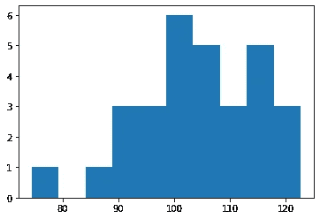

# 平均值的 3 个简单假设检验

> 原文：<https://towardsdatascience.com/3-easy-hypothesis-tests-for-the-mean-value-2d8a06177042>

## 将样本的平均值与其他预期值进行比较的 3 种简单方法


由 [Unsplash](https://unsplash.com?utm_source=medium&utm_medium=referral) 上的 [Edge2Edge 媒体](https://unsplash.com/@edge2edgemedia?utm_source=medium&utm_medium=referral)拍摄

数据科学家和分析师经常需要处理平均值，需要将一个样本的平均值与已知的期望值或另一个样本的平均值进行比较。统计学帮助我们进行一系列强有力的假设检验来完成这些任务。

# 问题是

比方说，我们测量类似珠穆朗玛峰的高度。我们知道它是 8848 米。我们测量后，得到 8840 米，标准误差为 20 米。我们的平均值和已知身高有统计学差异吗？

假设另一个研究小组使用不同的工具进行了相同的测量，并获得了 8850 米，标准误差等于 10 米。他们的结果在统计学上和我们的不同吗？

这是处理平均值时的两个常见问题。我们经常需要将我们的平均值与一个已知的期望值或别人得到的平均值进行比较。

将事物相互比较是统计学中的一个常见问题，我们可以从[假设检验](https://www.yourdatateacher.com/2022/10/17/a-beginners-guide-to-statistical-hypothesis-tests/)的理论中获益，以评估这种比较的统计学意义。在这篇文章中，我将讨论学生对平均值的 t 检验。它们是最常见的假设检验类型，非常有用。

它们都依赖于一个基本假设:样本是从正态分布中产生的。

下面是一些使用 Python 编程语言的例子。所有这些例子都是基于 NumPy 的，所以我们首先要导入它并设置随机数生成器的种子。让我们也为直方图计算导入 matplotlib。

```
import numpy as np 
import matplotlib.pyplot as plt 
np.random.seed(0)
```

# 将平均值与已知的期望值进行比较

最简单的 t 检验形式是将样本的平均值与已知的期望值进行比较。

让我们使用 NumPy 在 Python 中创建一个 30 个正态分布随机数的样本，其均值等于 100，标准差等于 10。

```
x = np.random.normal(size=30,loc=100,scale=10)
```



作者的 x. Image 直方图

这个样本的平均值是 104.43。我们想知道它在统计上是否不同于 100。

这种均值 t 检验的零假设是:均值等于 100。所以，我们正在进行一个双尾检验。

为了使用它，我们必须从 Scipy 导入适当的函数。

```
from scipy.stats import ttest_1samp
```

然后，我们可以使用“ttest_1samp”函数，它给出了这种双尾检验的 p 值:

```
ttest_1samp(x,100) 
# Ttest_1sampResult(statistic=2.2044551627605693, pvalue=0.035580270712695275)
```

如果我们想使用 1 尾检验，无效假设将是以下之一:

*   平均值大于 100
*   平均值小于 100

通过陈述替代假设，我们可以计算这两个检验的 p 值。

```
# Null hypothesis: x.mean() is greater than 100 
# (alternative hypothesis, it's less than 100) **ttest_1samp(x,100,alternative='less')** # Ttest_1sampResult(statistic=2.2044551627605693, pvalue=0.9822098646436523) 
######################## 
# Null hypothesis: x.mean() is less than 100 
# (alternative hypothesis, it's greater than 100) **ttest_1samp(x,100,alternative='greater')** # Ttest_1sampResult(statistic=2.2044551627605693, pvalue=0.017790135356347637)
```

这是一个学生对单一样本进行 t 检验的例子。请记住，样本必须是根据正态分布创建的。

# 比较具有相同方差的两个样本的平均值

现在让我们从上一个样本的正态分布开始创建一个新样本。我们可以把尺码从 30 号改成 50 号。

```
y = np.random.normal(size=50,loc=100,scale=10)
```

其平均值为 96.85。

假设我们已经知道两个样本来自两个方差相同的正态分布。我们可以使用双样本 t 检验来比较它们的平均值。我们必须使用“ttest_ind”函数。

```
from scipy.stats import ttest_ind
```

我们现在可以计算我们需要的所有测试的 p 值(两个尾部或一个尾部)。

```
# Null hypothesis: x.mean() is equal to y.mean() **ttest_ind(x,y)** # Ttest_indResult(statistic=3.4565852447894163, pvalue=0.0008885072426696321) 
###################### 
# Null hypothesis: x.mean() is greater than y.mean() 
# (alternative hypothesis: it's less than y.mean()) **ttest_ind(x,y,alternative='less')** 
# Ttest_indResult(statistic=3.4565852447894163, pvalue=0.9995557463786652) 
###################### 
# Null hypothesis: x.mean() is less than y.mean() 
# (alternative hypothesis: it's greater than y.mean()) **ttest_ind(x,y,alternative='greater')** # Ttest_indResult(statistic=3.4565852447894163, pvalue=0.00044425362133481604)
```

# 比较方差不同的两个样本的平均值

最后，最常见的情况:两个样本来自具有不同方差的正态分布。

让我们创建一个来自标准偏差等于 5 的正态分布的新变量:

```
z = np.random.normal(size=50,loc=100,scale=5)
```

执行所谓的韦尔奇检验(即学生 t 检验的这种特殊情况)的函数又是“ttest_ind”，但我们必须将 equal_var 参数设置为等于 False。

```
# Null hypothesis: x.mean() is equal to z.mean()**ttest_ind(x,z,equal_var=False)** 
# Ttest_indResult(statistic=1.094819002420836, pvalue=0.2807390405295771) 
###################### 
# Null hypothesis: x.mean() is greater than z.mean() 
# (alternative hypothesis: it's less than z.mean()) **ttest_ind(x,z,alternative='less',equal_var=False)** 
# Ttest_indResult(statistic=1.094819002420836, pvalue=0.8596304797352115) 
###################### 
# Null hypothesis: x.mean() is less than z.mean() 
# (alternative hypothesis: it's greater than z.mean()) **ttest_ind(x,z,alternative='greater',equal_var=False)** 
# Ttest_indResult(statistic=1.094819002420836, pvalue=0.14036952026478855)
```

# 结论

在本文中，我解释了 3 种基于平均值的假设检验:单样本 t 检验，将样本的平均值与已知的期望值进行比较；等方差双样本 t 检验；异方差双样本 t 检验(也称为 Welch 检验)。最后两个测试比较两个样本的平均值。尽管这种测试非常强大，但必须记住，它们强烈要求样本是从高斯分布中生成的。如果满足这一要求，就可以安全地进行这些测试。

*原载于 2022 年 10 月 25 日*[*【https://www.yourdatateacher.com】*](https://www.yourdatateacher.com/2022/10/25/3-easy-hypothesis-tests-for-the-mean-value/)*。*