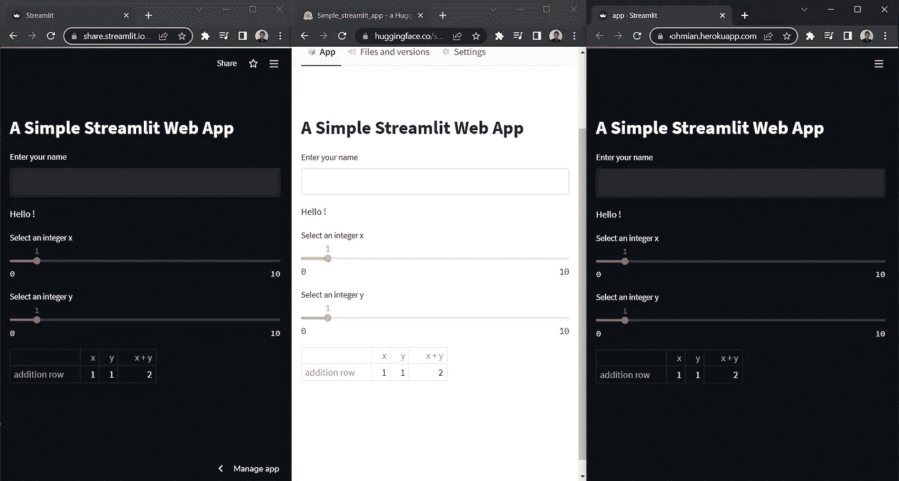
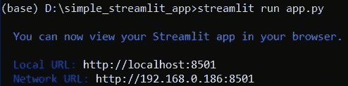
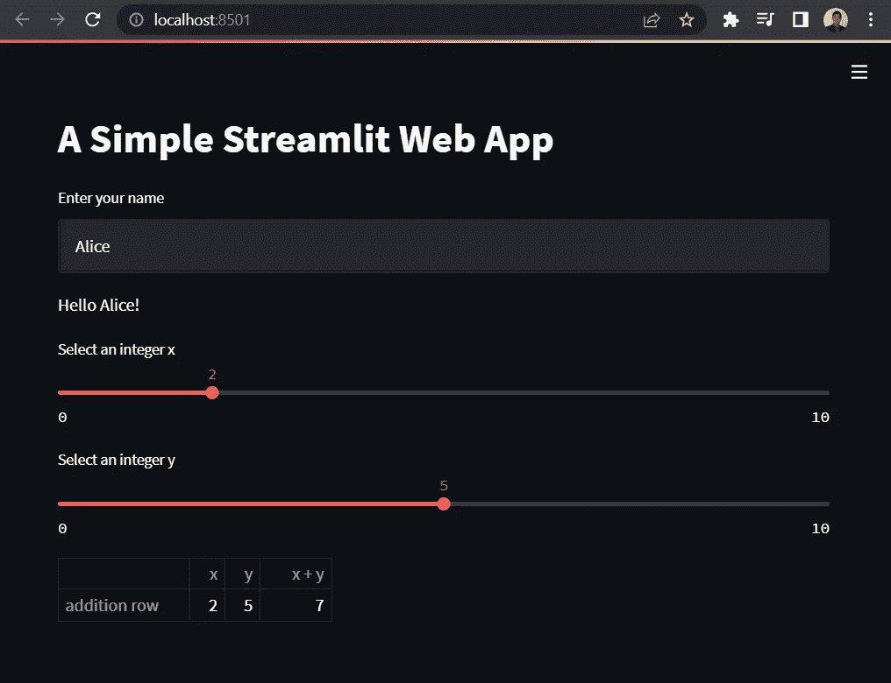
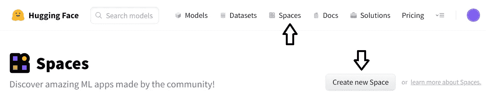
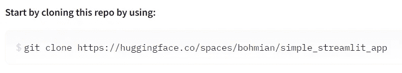
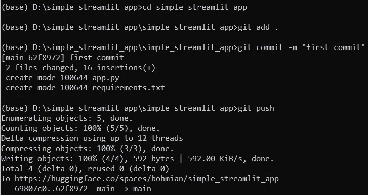
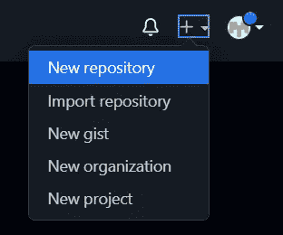
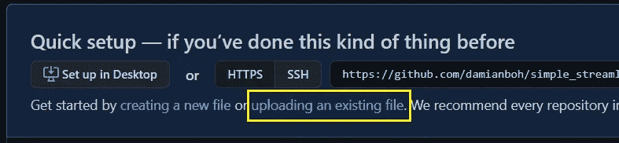
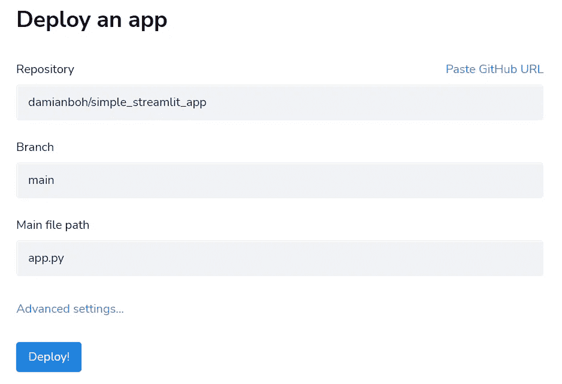

# 在线部署您的 Streamlit Web 应用程序的 3 种简单方法

> 原文：<https://towardsdatascience.com/3-easy-ways-to-deploy-your-streamlit-web-app-online-7c88bb1024b1>

## 免费，也不需要码头集装箱

Web 应用程序正日益成为与其他用户共享数据科学项目的流行方式。这是因为 Streamlit 等易于使用的 Python 库的出现，以及免费将 web 应用程序部署到云的便利性增加。


由[卢卡斯·布拉塞克](https://unsplash.com/@goumbik?utm_source=medium&utm_medium=referral)在 [Unsplash](https://unsplash.com?utm_source=medium&utm_medium=referral) 上拍摄

# 什么是 Streamlit？

Streamlit 是一个免费的开源 Python 框架，您可以使用它轻松构建和共享您的交互式仪表盘和机器学习 web 应用程序。如果您熟悉 Python，您应该能够在几小时内(如果不是几分钟的话)学会并构建 Streamlit 应用程序。一定要去画廊看看一些应用程序的灵感！[https://streamlit.io/gallery](https://streamlit.io/gallery)

# 云部署流程

不久前，将一个简单的 web 应用程序部署到云中需要大量的应用程序容器化知识和工具，当然还需要资金。如今，这个过程已经变得简单到只需上传几个文件到网上，运行几个命令行。在本文中，我将介绍如何将您的 Streamlit 应用程序部署到 3 个易于使用且免费的公共云平台上。

这是每个平台中最终产品的外观:

## **拥抱脸空间**

[https://huggingface.co/spaces/bohmian/simple_streamlit_app](https://huggingface.co/spaces/bohmian/simple_streamlit_app)

## **细流云**

[https://share . streamlit . io/Damian boh/simple _ streamlit _ app/main/app . py](https://share.streamlit.io/damianboh/simple_streamlit_app/main/app.py)

## Heroku 应用平台

[https://simple-streamlit-app-bohmian.herokuapp.com/](https://simple-streamlit-app-bohmian.herokuapp.com/)



部署到 3 个云平台的相同 Streamlit 应用程序。图片来自作者。

一个 app，3 个云平台。我们开始吧！

# 1.构建一个简单的 Streamlit Web 应用程序

让我们先用 Streamlit 创建一个简单的 web 应用程序，然后学习如何将它部署到三个云平台。

## 1.1.安装和设置

首先使用 pip 工具安装 Python Streamlit 包:`pip install streamlit`。

然后我们创建一个文件夹`simple_streamlit_app` 来存放 app 需要的文件。

## 1.2.Web 应用程序脚本

在该文件夹中，我们创建了一个简单的脚本，并将其命名为`app.py`。在这里，我们编写了一个简单的应用程序，演示了文本输入和滑块小部件的用法，以及如何显示数据帧。

```
import streamlit as st
import pandas as pdst.title(“A Simple Streamlit Web App”)name = st.text_input(“Enter your name”, ‘’)st.write(f”Hello {name}!”)x = st.slider(“Select an integer x”, 0, 10, 1)
y = st.slider(“Select an integer y”, 0, 10, 1)df = pd.DataFrame({“x”: [x], “y”: [y] , “x + y”: [x + y]}, index = [“addition row”])
st.write(df)
```

上面的代码基本上是不言自明的。该应用程序接受用户的文本输入，并将其存储为一个`name`变量，然后打印出问候文本。

它还接受两个范围从 0 到 10 的整数滑块输入，将它们存储为`x`和`y`变量。然后它打印出数据帧`df`中的变量及其总和。

## 1.3.在本地运行应用程序

这就是应用程序所需的全部内容。要在本地启动应用程序，只需在终端中运行以下命令，与您的`app.py`文件放在同一个文件夹中。

```
streamlit run app.py
```

如果成功，应该会出现以下内容:



图片来自作者

您的浏览器也应该弹出上面键入的本地 URL，您将看到类似这样的内容。在这里，我输入了一些输入来显示应用程序如何响应。



简单 Streamlit App 截图。图片作者。

# 2.在部署到云之前…

我们现在准备在云上公开部署您的应用。在部署到任何云平台之前，您还需要做两件事情。

## 2.1.安装 git

从[此链接](https://github.com/git-guides/install-git)安装 git 命令行工具。这允许您在终端上运行 git 命令，将您的应用程序文件上传到 web。

## 2.2.添加一个“requirements.text”文件

下面所有的云平台都需要知道要安装什么 Python 包，才能启动你的 app。我们在一个`requirements.txt`文件中指定了这一点。

```
streamlit
pandas
```

# 3.第一个平台:将你的应用程序部署到拥抱脸空间

## 3.1.建立一个拥抱脸帐户

在这里创建一个拥抱脸账户:[https://huggingface.co/](https://huggingface.co/)

## 3.2.创造一个新空间

点击顶部导航栏的**空格**。然后点击**‘创建新空间’**按钮。



拥抱脸空间截图。图片来自作者

填写出现的表格:

*   输入您想要的“空间名称”(例如“simple_streamlit_app”)
*   通过单击“Streamlit”选择 Space SDK
*   点击“创建空间”按钮。

## 3.3.将应用程序文件上传到您的新拥抱面部空间

现在，您将进入显示此命令行的页面。(您的将与我的不同，因为您使用的是不同的空间。)



*   复制上面的命令，并在您的终端上运行。(记住你的命令是不同的。)
*   一个名为`name of your new space`的文件夹将在您的计算机上本地创建。
*   将您的`app.py`和`requirements.txt`文件复制到这个新文件夹中。
*   在终端上，运行以下命令，替换文件夹名称。这些命令告诉 git 考虑您在上一步中添加的 2 个新文件，提交它们并将其推送到您的新拥抱面部空间。

```
cd *name_of_your_new_folder* git add .
git commit -m "first commit"
git push 
```

如果成功，您应该会看到以下输出。



终端输出截图。图片来自作者

## 3.4.您的公共应用程序现在是实时拥抱面部空间！

返回到显示拥抱面部空间页面的浏览器。等待几分钟后，刷新页面，您应该看到您的应用程序正在运行！任何人都可以使用此页面的链接访问此应用程序。这里是我的:【https://huggingface.co/spaces/bohmian/simple_streamlit_app】T4

恭喜您，您已经发布了您的 Streamlit 应用程序！现在让我们来探索第二个云平台。

# 4.第二个平台:部署您的应用程序以简化云

Streamlit 也提供了自己的云平台。

## 4.1.设置 GitHub 帐户

在这里创建一个 GitHub 账号:[https://github.com/](https://github.com/)

## 4.2.创建新的 GitHub 资源库

*   在任一页面的右上角，使用下拉+菜单，并选择“新建存储库”。



GitHub 截图。图片来自作者

*   填写您想要的“存储库名称”，然后向下滚动并单击“创建存储库”。不要更改任何其他参数。

## 4.3.上传文件到你的 GitHub 库

*   现在点击“上传现有文件”。



来自作者的 GitHub 截图

*   将您的`app.py`和`requirements.txt`文件拖放到下面的页面中。

## 4.1.设置 Streamlit 云帐户

在此创建一个 Streamlit 云帐户:[https://streamlit.io/cloud](https://streamlit.io/cloud)

## 4.2.创建一个新的应用程序并链接您的 GitHub 帐户

*   一旦你登录，应该有一个非常明显的(你会看到为什么)“新应用程序”按钮供你点击。
*   然后你会看到一个提示“连接到 GitHub”。登录到您之前创建的 GitHub 帐户。

## 4.3.部署您的应用

*   在下一个屏幕中，通过在“repository”下键入名称来搜索您之前创建的 GitHub 存储库。
*   将“主文件路径”更改为“app.py”。
*   点击部署！



Streamlit 云截图。图片来自作者

## 4.4.您的公共应用程序现已在 Streamlit Cloud 上上线！

等待一段时间后，您的应用程序将会出现。恭喜你。下面是我的:[https://share . streamlit . io/Damian boh/simple _ streamlit _ app/main/app . py](https://share.streamlit.io/damianboh/simple_streamlit_app/main/app.py)

最后但同样重要的是。再来看我们的第三个云平台。

# 5.第三平台:将您的应用部署到 Heroku 应用云

这里还需要几个文件，因为 Heroku App 是一个通用的 web app 云平台，没有默认的 Streamlit 配置。

## 5.1.添加一个“setup.sh”文件

这是一个 shell 文件，您需要在文件中添加以下 shell 命令。它基本上告诉 Heroku 在运行 Streamlit 应用程序时要配置和设置什么。

```
mkdir -p ~/.streamlit/
echo “\
[server]\n\
headless = true\n\
port = $PORT\n\
enableCORS = false\n\
\n\
“ > ~/.streamlit/config.toml
```

## 5.2.添加一个“Procfile”文件

该文件没有文件扩展名。这个文件指定了 Heroku 在部署应用程序时运行的命令。我们指定这是一个以 shell 文件为配置的 web app，并调用 Streamlit 来运行 app.py。

```
web: sh setup.sh && streamlit run app.py
```

## 5.3.为所有文件创建一个新文件夹

在我们之前包含文件的文件夹中，回想一下已经建立了一个本地 git 存储库，它链接到拥抱脸空间。我们不想对此文件夹进行任何更改。因此，我们创建一个新的文件，并将我们的`app.py`、`requirements.txt`、`setup.sh`和`Procfile`文件复制到其中。

## 5.4.设置 Heroku 应用程序云帐户

在这里创建一个 Herokuapp 账户:[https://herokuapp.com/](https://herokuapp.com/)

## 5.5.创建本地 Git 存储库

在终端的文件夹中运行以下命令。这将初始化一个本地 git 存储库，添加所有文件并提交所有更改。

```
git init
git add .
git commit -m “first commit”
```

## 5.6.创建一个新的 Heroku 应用程序并推送到它的存储库

接下来，运行以下命令(更改*‘应用程序名称’*)，这些命令将依次执行以下操作:

*   登录到您的 Heroku 帐户(您的浏览器将为您打开以执行登录)
*   用你想要的名字创建你的 Heroku 应用程序
*   把仓库推到 Heroku

```
heroku login
heroku create *name_of_your_app (change this)*
git push heroku master
```

## 5.7.您的公共 App 现已在 Heroku App Cloud 上线！

整个部署过程将显示在终端上。一旦完成，你的应用程序应该在`*<name_of_your_app>*.herokuapp.com`上运行。恭喜你。

下面是我的:[https://simple-streamlit-app-bohmian.herokuapp.com/](https://simple-streamlit-app-bohmian.herokuapp.com/)

# 结束语(赞成和反对)

现在，您已经学会了将您的 Streamlit 应用部署到三个不同的云平台。您可以根据自己的喜好选择部署到任何云中。这里有几点需要考虑。

## 拥抱面部空间

拥抱面部空间不会将你的应用程序部署到一个完整的浏览器页面上，而是嵌入到一个框架中，所有的导航栏和工具都在顶部。如果你想要一个整页的应用程序，你可以选择其他两个平台(不过我真的很喜欢顶部可爱的拥抱脸标志)。

## 流线云

Streamlit Cloud 是您访问时加载应用程序最快的。然而，拥抱脸空间和 Streamlit Cloud 都允许用户查看公共应用程序的源代码。我把它作为一个练习留给读者去发现如何做。如果想对源代码保密，可以考虑 Heroku App 代替。

## Heroku 应用程序

有些人可能不喜欢为 Heroku app 创建额外文件的麻烦，它也在 App 长时间未使用后启动 App 相当慢。然而，你可能之前已经在 Heroku 上部署了其他框架(比如 Flask 和 Django)的应用。在这种情况下，你可能更喜欢在 Heroku 上管理你的所有应用，包括 Streamlit 应用。请注意，一个免费的 Heroku 帐户最多只允许 5 个应用程序。

我希望这篇文章对你有用。享受 Streamlit 带来的乐趣。构建和部署愉快！

如果你喜欢这篇文章，请随意[关注我](https://medium.com/@bohmian)或者看看我下面的其他文章！:)

[](https://medium.datadriveninvestor.com/build-a-stock-sentiment-web-app-with-flask-and-deploy-it-online-3930e58a236c) [## 用 Flask 构建一个股票情绪 Web 应用程序，并在线部署

### 提取金融新闻标题上的股票情绪，在 Flask web 应用程序中绘制每小时/每天的情绪，并部署它…

medium.datadriveninvestor.com](https://medium.datadriveninvestor.com/build-a-stock-sentiment-web-app-with-flask-and-deploy-it-online-3930e58a236c) [](https://medium.datadriveninvestor.com/train-and-deploy-an-nlp-news-classifier-web-app-to-the-cloud-for-free-82655b6b32f4) [## 免费培训和部署一个 NLP 新闻分类器 Web 应用程序到云

### 训练 NLP 模型、将其嵌入 Python Flask Web 应用程序并将其部署到云上的分步指南

medium.datadriveninvestor.com](https://medium.datadriveninvestor.com/train-and-deploy-an-nlp-news-classifier-web-app-to-the-cloud-for-free-82655b6b32f4) 

如果你喜欢这样的文章，并希望支持像我这样的作家，请考虑[注册成为媒体会员](https://medium.com/@bohmian/membership)。每月 5 美元，你就可以无限制地阅读 Medium 上的任何文章。如果你注册使用我的链接，我会赚一小笔佣金，不需要你额外付费。

[](https://medium.com/@bohmian/membership) [## 通过我的推荐链接加入 Medium-Bohmian

### 作为一个媒体会员，你的会员费的一部分会给你阅读的作家，你可以完全接触到每一个故事…

medium.com](https://medium.com/@bohmian/membership)