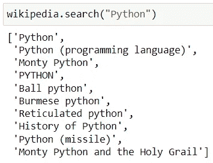
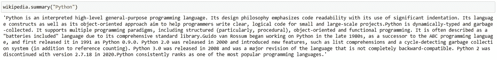
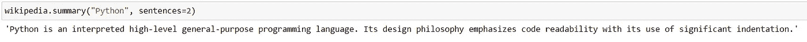
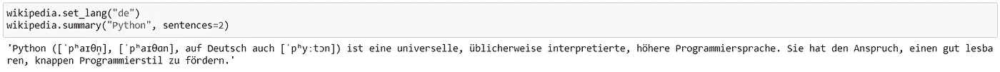
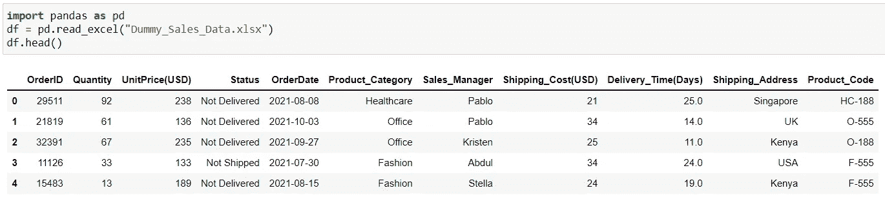
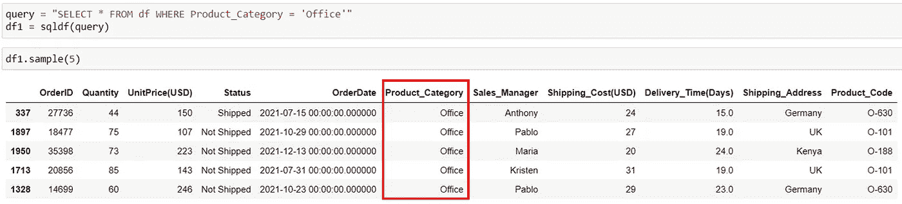
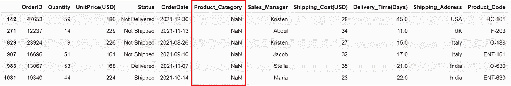
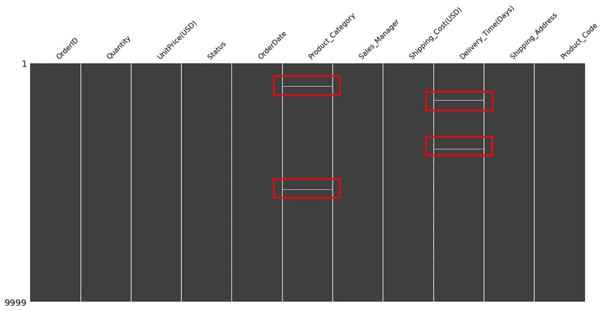

# 你应该知道的 3 个惊人的 Python 库

> 原文：<https://towardsdatascience.com/3-extremely-useful-python-libraries-for-data-science-7f809eb98334>

## Python 库

# 你应该知道的 3 个惊人的 Python 库

## 非常有用的 Python 库——维基百科，Pandasql，Missingno！


若昂·赞诺在 [Unsplash](https://unsplash.com?utm_source=medium&utm_medium=referral) 上的照片

**Python** 以其独特的特性集和提供这些特性的大量库而闻名。

三个如此神奇和强大的库是，

```
**·** [**Wikipedia**](#216e) **·** [**Pandasql**](#f9f8) **·** [**Missingno**](#5f03)
```

在本文中，我们将讨论如何在不离开 Python IDE 的情况下搜索尽可能多的信息，使用 SQL 查询轻松提取数据子集，并有效地可视化缺失值。⚡️

# 维基百科(一个基于 wiki 技术的多语言的百科全书协作计划ˌ也是一部用不同语言写成的网络百科全书ˌ 其目标及宗旨是为全人类提供自由的百科全书)ˌ开放性的百科全书

这是一个 Python 库，使得访问和解析来自维基百科的数据变得容易。使用这个库，我们可以在不离开 Python IDE 或 Jupyter-Notebook 的情况下搜索`**wikipedia**`上的任何东西。

## 有什么用💡

记得有一种情况，我们正在进行项目，需要对一些术语进行更多的澄清。通常我们 google 一下，看一下`wikipedia`进行初步的基本了解。这个库让你不用离开 python 编辑器就可以自由搜索维基百科。

## 如何在 Python 🛠️中使用维基百科

仅供第一次使用，使用以下代码行安装库，

```
pip install wikipedia
```

然后使用`import wikipedia`导入库，你就可以自由地在网上寻找你想要的内容了。下面是一些开始使用的标准命令。

*   设置网页结果的语言:`set_lang()`
*   维基百科的搜索页面:`search()`
*   获取文章摘要:`summary()`

## 例子:事物如何运作🚀

让我们看看这个图书馆有多神奇。下面是上面所有命令运行的图片！

例如，让我们在`wikipedia`上搜索术语“Python”。



维基百科搜索|作者图片

如您所见，`search()`命令将返回作为“Python”搜索的项目列表。

更进一步，让我们对其中一个结果进行总结。



按作者获取文章|图片的摘要

然而，方法`summary()`带有一个可选参数`sentences`，这让我们可以自由地只获取文章的前几个句子，如下所示。



文章摘要两句话|作者图片

默认情况下，生成的网页的语言是英语。使用方法`**set_lang()**`,我们可以在搜索之前将其更改为任何想要的语言。

例如，我们将语言更改为德语，德语的代码为`**de**` **。**



根据作者更改维基百科结果|图片的语言

这个库的更多细节可以在 [**这里**](https://pypi.org/project/wikipedia/) 找到。

# Pandasql

`**pandasql**`允许您使用 Python 中的 SQL 语法查询 pandas 数据帧。它为不熟悉 Python 或 pandas 的人提供了更简单的操作和清理数据的方法。

## 有什么用💡

尽管 Python 中的 Pandas 库被广泛用于数据操作和分析，但在许多情况下，SQL 查询非常高效且易于编写。因此，这个包利用 SQL 的能力从 Pandas 数据帧中快速提取数据子集。

## 如何在 Python 🛠️中使用 Pandasql

仅供第一次使用，请使用以下方式安装软件包:

```
pip install pandasql
```

安装完成后，通过导入`sqldf`开始使用这个库，如下所示

```
from pandasql import sqldf
```

这个`sqldf`接受两个参数—

1.  SQL 查询字符串— **必需的**
2.  一组会话/环境变量— locals()或 globals() — **可选**

## 例子:事物如何运作🚀

为了演示，我将使用我为所有文章生成的 [Dummy_Sales_Data](https://github.com/17rsuraj/data-curious/blob/master/TowardsDataScience/Dummy_Sales_Data.xlsx) ！



[由 Suraj 创建的 Dummy _ Sales _ Data](https://github.com/17rsuraj/data-curious/blob/master/TowardsDataScience/Dummy_Sales_Data.xlsx)|作者图片

例如，选择*产品类别*为“办公”的数据。对它的 SQL 查询将是，

```
SELECT * FROM df WHERE Product_Category = 'Office'
```

正如我提到的，函数`sqldf`接受 SQL 查询字符串作为输入参数，我们可以如下编写 SQL 查询字符串

```
"SELECT * FROM df WHERE Product_Category = 'Office'"
```

作为最后和下一步，让我们得到所需的数据如下



在 Pandasql | Image by Author 中使用 SQL 查询获取熊猫数据帧的子集

此外，更复杂的 SQL 查询，包括连接也可以使用`pandasql`来执行。

您所需要做的就是在`“ ”`中包含您想要运行的查询

`pandasql`的官方文档可以在这里[找到。](https://pypi.org/project/pandasql/)

# 缺少编号

`Missingno`是一个 Python 库，它提供了通过信息可视化来理解缺失值分布的能力。

## 有什么用💡

原始数据经常遇到的问题之一是*缺失值。*如果数据集在单元格中没有任何值，则它有一个缺失值。当这样的数据集被读入 pandas 数据帧时，缺失的值用`NaN`表示

除了使用`pandas.DataFrame.isnull()`、`pandas.DataFrame.isna()`来识别`NaN`之外，还可以可视化数据帧中缺失值的分布。

## 如何在 Python 🛠️中使用 Missingno

仅供第一次使用，从使用安装库开始

```
pip install missingno
```

安装完成后，只需将其导入到您当前的笔记本中，您就可以开始探索了

```
import missingno as msno
%matplotlib inline
```

## 例子:事物如何运作🚀

例如，在我们的数据集中，我们有丢失的值，



熊猫数据框|作者图片中缺少的值

使用`missingno`包，不同列中缺失值的分布可以在下面的一行中可视化。

```
msno.matrix(df)
```



使用 Python 中的 Missingno 可视化缺失值|作者提供的图像

在上图中，每一条水平线(红色矩形)代表一堆缺失值。并且它们的位置指示它们在数据集中的位置。

另一个有用的可视化技术是热图。要了解它的细节，我推荐阅读这篇有趣的文章。🏆

[](/five-ways-for-faster-data-analysis-801a043bfea9) [## 加快数据分析的五种方法

### 让它在竞争中脱颖而出

towardsdatascience.com](/five-ways-for-faster-data-analysis-801a043bfea9) 

*总结一下，*

这些库，尤其是`pandasql`在几乎每一个 Python 数据科学项目中都节省了我的时间，并且非常容易掌握。`Wikipedia`图书馆也同样有用，可以在维基上从笔记本本身搜索东西。

现在可以通过 [***在这里报名***](https://medium.com/@17.rsuraj/membership) 成为中会员，阅读我和其他作家发表的所有故事。如果你这样做，我会得到你的费用的一小部分。欢迎加入我的[邮件列表](https://medium.com/subscribe/@17.rsuraj)来了解我写作的最新进展。

**感谢您的阅读！**