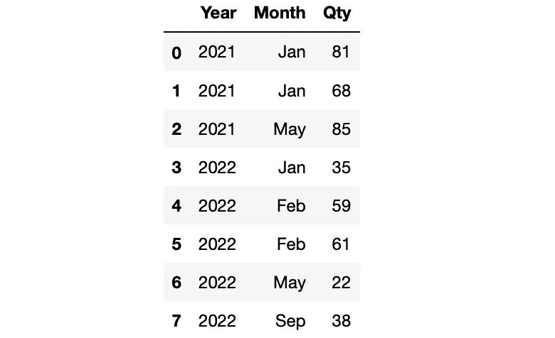

# 3 个你可能不会用到的熊猫群组功能

> 原文：<https://towardsdatascience.com/3-functions-to-use-with-pandas-groupby-that-you-probably-dont-use-724db94327ee>

## 探索更多关于熊猫的知识


杰西·卡森在 [Unsplash](https://unsplash.com/s/photos/owl?utm_source=unsplash&utm_medium=referral&utm_content=creditCopyText) 上的照片

当使用 Pandas 进行数据分析时，groupby 是最常用的函数之一。它允许根据给定的一列或多列中的值对数据点(即行)进行分组。

假设您有一个汽车数据集，并希望根据平均价格比较汽车品牌。这是一个两步任务。第一个是根据颜色对汽车进行分组，这就是 groupby 函数的用途。第二步是根据要聚合的值应用聚合函数。在本例中，这是通过对 price 列应用 mean 函数来实现的。


(图片由作者提供)

有许多聚合函数可以与 groupby 函数一起使用，如 mean、min、max 和 median。我刚刚列出的是常见的。还有一些功能不是那么常用。你不会经常需要它们，但是在某些情况下这些函数会派上用场。所以，最好了解一下他们。

在本文中，我们将讨论其中的 3 个函数。让我们创建一个样本数据帧用于示例。

```
import pandas as pd
import numpy as npdf = pd.DataFrame({ "Year": [2021, 2021, 2021, 2022, 2022, 2022, 2022, 2022],
  "Month": ["Jan", "Jan", "May", "Jan", "Feb", "Feb", "May", "Sep"],
  "Qty": np.random.randint(10, 100, size=8)

})df
```



df(作者图片)

我们有一个 3 列 8 行的数据帧。

## 1.努尼克岛

顾名思义，nunique 函数返回唯一值的数量。如果与 groupby 函数一起使用，我们可以获得每个组的唯一值的数量。

例如，我们可以在我们的数据框架中找到每年独特月份的数量，如下所示:

```
df.groupby("Year")["Month"].nunique()**# Output**
Year
2021    2
2022    4
Name: Month, dtype: int64
```

当然，在处理大型数据集时使用它更有意义。

## 1.n 最大

nlargest 函数返回一列中的 n 个最大值。n 的值可以用函数的 n 参数来指定。

在我们的数据框架中，我们可以将它与 groupby 函数一起使用来查找每年的最大数量。

```
df.groupby("Year")["Qty"].nlargest(1)**# Output**
Year   
2021  2    85
2022  5    61
Name: Qty, dtype: int64
```

2021 年一个月中的最高数量是 85，这是索引为 2 的行。让我们看看现在是几月:

```
df.iloc[2]**# Output**
Year     2021
Month     May
Qty        85
Name: 2, dtype: object
```

2021 年的最高数量是在 5 月观察到的。

熊猫还有最小的功能，与最大的功能相反。语法是一样的，所以没有必要为最小的做一个单独的例子。

## 3.累计

cumsum 函数计算给定列中值的累积和。在处理时间序列或序列数据时，这是一个非常实用的方法。一个典型的例子是计算一年的累计收益或收入。

在某些情况下，您可能希望分别计算不同类别或组的累计总和。我们的数据框架中有一个日期和月份列。我们可以使用 cumsum 和 groupby 函数创建一个列，其中包含每年数量的累积和。

```
df["cumulative_sum"] = df.groupby("Year").cumsum()df
```


df(作者图片)

正如我们在上面的截图中所看到的，累积总值从 2022 年重新开始。

我们所做的例子并不是 groupby 函数的典型用例。然而，他们绝对有解决问题的潜力。因此，最好把它们放在你的武器库中。

*你可以成为* [*媒介会员*](https://sonery.medium.com/membership) *解锁我的全部写作权限，外加其余媒介。如果你已经是了，别忘了订阅*[](https://sonery.medium.com/subscribe)**如果你想在我发表新文章时收到电子邮件。**

*[](https://sonery.medium.com/membership) [## 通过我的推荐链接加入 Medium-Soner yl DRM

### 作为一个媒体会员，你的会员费的一部分会给你阅读的作家，你可以完全接触到每一个故事…

sonery.medium.com](https://sonery.medium.com/membership) 

感谢您的阅读。如果您有任何反馈，请告诉我。*